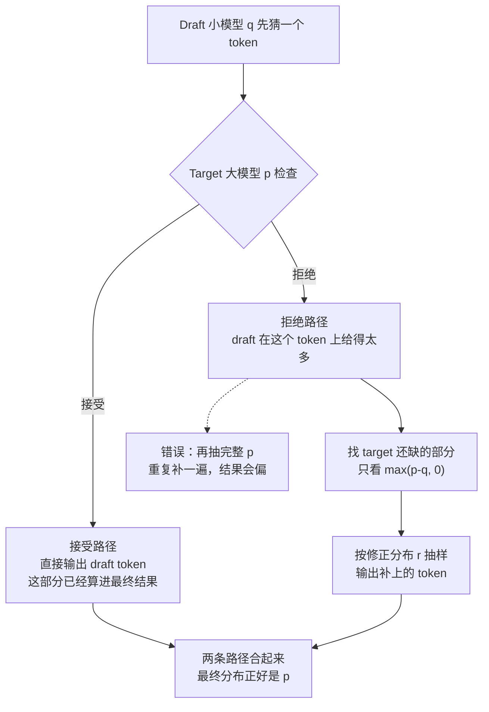

自回归 Decode 每走一步只吐 1 个 Token，却要把整个模型的权重从 HBM 完整搬一遍——1.1 节的结论是：Decode 是 Memory Bound，串行依赖是延迟的总根源。Speculative Sampling 的解法是**用并行换串行**：让一个小模型快速猜出接下来 γ 个 Token，大模型一次 forward 并行验证 γ+1 个位置，配合 Rejection Sampling 保证输出分布严格不变。理想情况下每步产出从 1 个 Token 提到约 **2.8 个**（接受率 0.7、γ=4 时），论文实测 2~3 倍加速，而且**数学上保证无偏**——这是它区别于一切“近似加速”方案的根本。本文把接受概率的推导、无偏性证明和加速比公式一步步拆给你看，这是 5.2~5.5 所有方案（Draft 模型、Medusa、EAGLE、N-gram）共同的地基。

<!-- more -->

## 📑 目录

- [1. 为什么需要：Decode 的串行瓶颈](#1-为什么需要decode-的串行瓶颈)
- [2. 框架总览：Draft 猜、Target 验](#2-框架总览draft-猜target-验)
- [3. 正确性核心：Rejection Sampling 无偏性](#3-正确性核心rejection-sampling-无偏性)
- [4. 加速比理论：期望接受多少 Token](#4-加速比理论期望接受多少-token)
- [5. 关键参数：γ、Draft 开销与批量验证](#5-关键参数γdraft-开销与批量验证)
- [6. 权衡：牺牲什么，换取什么](#6-权衡牺牲什么换取什么)
- [总结](#-总结)
- [自我检验清单](#-自我检验清单)
- [参考资料](#-参考资料)

---

## 1. 为什么需要：Decode 的串行瓶颈

### 1.1 一步一个 Token 的代价

回到 1.1 节的坐标系：Decode 阶段每一步只输入上一步刚生成的 1 个 Token，跑一遍完整网络，吐出下一个 Token。生成 200 个 Token，就要串行地跑 200 次 Decode。为什么这么慢？两个原因叠加：

- **串行依赖**：第 $t+1$ 个 Token 必须等第 $t$ 个算完——这是自回归的本质，绕不开。
- **Memory Bound**：为了算这 1 个 Token，得把整个模型的权重从 HBM 搬一遍。7B 模型 FP16 权重约 14GB，每步搬 14GB，只产出 1 个 Token——算术强度极低，带宽利用率却上不去。

能不能一次 forward 就多产出几个 Token？**能，但前提是“先猜后验”**：先有候选，才能批量验证；验证可以并行——一次 forward 同时核对 γ+1 个位置。

### 1.2 核心洞察：难任务里藏着简单子任务

Leviathan 等人（2022）观察到一件反直觉的事：**再难的语言任务，其中也有大量“简单子任务”，一个更小的模型就能做得对**。代码生成里的大部分 Token 是括号、缩进、常见 API 名；翻译里的大部分 Token 是高频词——这些对小模型来说毫无难度。真正难的只有少数几个“决策点”。

另一个观察在 1.1 的 Roofline 图里已经埋着：Decode 每步搬权重的时间是**固定成本**，搬都搬了，GPU 的算力其实大量空闲。既然如此——**让 target（大模型）一次 forward 同时验证 γ+1 个位置的候选 Token，边际成本很低**。

打个比方：**好比让实习生先快速起草一段文字，再让资深主编一次性审阅——猜对的直接用，猜错的当场改**。实习生=小 Draft 模型，起草速度快但水平有限；主编=大 Target 模型，水平高但“审阅”（一次 forward）的成本固定。让主编对实习生写好的 γ 句话一次性把关，而不是一句话一句话地口述——这就是 Speculative Sampling 的全部直觉。用技术语言重述：**Draft 模型快速采样 γ 个候选 Token，Target 模型一次并行 forward 验证 γ+1 个位置，验证通过的直接用，不通过的位置当场从正确分布里重采样**。

---

## 2. 框架总览：Draft 猜、Target 验

### 2.1 一次迭代的四步

设当前位置上下文为 $x_{<t}$，Draft 模型 $M_q$（小）、Target 模型 $M_p$（大，真正的服务对象）。一次迭代：

```
# 伪代码：Speculative Sampling 单次迭代（非逐字源码，理解原理的示意）
# 输入：当前已生成的 token 序列 x_<t

# 步骤 1：Draft 快速猜 γ 个
for i in 1..γ:
    d_i ~ M_q(· | x_<t, d_1..d_{i-1})      # 小模型逐个采样，每个位置分布记为 q_i

# 步骤 2：Target 一次并行 forward，验证 γ+1 个位置
# 输入 [d_1, d_2, ..., d_γ, <占位>] 一次跑完，得到分布 p_1..p_{γ+1}
# p_i = M_p(· | x_<t, d_1..d_{i-1})

# 步骤 3：逐位置验收（Rejection Sampling，见第 3 节）
#   以概率 min(1, p_i(d_i)/q_i(d_i)) 接受 d_i，继续验下一个；
#   一旦拒绝，从修正分布重采样一个 token 输出，本轮结束

# 步骤 4：若 γ 个全被接受，再从 p_{γ+1} 采样 1 个"bonus token"输出
# 本轮的产出：1 ~ γ+1 个 token，且其中每个都严格服从 target 分布
```

📌 **关键点**：Target 每轮只 forward **一次**，但处理的是 γ+1 个位置——**验证的并行度来自“位置”，不是来自“时间”**。这是“用并行换串行”的落点。

### 2.2 一个具体的小例子

假设 γ=3，Draft 猜出了 `d_1 d_2 d_3 = "的" "首都" "是"`（比如在生成“北京是中国的首都”）。Target 一次 forward 同时看四个位置：

- 位置 1：验证 `的` 是否靠谱——接受概率高，通过；
- 位置 2：验证 `首都` ——通过；
- 位置 3：验证 `是` ——大模型这里其实想生成“北京”，draft 猜错了，拒绝；
- 位置 4：本轮没有候选可验了，从 $p_4$（target 分布）重采样，得到 `北京`。

本轮输出 `的 首都 北京`——3 个 token，只有 1 次 target forward。对比普通解码：3 个 token 要 3 次 forward。**成本没变，产出多了**。

💡 **提示**：注意拒绝发生在位置 3，但位置 3 的最终输出不是 draft 的 `是`，也不是“回退到位置 2 重来”，而是**从 target 在位置 3 的分布里重采样**。为什么必须这么做，是第 3 节的核心，也是“无偏”两个字的分量所在。

---

## 3. 正确性核心：Rejection Sampling 无偏性

### 3.1 问题是什么

投机解码最大的争议点：**Draft 猜的分布 $q$ 和 Target 的真实分布 $p$ 不一样，如果直接采用 draft 的猜测，输出分布就被 $q$ 污染了**。面试官最常问的就是：“Speculative Decoding 会不会改变模型的输出分布？”答案是：**不会——rejection sampling 机制保证了输出分布严格等于 target 分布**。这一节把证明拆开。

先声明符号（词汇表 $\mathcal{V}$，对每个位置）：
- $p(x)$：Target 模型给出 token $x$ 的概率（我们要的分布）；
- $q(x)$：Draft 模型给出 token $x$ 的概率（候选的来源）。

### 3.2 接受概率：为什么是 min(1, p/q)

先给一句直觉：两个模型都看好的 token，直接收下；只有小模型单方面看好的，才按比例打折。写成公式，Draft 提出 token $x$，Target 以概率

$$
\underbrace{a(x)}_{\text{接受概率}} = \min\left(1,\ \frac{p(x)}{q(x)}\right)
$$

决定是否接受。这个式子看着简单，拆开看就很有味道：

- **情况一：$p(x) \leq q(x)$**，即大模型反而不如小模型看好 $x$。此时 $a(x) = \dfrac{p(x)}{q(x)} < 1$——**按比例打折接受**。小模型越自信（$q$ 越大），大模型越不认可（$p/q$ 越小），被打回的概率越高。
- **情况二：$p(x) > q(x)$**，即大模型比小模型更看好 $x$。此时 $a(x) = 1$——**无条件接受**。大模型都更想要它了，没有理由拒绝。

一句话：**接受概率 = 两个模型意见一致程度的度量**，draft 越“说中”target 的心思，接受率越高。

### 3.3 拒绝之后：三个候选答案，只有一个对

拒绝发生后，当前位置必须马上输出一个 token。这里有三个选择：

1. **回到上一个 token，再来一次** —— ❌ 错。这样这一轮就少输出一个 token，而且会让生成过程变慢。
2. **直接从完整的 target 分布 $p$ 抽一个** —— ❌ 也错。问题不在于 $p$ 不对，而在于：接受的 token 已经先拿走了一部分概率，再抽一整份 $p$，会把其中一部分重复计算。
3. **从“补缺口”的修正分布抽一个** —— ✅ 对。它只补 target 比 draft 更想要的那些 token：

$$
r(x) = \frac{\max(p(x) - q(x),\ 0)}{1 - \alpha}
$$

这里 $\alpha$ 是整体接受率，$1-\alpha$ 就是拒绝率。这个公式可以先不用死记，下面用一张图和一个小例子解释它。

#### 先看图：一轮验证有两条路



图的核心只有一句话：**接受路径先填上已经对得上的部分；拒绝路径只填还没有填上的部分。**所以，拒绝后不能再把完整的 $p$ 倒进去。

#### 用 $a,b$ 这个小例子数一遍

假设只有两个 token：$a$ 和 $b$。

- Draft 认为：100 次里大约有 90 次应该选 $a$，10 次应该选 $b$，所以 $q=(0.9,0.1)$；
- Target 认为：100 次里应该有 60 次选 $a$，40 次选 $b$，所以 $p=(0.6,0.4)$。

先看接受路径：

| token | Draft 给的概率 $q$ | Target 要的概率 $p$ | 接受路径已经给出 | Target 还缺多少 |
|---|---:|---:|---:|---:|
| $a$ | $0.9$ | $0.6$ | $0.6$ | $0$ |
| $b$ | $0.1$ | $0.4$ | $0.1$ | $0.3$ |

怎么得到这张表？

- 对 $a$：Draft 给得太多（$0.9$），Target 只想要 $0.6$，所以只接受其中 $2/3$。最终接受的 $a$ 是 $0.9\times2/3=0.6$。**$a$ 的名额已经用完了。**
- 对 $b$：Draft 只给了 $0.1$，Target 想要 $0.4$。这 $0.1$ 全部接受，但还差 $0.3$。

接受率是 $0.6+0.1=0.7$，所以拒绝率是 $0.3$。这 $0.3$ 的拒绝机会，应该全部用来补 $b$：

$$
r(a)=0,\qquad r(b)=1
$$

最终正好是：

$$
a:0.6+0.3\times0=0.6,\qquad b:0.1+0.3\times1=0.4
$$

#### 为什么拒绝后直接从 $p$ 抽会错？

如果拒绝后直接从 $p=(0.6,0.4)$ 抽，拒绝率是 $0.3$，所以会再加上：

$$
a:0.3\times0.6=0.18,\qquad b:0.3\times0.4=0.12
$$

于是最终变成：

$$
a:0.6+0.18=0.78,\qquad b:0.1+0.12=0.22
$$

$a$ 原本已经达到 Target 要的 $0.6$，却又被补了 $0.18$，所以 $a$ 太多、$b$ 太少。这就是“有偏”。

#### 再把例子写成通用公式

对任意 token $x$，接受路径给出的概率是：

$$
q(x)a(x)=\min\bigl(q(x),p(x)\bigr)
$$

这里的 $\min$ 就是“谁小取谁”：Draft 和 Target 都认可的那一部分，可以由接受路径提供。

Target 还缺的部分是：

$$
\begin{aligned}
\text{还缺多少}
&=p(x)-\min\bigl(q(x),p(x)\bigr)\\
&=\max\bigl(p(x)-q(x),0\bigr)
\end{aligned}
$$

把所有 token 的缺口加起来，正好就是拒绝率 $1-\alpha$。因此，拒绝后要把每个 token 的缺口除以总缺口：

$$
r(x)=\frac{\max\bigl(p(x)-q(x),0\bigr)}{1-\alpha}
$$

最后再看“拒绝为什么有信息”：某个 token $x$ 被提出并被拒绝的概率是

$$
q(x)\bigl(1-a(x)\bigr)=\max\bigl(q(x)-p(x),0\bigr)
$$

所以，拒绝一定发生在 Draft 给得太多的地方。既然这些地方已经“超额”了，补偿时就不能继续补它们，而要去补 Target 给得更多的地方。

**记住三句话：**

- 接受路径：拿走 Draft 和 Target 重合的部分；
- 拒绝路径：补上 Target 比 Draft 多出来的部分；
- 直接从完整 $p$ 抽：会把已经拿走的重合部分再拿一遍。

vLLM 的实现严格遵循论文（Leviathan et al., 2022）：源码里把输出分成三类——accepted tokens（按 $p/q$ 关系接受）、**recovered tokens（从 $p$ 与 $q$ 联合导出的修正分布采样）**、bonus tokens（全部 draft 接受后，仅从 target 分布采样的额外 token）。被拒绝的位置走的就是上面的 $r(x)$，实现上用 Gumbel-max 技巧直接对未归一化的 $\max(p-q, 0)$ 采样，等价于从 $r$ 采样。

⚠️ **注意**：如果你看到某些实现“拒绝后直接从 target 的 logits 采样”，要留个心眼——严格无偏的版本是修正分布，不是无条件 $p$。两者在 $q$ 与 $p$ 很接近时差别很小（所以有些实现偷懒没被发现），但偏差是真实存在的。**vLLM 的 RejectionSampler 是正确的修正分布实现**。

### 3.4 无偏性证明：输出分布严格等于 p

现在把两条路径合起来算总账。输出 token $x$ 的概率 = 接受路径 + 拒绝路径：

$$
P_{\text{out}}(x) = \underbrace{q(x) \cdot a(x)}_{\text{路径1：draft 提出 }x\text{ 且被接受}} + \underbrace{(1-\alpha) \cdot r(x)}_{\text{路径2：被拒绝后修正分布恰好采到 }x}
$$

**步骤 1**：当 $p(x) \leq q(x)$ 时，$a(x) = \dfrac{p(x)}{q(x)}$，且 $r(x) = 0$（$p-q \leq 0$）：

$$
P_{\text{out}}(x) = q(x) \cdot \frac{p(x)}{q(x)} + 0 = p(x)
$$

**步骤 2**：当 $p(x) > q(x)$ 时，$a(x) = 1$，且 $r(x) = \dfrac{p(x) - q(x)}{1 - \alpha}$：

$$
P_{\text{out}}(x) = q(x) \cdot 1 + (1-\alpha) \cdot \frac{p(x) - q(x)}{1 - \alpha} = q(x) + p(x) - q(x) = p(x)
$$

两种情况都得到 $P_{\text{out}}(x) = p(x)$。**对任意 token $x$ 成立，所以整个输出分布严格等于 target 分布 $p$——无偏性得证。**

📌 **关键点**：这个证明的精髓是**两条路径各管一段、严丝合缝地互补**：$p \le q$ 时接受路径按比例把 $q$ 压到 $p$；$p > q$ 时接受路径给出 $q$，拒绝路径补上差额 $p-q$，合起来恰好等于 $p$。这就是为什么拒绝后必须从修正分布采样——它承载的正是 $p > q$ 那部分概率质量。

💡 **提示**：greedy（贪心）解码是无偏性的特例：temperature→0 时，接受判定退化为“draft 是否等于 target 的 argmax”，被拒则输出 target 的 argmax——vLLM 对 greedy 请求走的正是这条快速路径。所以**贪心模式下的投机解码等价于“逐位置比对 argmax”，正确性一目了然**。

---

## 4. 加速比理论：期望接受多少 Token

### 4.1 期望产出公式

无偏性解决“对不对”，这一节解决“快多少”。为推导方便，先做一个理想化假设：**每个位置的接受概率都是同一个常数 $\alpha$，且相互独立**（第 4.3 节讨论这个假设的偏差）。

一次迭代的产出 = 被接受的 draft 数 + 1（拒绝位重采样出的 token，或全接受时的 bonus token）。用期望的线性性质逐位置加：

$$
E[N] = \underbrace{1}_{\text{第1个位置：draft 接受则输出 }d_1\text{，拒绝则输出修正采样——必有 1 个}} + \underbrace{\alpha}_{\text{第2个位置：要求 }d_1\text{ 已接受}} + \underbrace{\alpha^2}_{\text{第3个位置：要求 }d_1,d_2\text{ 已接受}} + \cdots + \underbrace{\alpha^{\gamma}}_{\text{第 }\gamma+1\text{ 个位置：要求全部 }\gamma\text{ 个 draft 已接受}}
$$

这是一个等比数列，求和（提出公因子后套等比级数公式）：

$$
E[N] = \frac{1 - \alpha^{\gamma+1}}{1 - \alpha} \quad \xrightarrow{\ \gamma \to \infty\ } \quad \frac{1}{1-\alpha}
$$

其中 $\dfrac{1}{1-\alpha}$ 是 γ 无限大时的理论上限。普通解码每步产出恰 1 个 token，所以 **$E[N]$ 就是理想加速比**（忽略 draft 开销时）。

### 4.2 数值算例：接受率 0.7、γ=4

代入 $\alpha = 0.7$，$\gamma = 4$：

$$
E[N] = \frac{1 - 0.7^5}{1 - 0.7} = \frac{1 - 0.16807}{0.3} \approx 2.77
$$

即每轮 target forward 平均产出 **2.77 个 token**，而普通解码是 1 个——理想加速比 **~2.77 倍**。再看 γ 与 α 两个方向的边际收益：

| 📊 期望产出 E[N] | γ=1 | γ=2 | γ=4 | γ=8 | 渐近 1/(1−α) |
|---|---|---|---|---|---|
| α=0.5（低接受率） | 1.50 | 1.75 | 1.94 | 2.00 | 2.00 |
| α=0.7（中接受率） | 1.70 | 2.19 | **2.77** | 3.20 | 3.33 |
| α=0.9（高接受率） | 1.90 | 2.71 | 4.10 | 6.13 | 10.0 |

📌 **关键点**：**接受率比 γ 更关键**。看两件事：一是 γ 从 4 加到 8，α=0.7 时只从 2.77 涨到 3.20（+16%），但 draft 的开销翻倍；二是 α 从 0.5 涨到 0.9，γ=4 时产出从 1.94 涨到 4.10（+111%）——**α 是分母上的指数，γ 只是分子上的截断**。论文里同样接受率 0.7~0.8 的模型，实测 2~3 倍加速（T5-XXL 上 2~3×，Chinchilla 70B 上 2~2.5×），和这里的理论区间吻合。

### 4.3 理想假设的偏差：接受率随位置衰减

上面假设每个位置接受率都是 α，但真实世界不是这样——**位置越靠后，接受率越低**。vLLM V1 引入 draft model 支持（PR #24322）后的公开基准给出了实测数据：Qwen3-32B + Qwen3-1.7B 在 InstructCoder（代码任务）上，第 1~4 个位置的接受率分别是 **71.4% / 49.8% / 36.3% / 27.0%**，整体接受率 46%，平均接受长度 2.85。

为什么衰减？直接原因是**条件概率连乘的累积效应**：无条件接受率是逐位条件接受率的乘积，γ 越大连乘越多、数值自然递减。实测也能验证这一点：无条件接受率 71.4%→49.8%→36.3%→27.0%，换算成条件接受率却稳定在 0.70~0.74 附近——**难度并没有逐位递增，是连乘把数字压下去了**。这对工程的含义是：

- 用“整体接受率 α”估算加速比是**乐观上界**，真实值更低；
- 位置接受率曲线才是调参依据（第 5 节讲 γ 怎么选）；
- 上表/公式作为**理解工具**完全够用，作为**预算工具**要打折。

---

## 5. 关键参数：γ、Draft 开销与批量验证

### 5.1 γ 怎么选：存在饱和点

第 4 节的表已经说明 γ 收益饱和。实测也验证了这一点：同一份基准里，Qwen3 系列加速比在 γ≈3~4 后不再增长，LLaMa-70B 在 γ≈7 饱和。**γ 过大的代价是线性的（draft 每步多猜一个 token，前向时间变长），收益却是衰减的（α^γ 趋近 0）**，所以每个负载都存在最优 γ。

💡 **提示**：找不到最优 γ 时，从 4 开始试（多数模型在 3~5 之间），对比吞吐曲线；记住“调 γ 的本质是调‘猜的深度’，而不是调接受率”——接受率由 draft 与 target 的能力差决定，γ 调不动它。

### 5.2 Draft 前向开销：小模型也要跑

很多人忽略这一点：**draft 每轮也要 forward**。虽然它小（典型为 target 的 1/10~1/100 参数量），但 γ 个位置的串行采样依然是真实开销。同一份基准里有个反直觉结果：Qwen3-32B 配 1.7B draft 的加速比**高于**配 4B draft——尽管 4B 的接受率更好，但它跑得更慢，前向开销吃掉了收益。**draft 的“快”和“准”要一起看：draft 每轮串行 γ 次的前向总耗时，必须小于 (E[N]−1) 个 target 前向的耗时，才有得赚。**

### 5.3 批量验证：为什么并行验证几乎不增加时间

回到 1.1 的 Roofline：Decode 是 Memory Bound，瓶颈在搬权重，不在算。Target 一次 forward 验证 γ+1 个位置，权重只搬一遍，多出来的计算量（多几个 token 的矩阵乘）被空闲的算力消化。**单请求场景下，target 前向时间基本不变，产出却翻了 E[N] 倍**——这是整个方法的物理基础。

⚠️ **注意**：这条只在 **Memory Bound 区**成立。batch 一大，GPU 进入 Compute Bound 区，draft 和 target 都在抢算力，投机解码的收益迅速消失——同一份基准里，batch 128+ 时投机解码**比普通解码还慢**。所以投机解码的适用前提是：低并发、单流延迟敏感（TPOT）场景。

### 5.4 vLLM 里怎么开

vLLM V1 的配置经历过一次大改：旧的 `--speculative-model` + `--num-speculative-tokens` 独立参数**已弃用**，统一收进 `--speculative-config` 的 JSON（以你所用版本的 `vllm serve --help` 为准）：

```bash
# 离线 API（Python）
from vllm import LLM, SamplingParams

llm = LLM(
    model="Qwen/Qwen3-8B",                 # target
    speculative_config={
        "model": "Qwen/Qwen3-0.6B",        # draft：同族小模型，必须共享 tokenizer
        "num_speculative_tokens": 5,       # 就是 γ
        "method": "draft_model",           # 方法名：独立 draft 模型
    },
)

# 在线 serve 等价写法
vllm serve Qwen/Qwen3-8B \
  --speculative-config '{"model": "Qwen/Qwen3-0.6B", "num_speculative_tokens": 5, "method": "draft_model"}'
```

关于 draft 模型怎么挑、以及完全不用模型的 ngram/suffix 方案，是 5.2 的内容；Medusa/EAGLE 这类“自蒸馏式”方法在 5.3；完整调参与实测在 5.5。

---

## 6. 权衡：牺牲什么，换取什么

把账算清楚，投机解码不是免费午餐：

- ✅ **换取**：打破 Decode 串行瓶颈（每步产出从 1 个提到 ~2.8 个）；**理论无偏**（输出分布严格等于 target，无需重训、无需改架构，开箱即用）；低并发下 TPOT 大幅下降。
- ❌ **牺牲**：1 **显存**--draft 模型权重 + 它自己的 KV Cache 也要占显存；2 **draft 前向开销**--每轮多一次小模型 forward,γ 越大越贵；③ **接受率不确定**——收益强依赖负载与 draft 质量，自由对话场景的接受率会明显低于代码类负载（实测对照见 5.4）；4 **工程复杂度**--调度要同时管理 draft/target 两套序列（vLLM V1 的统一调度表示天然兼容，见 2.4 节），与 Continuous Batching、量化的叠加还有额外坑（5.4 详述）。

落成一句话的规则：

- ✅ **低并发、单流延迟敏感、负载重复度高**（代码生成、翻译、结构化输出）→ 值得上，实测 2~3 倍。
- ✅ **有大 batch 吞吐诉求** → 别指望它，batch 一大收益归零甚至为负。
- ❌ **接受率低于 ~50% 还硬开** → 收益大概率被 draft 开销吃掉。但注意 50% 不是硬门槛（实测整体接受率 46% 的低并发代码负载仍有正收益），正确姿势是拿 $E[N]$ 和 draft 耗时算笔账，再决定换 draft 还是换方案（5.2/5.3）。

---

## 📝 总结

1. **动机**：Decode 是 Memory Bound + 串行依赖，每步搬一遍权重只产 1 个 Token；“先猜后验”把验证变成一次并行 forward。
2. **框架**：Draft 猜 γ 个 → Target 并行验证 γ+1 个位置 → 逐位置接受/拒绝 → 全接受时补 bonus token；实习生起草、主编审阅。
3. **无偏性**：接受概率 $\min(1, p/q)$ 按意见一致程度打折；拒绝后从修正分布 $\max(p-q,0)$ 重采样，两条路径互补，输出分布严格等于 $p$——回退或无条件从 $p$ 采样都有偏。
4. **加速比**：$E[N] = \dfrac{1-\alpha^{\gamma+1}}{1-\alpha}$，α=0.7、γ=4 时 ~2.77 倍；接受率 α 比 γ 更关键（渐近 $1/(1-\alpha)$），且真实接受率随位置衰减，估算要打折。
5. **工程**：γ 存在饱和点；draft 的“快”与“准”要一起权衡；批量验证只在 Memory Bound 区成立，大 batch 下收益消失；vLLM V1 用 `--speculative-config` 统一配置。

## ⚠️ 常见错误做法

- ❌ **把投机解码当成“近似加速”**：以为速度快了输出会变。为什么错：rejection sampling 保证输出分布与直接生成严格一致（无偏），不是近似；声称“差不多”就丢了正确性卖点。正确做法：理解验收/拒绝机制——小模型猜，大模型验，猜错的按修正概率重采样。
- ❌ **draft 模型与 target 的 tokenizer 不一致**：词表不同直接配对。为什么错：draft 猜的 token id 在 target 词表里没意义，验证无从谈起。正确做法：必须共享 tokenizer（或走支持跨词表的通用路径，如 Universal Assisted Decoding）。
- ❌ **只看命中率不看开销**：接受率高就宣布收益。为什么错：加速比 = 期望接受数 ÷（1 + γ × draft 相对开销），draft 慢、γ 大都会吃掉收益（5.4 的边界推导）。正确做法：先算账再上，γ 与 draft 大小都要调。
- ❌ **跳过无偏性验证**：改采样逻辑后直接上线。为什么错：任何“改进”若破坏 rejection 条件，输出分布就偏了。正确做法：用分布一致性测试（同一 prompt 多次采样对比分布）验证。

## 🎯 自我检验清单

- 能解释为什么 Decode 每步只产 1 个 Token 却是 Memory Bound（权重搬运，算术强度极低）
- 能用“实习生起草 + 主编审阅”的映射讲清 Draft/Verify 框架，并指出接受/拒绝分别对应什么
- 能手动推导接受概率 $a(x)=\min(1, p(x)/q(x))$，并解释 $p \le q$ 与 $p > q$ 两种情况的直觉
- 能说出拒绝后三种候选方案中哪两个有偏、为什么（回退 / 无条件从 p 采样），并给出一个 2-token 数值反例
- 能分步证明输出分布严格等于 target 分布（接受路径 + 拒绝路径互补）
- 能推导 $E[N] = (1-\alpha^{\gamma+1})/(1-\alpha)$，并口算 α=0.7、γ=4 的期望产出 ≈2.77（误差 10% 内）
- 能解释“接受率比 γ 更关键”（渐近 $1/(1-\alpha)$ 在分母，γ 只是截断）并用表格数字佐证
- 能说明真实接受率随位置衰减（如 71/50/36/27%）对加速比估算意味着什么
- 能写出 vLLM V1 的 `--speculative-config` draft_model JSON 配置（model / num_speculative_tokens / method，以你所用版本为准）
- 能说出投机解码在什么场景下比普通解码更慢（大 batch、Compute Bound 区）及原因

## 📚 参考资料

**论文**

- [Fast Inference from Transformers via Speculative Decoding - Leviathan et al., 2022（ICML 2023 Oral，T5-XXL 实测 2~3×）](https://arxiv.org/abs/2211.17192)
- [Accelerating Large Language Model Decoding with Speculative Sampling - Chen et al., 2023（Chinchilla 70B 实测 2~2.5×）](https://arxiv.org/abs/2302.01318)
- [Medusa: Simple LLM Inference Acceleration Framework with Multiple Decoding Heads - Cai et al., 2024](https://arxiv.org/abs/2401.10774)
- [EAGLE-2: Faster Inference of Language Models with Dynamic Draft Trees - Li et al., 2024](https://arxiv.org/abs/2406.16858)
- [EAGLE-3: Scaling up Inference Acceleration of Large Language Models via Training-Time Test - Li et al., 2025（NeurIPS 2025）](https://arxiv.org/abs/2503.01840)

**官方文档**

- [vLLM Speculative Decoding 文档（方案总览与配置入口）](https://docs.vllm.ai/en/latest/features/speculative_decoding/)
- [vLLM Draft Models（--speculative-config 用法与 schema）](https://docs.vllm.ai/en/latest/features/speculative_decoding/draft_model/)
- [vLLM RejectionSampler API 文档（无偏实现的术语说明）](https://docs.vllm.ai/en/stable/api/vllm/v1/sample/rejection_sampler/)

**博客与源码**

- [Up to 3.55x Faster: Contributing Speculative Decoding with Draft Models to vLLM V1 - Ruiz, 2026（位置接受率与 γ 饱和实测）](https://tomasruizt.github.io/posts/06_vllm-spec-decode/)
- [vLLM 源码 vllm/v1/sample/rejection_sampler.py（recovered tokens 的修正分布采样）](https://github.com/vllm-project/vllm/blob/main/vllm/v1/sample/rejection_sampler.py)

**站内**

- [1.1 LLM 推理基础（Prefill/Decode 两阶段与 Memory Bound 坐标系）](/AIInfraGuide/inference/模块四-推理优化/第1章-llm推理基础/11-llm推理基础)
- [2.4 Chunked Prefill 与统一调度（V1 调度如何统一表示投机解码验证）](/AIInfraGuide/inference/模块四-推理优化/第2章-推理引擎核心技术/24-chunked-prefill-与统一调度)
- [第 5 章 Speculative Decoding（章索引）](/AIInfraGuide/inference/模块四-推理优化/第5章-speculative-decoding/第5章-speculative-decoding)
- [5.2 Draft 模型与 N-gram/Suffix 方案（下一篇：无模型方案与 draft 选型）](/AIInfraGuide/inference/模块四-推理优化/第5章-speculative-decoding/52-draft模型与n-gram方案)
