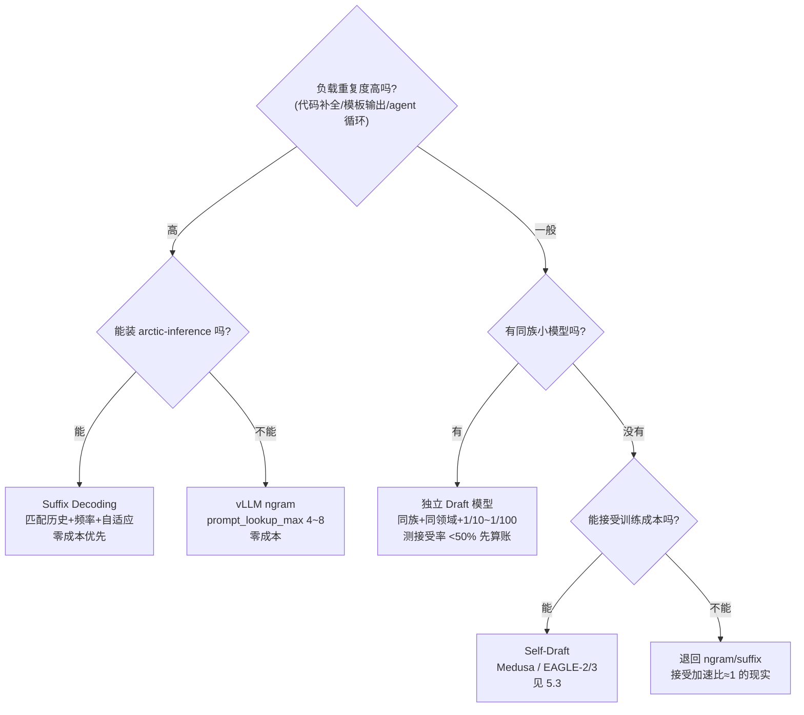

5.1 的框架里，draft 是谁都可以——但“谁”直接决定你拿到 2 倍还是 0.8 倍。这一节先把独立 Draft 模型的选择标准钉死：**参数规模典型是 target 的 1/10~1/100（Qwen3-8B 配 0.6B、70B 配 1B 都是常见组合）、必须共享 tokenizer、能力领域要对口**；再介绍一条完全不同的路——**无模型方案**（N-gram / Prompt-Lookup / Suffix Decoding）。它不加载任何 draft 模型，直接从 prompt 和生成历史里“抄”草稿——显存零开销、训练零成本。在重复性负载（代码补全、模板输出、agent 循环）上，它实测能到 5 倍级加速（Suffix Decoding 在 SWE-Bench/Text-to-SQL 上 5.3×）；但在自由生成的文本里，它基本不工作。什么时候该从“抄”升级到 5.3 的 Self-Draft（Medusa/EAGLE），看完对比表你就有答案。

<!-- more -->

## 📑 目录

- [1. Draft 模型怎么选](#1-draft-模型怎么选)
- [2. 无模型方案：动机与原理](#2-无模型方案动机与原理)
- [3. N-gram 投机：从 prompt 里找答案](#3-n-gram-投机从-prompt-里找答案)
- [4. Prompt-Lookup 与 Suffix Decoding](#4-prompt-lookup-与-suffix-decoding)
- [5. 对比表与选型](#5-对比表与选型)
- [6. 数值算例：一次 N-gram 匹配的完整过程](#6-数值算例一次-n-gram-匹配的完整过程)
- [7. 权衡与边界：什么时候不划算](#7-权衡与边界什么时候不划算)
- [总结](#-总结)
- [自我检验清单](#-自我检验清单)
- [参考资料](#-参考资料)

---

## 1. Draft 模型怎么选

### 1.1 多大合适：1/10~1/100 的“甜蜜区间”

Draft 模型的参数规模没有硬性规定，但工程实践收敛在一个区间：**target 的 1/10~1/100**。vLLM 文档和社区的常见组合：

| 📊 组合 | Draft / Target 参数比 | 说明 |
|---|---|---|
| Qwen3-0.6B → Qwen3-8B | ~1/13 | vLLM 文档默认示例 |
| Qwen3-1.7B → Qwen3-32B | ~1/19 | 5.1 提到过的实测组合 |
| Llama-3.2-1B → Llama-3.3-70B | ~1/70 | 70B 级常用配对 |

为什么不能太小或太大？这是“快”与“准”的跷跷板，5.1 第 5.2 节讲过那个反直觉实测：Qwen3-32B 配 **1.7B** draft 的加速比反而高于配 **4B** draft——4B 的接受率更高，但它每轮 forward 更慢，**draft 前向开销吃掉了接受率的收益**。反过来，draft 再小下去（比如 0.1B 配 70B），接受率会跌破盈亏线。**判断标准不是参数量，而是算一笔账：draft 每轮（串行 γ 次）的总耗时，是否小于 target 每轮耗时的 (E[N]−1) 倍**——5.1 的加速比公式在选型时就是预算表。

### 1.2 硬性条件：必须共享 tokenizer

draft 和 target 的 tokenizer（把文字切成 token 的工具）不一致，draft 猜的 token id 在 target 词汇表里根本没意义，验证无从谈起。所以**最省事的组合是同族模型**（Qwen 配 Qwen、Llama 配 Llama）——tokenizer 天然一致，能力分布也接近。

⚠️ **注意**：跨家族也不是绝对不行。vLLM 提供 `use_heterogeneous_vocab: true` 开启 **Token-Level Intersection（TLI）** 算法，允许 draft 用不同的 tokenizer——但当前要求 `draft_sample_method='greedy'`（概率采样尚未支持），且这是“拿灵活性换精度”的路径，别当默认选项。**默认约束仍然是：同 tokenizer**。

### 1.3 能力匹配：代码配代码，领域要对口

tokenizer 相同只保证“能对上话”，能力匹配才保证“猜得准”。三条经验：

- **同族 > 同规模**：同族的 0.6B draft 往往比跨族的 1B draft 接受率更高——它见过 target 的分布。
- **领域要对口**：代码模型的 target 配代码能力的小模型；做法律/医疗的 target 别配通用小模型。draft 不需要全能，只需要在**你的负载分布**上准。
- **能力差距过大的后果是接受率骤降**：5.1 第 4.3 节的位置接受率实测（71/50/36/27%）是“好 draft”的曲线；draft 太弱时，**连第 1 个位置都过不了**，E[N] 贴着 1 走，加速比 < 1——白付显存还变慢。

### 1.4 采样方式与无损边界

选完模型还有一个采样方式的旋钮：vLLM 的 `draft_sample_method` 支持 `greedy`（默认）与 `probabilistic` 两种 draft 采样。需要知道的事实是：**当前 vLLM 对 temperature>0 的请求，无损采样支持还不完整**——2026 年初的实测博客明确提到“temperature>0 的无损采样尚未支持、有 open PR”（PR #20459），所以基准测试和线上对比大多跑在 greedy。这意味着：**在 vLLM 上用 draft_model 想拿到 5.1 证明的那种严格无偏，现阶段先以 greedy 为准**；概率采样的支持状态演进很快，以你所用版本的发布说明为准。

选 draft 三步：**同族 + 同领域 + 1/10~1/100 规模，然后用你的真实负载测接受率；接受率 <50% 先算账（$E[N]$ vs draft 开销）再决定换不换**。

---

## 2. 无模型方案：动机与原理

Draft 模型好用，但它有四个绕不开的成本：**显存**（权重 + 自己的 KV Cache）、**训练/获取**（不是每个模型都有现成同族小模型）、**加载管理**（多一个模型对象）、**调参**（γ、采样方式）。能不能全都省掉？

**能——如果你接受一个前提：draft 只从“已经出现过的话”里抄**。人类写作有个特点：代码里的相似片段、模板化的公司介绍、翻译里的固定搭配、agent 循环里的自我反思模板……**大量输出是 prompt 或历史里某段内容的重复或变形**。既然要重复，就不用“猜”——直接“抄”：拿最近生成的 n 个 token 当钥匙，在历史文本里找相同片段，把片段后面跟着的 token 抄下来当草稿。

打个比方：**这不是让实习生起草了，而是让实习生去翻档案室——“这段话以前写过，直接抄后面的”**。档案室里没有的（自由发挥的新内容），实习生就一个字都交不出来，只能让主编（target）自己写。用技术语言重述：无模型方案的 draft 生成器是一个**确定性字符串匹配器**，不是概率模型；它的接受率完全取决于负载的重复度。

📌 **关键点**：无模型方案把 5.1 的“接受率”问题从“模型能力”变成了“**数据重复度**”问题——负载重复度越高，白拿的加速越多；这也是为什么这类方案在代码补全和 agent 循环里比在开放对话里好用得多。

### 2.1 无模型方案也是无偏的

一个值得放心的问题：**抄来的草稿走 rejection sampling 还是无偏的吗？** 是。回顾 5.1 的证明框架：draft 分布 $q$ 不必来自模型，任何分布都行。无模型方案的 $q$ 是一个**确定性分布**——抄来的那个 token $x$ 概率为 1，其余为 0。代入接受概率：

$$
a(x) = \min\left(1, \frac{p(x)}{q(x)}\right) = \min(1, p(x)) = p(x)
$$

即**接受概率退化为 target 自己给出的概率**：target 越看好抄来的 token，越可能直接放行。拒绝后从修正分布 $(p-q)^+$ 采样——由于 $q$ 只在 $x$ 处有质量，修正分布恰好等于“**排除 $x$ 后重新归一化的 $p$**”。两条路径相加仍是 $p$，无偏性完整保留。vLLM 的实现里无模型路径走的就是这个退化形式（`draft_probs` 为空时按 $q=1$ 处理接受判定，被拒位置的采样把 draft token 从 target 分布里屏蔽掉），和 5.1 的证明严丝合缝。

---

## 3. N-gram 投机：从 prompt 里找答案

### 3.1 机制：后缀匹配 + 顺延抄写

N-gram 投机的 draft 生成分三步：

1. **取钥匙**：把最近生成的 n 个 token 作为“查询后缀”（n 是匹配窗口长度）；
2. **找位置**：在 prompt 的 token 序列里找这个后缀**最近一次出现**的位置；
3. **顺延抄写**：把该位置之后的 token 依次抄下来，凑满 γ 个作为 draft。

匹配不到就不投机（本轮退回普通解码）；匹配到的片段越长、越靠后，draft 越可能被接受。vLLM 的 ngram 方法官方文档措辞是**“只匹配 prompt”**（原文：“proposals are generated by matching n-grams in the prompt”），但 V1 实现实际匹配**整个上下文（含生成历史）**——文档措辞滞后于实现，以你所用版本为准。

### 3.2 vLLM 配置

vLLM V1 里 ngram 的配置也收进 `--speculative-config`（旧版独立的 `--ngram-prompt-lookup-max` 等参数已随旧格式一起弃用，以你所用版本为准）：

```python
from vllm import LLM, SamplingParams

llm = LLM(
    model="Qwen/Qwen3-8B",
    speculative_config={
        "method": "ngram",          # 方法名：无模型
        "num_speculative_tokens": 5, # 还是 γ：最多猜几个
        "prompt_lookup_max": 4,      # 匹配窗口上限：钥匙最长取 n 个 token
        "prompt_lookup_min": 1,      # 匹配窗口下限：低于它就禁用投机（默认 1）
    },
)
```

参数语义：**`prompt_lookup_max` 是“钥匙”的最大长度**——窗口越大，匹配越精确、越不容易撞上巧合，但能找到的重复片段也越少；`prompt_lookup_min` 是兜底下限，实际匹配长度低于它就放弃投机。这组参数是 ngram 方案的调优旋钮，实践中从 max=4~8 起步。

### 3.3 接受率特征与适用场景

N-gram 的接受率完全由负载决定：

- ✅ **高接受率场景**：代码补全中的相似函数体、重复的 import 块、模板化输出（JSON 结构、固定格式报告）、长 prompt 里的引用式回复。
- ❌ **低接受率场景**：自由创作、开放性对话、任何“这段内容此前没出现过”的生成——匹配不到，加速比 ≈ 1。

💡 **提示**：vLLM 的 ngram 只翻 prompt，所以**prompt 越长、越结构化，收益越大**；短 prompt + 自由生成 = 别开。

---

## 4. Prompt-Lookup 与 Suffix Decoding

### 4.1 Prompt Lookup Decoding：概念的源头

N-gram 投机不是 vLLM 发明的。**Prompt Lookup Decoding**（Apoorv Saxena，2023 年 11 月）是这类方案的源头：用当前上下文（prompt + 已生成内容）的最后 n 个 token 做查询，在**整个上下文**里找最长匹配，把匹配点之后的 token 抄成草稿。作者报告在“输入锚定生成”（摘要、改写、问答引用原文）场景下**延迟降低 2~4 倍**、质量无损。

⚠️ **注意**：这个工作最初以 GitHub 仓库 + 技术说明的形式发布，**没有正式 arXiv 论文**——网上流传的 “arXiv:2311.09942” 编号对不上这篇工作，引用时以仓库为准。vLLM 的 ngram 方法就是它的工程化版本（vLLM 实现匹配整个上下文，官方文档措辞仍是“只匹配 prompt”）；HuggingFace Transformers 的 `assisted_decoding` 里也有 `prompt_lookup_num_tokens` 参数。2024 年还有一篇把这类“免学习批量投机”理论化的论文 The N-Grammys（Stewart et al.，ENLSP 2024 Workshop）。

原版实现就两个参数（作者实验取值：`max_ngram_size=3`、`num_pred_tokens=10`）：

- **`max_ngram_size`（匹配窗口）**：钥匙最长取几个 token。实现里从 `max_ngram_size` 往下递减尝试（3→2→1），找“最后一个 token 序列在历史里最近一次出现”的位置——宁可小窗口命中，也不大窗口落空；
- **`num_pred_tokens`（草稿长度上限）**：命中后最多顺延抄几个 token，对应 5.1 的 γ。注意实现有个“避免自匹配”的细节：匹配位置不能是当前位置自己，否则会把正在生成的内容再抄一遍。

作者的实验数据很能说明“数据重复度决定收益”：Mistral-7B + greedy 解码下，摘要/上下文问答平均 **2.4×** 加速且从未低于基线；MT-Bench 上按类别拆开看——**roleplay（角色扮演）收益最差**（几乎没什么可抄的），**coding 第二轮回合收益最高**（大量代码复制），**extraction 第一轮收益最高**（抽取式任务必然抄原文）。

### 4.2 Suffix Decoding：更强的“档案室管理员”

2024 年底，Snowflake 的 **SuffixDecoding**（arXiv:2411.04975，NeurIPS 2025 Spotlight）把无模型方案推到新高度。它和 ngram 的核心区别有三点：

1. **匹配不受固定窗口限制**：用后缀树（一种存下所有后缀、查找很快的数据结构）缓存长 token 序列，能匹配**任意长度的历史片段**（不限于 n-gram 大小）；
2. **不再“抄第一个匹配”**：用**频率计数**统计每个候选续写的出现次数，投出“最可能”的那个，而不是“最近”的那个；
3. **自适应投机长度**：接受率高就多猜、接受率低就少猜——γ 不再是定值，每步动态调整。

论文在 agent 负载（SWE-Bench、Text-to-SQL）上报告 **最高 5.3× 加速**：比 EAGLE-2/3 这类模型方案快 2.8×，比同样免模型的 Token Recycling 快 1.9×。vLLM 已支持 `method="suffix"`（需要 `pip install arctic-inference`，这是 Snowflake 的推理库，参数名以你所用版本为准）：

```python
llm = LLM(
    model="Qwen/Qwen3-8B",
    speculative_config={
        "method": "suffix",
        "num_speculative_tokens": 32,  # 注意：这里是"最大"投机长度
                                       # 官方建议给大值，16 或 32（默认 32），
                                       # 实际长度由接受情况自适应
    },
)
```

📌 **关键点**：suffix 的 `num_speculative_tokens` 语义和 draft model 不一样——它是**上限**不是固定值，官方建议直接给 16~32。别用 draft 模型时代的“γ=4”直觉去调它。

---

## 5. 对比表与选型

| 📊 维度 | vLLM ngram | Prompt-Lookup（概念） | Suffix Decoding | 独立 Draft 模型 |
|---|---|---|---|---|
| 额外显存 | 0 | 0 | 0（一个后缀树索引） | draft 权重 + KV Cache |
| 训练成本 | 无 | 无 | 无 | 需现成同族模型或自训练 |
| 匹配对象 | 仅 prompt | prompt + 生成历史 | prompt + 生成历史（频率计数） | 任意文本分布 |
| 投机长度 | 固定 γ | 固定 γ | 自适应（上限 16~32） | 固定 γ |
| 接受率特征 | 靠负载重复度 | 靠负载重复度 | 靠负载重复度（更高，有投票） | 靠模型能力匹配 |
| 典型加速（论文/实测） | 重复负载高收益 | 输入锚定生成 2~4× | agent 负载最高 5.3× | 2~3×（代码/结构化） |
| 依赖 | vLLM 内置 | vLLM 内置 | 需 arctic-inference | 同族模型存在即可 |

📌 **关键点**：表格里最反直觉的一行是“接受率特征”——**无模型方案的上限由数据决定，模型方案的上限由模型决定**。你的负载如果是“写新东西”，模型方案永远压无模型方案一头；如果是“大量重复已有内容”，无模型方案能以零成本接近甚至超过一个平庸 draft 模型。

决策规则：

- ✅ **负载重复度高**（代码补全、模板输出、agent 循环）→ 先上 ngram/suffix，零成本白拿；suffix 的树索引比 ngram 更强，能装依赖就优先。
- ✅ **重复度一般但想要稳定加速** → 上独立 draft 模型（第 1 节三原则选型）。
- ❌ **别上来就买“模型方案”**——先用无模型方案测一轮接受率，接受率数据会告诉你负载的重复度天花板，再决定要不要花钱（显存/训练）买模型方案。

把上面的规则画成决策树：



---

## 6. 数值算例：一次 N-gram 匹配的完整过程

把机制走一遍。假设 prompt 是：

```
北京是中国的首都。北京是中国的
```

分词后（示意，不追求精确 BPE）得到 token 序列：

```
[北京] [是] [中国] [的] [首都] [。] [北京] [是] [中国] [的]
  t0     t1    t2    t3   t4    t5    t6    t7    t8    t9
```

假设模型正在生成的是 `t10`（prompt 结束处的下一个 token），配置 `prompt_lookup_max=3`、γ=3：

**第 1 步：取钥匙。** 取最近最多 3 个 token 当查询后缀：`[北京] [是] [中国]`（t7~t9）。

**第 2 步：在 prompt 里找最近一次出现。** 从后往前扫，t7~t9 在 t0~t2 处完全匹配（`[北京] [是] [中国]`），命中位置 = 2（匹配段的末尾）。

**第 3 步：顺延抄写。** 把命中位置之后的 token 依次抄下来：t3=`[的]`、t4=`[首都]`、t5=`[。]`——凑满 γ=3 个，draft = `[的] [首都] [。]`。

**第 4 步：Target 并行验证。** 一次 forward 验证这 3 个候选 + 1 个 bonus 位置。如果这个文本确实是重复生成场景，三个候选大概率全过，加上 bonus token，**一次 forward 产出 4 个 token**——理想加速比 4×（5.1 的公式同样适用：γ=3 时 $E[N]$ 的上限是 $\gamma+1=4$，α 越接近 1 越靠近这个上限）。

**第 5 步（失败路径）**：如果 t0~t2 处的续写是“曾经说过但这次不打算再说”的话，第 1 个位置就被拒绝，从修正分布重采样后本轮结束——产出 1 个 token，退回普通解码的速度。

💡 **提示**：注意第 2 步选“最近一次出现”而不是“第一次出现”——因为离得越近的匹配，上下文越相似，抄来的续写越可能被接受。窗口 min/max 的作用就是在这里：max 限制钥匙长度避免误匹配，min 兜底避免拿 1 个 token 就乱抄。

---

## 7. 权衡与边界：什么时候不划算

### 7.1 无模型方案的三个软肋

- **自由生成文本基本不工作**：开放对话、新闻写作、创意内容——这些负载里“重复已有文本”的占比很低，匹配率可能 <10%，加速比贴着 1，还多花字符串匹配的 CPU 时间。
- **收益上限 = 数据重复度**：即使匹配成功，抄来的片段也可能被 target 拒绝（语境变了）；无模型方案没有“能力”可以提升，**调参只能调匹配策略，调不动接受率天花板**。
- **匹配本身有成本**：长 prompt + 大窗口下的字符串搜索不是免费的（suffix 树能把索引做得高效，ngram 的朴素实现要权衡窗口大小与搜索开销）。

### 7.2 什么时候升级到 Self-Draft（5.3）

如果你测完发现：**负载重复度不错但接受率不够、或者重复度一般但你就是想要模型级的稳定加速**——该看 5.3 的 Self-Draft 了。两条升级路径，都**不需要外部 draft 模型**：

- **Medusa**（多解码头）：在 target 上加几个小头并行预测后续 token，Medusa-1 实测 >2.2×，Medusa-2（与主干联合微调）2.3~3.6×；
- **EAGLE-2/3**（动态 Draft Tree + 置信度校准）：利用 draft 头输出的置信度动态决定树的分支，EAGLE-2 实测 3.05~4.26×，EAGLE-3 最高 6.5×。

它们的共同点是“**在 target 自己身上长出草稿能力**”——接受率比通用小模型高，又免去了外部 draft 的显存与运维。代价是**需要训练**（draft 头要针对你的 target 微调）和更复杂的工程。选型顺序建议：**先测 ngram/suffix（0 成本）→ 重复度不够再测 draft 模型（0 训练）→ 还不够才上 Self-Draft（要训练，5.3 详述）**。

三档对比：**无模型方案是“数据里有就白拿”；draft 模型是“花钱买通用性”；Self-Draft 是“花钱买上限”**——每一步升级都先拿上一步的接受率数据说话。

---

## 📝 总结

1. **Draft 选型三原则**：规模 1/10~1/100（Qwen3-8B 配 0.6B、70B 配 1B）、必须共享 tokenizer（跨家族 TLI 是 greedy-only 的例外）、能力领域对口（代码配代码）——接受率 <50% 先算账再决定换不换。
2. **draft 的“快”与“准”要一起权衡**：1.7B draft 实测比 4B 加速比更高，draft 前向开销会吃掉接受率收益。
3. **无模型方案的本质**：把接受率问题从“模型能力”变成“数据重复度”——从 prompt/历史里抄草稿，显存零开销、训练零成本。
4. **三代无模型方案**：vLLM ngram（实现匹配整个上下文，`prompt_lookup_max/min` 调窗口）→ Prompt-Lookup（概念源头，无 arXiv 论文，输入锚定生成 2~4×）→ Suffix Decoding（匹配历史 + 频率计数 + 自适应长度，agent 负载最高 5.3×）。
5. **升级路线**：ngram/suffix（0 成本测重复度）→ draft 模型（0 训练买通用）→ Medusa/EAGLE Self-Draft（要训练，买上限，5.3）。

## ⚠️ 常见错误做法

- ❌ **draft 模型越大越好**：觉得 draft 强则接受率高。为什么错：接受率提升赶不上 draft 前向开销的增长，中等 draft（1/10 左右）反而最优（本文的 Qwen3-32B 配 1.7B 反超 4B 的实测）。正确做法：按“draft 每轮耗时 vs target 每轮耗时”算账选型。
- ❌ **在自由生成场景硬上 N-gram**：把代码补全的 5 倍加速期待带到对话。为什么错：N-gram 只对重复性负载（代码、模板）有效，自由文本基本不命中。正确做法：按负载类型选——重复性负载用 N-gram，通用负载用 draft 模型（本文的决策树）。
- ❌ **忽略 tokenizer 对齐**：draft 与 target 词表不一致就配对。为什么错：同族模型（Qwen 配 Qwen）tokenizer 天然一致；跨族配对验证无意义。正确做法：同族配对或走跨词表方案。
- ❌ **把 draft 模型当“小模型”随便选**：不看能力分布。为什么错：draft 与 target 能力差距过大时接受率跌破盈亏线（0.1B 配 70B 基本不赚）。正确做法：按任务类型匹配（代码模型配代码）。

## 🎯 自我检验清单

- 能说出 Draft 模型选型的三原则，并给出 1/10~1/100 规模的具体实例组合
- 能解释“1.7B draft 比 4B draft 加速比更高”的机制（前向开销 vs 接受率的跷跷板）
- 能解释为什么 draft 与 target 必须共享 tokenizer，以及 `use_heterogeneous_vocab` 的代价（greedy-only）
- 能说出无模型方案把什么换成了什么（显存/训练成本 → 对数据重复度的依赖）
- 能写出 vLLM ngram 的 `--speculative-config` 配置，并解释 `prompt_lookup_max` / `prompt_lookup_min` 的语义
- 能手动走一遍 n-gram 匹配流程（取钥匙 → 找最近匹配 → 顺延抄写 → 验证），并解释为什么选“最近一次出现”
- 能说出 Prompt Lookup Decoding 与 vLLM ngram 的关系（概念源头/工程化），以及为什么它没有 arXiv 编号可引
- 能说出 Suffix Decoding 相对 ngram 的三个改进（匹配历史、频率计数、自适应长度）及其适用负载
- 能解释为什么 `num_speculative_tokens` 在 suffix 里是“上限”而 draft model 里是“定值”
- 能根据负载重复度走完“ngram → draft 模型 → Self-Draft”的升级决策，并说明每步的判定依据（接受率数据）

## 📚 参考资料

**论文**

- [SuffixDecoding: Extreme Speculative Decoding for Emerging AI Applications - Oliaro et al., 2024（NeurIPS 2025 Spotlight，agent 负载最高 5.3×）](https://arxiv.org/abs/2411.04975)
- [The N-Grammys: Accelerating Autoregressive Inference with Learning-Free Batched Speculation - Stewart et al., 2024（ENLSP-IV Workshop）](https://www.amazon.science/publications/the-n-grammys-accelerating-autoregressive-inference-with-learning-free-batched-speculation)
- [Medusa: Simple LLM Inference Acceleration Framework with Multiple Decoding Heads - Cai et al., 2024（Medusa-1 >2.2×，Medusa-2 2.3~3.6×）](https://arxiv.org/abs/2401.10774)
- [EAGLE-2: Faster Inference of Language Models with Dynamic Draft Trees - Li et al., 2024（3.05~4.26×）](https://arxiv.org/abs/2406.16858)
- [EAGLE-3: Scaling up Inference Acceleration of Large Language Models via Training-Time Test - Li et al., 2025（最高 6.5×）](https://arxiv.org/abs/2503.01840)

**开源项目与官方文档**

- [Prompt Lookup Decoding - Saxena, 2023（概念源头，GitHub 仓库；无正式 arXiv 论文）](https://github.com/apoorvumang/prompt-lookup-decoding)
- [vLLM N-Gram Speculation 文档（method="ngram" 配置）](https://docs.vllm.ai/en/latest/features/speculative_decoding/n_gram/)
- [vLLM Suffix Decoding 文档（method="suffix" 与 arctic-inference）](https://docs.vllm.ai/en/latest/features/speculative_decoding/suffix/)
- [vLLM Draft Models（method="draft_model" 与 use_heterogeneous_vocab）](https://docs.vllm.ai/en/latest/features/speculative_decoding/draft_model/)
- [vLLM SpeculativeConfig 源码（prompt_lookup_max/min 字段定义）](https://github.com/vllm-project/vllm/blob/main/vllm/config/speculative.py)
- [Arctic Inference（Suffix Decoding 的推理库）](https://github.com/snowflakedb/ArcticInference)

**站内**

- [5.1 Speculative Sampling 核心原理（Draft + Verify 框架与无偏性）](/AIInfraGuide/inference/模块四-推理优化/第5章-speculative-decoding/51-核心原理与rejection-sampling)
- [第 5 章 Speculative Decoding（章索引）](/AIInfraGuide/inference/模块四-推理优化/第5章-speculative-decoding/第5章-speculative-decoding)
- [1.1 LLM 推理基础（Decode 串行瓶颈与 Memory Bound）](/AIInfraGuide/inference/模块四-推理优化/第1章-llm推理基础/11-llm推理基础)
- [4.6 量化选型与 vLLM 实战（量化与投机叠加的坑，见 5.4）](/AIInfraGuide/inference/模块四-推理优化/第4章-量化/46-量化选型与vllm实战)
