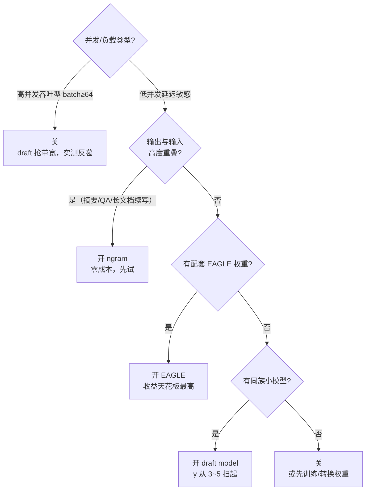

5.4 把收益边界讲透了，这一节解决"怎么快速知道赚不赚"。vLLM 从 V0 演进到 V1，投机解码的配置从散落的 `--speculative-model`、`--num-speculative-tokens` 等一堆参数，收敛成了**一个 JSON**：`--speculative-config`。本文带你跑通三种方案的完整命令——独立 Draft 模型（vLLM V1 的 PR #24322 在 Llama-3.3-70B + Llama-3.2-1B 上实测最高 3.55x，但只出现在并发 1~4）、ngram（官方博客在摘要负载上 2.8x）、EAGLE（EAGLE-2 论文 3.05x~4.26x）——再给一套可复用的 A/B 验证流程和"什么负载开、什么负载关"的决策规则。动手之前记住 5.4 的结论：**加速比由接受率和 draft 开销决定，配置只负责把它们调到最优**。

<!-- more -->

## 📑 目录

- [1. 三种方案的总览：先选方向再动手](#1-三种方案的总览先选方向再动手)
- [2. 方案 A：独立 Draft 模型](#2-方案-a独立-draft-模型)
- [3. 方案 B：N-gram（Prompt Lookup）](#3-方案-bn-gramprompt-lookup)
- [4. 方案 C：EAGLE](#4-方案-ceagle)
- [5. 通用易错点清单](#5-通用易错点清单)
- [6. 可复用的 A/B 验证流程](#6-可复用的-ab-验证流程)
- [7. 决策规则：什么负载开、什么负载关](#7-决策规则什么负载开什么负载关)
- [总结](#-总结)
- [自我检验清单](#-自我检验清单)
- [参考资料](#-参考资料)

---

## 1. 三种方案的总览：先选方向再动手

### 1.1 三个问题先钉死

动手之前先回答三个问题：**你手里有什么？（有没有同族小模型 / EAGLE 权重）→ 你的负载是什么？（结构化输出还是开放对话）→ 你的瓶颈是延迟还是吞吐？** 这三个答案直接决定方案，比参数调优重要得多。

| 📊 维度 | 独立 Draft 模型 | N-gram（Prompt Lookup） | EAGLE |
|---|---|---|---|
| 提案来源 | 另一个小模型 | 从 prompt/历史输出里匹配 n-gram | 挂在 target 上的额外 head |
| 需要额外训练 | 否（用现成小模型） | 否 | 是（需要配套训练好的 EAGLE 权重） |
| 额外显存 | 最大（小模型权重 + 两套 KV Cache） | 几乎为零 | head 权重（几百 MB 级）+ 树 KV |
| 词表约束 | 默认要求与 target 同词表 | 无 | 必须与 target 同族配套 |
| 典型收益 | 高（代码负载 3.55x 实测） | 低~中（摘要 2.8x，开放对话几乎为零） | 最高（论文 3.05x~4.26x） |
| 上手成本 | 低（一个模型名） | 最低（一段 JSON） | 中（要找匹配权重） |

### 1.2 配置入口：V1 的 `--speculative-config`

vLLM V1 起，投机解码的所有参数收进一个 JSON：

```bash
vllm serve <target-model> \
  --speculative-config '{
    "method": "draft_model",
    "model": "<draft-model>",
    "num_speculative_tokens": 5
  }'
```

⚠️ **注意**：vLLM 官方文档明确标注，旧的 `--speculative-model` + `--num-speculative-tokens` 分开传参的方式**已经弃用**。如果你在网上搜到 2024~2025 年的老教程（V0 写法），参数名大概率对不上——**一切以你所用版本的 `vllm serve --help` 为准**。Python 离线模式等价写法是 `LLM(..., speculative_config={...})`，字段完全一致。

`method` 的常见取值：`draft_model`（独立模型）、`ngram`、`suffix`（后缀匹配）、`eagle` / `eagle3`、`mtp`（原生多 token 预测）、`dflash`、`pard`、`medusa` 等。**拿不准就查官方文档的 method selection 表**，选型结论一句话：模型类方法（EAGLE/MTP/draft model）延迟收益最高，ngram/suffix 收益温和但零成本。

如何确认你的版本支持哪些 method？先跑 `vllm serve --help | grep speculative` 看有没有 `--speculative-config`（没有说明你还在 V0 或老版本）；method 的完整支持列表随版本演进，**以官方文档和 `--help` 为准**，别信博客里的旧列表。

---

## 2. 方案 A：独立 Draft 模型

### 2.1 完整启动命令与参数解释

```bash
vllm serve Qwen/Qwen3-32B \
  --host 0.0.0.0 --port 8000 \
  --max-model-len 8192 \
  --gpu-memory-utilization 0.8 \
  --speculative-config '{
    "method": "draft_model",
    "model": "Qwen/Qwen3-1.7B",
    "num_speculative_tokens": 4,
    "draft_tensor_parallel_size": 1
  }'
```

逐项解释：

- **`method: "draft_model"`**：声明用独立小模型做提案。V0 时代这个能力在 V1 早期一度缺失，PR #24322 把它重新带回 V1（2026 年初合并）。
- **`model`**：draft 模型 ID。**默认要求与 target 用同一词表**（同一模型族的对应小尺寸版本最稳），否则启动会报错或需要开 `use_heterogeneous_vocab`（见 2.2）。
- **`num_speculative_tokens`**：就是 5.1~5.4 里的 γ。**不是越大越好**——PR #24322 实测 Qwen3 上最优 3~4、Llama-3.3-70B 上最优 7，再大收益饱和、开销线性涨（5.4 第 1.3 节的曲线）。
- **`draft_tensor_parallel_size`**：draft 的 TP 大小，可以和 target 不同。70B target 用 TP4 时，1B draft 用 TP1 就够了，省掉 4 卡之间来回通信的开销。注意 `tensor_parallel_size` 不是 `speculative-config` 的合法字段，别放错位置。

### 2.2 选 draft 模型的三个原则

1. **同族同词表优先**：draft 与 target 同一模型族的小尺寸版本（Qwen3-32B 配 Qwen3-1.7B/4B、Llama-3.3-70B 配 Llama-3.2-1B）。词表一致是默认前提，也是 5.4 讲的"同族同分布"高接受率的来源。
2. **能力差距要适中**：太小接受率跌破 0.5（5.4 的“亏”区间），太大 draft 开销吃掉收益（c 逼近 1）。经验量级：target 的 1/10~1/100 参数规模（与 5.2 口径一致）。打个比方：选 draft 像给主编配实习生——**得是同部门、懂同一套黑话的人**；跨部门（跨模型族）的实习生再聪明，草稿也常常不在点子上；而同部门的资深编辑（太大的 draft）帮你打草稿的价格又太贵。
3. **跨词表硬配要用 TLI**：`use_heterogeneous_vocab: true` 启用 Token-Level Intersection，构建两词表的 token 交集、把 draft logits 限制在共有 token 上。举个具体场景：target 是 Qwen3-8B，你想用 SmolLM2-135M 当 draft（不同词表）——默认直接启动失败；开 TLI 后 vLLM 在初始化时构建交集映射，draft 采样出的 token id 会被翻译回 target 词表再做 rejection。⚠️ 代价是共有 token 之外的候选全部消失，draft 表达力打折，接受率通常比同词表低一截——**TLI 是"手头没有同族模型"时的应急通道，不是常规选项**；而且目前只支持 greedy draft 采样（概率采样还在路上）。

### 2.3 预期收益：先看这份实测，再看你自己的

PR #24322 的公开基准（tomasruizt 博客，2026-01）：Llama-3.3-70B-Instruct + Llama-3.2-1B，2×H100 80GB，InstructCoder 代码数据集，**并发 1~4 时最高 3.55x**，某些配置下超过 EAGLE-3；Qwen3-32B + Qwen3-1.7B 在 1×H100 96GB 上类似。**但**：batch 128+ 时投机解码反而比普通解码更慢。这份数字只说明"代码负载 + 低并发"是它的主场，你的负载必须自己测（第 6 节）。

---

## 3. 方案 B：N-gram（Prompt Lookup）

### 3.1 配置与原理

```bash
vllm serve meta-llama/Llama-3.1-8B-Instruct \
  --speculative-config '{
    "method": "ngram",
    "num_speculative_tokens": 4,
    "prompt_lookup_min": 2,
    "prompt_lookup_max": 5
  }'
```

原理一句话：**把 prompt 和已生成的历史输出里出现过的 n-gram 建成查找表，当前上下文命中某个 n-gram 时，就把它后面的 token 当草稿提出来**（vLLM V1 的 ngram proposer 匹配的是整个上下文；早期文档措辞是"只匹配 prompt"，以你所用版本的实现为准）。打个比方：这是"照着原文抄"——考试题目是"把原文背一遍"时抄原文稳拿分，题目是开放论述时抄了也没用。所以它只适合**输出大量重复输入内容**的负载：摘要（输出是输入的浓缩改写）、QA（答案引原文）、代码重构、长文档续写。

看一眼匹配过程就明白为什么。假设 prompt 是 `def fib(n): if n < 2: return n`，vLLM 先把 prompt 里所有相邻 2 元组建成查找表：`('def', 'fib') → 后面跟的 ('(', 'n', ')')`、`('fib', '(') → ('n', ')' ...)`，以此类推。生成时当前上下文末尾命中某个 2 元组，就把表里存的后续 token 当草稿提出来——**输出是对输入的改写时命中率自然高；输出天马行空时表里根本没有可匹配的 key，每轮只能空手而归**（提案长度为零，白付一次验证开销）。完整的匹配策略、参数调优与 Suffix Decoding 的进阶对比在 5.2 有专门一节，这里只讲配置与实测。

- **`prompt_lookup_min / max`**：n-gram 窗口大小（默认都是 5）。窗口太小容易误命中、太大匹配不到。
- **`num_speculative_tokens`**：命中后最多抄几个 token，对应 γ。

### 3.2 收益与陷阱

- vLLM 官方博客（2024-10）：QPS=1、Llama-3-70B、4×H100，CNN/DailyMail 摘要负载 **2.8x**；但同样的 ngram 换到 ShareGPT 开放对话，收益趋近于零——**ngram 的收益完全由负载决定**。
- ⚠️ **反直觉陷阱**：接受率高 ≠ 一定赚。vLLM Issue #16258 记录了一个实测：ngram 的 draft 接受率高达 **69.8%**（γ=5、lookup max=2），吞吐反而比不开还差——因为命中的片段大多很短、验证开销没被摊平。**接受率只是必要不充分条件，最终判决看 TPOT**。

---

## 4. 方案 C：EAGLE

### 4.1 配置与权重获取

EAGLE 不是独立小模型，而是挂在 target 上的额外 head（5.3 讲过：用 target 的 hidden state 预测下一 token 的特征，再解码出 token）。所以**权重必须与 target 配套**——给 Llama-3-8B-Instruct 用别的模型的 EAGLE head 会直接崩。

```bash
# EAGLE-1/2（注意 model 换成与你 target 匹配的权重）
vllm serve meta-llama/Meta-Llama-3-8B-Instruct \
  --speculative-config '{
    "method": "eagle",
    "model": "yuhuili/EAGLE-LLaMA3-Instruct-8B",
    "num_speculative_tokens": 2,
    "draft_tensor_parallel_size": 1
  }'

# EAGLE-3（method 不同，权重来源不同）
vllm serve meta-llama/Meta-Llama-3.1-8B-Instruct \
  --speculative-config '{
    "method": "eagle3",
    "model": "RedHatAI/Llama-3.1-8B-Instruct-speculator.eagle3",
    "num_speculative_tokens": 2,
    "draft_tensor_parallel_size": 2
  }'
```

权重去哪找：HuggingFace 上的 **RedHatAI/speculator-models** 集合、**yuhuili/models**（EAGLE 作者），以及 vLLM 团队的 **Speculators 项目**（提供训练与接入一体化工具）。⚠️ 如果你用的 vLLM 版本 < 0.7.0，EAGLE checkpoint 需要先跑官方转换脚本再加载；新版直接读。**具体权重名和 target 的对应关系以官方文档为准，配错模型族是最常见的启动失败原因**。

### 4.2 为什么 EAGLE 通常最值得先试

EAGLE 系列论文的收益天花板最高：EAGLE-2（arXiv:2406.16858）在三个模型族、六个任务上 **3.05x~4.26x**，比 EAGLE-1 快 20~40%；EAGLE-3 靠"训练时测试"进一步到 **6.5x**（相对 EAGLE-2 提升 ~1.4 倍）。vLLM 官方文档的 method selection 表把 EAGLE 列为"强通用模型类方法"。代价是**需要能找到匹配你 target 的权重**——model 生态没覆盖的模型（小众或刚发布），EAGLE 就用不了，只能退回方案 A。

---

## 5. 通用易错点清单

把三个方案共同的坑集中列一遍，**每一条都是真实踩过**的：

1. **版本漂移**：V1 用 `--speculative-config`；`--speculative-model`/`--num-speculative-tokens` 已弃用；`ngram_prompt_lookup_max` 这类老 flag 同理。网上教程九成是 V0 写法，**以 `vllm serve --help` 和官方文档为准**。
2. **词表/tokenizer 不一致**：draft model 默认必须与 target 同词表；EAGLE 权重必须与 target 同族配套。配错的表现往往是启动报错或静默低收益（接受率骤降）。
3. **显存预留**：draft 权重 + 两套 KV Cache + 树 KV 瞬态（5.4 第 3.4 节的账本）。`--gpu-memory-utilization` 建议从 0.9 降到 0.8 再逐步收紧，否则 OOM 或 preemption 频繁。
4. **采样参数放错位置**：`temperature`、`top_p` 是采样参数（`--temperature` 或 SamplingParams），**不是 `--speculative-config` 的字段**，放进 JSON 会被忽略或报错。
5. **`tensor_parallel_size` 不能进 speculative-config**：draft 的 TP 用 `draft_tensor_parallel_size`。
6. **与张量/流水线并行的兼容性**：vLLM 官方文档记录，截至 vllm ≤ 0.15.0，**Pipeline Parallelism 与投机解码不兼容**；draft model 方案在 vllm ≤ 0.10.0 里根本没有。
7. **GGUF 等格式不支持**：投机解码不支持 GGUF 模型（无论 target 还是 draft），论坛有明确答复。

---

## 6. 可复用的 A/B 验证流程

### 6.1 协议设计（承接 4.6 与 5.4 的方法论）

变量全部固定，只切换投机开关：

- **两组任务**：代码生成（HumanEval 类，预期高接受率）与开放对话（ShareGPT 类，预期低接受率）各 100~200 条。
- **固定采样**：`--temperature 0.6`（或你的线上值——温度直接决定接受率，5.4 第 2.1 节）、固定 `max_tokens`（如 200）。
- **并发档位**：1 / 8 / 32，每档单独跑——收益曲线对并发极其敏感（3.55x 只在并发 1~4）。
- **控制变量**：同一台机器、同样的 `--gpu-memory-utilization`、同样的模型，只有 `--speculative-config` 不同。

用 GenAI-Perf 或 vLLM 自带 bench 打同一个端点（4.6 用过 `genai-perf profile`，命令模板照抄即可），记录四件套：**TPOT P50/P95、TTFT、throughput、接受率**。注意每条命令里只有一个变量不同：

```bash
# baseline（无投机）
genai-perf profile -m <model> --endpoint-type chat --service-kind openai \
  --url http://localhost:8000 --concurrency 8 \
  --synthetic-input-tokens-mean 512 --output-tokens-mean 256 \
  --profile-export-file baseline.json

# speculative（换一个启动参数相同的服务，只多 --speculative-config）
genai-perf profile -m <model> --endpoint-type chat --service-kind openai \
  --url http://localhost:8001 --concurrency 8 \
  --synthetic-input-tokens-mean 512 --output-tokens-mean 256 \
  --profile-export-file spec.json
```

两个服务用同一台机器、同一个 `--gpu-memory-utilization`、同一个模型权重，端口分开；参数名可能随版本调整，以 `genai-perf profile --help` 为准。

如果连压测工具都来不及装：直接用 curl 或脚本打 OpenAI 兼容端点，对同一批 prompt 记录每次请求的 TPOT（总耗时 ÷ 输出 token 数），并发控制在 1~8 的低档——**高并发下手工测不准**（排队效应会把延迟曲线搅浑），但低并发下足够分辨"有没有戏"：先花 10 分钟探路，有戏再上正规压测。

### 6.2 接受率怎么拿、怎么读

接受率是投机解码的"体检指标"，两条路径：

- **离线脚本**：跑官方示例 `examples/features/speculative_decoding/spec_decode_offline.py`（以你所用版本的源码路径为准），它会输出两个关键量：**平均接受长度**（= 1 + 接受的 draft token 数 ÷ 投机轮数）和**逐位置接受率**（第 1 位、第 2 位……各自被接受的比例）。示意输出长这样（格式参考官方脚本，数字是虚构的）：

```
Speculative metrics:
  Mean accepted length: 2.84
  Position 0 acceptance rate: 0.82
  Position 1 acceptance rate: 0.61
  Position 2 acceptance rate: 0.43
  Position 3 acceptance rate: 0.30
```

怎么读这份输出？**第 1 位接受率 0.82 说明 draft 整体靠谱**；但第 3 位就掉到 0.43——再往后猜纯属浪费，把 γ 从 5 收到 2~3，收益反而更高（5.4 第 1.3 节的 γ 扫描曲线）。反过来，如果第 1 位接受率就低于 0.5，说明 draft 和 target 错位，γ 怎么调都没用，直接换 draft。
- **在线监控**：vLLM 暴露 Prometheus 指标 `vllm:spec_decode_draft_acceptance_rate` 等（指标名随版本演进，以 `--metrics` 文档为准），服务起来就能盯。

### 6.3 结果模板与解读

| 📊 指标 | Baseline | +Draft Model | +ngram | +EAGLE |
|---|---|---|---|---|
| TPOT P50 / P95（ms） | / | / | / | / |
| TTFT P50（ms） | / | / | / | / |
| Throughput（token/s） | / | / | / | / |
| 接受率（首位 / 整体） | — | / | / | / |

📌 **关键点**：判决只看两行——**TPOT P50 提升 ≥15% 且 P95 不恶化 → 开；接受率 < 0.5 或 TPOT 没降 → 关**。接受率再高，TPOT 没降也白搭（Issue #16258 的 69.8% 教训）；TPOT 降了但 P95 恶化，说明验证阶段的批次抖动伤害了尾延迟，同样该关。

一组典型结果示意（虚构数字，帮你建立读数直觉）：baseline TPOT P50 = 45ms；+draft model TPOT = 28ms（提升 38%）、接受率 0.61 → **开**；+ngram TPOT = 43ms（提升 4%）、接受率 0.35 → **关**，换 EAGLE 或接受现状；+EAGLE TPOT = 24ms 但 P95 从 60ms 涨到 85ms → 收益可疑，查批次抖动来源，不达标就关。**注意同一负载下 ngram 和 EAGLE 的接受率差异可以很大——方案选型比参数调优重要一个数量级**。

---

## 7. 决策规则：什么负载开、什么负载关



落成一句话的规则：

- ✅ **低 QPS、延迟敏感、代码/JSON/结构化输出** → 开。有 EAGLE 权重优先 EAGLE，没有就用同族 draft model。
- ✅ **摘要 / QA / 输出重复输入内容** → 开 ngram，五分钟上线，收益可能有惊喜（2.8x 级）。
- ✅ **温度高（T ≥ 0.8 开放采样）或输出短（≤50 token）** → 关，5.4 的不赚清单前两名。
- ✅ **高并发吞吐型服务（batch ≥ 64）** → 默认关。真要开，先跑第 6 节的并发扫描，别拿单并发数字做决策。
- ❌ **别为了"显得高级"开投机**——如果 TPOT 不是你的瓶颈（比如 TTFT 占大头、或者算力吃满），投机解决的是"串行生成太慢"，不是"首 token 太慢"。
- ❌ **别拿论文/博客的加速比当自己的 KPI**——接受率是 (负载, 温度, draft, target) 的四元函数，30 分钟的 A/B 比任何引用都权威。

---

## 📝 总结

1. **入口统一**：vLLM V1 的投机解码全部走 `--speculative-config` 一个 JSON，旧参数已弃用；`method` 决定方案，`model` 给提案源，`num_speculative_tokens` 就是 γ。
2. **方案 A draft model**：同族小模型最稳，PR #24322 实测最高 3.55x 但只限低并发；γ 最优 3~7，别贪。
3. **方案 B ngram**：零成本、五分钟上线，但只适合"输出重复输入"的负载；接受率高 ≠ 赚（69.8% 反例）。
4. **方案 C EAGLE**：收益天花板最高（EAGLE-2 3.05x~4.26x、EAGLE-3 6.5x），但权重必须与 target 配套。
5. **易错点七连**：版本漂移、词表一致、显存预留、采样参数位置、TP 字段、PP 不兼容、GGUF 不支持。
6. **A/B 判决**：固定负载与并发档，看 TPOT P50/P95 + 接受率；**TPOT P50 ≥15% 且 P95 不恶化才开，否则关**。
7. **决策一句话**：低并发延迟敏感 + 结构化输出 → 开；高并发 / 高温 / 短输出 → 关；先测再上，数字钉死在自己硬件上。

## 🎯 自我检验清单

- 能独立用 `--speculative-config` 启动 draft model 方案，并逐项解释 method/model/num_speculative_tokens/draft_tensor_parallel_size
- 能说出 V0 旧参数（`--speculative-model` 等）为何失效，以及如何查证当前版本的参数格式
- 能写出 ngram 方案的最小 JSON，并说明 prompt_lookup_min/max 各自控制什么
- 能写出 EAGLE 方案的最小 JSON，并说出 EAGLE 权重必须与 target 配套的原因
- 能说出 EAGLE 权重在 HuggingFace 的两个主要来源（RedHatAI / yuhuili）
- 能解释 `use_heterogeneous_vocab`（TLI）解决什么问题、当前有什么限制
- 能列举至少 4 条投机解码的易错点（版本/词表/显存/采样参数位置）
- 能说明"接受率 69.8% 但吞吐更差"可能的原因（命中片段短、验证开销摊不平）
- 能用 spec_decode_offline.py 或 Prometheus 指标读出接受率，并解释"首位接受率"的含义
- 能设计控制变量的 A/B 协议（两组任务 × 三档并发 × 固定采样参数）并跑出 TPOT/接受率对比表
- 能根据"TPOT P50 ≥15% 且 P95 不恶化、接受率 ≥0.5"的判定线做出开关决策
- 能向同事一句话讲清：什么负载开投机（低并发延迟敏感+结构化输出）、什么负载关（高并发/高温/短输出）

## 📚 参考资料

**官方文档**

- [vLLM Speculative Decoding 官方文档（--speculative-config schema 与 method selection）](https://docs.vllm.ai/en/latest/features/speculative_decoding/)
- [vLLM Draft Model 文档（含 V0 参数弃用说明）](https://docs.vllm.ai/en/latest/features/speculative_decoding/draft_model/)
- [vLLM EAGLE 文档（eagle / eagle3 配置示例与权重来源）](https://docs.vllm.ai/en/latest/features/speculative_decoding/eagle/)
- [vLLM Speculators 项目文档（EAGLE-3 训练与接入）](https://docs.vllm.ai/projects/speculators/en/stable/user_guide/getting_started/)
- [vLLM 官方博客：How Speculative Decoding Boosts vLLM Performance by up to 2.8x（2024-10-17）](https://vllm.ai/blog/2024-10-17-spec-decode)

**论文**

- [EAGLE-2: Faster Inference of Language Models with Dynamic Draft Trees - Li et al., 2024](https://arxiv.org/abs/2406.16858)
- [EAGLE-3: Scaling up Inference Acceleration of LLMs via Training-Time Test - Li et al., 2025（NeurIPS 2025）](https://arxiv.org/abs/2503.01840)
- [Fast Inference from Transformers via Speculative Decoding - Leviathan et al., 2022（ICML 2023）](https://arxiv.org/abs/2211.17192)

**开源项目与实测**

- [vLLM PR #24322：spec decode with draft models（V1，3.55x 实测出处）](https://github.com/vllm-project/vllm/pull/24322)
- [Up to 3.55x Faster: Contributing Speculative Decoding with Draft Models to vLLM V1（Tomas Ruiz 实测博客）](https://tomasruizt.github.io/posts/06_vllm-spec-decode/index.html)
- [vLLM Issue #16258：ngram 高接受率但吞吐下降的实测案例](https://github.com/vllm-project/vllm/issues/16258)
- [RedHatAI/speculator-models（HuggingFace EAGLE 权重集合）](https://huggingface.co/collections/RedHatAI/speculator-models)
- [GenAI-Perf（NVIDIA 压测工具，A/B 流程用）](https://github.com/NVIDIA/triton-inference-server/tree/main/genai-perf)

**站内**

- [第 5 章 Speculative Decoding（章首页）](/AIInfraGuide/inference/模块四-推理优化/第5章-speculative-decoding/第5章-speculative-decoding)
- [5.1 核心原理与 Rejection Sampling](/AIInfraGuide/inference/模块四-推理优化/第5章-speculative-decoding/51-核心原理与rejection-sampling)：γ 与接受率的公式源头
- [5.2 Draft 模型与 N-gram 方案](/AIInfraGuide/inference/模块四-推理优化/第5章-speculative-decoding/52-draft模型与n-gram方案)：ngram 匹配策略与 Suffix Decoding 对比
- [5.3 Self-Draft 方案（Medusa 与 EAGLE）](/AIInfraGuide/inference/模块四-推理优化/第5章-speculative-decoding/53-self-draft方案-medusa与eagle)：EAGLE 结构与训练方式
- [5.4 收益边界与限制](/AIInfraGuide/inference/模块四-推理优化/第5章-speculative-decoding/54-收益边界与限制)：何时不赚、A/B 判定线依据
- [2.4 Chunked Prefill 与统一调度](/AIInfraGuide/inference/模块四-推理优化/第2章-推理引擎核心技术/24-chunked-prefill-与统一调度)：V1 调度如何表示投机验证
- [vLLM 快速入门](/AIInfraGuide/inference/模块四-推理优化/第3章-深入vllm/vllm快速入门)：vllm serve 基础用法
- [4.6 量化选型与 vLLM 实战](/AIInfraGuide/inference/模块四-推理优化/第4章-量化/46-量化选型与vllm实战)：GenAI-Perf 压测模板与评测协议
- [AI Infra 学习路线（3.4 Speculative Decoding 检验标准）](/AIInfraGuide/guides/ai-infra学习路线)
