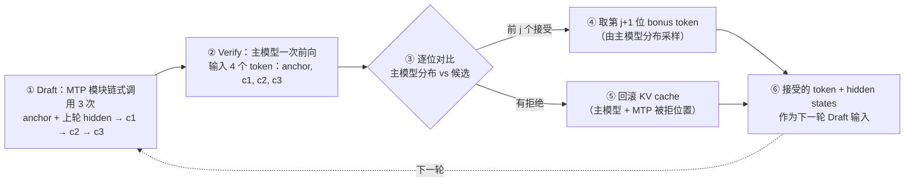

5.1~5.3 里，Draft 要么是一个独立的 0.6B 小模型（5.2），要么是挂在目标模型上的 EAGLE 头（5.3）——都意味着"额外训练 + 额外部署"。MTP（Multi-Token Prediction，多 Token 预测）换了个思路：**把草稿模型直接训进主模型的 checkpoint 里**。DeepSeek-V3 官方权重 685B 里，有 14B 就是 MTP 模块——训练时它作为额外的预测目标让主模型看得更远（论文消融：大模型 HumanEval 44.5→53.7），推理时它摇身一变当 Draft 模型，主模型一次前向并行验证。NVIDIA 在 R1-FP4 上实测（8 卡、batch=1）：MTP=3 相比关闭投机解码提速 2.16 倍，叠加"宽松接受"策略到 2.33 倍。但它的边界也很硬：DeepSeek 自己在 DSpark 论文里承认，**固定的多 Token MTP 草稿（MTP-3/5）在高并发下会严格降低总吞吐**——V4 生产环境因此长期停在 MTP-1，直到两周后换成 5.8 的 DSpark。

<!-- more -->

## 📑 目录

- [1. MTP 在 Draft 选型家族里的位置](#1-mtp-在-draft-选型家族里的位置)
- [2. 直觉理解：跟主模型同训的助教](#2-直觉理解跟主模型同训的助教)
- [3. 角色一：训练目标——为什么 MTP 让模型变强](#3-角色一训练目标为什么-mtp-让模型变强)
- [4. MTP 模块的结构：公式逐项拆解](#4-mtp-模块的结构公式逐项拆解)
- [5. 角色二：推理草稿——MTP Eagle 的一轮循环](#5-角色二推理草稿mtp-eagle-的一轮循环)
- [6. 实测收益与 MTP 的两条推理路径](#6-实测收益与-mtp-的两条推理路径)
- [8. 工程落地与选型](#8-工程落地与选型)
- [9. DeepSeek-V4 的 MTP 现状](#9-deepseek-v4-的-mtp-现状)
- [📝 总结](#-总结)
- [🎯 自我检验清单](#-自我检验清单)
- [📚 参考资料](#-参考资料)

---

## 1. MTP 在 Draft 选型家族里的位置

5.2 和 5.3 把"谁来当草稿模型"的三条路走了一遍。把 MTP 放进去对比，它的位置就清楚了：

| 维度 | 独立 Draft 模型（5.2） | EAGLE 自起草（5.3） | MTP（本文） |
| --- | --- | --- | --- |
| 草稿器来源 | 独立训练的小模型 | 目标模型上训练一个 EAGLE 头 | **主模型 checkpoint 自带**（训练时就在一起） |
| 额外权重 | 整个模型（如 0.6B） | 一个 Transformer 层 + 头 | 一个完整 Transformer 模块（V3 为 14B，占总权重 685B 的 ~2%） |
| 额外训练成本 | 训一个模型 | 训一个头 | **零**——MTP 是主模型预训练的一部分 |
| 草稿方式 | 自回归，逐 token 串行 | 自回归 + 动态树 | 链式：同一个 MTP 模块（或一列 MTP 模块）串行出 K 个候选 |
| KV Cache | 草稿模型一份 + 目标模型一份 | 目标模型一份 + 草稿头一份 | 目标模型一份 + **MTP 模块一份**（Eagle 路径复用单份） |
| 谁能用 | 任何模型 | 需要针对目标模型训练 | **只有带 MTP 模块的 checkpoint**（DeepSeek-V3/R1/V4 系） |

📌 **关键点**：MTP 的本质不是"新的草稿算法"，而是"**草稿模型的来源变了**"——它不是外挂的，而是主模型训练目标的一部分，恰好可以在推理时复用。所以它的第一重价值其实是训练侧的（第 3 节），第二重价值才是推理加速（第 5 节）。反过来，没有 MTP 模块的模型（比如 Qwen、LLaMA 官方 checkpoint）用不了这条路。

## 2. 直觉理解：跟主模型同训的助教

打个比方：主模型是一位带了很多届的**主教练**，MTP 模块是跟主教练**同一起跑线训练出来的助教**。

- **共享教材**：MTP 模块的 token embedding（查词表）和输出头（logits→概率）都直接复用主模型的——就像助教和主教练用同一套教材、同一份评分标准，省掉了"再请一位教练"的钱（V3 论文 §2.2 明确 embedding 层与输出头均与主模型共享）。
- **训练时**：助教每轮训练都跟着做"再往后预测几个词"的额外作业（第 3 节的 MTP 损失），顺便逼着主教练把"后文走向"编码进自己的表示里。
- **推理时**：助教先快速写出 K 个候选词（草稿），主教练一次批改 K+1 个位置（验证），批到哪个词不合格就停，不合格的**答案撕掉、草稿纸也撕掉**（KV 回滚），从撕掉的位置由主教练自己重新起笔。

最后一句"撕草稿纸"是关键：5.1 讲过，投机解码的无损性靠 rejection sampling 保证，而它的前提是**验证阶段只认目标模型的分布**——MTP 也不例外，它的候选再像样，也必须过主模型这一关。

下面是 DeepSeek-V3 论文里的 MTP 结构示意图：主模型（Main Model）预测下一个 token 之后，MTP 模块（MTP Module 1）拿着"上一个深度的表示 + 下一个位置的 embedding"继续往后预测，保持完整的因果链。


*图源：DeepSeek-V3 论文 Figure 3（arXiv:2412.19437），"We keep the complete causal chain for the prediction of additional tokens"*

## 3. 角色一：训练目标——为什么 MTP 让模型变强

先回答一个容易被跳过的问题：**MTP 在 V3 论文里的定位首先是训练技巧，不是推理技巧**。论文原文（§2.2）写得非常直白：

> "Our MTP strategy mainly aims to improve the performance of the main model, so during inference, we can directly discard the MTP modules and the main model can function independently and normally. Additionally, we can also repurpose these MTP modules for speculative decoding to further improve the generation latency."

翻译过来：**MTP 的目标是提升主模型本身，推理时可以直接把 MTP 模块扔掉，主模型照常工作；顺便，这些模块还能拿去当投机解码的草稿器。** 也就是说，就算一个推理引擎完全不支持投机解码，V3 的训练收益（数学、代码能力变强）也已经落袋了。

MTP 损失长什么样？对每个预测深度 $k$，单独算一个交叉熵（Eq. 24）：

$$
\mathcal{L}_{\text{MTP}}^{k}
= \operatorname{CrossEntropy}\!\left(P_{2+k:T+1}^{k},\ t_{2+k:T+1}\right)
= \underbrace{-\frac{1}{T}\sum_{i=2+k}^{T+1}\log P_{i}^{k}\!\left[t_{i}\right]}_{\text{第 }k\text{ 个 MTP 模块对第 }(i+k)\text{ 个位置预测 token }t_i\text{ 的交叉熵}}
$$

其中 $T$ 是序列长度，$t_i$ 是第 $i$ 个位置的真实 token，$P_i^k[t_i]$ 是第 $k$ 个 MTP 模块给出的 $t_i$ 预测概率。然后把所有深度的损失取平均、乘一个权重 $\lambda$，作为**额外**的训练目标加到主损失上（Eq. 25）：

$$
\mathcal{L}_{\text{MTP}} = \underbrace{\frac{\lambda}{D}}_{\substack{\text{总权重 } \lambda \text{ 按深度数 } D \text{ 摊薄}}} \sum_{k=1}^{D} \mathcal{L}_{\text{MTP}}^{k}
$$

V3 实际设置（论文附录）：$D=1$（只挂 1 个 MTP 模块，即官方 checkpoint 里那 14B），$\lambda$ 在前 10T token 取 0.3、后 4.8T token 降到 0.1。代入算一下：V3 的 MTP 总损失就是 $0.3 \times \mathcal{L}_{\text{MTP}}^{1}$（训练前期）——MTP 作业的分量大约是主任务的三成，不是主角，但足够影响表示。

**为什么这会让模型变强？** 可以这样理解：普通 next-token 训练只要求模型"猜中下一个词"，而 MTP 逼着模型在每一个位置都**把未来两个词的走向编码进 hidden states**——就像让你写文章时每句话都得想好"下一句接什么、下下句接什么"，你对全文结构的预判能力自然更强。这个观察后来被 DFlash 直接当成设计出发点（5.7 的"target knows best"）。

V3 论文 Table 4 的消融实验给了数字（消融模型，非完整 671B：小模型 15.7B 总参/1.33T token，大模型 228.7B 总参/540B token；对比组除了多挂一个 1 深度 MTP 模块并做 MTP 训练，其他完全相同；**推理时 MTP 模块被丢弃，两组推理成本完全一致**）：

| 基准（指标） | 小模型 基线 | 小模型 +MTP | 大模型 基线 | 大模型 +MTP |
| --- | --- | --- | --- | --- |
| HumanEval（Pass@1） | 20.7 | **26.8** | 44.5 | **53.7** |
| GSM8K（EM） | 25.4 | **31.4** | 72.3 | **74.0** |
| MATH（EM） | 10.7 | **12.6** | 38.6 | **39.8** |
| DROP（F1） | 39.2 | **41.3** | 68.5 | **70.6** |
| MMLU（EM） | 50.0 | **53.3** | 67.5 | 66.6 |
| Pile-test（BPB，越低越好） | 0.729 | 0.729 | 0.658 | **0.657** |

来源口径：V3 论文 Table 4（消融模型实测）。

📌 **关键点**：收益集中在**代码和数学**（HumanEval 大模型 +9.2 个点最猛），MMLU 这类多选基准在大模型上反而微降（67.5→66.6）——MTP 不是全面加成，而是"让表示更擅长长程规划"，规划型任务受益，死记硬背型任务不受益甚至轻微受损。这也是为什么引用 MTP 收益时必须带设置：这是 1.33T/540B token 消融模型的数字，不等于 671B 主模型的绝对值。

## 4. MTP 模块的结构：公式逐项拆解

现在把第 2 节的结构图落成公式。V3 论文（Eq. 21~23）里，MTP 实现用 $D$ 个**串行**模块预测 $D$ 个额外 token。第 $k$ 个 MTP 模块由四件东西组成：

- 共享 embedding 层 $\operatorname{Emb}(\cdot)$（查词表，与主模型同一份）
- 共享输出头 $\operatorname{OutHead}(\cdot)$（hidden→logits，与主模型同一份）
- 一个 Transformer 块 $\operatorname{TRM}_k(\cdot)$（MTP 模块自己的"脑子"，14B 的大头在这）
- 一个投影矩阵 $M_k \in \mathbb{R}^{d \times 2d}$（把两路输入压回一维宽度）

对第 $i$ 个输入 token $t_i$，在第 $k$ 个预测深度，输入是**两路信息的拼接**：

$$
\mathbf{h}_{i}^{\prime k}
= \underbrace{M_k}_{\text{d}\times\text{2d 投影}} \left[\, \underbrace{\operatorname{RMSNorm}\left(\mathbf{h}_{i}^{k-1}\right)}_{\text{上一深度的表示（k=1 时即主模型输出）}} \ ; \ \underbrace{\operatorname{RMSNorm}\left(\operatorname{Emb}(t_{i+k})\right)}_{\text{第 }i+k\text{ 个位置的 token embedding}} \,\right]
$$

逐项解释：$\mathbf{h}_i^{k-1} \in \mathbb{R}^d$ 是上一个深度在位置 $i$ 的表示（$k=1$ 时就是主模型最后一层的 hidden state）；$\operatorname{Emb}(t_{i+k})$ 是**真值 token** $t_{i+k}$ 的 embedding——注意 MTP 模块输入里直接带了这个位置的 embedding，所以它能"看到"下一步是什么、只需要预测**下两步**；$[\cdot;\cdot]$ 是拼接（两个 $d$ 维向量拼成 $2d$ 维），$M_k$ 再压回 $d$ 维。代入 V3 的 $d=7168$：$M_k$ 约 $7168 \times 14336 \approx 1.03$ 亿参数，不到 0.1B——真正的算力大头是后面那个 Transformer 块。

然后过 Transformer 块、过共享输出头：

$$
\mathbf{h}_{i}^{k} = \operatorname{TRM}_k\!\left(\mathbf{h}_{i}^{\prime k}\right)
\qquad\quad
P_{i+k+1}^{k} = \operatorname{OutHead}\!\left(\mathbf{h}_{i}^{k}\right)
$$

$P_{i+k+1}^{k} \in \mathbb{R}^V$（$V$ 是词表大小）就是**第 $i+k+1$ 个 token 的预测分布**。串起来看因果链：主模型预测 $t_{i+1}$，MTP-1 预测 $t_{i+2}$（输入含 $t_{i+1}$ 的 embedding），MTP-2 预测 $t_{i+3}$（输入含 MTP-1 的输出）——每一级都比上一级多看一步，但都站在前一级肩膀上，所以叫"保持完整因果链"（论文原文说这个链式设计的精神与 EAGLE 类似，但 MTP 的主目的是训练提质，EAGLE 的主目的是投机解码）。

💡 **提示**：训练时 $\operatorname{Emb}(t_{i+k})$ 用的是语料真值（teacher forcing）；推理时没有真值，这一路换成"上一步采样出来的候选 token 的 embedding"——这是 MTP 训练和推理最大的行为差异，也是它推理调度比独立草稿模型复杂的原因（要维护"候选 token 序列 + 对应 hidden states"）。

## 5. 角色二：推理草稿——MTP Eagle 的一轮循环

推理时的角色切换：MTP 模块当草稿器，主模型当验证器。先看 V3/R1 官方 checkpoint 只带 1 个 MTP 模块时的**MTP Eagle** 路径（TensorRT-LLM 对 V3/R1 的默认实现）：同一个 MTP 模块被**反复调用 K 次**，链式产出 K 个候选。

一轮完整循环（设 K=3）：



*这张图讲的是一轮"起草→验证→回滚→下一轮"的完整状态流：②~③ 复用 5.1 的 rejection sampling 框架，⑤ 是 MTP 特有的工程细节。*

用 5.1 的账本套一遍（设接受率 0.7、K=3）：

- **最好情况**：c1~c3 全接受 → 一轮产出 3 个草稿 + 1 个 bonus = 4 个 token，而基线一轮只出 1 个 → 上限 4×（这里 MTP 起草的开销还没算，见下）。
- **期望情况**：按 5.1 的公式 $\tau = 1 + \sum_{i=1}^{K} p^i = 1 + 0.7 + 0.49 + 0.343 \approx 2.53$ token/轮。
- **实际还要扣两笔**：(a) MTP Eagle 的草稿阶段是**串行的 3 次 MTP 前向**（链式，每次要等上一次的输出），草稿本身也有延迟；(b) 有拒绝时要回滚 KV cache——主模型前向里 c1~c3 的 K/V 已经写进去了，被拒的位置必须清掉，否则后续 attention 会读到脏 KV。TensorRT-LLM 的做法是把这些验证/draft/回滚全部融进同一个模型引擎的前向传播里（而不是当两个模型调度），这样 CUDA graph 才能把整条链路包起来，CPU 开销大幅下降。

这就是 MTP 与独立草稿模型的本质区别：**它不是"两个模型交替跑"，而是"一个 checkpoint 里的两块权重协同跑"**——验证、起草、回滚在同一个前向图里完成。

## 6. 实测收益与 MTP 的两条推理路径

**实测数字（NVIDIA TensorRT-LLM 博客，R1-FP4，MLA TP=8 + MoE EP=2，8 卡，batch=1，输入 1K/输出 2K，最低延迟口径）**：

| 配置 | 相对 nextn=0 的最低延迟 |
| --- | --- |
| MTP=0（不开投机） | 1.00×（基线） |
| MTP=3 | **2.16×** |
| MTP=3 + 宽松接受（loose acceptance） | **2.33×** |

来源口径：NVIDIA 博客实测（非论文数字）。注意限定条件：**batch=1 的低延迟场景**——这是投机解码最甜的区间（5.4 讲过高并发时草稿会抢算力）。

两条路径的区别（同一篇博客）：

| 维度 | MTP Vanilla | MTP Eagle |
| --- | --- | --- |
| 草稿方式 | 按序调用**不同的** MTP 模块（模块 1 出 c1、模块 2 出 c2…） | **复用同一个** MTP 模块链式调用 K 次 |
| KV Cache | 每个 MTP 模块一份独立 KV | 单份 KV 跨轮复用 |
| 适用 checkpoint | 带多个 MTP 模块权重的模型 | **只带 1 个 MTP 模块的模型（官方 V3/R1）** |
| 工程复杂度 | 要维护 K 份模块权重 + K 份 KV | 简单直接 |
| 默认状态 | — | **V3/R1 的默认路径** |

**宽松接受（loose acceptance）** 是 R1 特有的调参点：R1 先输出大段思考 token 再给答案，思考段的质量对最终答案影响有限，于是验证时可以"放宽"——从主模型 logits 里采样 top-N 个候选（而不是只取 top-1），去掉概率低于"top1 概率 − $\delta$"的，剩下的高概率集合里只要有一个和草稿匹配就算接受。实验结论：对输出质量影响不大，但接受率上去了，2.16× 提到 2.33×（博客实测）。

💡 **提示**：宽松接受是**有损的**——严格 rejection sampling 只接受与目标分布一致的 token，loose acceptance 接受了一个"高概率邻居"。它换的是"思考段的措辞多样性"，这类场景下分布偏移的代价可接受；但对你自己的场景（比如结构化输出、代码），先别开，用严格模式打底。

## 7. ⚠️ 错误做法对比

**错误做法 A：MTP 既然能一次预测 2 个 token，推理时就跳过验证、直接输出 MTP 的结果。**

这是新手最容易犯的错，根源是把"MTP 模块"当成了"主模型的延伸"。用一个最小例子看：主模型处理到"今天天气真"，主模型自己预测下一个 token 是"好"（概率 0.9），MTP 模块预测下下个 token 是"呀"——但 MTP 模块是在训练时拿**真值** hidden states 喂出来的，推理时它吃的是"主模型 hidden + 采样出的候选 token"，它的输出分布和主模型**逐位置直接续写**的分布并不相同。如果你跳过主模型验证直接输出，等于换了一个（更弱的）模型在生成，**5.1 证明的无损性立刻失效**：接受率、分布、甚至复读率都会变。正确做法永远是：MTP 出的候选必须过主模型的 rejection sampling，被拒的连 KV 一起回滚。

**错误做法 B：MTP 模块才 14B，比 8B 独立草稿模型大但"贴着主模型"，那就把 num_speculative_tokens 拉满（比如 8、16），草稿越长越快。**

低并发 batch=1 时也许有效（NVIDIA 实测 MTP=3 是 sweet spot，更大反而更差——草稿串行开销开始吃掉验证收益）。但在**高并发 serving** 下这是明确的负优化：DSpark 论文（第 9 节）给出了生产级证据——静态多 Token 草稿（MTP-3/5）因为验证开销过高，**在高并发下严格降低总吞吐**，DeepSeek 自己的 V4 生产环境因此一直只用 MTP-1。正确做法：低延迟单流场景用 MTP=2~3；高并发场景要么压短草稿长度，要么上 5.8 的置信度调度——"草稿该多长"应该由**负载和置信度**决定，而不是一个写死的超参。

## 8. 工程落地与选型

**vLLM 配置**（5.5 的 method 列表里 `mtp` 对应的完整写法，基于 vLLM 近期版本，参数以你所用版本的 `--help` 为准）：

```bash
vllm serve deepseek-ai/DeepSeek-V3 \
  --speculative-config '{"method": "mtp", "num_speculative_tokens": 5}'
```

**TensorRT-LLM**：V3/R1 默认走 MTP Eagle 路径，验证/draft/回滚在同一引擎前向内完成，可与 CUDA graph、重叠调度器叠加（FP4 量化场景下收益最大）。

**代价与收益**（权衡账）：

- 牺牲：一份 MTP KV cache 的显存；prefill 阶段多一轮（串行的）MTP prefill；高并发下的验证开销（第 7 节 B）；PD 分离场景更复杂（prefill 节点必须算出最后一层 hidden states 和采样 token 才能喂 MTP）。
- 换取：**零训练成本**（checkpoint 自带）、零额外模型部署、低并发延迟场景 2×+ 加速（实测 2.16~2.33×）。

**落成一句话的决策规则**：

- ✅ **服务 DeepSeek-V3/R1/V4 系 checkpoint** → 先开 MTP（`method: mtp`），这是白捡的加速。
- ✅ **batch=1 / 低延迟场景** → MTP 收益最大，num_speculative_tokens 从 2~3 起步调。
- ❌ **checkpoint 不带 MTP 模块**（Qwen、LLaMA 等）→ 用不了 MTP，走 5.3 的 EAGLE 或 5.7 的 DFlash。
- ❌ **高并发 + 严格 SLA** → 别靠加大 MTP 长度，看 5.8。

## 9. DeepSeek-V4 的 MTP 现状

“V4 里 MTP 怎么样了”——DSpark 论文（arXiv:2607.05147，§5.4）给出了生产视角的答案，三句话：

1. **V4（preview）的生产基线是 MTP-1**——只起草 1 个 token 的保守配置。这不是团队不敢开更长草稿，而是前面 5.1 的账在高并发下的必然结果：静态多 Token 草稿（MTP-3/5）的验证开销在高并发下**严格**降低总吞吐，所以单 token 配置被"历史性地"保留在生产里。
2. **V4-preview 发布两周后，MTP-1 被 DSpark 替换**——5.8 讲的"半自回归草稿 + 置信度调度"正是为了解决"MTP 想用长草稿但不敢"这个矛盾。
3. **V4 的 MTP 模块还有一个架构层面的新问题**：V4 采用多超连接（MHC）残差流，每个 token 由多条并行残差路径表示，原生 MTP 在"初始 token 起草"上依然强，但**后续位置的草稿精度显著衰减**（HyperDFlash 论文，arXiv:2606.26744 的观察；该工作把 MHC 对齐的块并行草稿做到接受长度 2.93→3.69、解码加速 2.25×→2.80×，非思考模式 temperature=0 口径）。

一句话串起来：**MTP 是 DeepSeek 系模型"出厂自带"的投机解码入口，它的天花板恰好是 5.7/5.8 两个主题要解决的问题**——草稿串行、块内无依赖、长度不随负载调节。

## 📝 总结

1. **MTP 的第一身份是训练技巧**：额外的多 token 预测目标（$\lambda$=0.3→0.1）让模型表示更擅长长程规划，消融实测代码/数学大涨（大模型 HumanEval 44.5→53.7），推理时 MTP 模块可直接丢弃、主模型照常工作。
2. **MTP 的第二身份是内置草稿器**：checkpoint 里那 14B 模块（共享 embedding/输出头 + 一个 Transformer 块）推理时链式起草 K 个候选，主模型一次前向验证 K+1 位，配合 KV 回滚保持无损；V3/R1 默认走单模块复用的 MTP Eagle 路径，R1-FP4 8 卡 batch=1 实测 2.16×，加宽松接受 2.33×。
3. **MTP 的天花板就是下一节的起点**：链式起草仍是串行的，固定草稿长度在高并发下严格降吞吐（V4 生产因此停在 MTP-1）——块并行草稿（5.7 DFlash）和置信度调度（5.8 DSpark）分别拆掉这两根钉子。

## 🎯 自我检验清单

- 能解释 MTP 与独立草稿模型、EAGLE 头的本质区别（草稿器来源：checkpoint 自带 vs 外挂训练），并说出 MTP 的第一身份是训练目标
- 能手写 MTP 模块的输入公式 $\mathbf{h}_{i}^{\prime k}=M_k[\mathrm{RMSNorm}(\mathbf{h}_i^{k-1});\,\mathrm{RMSNorm}(\mathrm{Emb}(t_{i+k}))]$，并逐项说出 $M_k$、两路输入、共享组件各是什么
- 能推导 MTP 训练总损失 $\mathcal{L}_{\text{MTP}}=(\lambda/D)\sum_k \mathcal{L}_{\text{MTP}}^k$ 在 $D=1$、$\lambda=0.3$ 时的具体形式，并解释为什么 MMLU 可能微降而 HumanEval 大涨
- 能画出 MTP Eagle 一轮循环（draft K → verify K+1 → 接受前缀 + bonus → KV 回滚 → 下一轮），说清哪一步依赖 rejection sampling 的无损保证
- 能解释为什么 MTP 推理必须做 KV 回滚（主模型前向已写入被拒候选的 K/V），以及为什么 TRT-LLM 要把 draft/verify/rollback 融进同一引擎前向
- 能说明 MTP Vanilla 与 MTP Eagle 的区别（多模块独立 KV vs 单模块复用 KV），并解释为什么官方 V3/R1 默认 Eagle
- 能引用实测数字并带全设置：R1-FP4、8 卡、batch=1、1K/2K 下 MTP=3 得 2.16×，宽松接受 2.33×（NVIDIA 博客口径）
- 能解释宽松接受（top-N + $\delta$ 阈值）为什么提升接受率、为什么它是近似加速而非严格无损
- 能举出"跳过 MTP 验证直接输出"的错误并说明它如何破坏无损性（分布偏移，最小例子）
- 能说出高并发下静态长 MTP 草稿（MTP-3/5）为什么严格降低总吞吐，并给出正确做法（压短草稿或置信度调度，接 5.8）
- 能写出 vLLM 的 MTP 投机解码配置（`{"method": "mtp", "num_speculative_tokens": N}`）并说明 N 的选取原则（低延迟 2~3 起步，高并发别拉满）
- 能说明 DeepSeek-V4 生产基线 MTP-1 的由来、DSpark 何时替换了它，以及 V4 的 MHC 架构对 MTP 草稿精度的影响

## 📚 参考资料

**论文**

- [DeepSeek-V3 Technical Report（arXiv:2412.19437）](https://arxiv.org/abs/2412.19437) —— MTP 结构（Eq. 21~23）、训练目标（Eq. 24~25）、消融 Table 4 的一手来源
- [DSpark: Confidence-Scheduled Speculative Decoding with Semi-Autoregressive Generation（arXiv:2607.05147）](https://arxiv.org/abs/2607.05147) —— V4 生产基线 MTP-1、静态多 Token 草稿高并发降吞吐、DSpark 替换时间线（§5.4）
- [HyperDFlash（arXiv:2606.26744）](https://arxiv.org/abs/2606.26744) —— V4 MHC 架构下原生 MTP 的位置衰减观察与对齐方案（延伸阅读）

**官方文档 / 博客**

- [DeepSeek R1 MTP 在 TensorRT-LLM 中的实现与优化（NVIDIA 技术博客）](https://developer.nvidia.cn/blog/implementation-and-optimization-of-deepseek-r1-mtp-in-tensorrt-llm/) —— MTP Vanilla/Eagle 两条路径、KV 回滚、宽松接受、2.16×/2.33× 实测（2026-08-18 访问）
- [DeepSeek-V3 GitHub README](https://github.com/deepseek-ai/DeepSeek-V3) —— 685B = 671B 主模型 + 14B MTP 模块的权重口径

**站内链接**

- [5.1 Speculative Sampling 核心原理](/AIInfraGuide/inference/模块四-推理优化/第5章-speculative-decoding/51-核心原理与rejection-sampling) —— rejection sampling 无损性与加速比公式的框架基础
- [5.3 Self-Draft 方案：Medusa 与 EAGLE](/AIInfraGuide/inference/模块四-推理优化/第5章-speculative-decoding/53-self-draft方案-medusa与eagle) —— 自起草家族的前两站
- [5.4 收益边界与限制](/AIInfraGuide/inference/模块四-推理优化/第5章-speculative-decoding/54-收益边界与限制) —— 高并发下草稿抢算力的分析
- [5.5 vLLM 投机解码实战](/AIInfraGuide/inference/模块四-推理优化/第5章-speculative-decoding/55-vllm投机解码实战) —— `speculative-config` 的 method 全家福
- [5.7 DFlash：块扩散并行起草](/AIInfraGuide/inference/模块四-推理优化/第5章-speculative-decoding/57-dflash-块扩散并行起草) —— 拆掉"MTP 草稿串行"这根钉子
- [5.8 DSpark：置信度调度的生产级投机解码](/AIInfraGuide/inference/模块四-推理优化/第5章-speculative-decoding/58-dspark-置信度调度的生产级投机解码) —— 拆掉"草稿长度不随负载调节"这根钉子
- [DSpark 精读](/AIInfraGuide/papers/dspark-notes) —— DSpark 论文的选择性精读（含调度器 Algorithm 1 细节）
- [DeepSeek-V3 精读](/AIInfraGuide/papers/deepseek-v3-notes) —— V3 架构与训练细节的完整精读
- [Gemma 4 精读（MTP 草稿头一节）](/AIInfraGuide/papers/gemma-4-notes) —— 另一家厂商（Gemma 4）的 MTP 式草稿头实现对照
