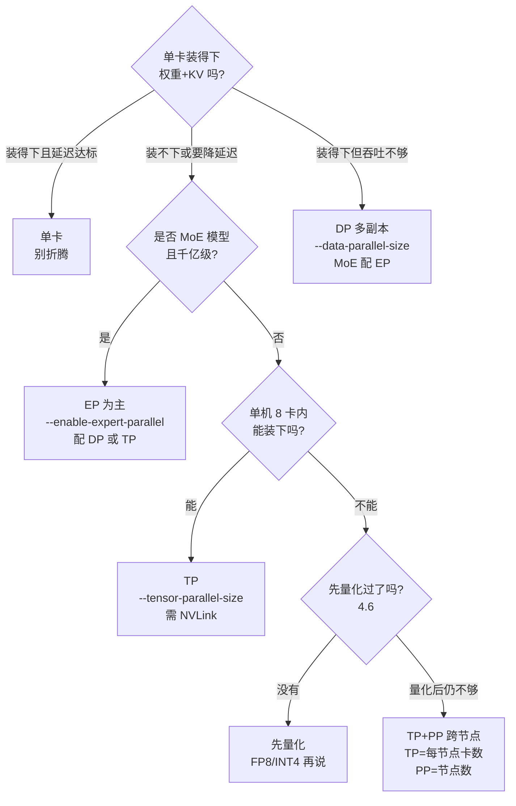

推理并行和训练并行是两回事：训练的目标是"把梯度同步的账算平、让损失收敛"，推理的目标只有三个——**显存装得下、首 token（回答的第一个字）等得起、后续 token 出得够快**。先给结论：70B 模型（700 亿参数）的 FP16 权重（每个参数占 2 字节）共 140GB，单张 80GB 的 H100（英伟达高端 GPU）连权重都装不下；四种并行策略——张量并行（TP）切矩阵、流水线并行（PP）切层、数据并行（DP）复制引擎、专家并行（EP）分专家——分别用一类通信换一类资源，没有一张是免费的。这一节把四张牌摊开，给你一张"症状 → 方案"的决策树和一张 70B 显存账本，作为第 6 章的地图，也是第 11 章选型的入口。

<!-- more -->

## 📑 目录

- [1. 为什么推理要并行](#1-为什么推理要并行)
- [2. 四种策略一句话总览](#2-四种策略一句话总览)
- [3. 推理场景的独特约束](#3-推理场景的独特约束)
- [4. 选型直觉：症状到方案](#4-选型直觉症状到方案)
- [5. 数值总览：70B 模型的显存分布](#5-数值总览70b-模型的显存分布)
- [总结](#-总结)
- [自我检验清单](#-自我检验清单)
- [参考资料](#-参考资料)

---

## 1. 为什么推理要并行

### 1.1 单卡装不下：先算权重的账

**设问：模型大了，换一张更大的卡不就行了？** 答案是：卡的容量有上限，而模型没有。以 70B 模型为例：

$$
\underbrace{70 \times 10^9}_{\text{参数量}} \times \underbrace{2\ \text{B}}_{\text{FP16 每参数}} = \underbrace{140\ \text{GB}}_{\text{权重总量}}
$$

主流单卡是 80GB（H100/A100），140GB 放不下；就算换 H200（141GB），也刚够权重、没有一丝空间给 KV Cache（键值缓存：把算过的注意力键值记下来复用的缓存，推理独有的显存大头）和激活（每步计算产生的中间结果，瞬生瞬灭）。**"装得下权重"从来不是终点，"权重 + KV Cache 都装得下"才是**。算上 KV 账本（每 token 每层 0.5MB，公式同第 1 章）配合 batch 16（一次同时处理 16 个请求），7B 模型、4K 上下文就是约 32GB，与 14GB 权重同量级；8K 上下文直接翻倍到 64GB。70B 模型的 KV 只会更夸张（第 5 节给你算）。所以并行不是"显得高级"，是数学上绕不开的。

### 1.2 单卡吞吐有上限：decode 是 Memory Bound

就算模型装得下，还有吞吐问题。decode 阶段（解码：逐 token 生成回答的阶段）每生成一个 token，都要把模型权重从头到尾读一遍，速度受制于"从显存读数据"而非"计算"——这叫做 **Memory Bound（内存带宽瓶颈）**。把 7B 的账本摊开看，单卡每 step（每生成一个 token 的一步）要读的数据是：

$$
\underbrace{14\ \text{GB}}_{\text{权重：每 step 读一遍}} + \underbrace{32\ \text{GB}}_{\text{KV：4K ctx、batch 16}} = 46\ \text{GB} \rightarrow \frac{46\ \text{GB}}{3.35\ \text{TB/s}} \approx 14\ \text{ms/step}
$$

也就是说：**长上下文 + 大并发下，decode 读 KV 的时间比读权重还多**——单请求每步至少 4.2ms，整批 14ms 起步，而且这个下限与算力无关：GPU 的 Tensor Core（矩阵乘专用电路）根本打不满，时间全花在"读数据"上。

想同时服务 100 个用户？单卡的 KV 带宽会被抢爆。**并行的答案是横向扩展（加卡）而不是纵向升级（换卡）**——注意 6.2 会证明：TP 恰好把"读权重"和"读 KV"两笔账一起摊薄，这是推理并行的核心红利。

顺带解释一个现象：为什么 KV 比权重更早成为瓶颈？权重 14GB 是固定的，KV 却随上下文和并发线性膨胀——请求越多、对话越长，KV 越大，而权重始终那么大。

### 1.3 训练并行的结论不能直接搬

模块三把训练侧的四件套讲透了，但推理不能照抄，因为目标函数完全不同。先说两个马上要用到的延迟指标：**TTFT（Time to First Token，首 token 延迟）**——从发出请求到第一个字出现的时间；**TPOT（Time Per Output Token，单 token 间隔）**——每生成一个 token 的耗时；**P95**（95 分位）表示 95% 的请求都低于这个值。下面的对比表里会用它们：

| 📊 维度 | 训练并行 | 推理并行 |
|---|---|---|
| 优化目标 | 梯度同步正确、损失收敛、训练吞吐 | 显存装载、TTFT/TPOT、服务吞吐 |
| 通信内容 | 梯度（反向）、参数分片重组（前向） | 激活/部分和（TP）、激活值（PP）、token（EP） |
| 时延敏感度 | 低（吞吐为王，几百 ms 无所谓） | 极高（TTFT P95 超 2s 用户就流失） |
| 显存大头 | 权重 + 优化器状态（12B/参数） | 权重 + KV Cache（无优化器状态！） |
| 可接受排队 | 可以（流水线气泡 bubble 正常） | 尽量不行（连续 batching 都在消灭排队） |

📌 **关键点**：训练没有 KV Cache 这个问题，推理的并行设计必须把 KV 的切分一并考虑（第 3 节）；训练有反向可以"用通信换重计算"，推理是纯前向，**每一步都是实时同步，藏不住**。这是整个第 6 章反复出现的底色。

### 1.4 反过来问：什么时候不需要并行

好消息是，并行不是必选项。以下三种情况**别上分布式**：

- **单卡装得下、延迟达标、QPS 够用**——比如 7B 模型在 80GB 单卡上跑中等并发，加卡的收益远小于多出来的运维成本（Ray/多进程、故障面变大）。
- **显存差一点但不想动架构**——先试 4.6 的量化（FP8 省一半、INT4 省 3/4），往往比加卡便宜得多。
- **只是偶尔跑批处理**——离线任务不要求实时，排队比并行便宜。

记住这个判断顺序：**量化 → 并行 → 换卡**，每一步都先算账再动手。并行是"最后的手段"，不是"默认的姿势"——这一节剩下的篇幅，是给你"必须上并行"时用的。

---

## 2. 四种策略一句话总览

### 2.1 四张牌：切什么、解决什么、代价是什么

**设问：四张牌到底怎么选？** 先记住它们各自"切"的对象——这是理解一切的钥匙：

| 📊 策略 | 切什么 | 解决什么问题 | 代价（通信/其他） | 推理中的典型用法 |
|---|---|---|---|---|
| TP 张量并行 | 每个权重矩阵按行/列切 | 单卡显存不够 + 单请求延迟高 | 每层 2 次 AllReduce（全归约：把各卡的部分结果相加汇总），通信密集、对延迟敏感 | 单机多卡（≤8 卡），7B/70B 首选 |
| PP 流水线并行 | 模型按层切成多段 | 跨节点扩展显存 | 段间传激活值，有流水线 bubble | 多节点部署（TP=每节点卡数，PP=节点数） |
| DP 数据并行 | 复制整份模型 | 吞吐不够（单副本 QPS（每秒请求数）上限） | 显存 ×N（每副本一份权重+KV），无每步通信 | 多副本横向扩吞吐；MoE（混合专家模型）可配 EP |
| EP 专家并行 | MoE 的专家分散到各卡 | 千亿 MoE 模型显存 | 每步 All-to-All（全交换：每张卡给其他所有卡各发一份数据）路由 token，负载不均衡 | DeepSeek-V3/R1 等超大 MoE |

打个比方：**TP 是把一道菜分给几位厨师同时做，每人负责一部分食材（权重矩阵的分片），出锅前必须拼盘对齐（AllReduce）**；PP 是接力赛——一棒一棒往下传（层与层之间传激活值），换棒那一下有停顿（bubble，流水线气泡）；DP 是连锁店开分店，每家分店配一套完整人马（完整模型副本），各自接客互不打扰；EP 是专科门诊——先到导诊台（Router，路由：决定每个 token 去哪些专家）分诊，病人（token）被送去对应的科室（Expert，专家：一个小型神经网络），看完再回来。EP 的通信方式是 All-to-All（全交换：每张卡给其他所有卡各发一份数据），是四种策略里最贵的一种。

用技术语言重述：TP/PP 是"拆一个模型"（降低单请求延迟、摊薄显存），DP 是"复制多个模型"（提升吞吐），EP 是"拆 MoE 的专家"（让千亿参数装得下且只算被激活的部分）。

把四张牌放到同一张"指标表"里，一眼看清各自的主场：

| 📊 指标 | TP | PP | DP | EP |
|---|---|---|---|---|
| 单请求延迟（TTFT/TPOT） | ✅ 降 | ✅ 降（有 bubble 损耗） | ➖ 不变 | ➖ 不变 |
| 单副本吞吐 | ➖ 不提升 | ➖ 微降 | ✅ 翻 N 倍 | ✅ 提升（稀疏省算力） |
| 每卡显存 | ✅ 1/TP | ✅ 1/PP | ❌ 不变（×N 份） | ✅ 1/EP |
| 通信代价 | 每层 2 次 AllReduce | 段间传激活 + bubble | 几乎为零 | All-to-All 最贵 |
| 部署范围 | 单机 ≤8 卡 | 跨节点 | 任意（副本间独立） | 机内/机间均可 |

📌 **关键点**：这表里藏着推理选型最重要的反直觉——**TP 和 PP 降延迟但基本不提升吞吐，DP 提吞吐但不降延迟**。要"又低延迟又高吞吐"，必须组合（第 4 节的 3D 并行），单张牌做不到。

### 2.2 回到不可能三角

模块三总论讲过：所有并行优化都是在**计算、通信、显存**这个不可能三角里做取舍。推理侧的表跟训练侧对得上：

- **TP**：用通信（每层 2 次 AllReduce）换显存（1/TP）和单请求延迟。
- **PP**：用通信（段间传激活值）和 bubble 换显存（1/PP），跨节点扩展靠它。
- **DP**：用显存（每副本全量）换吞吐，通信几乎为零（推理无梯度同步）。
- **EP**：用通信（All-to-All）换显存（每卡只存 1/EP 的专家），是 MoE 的"专用牌"。

### 2.3 EP 的通信代价：All-to-All 为什么贵

EP 的通信量和 TP 不在一个量级，值得提前感受一下。EP 的工作方式是"搬家"：每个 token 被 Router 选中的 top-K 个专家处理，数据要"发过去再拿回来"两次，单层通信量的骨架是：

$$
\underbrace{2}_{\text{dispatch 去 + combine 回}} \times \underbrace{K}_{\text{每 token 选 K 个专家}} \times \underbrace{h}_{\text{hidden 维}} \times \underbrace{d}_{\text{每元素字节数}}
$$

（完整推导与直觉验证在 6.4 第 5 节，这里先用数字感受量级。）代入 DeepSeek-V3（hidden=7168，FP8 精度即每参数 1 字节，每 token 激活 8 个路由专家）：每 token 每层通信 ≈ 2 × 8 × 7168 × 1B ≈ **114KB**；全模型 58 层 MoE 层（61 层中前 3 层是稠密层）约 **6.6MB/token**——对比 6.2 算出的 7B 稠密模型 TP 通信（1MB/step），EP 高出一个量级。这也是为什么 DeepSeek-V3 论文专门花一章讲跨节点 All-to-All 优化：论文给出跨节点 EP 的计算/通信比约为 **1:1**，不优化就有一半时间在等网络。这里先记住结论：**EP 省显存，但通信最贵，且路由倾斜会造成负载不均衡**（细节在 6.4）。

---

## 3. 推理场景的独特约束

### 3.1 约束一：KV Cache 也要跟着切

**设问：权重切了，KV Cache 切不切？** 必须切，否则并行就白做了。TP 下 attention head（注意力头，多头注意力里的独立计算通道）被分到各卡，每卡只负责自己那 1/TP 的 head 的 KV——KV Cache 总量随之摊薄为每卡 1/TP。6.2 会给你完整账本（7B：32GB / TP8 = 4GB/卡），这里先立结论：**KV 摊薄是推理并行独有的红利，训练并行根本没有这笔账。**

⚠️ **注意**：有一个知名例外——DeepSeek 系的 MLA（Multi-head Latent Attention，多头潜变量注意力：把 KV 压缩成低维向量再还原的一种注意力设计）在 vLLM 的 TP 实现下，KV Cache 是按卡复制的（不是 1/TP 切分），TP=8 时 KV 要存 8 份。这正是 vLLM 官方在 DeepSeek-V3/R1 上推荐 **DP+EP 而不是纯 TP** 的原因之一（详见 6.4）。

### 3.2 约束二：decode 的通信占比天然更高

训练里通信可以跟反向计算重叠、藏进"大块时间"里；推理 decode 每步只有一次前向，**计算时间短（毫秒级），小消息通信的固定延迟（微秒级 × 每层 2 次）就藏不住了**。6.2 会定量算：7B 模型 TP8 时，每步通信延迟约 0.3ms，而每卡计算只有 ~0.5ms——通信占比可达三成以上。**推理里"通信效率"和"计算效率"同样重要，这是和训练最大的体感差异。**

### 3.3 约束三：batch 是动态的

训练里 batch 固定，通信量可预测；推理里 Continuous Batching（连续组批，机制见站内 2.2）让 batch 每毫秒都在变——TP 的通信量正比于 batch。DP 的副本之间还需要协调空转：vLLM 官方文档明确，MoE + DP 时只要有任意一个 rank（分布式里的进程编号）有请求在跑，其他没请求的 rank 也必须做"空的前向"（dummy forward）来对齐专家层同步。**并行方案必须在一个动态变化的工作负载上稳住延迟，比训练难伺候得多。**

### 3.4 预告：PP 在推理里的 bubble 不一样

训练章的 bubble 公式（见模块三第 7 章）不能直接搬——bubble（流水线气泡）指流水线里某段 GPU 闲着等前一段算完的时间。推理只有前向（forward：把输入逐层算成输出），PP 的"气泡"表现为**请求级的流水线填充延迟**：一个请求要依次穿过所有 stage（流水线的每一段），PP 深度越大、单请求 TTFT 被放得越大。所以推理里 PP 的典型用法是"TP 塞满单机后，用 PP 把装不下的层放到下一台机器"，而不是追求训练那种极致吞吐。6.3 会给你推理版 bubble 的算例与 micro-batch 组织方式。

💡 **提示**：推理里还有一个“组合约束”要提前知道——投机解码（第 5 章）与 PP 长期不兼容（vLLM 官方文档口径：vLLM ≤ 0.15.0 时 PP 与投机解码不兼容，见 5.5）。**选型时若想“PP + 投机解码”叠加，先查你所用版本的兼容矩阵**，6.3 会展开现状。

---

## 4. 选型直觉：症状到方案

### 4.1 决策树：先问症状，再开药

把自己当成刚拿到部署需求的工程师，按顺序回答：



### 4.2 四张牌怎么组合：3D 并行

真实集群从来不是一张牌打到底，而是 **TP × PP × DP** 三轴组合（EP 嵌在 MoE 层内部）。组合规则一句话：**TP 只在单机内（NVLink 域——GPU 之间的高速直连总线，约 900 GB/s），PP 沿节点切（IB，InfiniBand——连接机器的机间网络，约 50 GB/s），DP 复制整组**。vLLM 的参数就是三个数字的乘积：

```bash
# 8 节点 × 8 卡 = 64 卡：TP8（机内）× PP4（跨 4 组节点）× DP2（2 个副本）
vllm serve <model> \
  --tensor-parallel-size 8 \
  --pipeline-parallel-size 4 \
  --data-parallel-size 2
```

三个数字相乘必须等于总卡数（8 × 4 × 2 = 64），顺序上先定 TP（受 head 整除约束），再定 PP（受节点数约束），剩下的自由度给 DP。**MoE 模型还要记住：专家层会自动形成一个 TP×DP 大小的组，默认按张量并行切，开 `--enable-expert-parallel` 才换成专家并行**（vLLM 官方文档口径，6.4 展开）。

⚠️ **注意**：DP/PP/TP 三者的组合支持矩阵随 vLLM 版本演进（例如 V1 早期 PP 与 DP 的组合一度受限），上面的命令是标准拓扑的示意，**具体组合能否跑、参数怎么配，以你所用版本的官方文档和 `vllm serve --help` 为准**。

### 4.3 落成一句话的规则

- ✅ **单卡装得下、延迟达标** → 单卡。分布式不是勋章，是成本。
- ✅ **单机多卡、追求单请求延迟** → TP（head 数能整除 TP 才行，6.2 第 4 节）。
- ✅ **MoE 千亿模型（DeepSeek 系）** → EP，官方 recipe 是 DP+EP 或 TP+EP。
- ✅ **跨节点扩展显存** → TP+PP：`--tensor-parallel-size` 设为每节点卡数、`--pipeline-parallel-size` 设为节点数（vLLM 官方文档口径）。
- ✅ **吞吐不够** → DP 多副本；MoE 用 `--enable-expert-parallel` 让专家层跨副本一起切。
- ❌ **别在无 NVLink 的机器上硬上 TP**——vLLM 官方文档明确：L40S 这类无 NVLink 互联的卡，PP 比 TP 吞吐更高、通信更少。
- ❌ **别先并行后量化**——70B 在 2×A100 上 FP16 连权重都放不下，4.6 的结论：先算账，量化通常比加卡便宜得多。

组合时的检查顺序（也是排查顺序）：**先验算 `TP × PP × DP = 总卡数` → 再验 TP 能整除 head 数 → 再验 PP 整除层数 → 剩下的自由度给 DP**。启动后看日志的 `GPU KV cache size`（可缓存的总 token 数）确认显存分布符合预期，再谈调优。

💡 **提示**：学习路线里有一道经典题——64 卡集群（8 节点 × 8 卡）怎么设计？标准答案就是 **TP=8（机内，NVLink）、PP=4（跨机，IB）、DP=2（副本）**：TP 吃 NVLink 的带宽和低延迟，PP 跨机只传层间激活（量小、可容忍 IB 延迟），DP 完全不需要跨机通信。为什么 TP 不能跨机？6.2 的通信量推导会给你定量答案。

### 4.4 动手验证：30 分钟跑出你自己的对比表

纸上谈兵不算数，动手是检验标准。最小验证方案（一台 8 卡机即可）：

1. 用 vLLM 分别以 `--tensor-parallel-size 1/2/4/8` 启动同一个 7B 模型（4 个端口）。
2. 用 GenAI-Perf（4.6 用过）或 curl 脚本打同一批 prompt，并发 1 和 16 两档。
3. 记录 **TTFT P50/P95、TPOT P50/P95、throughput** 四列，填进 6.2 第 2.3 节的对比表。
4. 观察两个现象是否复现：TP 从 1 到 2 的收益最大；并发 16 时 TP8 的 TPOT 相比 TP4 改善有限甚至变差（通信延迟占比上升）。

预期结论（待你实测确认）：**TP 把单请求延迟压下去，但吞吐曲线在 TP≥4 后趋于平缓**——这正是 4.2 节"刚好装下"规则的实测来源。

---

## 5. 数值总览：70B 模型的显存分布

### 5.1 账本怎么算

70B FP16 权重 140GB，TP 摊到 N 卡上每卡 140/N GB：

$$
\frac{\underbrace{70 \times 10^9 \times 2\ \text{B}}_{\text{FP16 权重 140GB}}}{N} = \text{每卡权重}
$$

### 5.2 不同并行度下的分布

| 📊 配置 | 每卡权重 | 每卡剩余（80GB 卡） | 能跑吗 | 评价 |
|---|---|---|---|---|
| 单卡（TP1） | 140GB | — | ❌ 装不下 | 连权重都放不下 |
| TP2 | 70GB | ~10GB | ⚠️ 勉强 | KV 预算几乎为零，仅极短上下文 |
| TP4 | 35GB | ~45GB | ✅ | 常规起点，KV 有空间 |
| TP8 | 17.5GB | ~62.5GB | ✅ 宽裕 | 单机 8 卡天花板 |
| TP8 × PP2（16 卡） | 8.75GB | ~71GB | ✅ | 跨节点，留给 KV/并发的空间巨大 |
| FP8 量化 + TP2（参考 4.6） | 35GB | ~45GB | ✅ | 量化后 2 卡顶 4 卡 |

💡 **提示**：别只算权重。70B 的 KV 和权重同量级——先认两个词：**GQA**（Grouped Query Attention，分组查询注意力：多个查询头共享一组键值头，省 KV 显存）、**head**（注意力头）与 **head_dim**（每个头的维度）。按 Llama-3.1-70B（80 层、GQA 8 个 KV head、head_dim 128）算：8K 上下文单请求 KV ≈ 2 × 80 × 8 × 128 × 8192 × 2B ≈ **2.7GB**，batch 16 就是 **~43GB**。TP8 每卡 62.5GB 的余量，主要就是给 KV 用的。

📌 **关键点**：TP 的收益不是线性的——从 TP1 到 TP2 是把"装不下"变成"装得下"的质变；从 TP4 到 TP8 主要是给 KV 和并发腾空间，单请求延迟的边际收益递减（6.2 的通信账会证明）。**"刚好装下"往往是最优解，卡多出来的部分留给 DP 扩吞吐更划算。**

### 5.3 千亿 MoE 的账本：DeepSeek-V3 参考

70B 是稠密模型的代表，千亿 MoE 的账本完全不同——DeepSeek-V3 总参数 671B（每 token 只激活 37B），FP8 权重约 671GB，单节点 8×H100（640GB）都装不下。官方与社区的部署口径：

| 📊 方案 | 权重占用 | 硬件 | 备注 |
|---|---|---|---|
| FP8（官方 recipe） | ~671GB | 8×H200（1.13TB）或 8×MI300X | `--data-parallel-size 8 --enable-expert-parallel` |
| FP4（Blackwell 专属） | ~335GB | 4×Blackwell | `nvidia/DeepSeek-R1-FP4`，`--tensor-parallel-size 4` |
| AWQ INT4（社区） | ~335GB 权重 + 激活 FP16 | 8×H100（640GB） | 单节点勉强，余量给 KV |

（数字来自 vLLM Recipes 与社区部署实测的公开口径；具体显存随上下文与并发浮动，以你实测为准。）

📌 **关键点**：MoE 的"装得下"逻辑和稠密模型相反——**671B 装不下不是靠把矩阵切细（TP），而是靠"每个 token 只激活 37B"的稀疏性 + 把专家分散到各卡（EP）**。这也是为什么 MoE 模型的并行方案要单开一节（6.4）。

---

## 📝 总结

1. **目标不同**：训练并行求梯度同步与收敛，推理并行求显存装载、TTFT/TPOT、吞吐——KV Cache 是推理独有的账本，且每步实时同步、通信藏不住。
2. **四张牌**：TP 切矩阵（单机、降延迟、每层 2 次 AllReduce）；PP 切层（跨节点、有 bubble）；DP 复制引擎（扩吞吐、显存 ×N）；EP 分专家（MoE 专属、All-to-All 最贵，DeepSeek-V3 每 token 每层 ~112KB 通信）。
3. **推理三约束**：KV 要跟着切（MLA 例外）、decode 通信占比高、batch 动态变化让并行调度更难。
4. **选型顺序**：单卡装得下 → 别折腾；MoE 千亿 → EP；单机多卡 → TP；量化后再不够 → TP+PP；吞吐不够 → DP。64 卡拓扑 = TP8 × PP4 × DP2。
5. **显存账本**：70B FP16 140GB，TP4 每卡 35GB 是常规起点，TP8 每卡 17.5GB 留给 KV 约 62.5GB；"刚好装下"往往优于"越多越好"。

## 🎯 自我检验清单

- 能解释推理并行与训练并行的目标差异（显存装载/TTFT/TPOT/吞吐 vs 梯度同步/收敛），并说出 KV Cache 为什么是推理独有的账本
- 能一句话讲清 TP/PP/DP/EP 各自"切什么、解决什么、代价是什么"
- 能口算 70B FP16 权重在 TP2/TP4/TP8 下的每卡显存（70/35/17.5GB），误差不超过 20%
- 能计算 70B（GQA 8 KV head）8K 上下文单请求 KV 约 2.7GB，并说明它为什么与权重同量级
- 能说出 vLLM 部署 DeepSeek-V3 官方推荐的口径（FP8 需 8×H200；`--enable-expert-parallel`；低延迟选 TP、高负载选 DP）
- 能解释 MLA 模型在 TP 下 KV 复制的原因，以及为什么官方因此推荐 DP+EP
- 能画出 64 卡集群（8 节点 × 8 卡）TP=8/PP=4/DP=2 的映射，并标注哪些通信走 NVLink、哪些走 IB
- 能说出"为什么 TP 通常不跨节点"的物理根源（NVLink vs IB 带宽差近 18 倍，6.2 有定量推导）
- 能根据"单卡装不下 / 吞吐不够 / 千亿 MoE / 无 NVLink 机器"四类症状分别给出方案
- 能解释为什么“先并行后量化”通常比“先量化再并行”更贵
- 能说明 EP 的 All-to-All 通信量公式（2 × K × h × d）并代入 DeepSeek-V3 算出量级
- 能向同事一句话讲清：模型装得下就别并行，装不下先量化，还不行才按 TP→PP→DP/EP 的顺序加卡

## 📚 参考资料

**官方文档**

- [vLLM Parallelism and Scaling（并行策略选择指南与 L40S 边界案例）](https://docs.vllm.ai/en/latest/serving/parallelism_scaling/)
- [vLLM Data Parallel Deployment（DP 参数语义、MoE 对齐与 dummy forward）](https://docs.vllm.ai/en/latest/serving/data_parallel_deployment/)
- [vLLM Expert Parallel Deployment（EP 度 = TP×DP、All-to-All 后端与 EPLB）](https://docs.vllm.ai/en/latest/serving/expert_parallel_deployment/)
- [vLLM DeepSeek-V3/R1 Recipes（官方启动 recipe：FP8 8×H200、FP4、DP+EP）](https://docs.vllm.ai/projects/recipes/en/stable/DeepSeek/DeepSeek-V3.html)

**论文**

- [DeepSeek-V3 Technical Report - DeepSeek-AI, 2024](https://arxiv.org/abs/2412.19437)：671B 总参数/37B 激活、EP 部署（prefill EP32、decode EP320）、跨节点 All-to-All 优化与计算/通信比 1:1
- [Megatron-LM: Training Multi-Billion Parameter Language Models Using Model Parallelism - Shoeybi et al., 2019](https://arxiv.org/abs/1909.08053)：TP 的 Column/Row Parallel 出处（vLLM 也实现该算法）

**开源项目与实测**

- [AMD ROCm vLLM MoE Playbook（TP 下 MLA KV 复制 8× 浪费、DP+EP 收益实测）](https://rocm.blogs.amd.com/software-tools-optimization/vllm-moe-guide/README.html)
- [NVIDIA Blog: Optimizing Communication for MoE Training with Hybrid-EP（DeepSeek-V3 通信占比 >50% 的实测背景）](https://developer.nvidia.com/blog/optimizing-communication-for-mixture-of-experts-training-with-hybrid-expert-parallel/)

**站内**

- [第 6 章 分布式推理（章首页）](/AIInfraGuide/inference/模块四-推理优化/第6章-分布式推理/第6章-分布式推理)
- [6.2 张量并行推理](/AIInfraGuide/inference/模块四-推理优化/第6章-分布式推理/62-张量并行推理)：TP 通信量推导与"为什么不跨机"
- [模块三 第 6 章 张量并行与序列并行](/AIInfraGuide/distributed/模块三-分布式训练/第6章-张量并行与序列并行)：TP 切分细节的训练侧姊妹篇
- [模块三 第 7 章 流水线并行](/AIInfraGuide/distributed/模块三-分布式训练/第7章-流水线并行)：PP 的 Bubble 与 1F1B
- [模块三 第 10 章 MoE 并行](/AIInfraGuide/distributed/模块三-分布式训练/第10章-moe并行)：EP 与 All-to-All 的训练侧详解
- [2.1 集合通信原语详解](/AIInfraGuide/distributed/模块三-分布式训练/21-集合通信原语详解)：NVLink/IB 带宽差一个数量级
- [2.1 PagedAttention（KV Cache 的页式管理）](/AIInfraGuide/inference/模块四-推理优化/第2章-推理引擎核心技术/21-pagedattention)
- [4.6 量化选型与 vLLM 实战（先量化再加卡的决策依据）](/AIInfraGuide/inference/模块四-推理优化/第4章-量化/46-量化选型与vllm实战)
- [第 11 章 推理优化选型与端到端实战（本节决策树的落点）](/AIInfraGuide/inference/模块四-推理优化/第11章-推理优化选型与端到端实战)
- [AI Infra 学习路线（2.3 并行拓扑、3.1 KV 账本检验标准）](/AIInfraGuide/guides/ai-infra学习路线)
