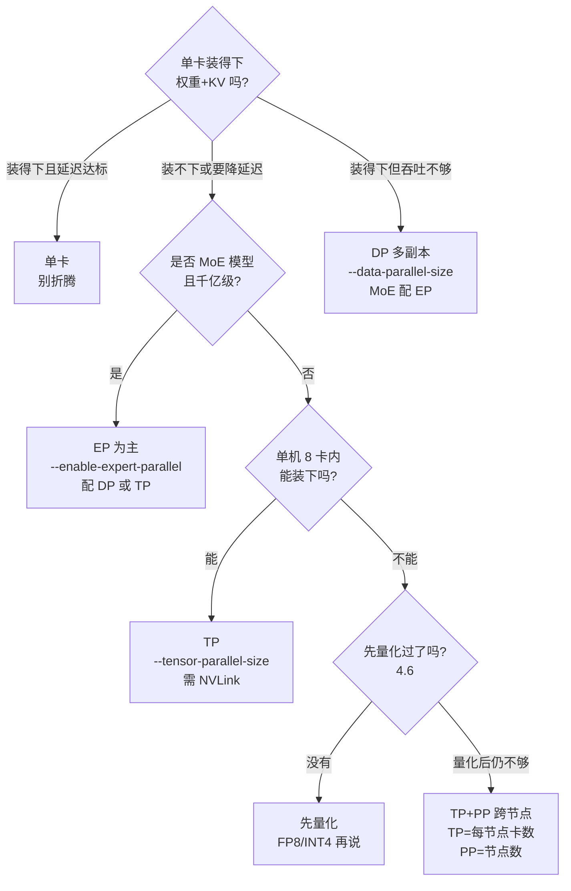

在线推理并行先解决容量问题：单卡要同时容纳权重、随请求增长的 KV Cache 和运行时余量；容量满足后，还要看 TTFT、TPOT/P95 与吞吐是否达标。以 70B 模型为例，FP16 权重按十进制名义容量约为 140GB，单张 80GB 的 H100 放不下。

TP、PP、DP、EP 分别切分矩阵、模型层、完整模型副本和 MoE 专家。它们的显存收益、通信路径和适用场景不同，下面结合显存、时延、吞吐与拓扑逐一比较。

<!-- more -->

## 📑 目录

- [1. 为什么推理要并行](#1-为什么推理要并行)
- [2. 四种策略一句话总览](#2-四种策略一句话总览)
- [3. 推理场景的独特约束](#3-推理场景的独特约束)
- [4. 选型直觉：症状到方案](#4-选型直觉症状到方案)
- [5. 数值总览：70B 模型的显存分布](#5-数值总览70b-模型的显存分布)
- [总结](#-总结)
- [自我检验清单](#-自我检验清单)
- [参考资料](#-参考资料)

---

## 1. 为什么推理要并行

### 1.1 单卡装不下：先算权重的账

**设问：模型大了，换一张更大的卡不就行了？** 答案是：卡的容量有上限，而模型没有。以 70B 模型为例：

$$
\underbrace{70 \times 10^9}_{\text{参数量}} \times \underbrace{2\ \text{B}}_{\text{FP16 每参数}} = \underbrace{140\ \text{GB}}_{\text{权重总量}}
$$

主流单卡是 80GB（H100/A100），140GB 放不下。按十进制名义容量粗算，H200 的 141GB 只能勉强覆盖 70B FP16 的约 140GB 权重，实际服务几乎没有给 KV Cache（键值缓存：把算过的注意力键值记下来复用）、激活（每步计算产生的中间结果）和运行时开销留下余量。KV Cache 会随上下文长度和并发增长：按这里的 7B 估算，batch 16（一次同时处理 16 个请求）、4K 上下文约占 32GB；上下文增至 8K 后约为 64GB。70B 的 KV 需要按层数、KV head、head_dim、缓存精度和上下文分别计算，后文再算。**部署时应同时核算权重、KV Cache 和运行时余量；只看权重容量会高估可用并发。**

### 1.2 单卡吞吐有上限：decode 是 Memory Bound

就算模型装得下，还有吞吐问题。decode 阶段（解码：逐 token 生成回答的阶段）每生成一个 token，都要把模型权重从头到尾读一遍，速度受制于“从显存读数据”而非“计算”——这叫做 **Memory Bound（内存带宽瓶颈）**。把 7B 的账本摊开看，单卡每 step（每生成一个 token 的一步）要读的数据是：

$$
\underbrace{14\ \text{GB}}_{\text{权重：每 step 读一遍}} + \underbrace{32\ \text{GB}}_{\text{KV：4K ctx、batch 16}} = 46\ \text{GB} \rightarrow \frac{46\ \text{GB}}{3.35\ \text{TB/s}} \approx 14\ \text{ms/step}
$$

这个 $46\ \text{GB} / 3.35\ \text{TB/s} \approx 14\ \text{ms}$ 是按名义 HBM 带宽计算的理想 step 下界，用来说明内存流量的量级；实际 step time 还会受到算子效率、访存利用率、调度和通信影响，不能直接等同于端到端延迟。若单独计算 14GB 权重的带宽下界，结果约为 4.2ms，但 batch=16 时权重读取通常由整个 batch 共享，不能把它当成每个请求的服务下界。长上下文和高并发下，KV 读流量会随请求增长，可能成为主要瓶颈。

想同时服务 100 个用户？单卡的 KV 带宽会被抢爆。**并行的答案是横向扩展（加卡）而不是纵向升级（换卡）**——注意 6.2 会证明：TP 恰好把“读权重”和“读 KV”两笔账一起摊薄，这是推理并行的核心红利。

顺带解释一个现象：为什么 KV 比权重更早成为瓶颈？权重 14GB 是固定的，KV 却随上下文和并发线性膨胀——请求越多、对话越长，KV 越大，而权重始终那么大。

### 1.3 训练并行的结论不能直接搬

训练并行主要围绕梯度同步、收敛和训练吞吐；在线推理还要满足 TTFT、TPOT、尾延迟和服务吞吐。本文使用三个指标：**TTFT（Time to First Token，首 token 延迟）**是从发出请求到第一个 token 出现的时间；**TPOT（Time Per Output Token，单 token 间隔）**是后续输出 token 之间的时间；**P95** 不是独立的延迟类型，而是对某个指标（例如 TTFT 或 TPOT）取的 95 分位。下面的对比表会使用这些指标：

| 📊 维度 | 训练并行 | 推理并行 |
|---|---|---|
| 优化目标 | 梯度同步正确、损失收敛、训练吞吐 | 显存装载、TTFT/TPOT、服务吞吐 |
| 通信内容 | 梯度（反向）、参数分片重组（前向） | 激活/部分和（TP）、激活值（PP）、token（EP） |
| 时延敏感度 | 低（通常以整体吞吐和 step time 为主） | 高（按业务 SLO 关注 TTFT、TPOT 及其 P95，阈值取决于交互场景） |
| 显存大头 | 权重、梯度、优化器状态和激活（随精度、优化器、分片及 checkpointing 变化） | 权重 + KV Cache + 运行时余量（通常没有训练优化器状态） |
| 可接受排队 | 可以（流水线气泡 bubble 正常） | 尽量不行（连续 batching 都在消灭排队） |

📌 **关键点**：这里比较的是标准的全序列训练和自回归 decode。训练通常一次处理整段序列，不维护跨生成步复用的持久 decode KV Cache；它仍会计算 K/V 激活。decode 则要在每个 token 上读取并更新这份缓存。为节省激活显存，可以用 checkpoint/recompute；在异步 collective、分桶和依赖允许时，部分梯度通信也可以与后续反向计算重叠，这两种机制不是一回事。decode 每生成一个 token 都要做一次前向；若 TP 的 collective 位于层间依赖上，它通常进入该 token 的关键路径。算子融合、异步通信和批处理可以隐藏其中一部分，但不能默认全部隐藏。

### 1.4 反过来问：什么时候不需要并行

并行不是必选项。以下三种情况**别上分布式**：

- **单卡装得下、延迟达标、QPS 够用**——比如 7B 模型在 80GB 单卡上跑中等并发，加卡的收益远小于多出来的运维成本（Ray/多进程、故障面变大）。
- **显存差一点但不想动架构**——先试 4.6 的量化（FP8 省一半、INT4 省 3/4），往往比加卡便宜得多。
- **只是偶尔跑批处理**——离线任务不要求实时，排队比并行便宜。

因此，先检查单卡是否同时满足目标精度下的权重、KV Cache 和运行时显存，以及 TTFT、TPOT 和吞吐 SLO。若不满足，再比较量化带来的质量和 kernel 代价、并行带来的通信与运维代价，以及换卡成本；在允许量化且容量是主要瓶颈时，通常先评估量化，再评估并行。

---

## 2. 四种策略一句话总览

### 2.1 四张牌：切什么、解决什么、代价是什么

**设问：四张牌到底怎么选？** 先看四种策略分别切什么，再看它们解决的问题和需要付出的代价：

| 📊 策略 | 切什么 | 解决什么问题 | 代价（通信/其他） | 推理中的典型用法 |
|---|---|---|---|---|
| TP 张量并行 | 每个权重矩阵按行/列切 | 单卡显存不够 + 单请求延迟高 | 每层需集合通信 collective（多卡协同交换数据的通信原语，常见实现为 2 次 AllReduce——全归约，各卡部分和相加且人人得完整结果，通信量≈$2M$），通信密集、对延迟敏感 | 单机多卡（≤8 卡），7B/70B 首选 |
| PP 流水线并行 | 模型按层切成多段 | 跨节点扩展显存 | 段间传激活值，有流水线 bubble | 多节点部署（TP=每节点卡数，PP=节点数） |
| DP 数据并行 | 复制整份模型 | 吞吐不够（单副本 QPS（每秒请求数）上限） | 显存 ×N（每副本一份权重+KV），副本间通常无每 token 的模型同步 | 多副本横向扩吞吐；MoE（混合专家模型）可配 EP |
| EP 专家并行 | MoE 的专家分散到各卡 | 千亿 MoE 模型显存 | 每步通常需要 All-to-All（全交换：按路由发送和回收 token），通信和负载均衡成本较高 | DeepSeek-V3/R1 等超大 MoE |

TP：按矩阵或注意力头分片，每卡计算局部结果，再通过 collective 汇总；常见实现使用 AllReduce，因此更适合机内低延迟互联。

PP：按层分段，stage 之间传激活值；请求需要依次经过各段，并承担流水线填充代价。

DP：复制完整模型或引擎副本，让副本独立接收请求，主要扩展系统级吞吐；每个副本都要保存自己的权重和 KV Cache。

EP：只适用于 MoE，把专家分到不同卡；Router 将 token dispatch 到专家，再 combine 结果，通常引入 All-to-All 和负载均衡成本。

下面用同一组指标比较四种策略：

| 📊 指标 | TP | PP | DP | EP |
|---|---|---|---|---|
| 单请求延迟（TTFT/TPOT） | 可能下降（collective 可能抵消收益） | 取决于调度，常有填充/传输开销 | ➖ 通常不变 | ➖ 通常不变 |
| 单副本吞吐 | ➖ 不提升 | 取决于并发与调度 | ➖ 不变（系统吞吐可扩展） | 可能提升（稀疏减少计算） |
| 每卡显存 | ✅ 1/TP | ✅ 1/PP | ❌ 不变（×N 份） | ✅ 1/EP |
| 通信代价 | 每层需 collective（常见为 2 次 AllReduce） | 段间传激活 + bubble | 副本间通常无每 token 模型通信 | All-to-All，受路由与拓扑影响 |
| 部署范围 | 单机 ≤8 卡 | 跨节点 | 任意（副本可独立） | 机内/机间均可 |

📌 **关键点**：从表格可以得到一个具体分工：TP 主要把一个模型副本的计算和显存压力分到机内多卡，但 collective 可能抵消部分延迟收益；PP 主要解决跨节点容量，单请求要依次经过各 stage，TTFT 不一定下降；DP 通过复制副本扩展系统级吞吐，单副本计算延迟基本不变。若同时需要低延迟和高吞吐，再组合这些维度，并用相同 workload 实测。

### 2.2 回到不可能三角

模块三总论讲过：所有并行优化都是在**计算、通信、显存**这个不可能三角里做取舍。推理侧的表跟训练侧对得上：

- **TP**：用通信（每层 2 次 AllReduce）换显存（1/TP）和单请求延迟。
- **PP**：用通信（段间传激活值）和 bubble 换显存（1/PP），跨节点扩展靠它。
- **DP**：用显存（每副本全量）换吞吐；稠密推理中副本间通常没有每 token 的模型通信，MoE+DP 仍可能需要同步。
- **EP**：用通信（All-to-All）换显存（每卡只存 1/EP 的专家），是 MoE 的“专用牌”。

### 2.3 EP 的通信代价：All-to-All 为什么贵

先估算 EP 的通信量，看看它为什么容易成为瓶颈。EP 的工作方式是“搬家”：每个 token 被 Router 选中的 top-K 个专家处理，数据要“发过去再拿回来”两次，单层通信量的骨架是：

$$
\underbrace{2}_{\text{dispatch 去 + combine 回}} \times \underbrace{K}_{\text{每 token 选 K 个专家}} \times \underbrace{h}_{\text{hidden 维}} \times \underbrace{d}_{\text{每元素字节数}}
$$

（完整推导与直觉验证见 6.4 第 5 节。）这里按所有路由副本合计的数据量估算，暂不扣除本地专家和 padding。DeepSeek-V3 取 hidden=7168、FP8（每元素 1B）和每 token 8 个路由专家：单个 token、单个 MoE 层的 dispatch+combine 量为 2 × 8 × 7168 × 1B = 114,688B，约 **114KB**（十进制，约 112KiB）；58 个 MoE 层累计约 **6.6MB/token**。

这个数字表示所有路由副本合计的激活数据量，不等同于实际跨节点字节数；后者还受本地专家、padding、路由负载和拓扑影响。与 6.2 对 7B 稠密模型 TP 约 1MB/step 的估算比较时，也必须统一 batch、token、精度和聚合口径。DeepSeek-V3 论文报告的跨节点 EP 计算/通信比约为 **1:1**，这是特定实现和工作负载下的结果。EP 因而需要同时处理通信和路由负载均衡，不能只看省下的专家显存。

---

## 3. 推理场景的独特约束

### 3.1 约束一：KV Cache 也要跟着切

**设问：权重切了，KV Cache 切不切？** 这里先讨论常见的按 attention head 分片、且 KV head 能均匀映射到 TP ranks 的标准 decode TP。TP 度为 N 时，每卡只保存和读取自己负责的 K/V，KV 容量大致降为 1/TP；例如 7B 的 32GB 在 TP8 下约为 4GB/卡。GQA、MQA、MLA 以及具体后端可能改为部分切分或复制；复制 KV 会失去这部分显存收益，但不等于 TP 的权重和计算收益全部消失。这里的“推理账本”特指跨生成步持久的 decode KV Cache；标准全序列训练通常不维护同样的缓存，不代表训练系统没有 K/V 激活或其他缓存。

⚠️ **注意**：有一个知名例外——DeepSeek 系的 MLA（Multi-head Latent Attention，多头潜变量注意力：把 KV 压缩成低维向量再还原的一种注意力设计）在 vLLM 的 TP 实现下，KV Cache 是按卡复制的（不是 1/TP 切分），TP=8 时 KV 要存 8 份。这正是 vLLM 官方在 DeepSeek-V3/R1 上推荐 **DP+EP 而不是纯 TP** 的原因之一（详见 [6.4 数据并行与专家并行](/AIInfraGuide/inference/模块四-推理优化/第6章-分布式推理/64-数据并行与专家并行)——该节讲 MLA 的 KV 复制与 DP 切请求+EP 切专家的组合；本文只提选型结论）。

### 3.2 约束二：decode 的通信占比天然更高

训练中的部分梯度 collective 只有在异步调度、分桶且依赖允许时，才可能与后续反向计算重叠；通信不能默认视为免费。自回归 decode 按 token、按层推进；若 TP collective 的结果是下一层所需输入，它通常位于 token 的关键路径上，虽然融合、异步通信和批处理可能隐藏一部分。6.2 的 7B TP8 示例在特定硬件和 workload 下约为 0.3ms 通信、0.5ms 计算；这只能作为该口径的示例，不能推广为普遍比例。

### 3.3 约束三：batch 是动态的

训练通常使用预先规划的 batch 或 shape；推理的 Continuous Batching（连续组批，机制见站内 2.2）会改变 active sequences 和 active tokens，因此 TP collective 的消息量与 kernel 效率会随调度变化。

在本文引用的 vLLM MoE+DP 路径中，为了让专家侧 collective 对齐，空闲 rank 可能需要执行 dummy forward（空前向）；这是该实现的同步机制，不应推广为所有 DP 系统的必然行为。这里的 rank 指一个分布式进程，dummy forward 指为完成同步而执行的无有效请求前向。

### 3.4 预告：PP 在推理里的 bubble 不一样

训练章的 bubble 占比≈$(PP-1)/m + t_{comm}/t_{comp}$（$m$ 为 micro-batch 数）公式（详见 [模块三 第7章 流水线并行](/AIInfraGuide/distributed/模块三-分布式训练/第7章-流水线并行)——该章推导 1F1B 调度与 bubble 随 $m$ 递减；本文只对比推理侧单 token 需串行穿 $PP$ 段故 bubble 更重）依赖具体的 forward/backward 调度、micro-batch 数和 stage 平衡；bubble 指流水线中某段等待前一段完成的空档，因此不能直接套到只有前向的自回归推理。对单请求 decode，token 要依次经过各 stage，stage 间传输和填充可能增加 TTFT；并发和 micro-batch 足够时，stage 可以重叠，吞吐和 TPOT 仍取决于调度器、stage 平衡与网络。因此，推理中的 PP 常用于 TP 塞满单机后跨节点解决容量，而不是仅凭训练吞吐公式选择深度。推理版 bubble 计算和 micro-batch 组织见 [6.3 流水线并行推理](/AIInfraGuide/inference/模块四-推理优化/第6章-分布式推理/63-流水线并行推理)——该节给出推理侧 micro-batch 组织与占比实测；本文只给占比公式。

💡 **提示**：推理里还有一个“组合约束”要提前知道——投机解码（第 5 章）与 PP 长期不兼容（vLLM 官方文档口径：vLLM ≤ 0.15.0 时 PP 与投机解码不兼容，见 5.5）。**选型时若想“PP + 投机解码”叠加，先查你所用版本的兼容矩阵**，6.3 会展开现状。

---

## 4. 选型直觉：症状到方案

### 4.1 决策树：先问症状，再开药

把自己当成刚拿到部署需求的工程师，按顺序回答：



### 4.2 四张牌怎么组合：3D 并行

真实集群通常组合使用 TP、PP 和 DP；MoE 的专家层再根据实现叠加 EP。拓扑上，TP 尽量留在单机的 NVLink 域（GPU 间高速互联）内，PP 用来跨节点放置模型层，DP 复制整组模型。本文示例中的 NVLink 约 900 GB/s、IB（InfiniBand，机间网络）约 50 GB/s；vLLM 的三个并行参数相乘后应等于总卡数。

```bash
# 8 节点 × 8 卡 = 64 卡：TP8（机内）× PP4（跨 4 组节点）× DP2（2 个副本）
vllm serve <model> \
  --tensor-parallel-size 8 \
  --pipeline-parallel-size 4 \
  --data-parallel-size 2
```

三个数字相乘必须等于总卡数（8 × 4 × 2 = 64）。通常先定 TP（受 head 整除约束），再定 PP（受节点数和层数约束），剩余自由度给 DP。

MoE 模型还要单独检查专家层：专家层会自动形成一个 TP×DP 大小的组，默认按张量并行切；开启 `--enable-expert-parallel` 后才切换为专家并行（vLLM 官方文档口径，6.4 展开）。

⚠️ **注意**：DP/PP/TP 三者的组合支持矩阵随 vLLM 版本演进（例如 V1 早期 PP 与 DP 的组合一度受限），上面的命令是标准拓扑的示意，**具体组合能否跑、参数怎么配，以你所用版本的官方文档和 `vllm serve --help` 为准**。

### 4.3 决策规则

- ✅ **单卡装得下、延迟达标** → 单卡。分布式不是勋章，是成本。
- ✅ **单机多卡、追求单请求延迟** → TP（head 数能整除 TP 才行，6.2 第 4 节）。
- ✅ **MoE 千亿模型（DeepSeek 系）** → EP，官方 recipe 是 DP+EP 或 TP+EP。
- ✅ **跨节点扩展显存** → TP+PP：`--tensor-parallel-size` 设为每节点卡数、`--pipeline-parallel-size` 设为节点数（vLLM 官方文档口径）。
- ✅ **吞吐不够** → DP 多副本；MoE 用 `--enable-expert-parallel` 让专家层跨副本一起切。
- ❌ **别在无 NVLink 的机器上硬上 TP**——vLLM 官方文档明确：L40S 这类无 NVLink 互联的卡，PP 比 TP 吞吐更高、通信更少。
- ❌ **别先并行后量化**——70B 在 2×A100 上 FP16 连权重都放不下，4.6 的结论：先算账，量化通常比加卡便宜得多。

组合时的检查顺序（也是排查顺序）：**先验算 `TP × PP × DP = 总卡数` → 再验 TP 能整除 head 数 → 再验 PP 整除层数 → 剩下的自由度给 DP**。启动后看日志的 `GPU KV cache size`（可缓存的总 token 数）确认显存分布符合预期，再谈调优。

💡 **提示**：一个具体的工作示例是 8 个节点、每节点 8 张卡的 64 卡集群。如果要让 TP 留在机内、把模型层跨节点放置，同时扩展请求吞吐，可以配置 TP=8、PP=4、DP=2：8 × 4 × 2 = 64。每个 TP 组内的 AllReduce 走 NVLink；PP stage 之间传递层间激活，跨节点走 IB；两份 DP 副本分别接收请求，不参与每个 token 的模型同步。这个配置还要通过 head 数、层数整除、stage 平衡和实测 SLO 验证。

### 4.4 动手验证：30 分钟跑出你自己的对比表

仅靠纸面估算还不够，下面用一个小实验验证这些判断。最小验证方案（一台 8 卡机即可）：

1. 用 vLLM 分别以 `--tensor-parallel-size 1/2/4/8` 启动同一个 7B 模型（4 个端口）。
2. 用 GenAI-Perf（4.6 用过）或 curl 脚本打同一批 prompt，并发 1 和 16 两档。
3. 记录 **TTFT P50/P95、TPOT P50/P95、throughput** 四列，填进 6.2 第 2.3 节的对比表。
4. 观察两个现象是否复现：TP 从 1 到 2 的收益最大；并发 16 时 TP8 的 TPOT 相比 TP4 改善有限甚至变差（通信延迟占比上升）。

把下面标为“待验证假设”：在固定模型、精度、GPU/互联、框架版本、prompt 长度、输出长度、采样参数和并发条件下，可能观察到 TP 从 1 增至 2 时延迟收益较大，而 TP≥4 后吞吐收益趋于平缓；高并发下 TP8 还可能因通信开销不再优于 TP4。当前段落没有给出实测数据，因此这些只能作为实验假设；要写成本文结论，还需记录 TTFT/TPOT 的 P50/P95、token throughput 和请求吞吐，并注明重复次数与适用边界。

---

## 5. 数值总览：70B 模型的显存分布

### 5.1 账本怎么算

70B FP16 权重 140GB，TP 摊到 N 卡上每卡 140/N GB：

$$
\frac{\underbrace{70 \times 10^9 \times 2\ \text{B}}_{\text{FP16 权重 140GB}}}{N} = \text{每卡权重}
$$

### 5.2 不同并行度下的分布

| 📊 配置 | 每卡权重 | 每卡剩余（80GB 卡） | 能跑吗 | 评价 |
|---|---|---|---|---|
| 单卡（TP1） | 140GB | — | ❌ 装不下 | 连权重都放不下 |
| TP2 | 70GB | ~10GB | ⚠️ 勉强 | KV 预算几乎为零，仅极短上下文 |
| TP4 | 35GB | ~45GB | ✅ | 常规起点，KV 有空间 |
| TP8 | 17.5GB | ~62.5GB | ✅ 宽裕 | 单机 8 卡天花板 |
| TP8 × PP2（16 卡） | 8.75GB | ~71GB | ✅ | 跨节点，留给 KV/并发的空间巨大 |
| FP8 量化 + TP2（参考 4.6） | 35GB | ~45GB | ✅ | 量化后 2 卡顶 4 卡 |

💡 **提示**：别只算权重。先把算例中的量说清楚：**GQA**（Grouped Query Attention，分组查询注意力）表示多个 query head 共享一组 KV head；**head** 是一个注意力头；**head_dim** 是每个头的维度。按 Llama-3.1-70B（80 层、8 个 KV head、head_dim=128）计算，8K 上下文下单请求 KV 为 `2 × 80 × 8 × 128 × 8192 × 2B ≈ 2.7GB`。其中 2 表示 K/V 两份，2B 表示 FP16 每元素 2 字节；batch=16 时约为 43GB。这个估算忽略分页元数据等额外开销，TP8 每卡名义剩余的 62.5GB 还要留给激活、运行时和其他缓冲，不能全部视为可用 KV 容量。

📌 **关键点**：TP 的收益不是线性的——从 TP1 到 TP2 是把“装不下”变成“装得下”的质变；从 TP4 到 TP8 主要是给 KV 和并发腾空间，单请求延迟的边际收益递减（6.2 的通信账会证明）。**“刚好装下”往往是最优解，卡多出来的部分留给 DP 扩吞吐更划算。**

### 5.3 千亿 MoE 的账本：DeepSeek-V3 参考

70B 是稠密模型的代表，千亿 MoE 的账本需要把总权重和每 token 的激活量分开看。DeepSeek-V3 总参数 671B，表示推理时需要驻留的权重规模；每 token 激活约 37B，主要说明计算稀疏性，并不会单独减少总权重显存。FP8 权重约 671GB，单节点 8×H100（640GB）仍然不足；部署时还要通过量化以及 TP、PP、EP 或其组合把权重分布到多卡。官方与社区的部署口径：

| 📊 方案 | 权重占用 | 硬件 | 备注 |
|---|---|---|---|
| FP8（官方 recipe） | ~671GB | 8×H200（1.13TB）或 8×MI300X | `--data-parallel-size 8 --enable-expert-parallel` |
| FP4（Blackwell 专属） | ~335GB | 4×Blackwell | `nvidia/DeepSeek-R1-FP4`，`--tensor-parallel-size 4` |
| AWQ INT4（社区） | ~335GB 权重 + 激活 FP16 | 8×H100（640GB） | 单节点勉强，余量给 KV |

（数字来自 vLLM Recipes 与社区部署实测的公开口径；具体显存随上下文与并发浮动，以你实测为准。）

📌 **关键点**：EP 通过按专家分片减少单卡常驻专家及相应计算，但会引入 All-to-All 和负载均衡成本；它不会让 671B 的总权重凭空消失，最终仍需结合量化、TP、PP、EP、拓扑和 SLO 选择配置。

---

## 📝 总结

1. **显存和时延要一起算**：标准全序列训练通常不维护跨生成步的持久 decode KV；在线 decode 要为活动请求保留它，并把层间 collective 的关键路径延迟算进去。
2. **并行维度分工不同**：TP/PP 主要拆分一个模型副本，DP 复制副本扩展吞吐，EP 只针对 MoE；收益和通信代价由架构、后端、拓扑和 workload 决定。
3. **配置从最小可行解开始**：先按权重、KV、运行时余量和 SLO 找到能工作的最小配置，再比较量化与 TP/PP/EP/DP。70B FP16 的 TP4=35GB、TP8=17.5GB 只是权重账本，不是最终 KV 或并发保证。

## ⚠️ 常见错误做法

- ❌ **把训练拓扑原样搬到 decode**：训练中为梯度同步和吞吐选择的 TP/PP/DP，可能忽略推理的持久 KV 和 per-token collective，导致显存或时延失控。部署前应按推理 SLO、权重与 KV 账本重新选型。
- ❌ **把 TP 组跨到 IB**：TP 的层间 collective 频繁落在每个 token 的关键路径上，跨机后带宽和固定延迟同时恶化。TP 尽量限制在 NVLink 域内，跨节点容量优先考虑 PP，吞吐扩展再考虑 DP。
- ❌ **单卡已满足 SLO 仍增加并行**：额外的 collective、调度和故障面不会自动带来收益。只有在权重、KV 或延迟/吞吐目标无法由单卡满足时，才增加并行度。
- ❌ **只按权重规划显存**：TP、PP、DP 对 KV 的分布不同，MLA 等实现还可能复制 KV；应把 KV、运行时余量和目标并发一起纳入 6.2–6.4 的账本。

## 🎯 自我检验清单

- 能解释推理并行与训练并行的目标差异（显存装载/TTFT/TPOT/吞吐 vs 梯度同步/收敛），并说明持久 decode KV 为什么会成为在线推理的额外显存账本
- 能讲清 TP/PP/DP/EP 各自“切什么、解决什么、代价是什么”
- 能口算 70B FP16 权重在 TP2/TP4/TP8 下的每卡显存（70/35/17.5GB），误差不超过 20%
- 能计算 70B（GQA 8 KV head）8K 上下文单请求 KV 约 2.7GB，并说明它为什么与权重同量级
- 能说出 vLLM 部署 DeepSeek-V3 官方推荐的口径（FP8 需 8×H200；`--enable-expert-parallel`；低延迟选 TP、高负载选 DP）
- 能解释 MLA 模型在 TP 下 KV 复制的原因，以及为什么官方因此推荐 DP+EP
- 能画出 64 卡集群（8 节点 × 8 卡）TP=8/PP=4/DP=2 的映射，并标注哪些通信走 NVLink、哪些走 IB
- 能说出“为什么 TP 通常不跨节点”的物理根源（NVLink vs IB 带宽差近 18 倍，6.2 有定量推导）
- 能根据“单卡装不下 / 吞吐不够 / 千亿 MoE / 无 NVLink 机器”四类症状分别给出方案
- 能解释为什么“先并行后量化”通常比“先量化再并行”更贵
- 能说明 EP 的 All-to-All 通信量公式（2 × K × h × d）并代入 DeepSeek-V3 算出量级
- 能向同事讲清：先检查单卡的权重、KV、运行时余量和 SLO，再按成本比较量化、TP/PP/DP/EP，而不是机械增加并行度

## 📚 参考资料

**官方文档**

- [vLLM Parallelism and Scaling（并行策略选择指南与 L40S 边界案例）](https://docs.vllm.ai/en/latest/serving/parallelism_scaling/)
- [vLLM Data Parallel Deployment（DP 参数语义、MoE 对齐与 dummy forward）](https://docs.vllm.ai/en/latest/serving/data_parallel_deployment/)
- [vLLM Expert Parallel Deployment（EP 度 = TP×DP、All-to-All 后端与 EPLB）](https://docs.vllm.ai/en/latest/serving/expert_parallel_deployment/)
- [vLLM DeepSeek-V3/R1 Recipes（官方启动 recipe：FP8 8×H200、FP4、DP+EP）](https://docs.vllm.ai/projects/recipes/en/stable/DeepSeek/DeepSeek-V3.html)

**论文**

- [DeepSeek-V3 Technical Report - DeepSeek-AI, 2024](https://arxiv.org/abs/2412.19437)：671B 总参数/37B 激活、EP 部署（prefill EP32、decode EP320）、跨节点 All-to-All 优化与计算/通信比 1:1
- [Megatron-LM: Training Multi-Billion Parameter Language Models Using Model Parallelism - Shoeybi et al., 2019](https://arxiv.org/abs/1909.08053)：TP 的 Column/Row Parallel 出处（vLLM 也实现该算法）

**开源项目与实测**

- [AMD ROCm vLLM MoE Playbook（TP 下 MLA KV 复制 8× 浪费、DP+EP 收益实测）](https://rocm.blogs.amd.com/software-tools-optimization/vllm-moe-guide/README.html)
- [NVIDIA Blog: Optimizing Communication for MoE Training with Hybrid-EP（DeepSeek-V3 通信占比 >50% 的实测背景）](https://developer.nvidia.com/blog/optimizing-communication-for-mixture-of-experts-training-with-hybrid-expert-parallel/)

**站内**

- [第 6 章 分布式推理（章首页）](/AIInfraGuide/inference/模块四-推理优化/第6章-分布式推理/第6章-分布式推理)
- [6.2 张量并行推理](/AIInfraGuide/inference/模块四-推理优化/第6章-分布式推理/62-张量并行推理)：TP 通信量推导与“为什么不跨机”
- [模块三 第 6 章 张量并行与序列并行](/AIInfraGuide/distributed/模块三-分布式训练/第6章-张量并行与序列并行)：TP 切分细节的训练侧姊妹篇
- [模块三 第 7 章 流水线并行](/AIInfraGuide/distributed/模块三-分布式训练/第7章-流水线并行)：PP 的 Bubble 与 1F1B
- [模块三 第 10 章 MoE 并行](/AIInfraGuide/distributed/模块三-分布式训练/第10章-moe并行)：EP 与 All-to-All 的训练侧详解
- [2.1 集合通信原语详解](/AIInfraGuide/distributed/模块三-分布式训练/21-集合通信原语详解)：NVLink/IB 带宽差一个数量级
- [2.1 PagedAttention（KV Cache 的页式管理）](/AIInfraGuide/inference/模块四-推理优化/第2章-推理引擎核心技术/21-pagedattention)
- [4.6 量化选型与 vLLM 实战（先量化再加卡的决策依据）](/AIInfraGuide/inference/模块四-推理优化/第4章-量化/46-量化选型与vllm实战)
- [第 11 章 推理优化选型与端到端实战（本节决策树的落点）](/AIInfraGuide/inference/模块四-推理优化/第11章-推理优化选型与端到端实战/第11章-推理优化选型与端到端实战)
- [AI Infra 学习路线（2.3 并行拓扑、3.1 KV 账本检验标准）](/AIInfraGuide/guides/ai-infra学习路线)
