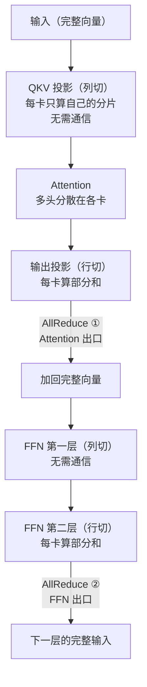
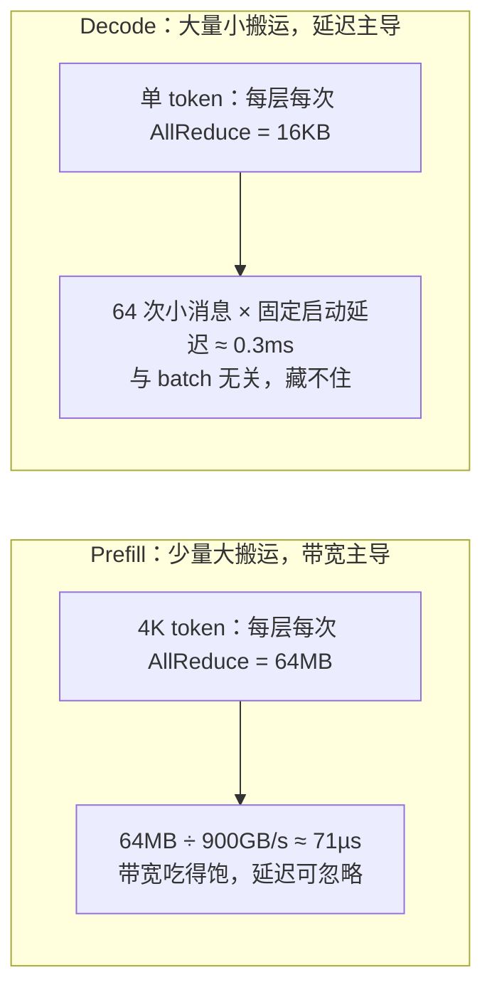

张量并行（Tensor Parallelism，TP）是推理并行的默认答案：单机多卡、追求单请求延迟，它最先出场。它的全部代价浓缩在一句话里——**每生成一个 token，每层要做 2 次 AllReduce（全归约：把各卡的部分结果相加，让每张卡都拿到完整结果）**。通信代价有多重？7B 模型每生成一个 token，全模型要通信约 1MB：这 1MB 走 NVLink（机内高速互联，约 900 GB/s）只要约 1µs（微秒），走机间 InfiniBand（约 50 GB/s）却要约 20µs——慢 18 倍。这就是“TP 通常不跨节点”的物理根源。模块三第 6 章讲过切分原理，本文从推理视角把 TP 的通信量、KV 切分、vLLM 实现和权衡得失算给你看。

<!-- more -->

## 📑 目录

- [1. TP 原理回顾与推理视角的差异](#1-tp-原理回顾与推理视角的差异)
- [2. TP 通信量推导：1MB 每步怎么来的](#2-tp-通信量推导1mb-每步怎么来的)
- [3. KV Cache 的切分：每卡 1/TP](#3-kv-cache-的切分每卡-1tp)
- [4. 权重切分细节与 vLLM 实现](#4-权重切分细节与-vllm-实现)
- [5. 权衡：换来了什么，牺牲了什么](#5-权衡换来了什么牺牲了什么)
- [总结](#-总结)
- [自我检验清单](#-自我检验清单)
- [参考资料](#-参考资料)

---

## 1. TP 原理回顾与推理视角的差异

### 1.1 三十秒复习：列切 + 行切 + 两次 AllReduce

**先回答一个三十秒复习题：TP 到底把什么切开了？** 模块三第 6 章讲过完整推导，这里只留骨架。Transformer 每层有两个“必经之路”，先认三个词：**QKV**（注意力里的三组向量：Q 查询、K 键、V 值）、**FFN**（前馈网络：两个线性层夹一个激活函数）、**head**（注意力头：注意力计算的一个独立通道，多头就是多条通道并行）。

- **Attention 输出投影、FFN 第二个线性层**：权重按**行**切，每卡算部分和，最后必须 **AllReduce** 把部分和加回完整向量——因为下一层的输入要求“完整”。
- **QKV 投影、FFN 第一个线性层**：权重按**列**切，每卡只算输出的一部分（多头天然可切），不需要通信——但前一步的输入得是完整的。

于是每个 Transformer Block 恰好有 **2 次 AllReduce**（Attention 输出 + FFN 输出），这就是 TP 全部通信的骨架。下图把这两次通信的位置标了出来：



这张图讲的是：**一个 Transformer 层里，两次 AllReduce 都发生在“行切”的出口**——列切只管算自己的分片，行切算完必须拼齐。vLLM 官方文档确认：其分布式实现采用的就是 Megatron-LM 的张量并行算法。

打个比方：**一张桌子（权重矩阵）太重，四个人各抬一个角（行切分片），每人负责自己那部分的计算；但桌子的四角必须同时落地——每次 AllReduce 就是一次“对齐落地”，任何一个人慢了，整张桌子（整个 batch 的所有请求）都在等。** 这个“必须同时落地”的同步特性，是理解 TP 一切代价的钥匙。

### 1.2 推理视角：为什么通信的形态和训练不一样

**设问：同样的 TP，推理和训练里的通信长一个样吗？** 不一样，要先拆成两个阶段看：**prefill（预填充：一口气把输入 prompt 全部处理完）**和 **decode（解码：逐 token 生成）**。

| 📊 维度 | Prefill | Decode |
|---|---|---|
| 每次 AllReduce 数据量 | 2 × b × s × h × d（大块，MB 级） | 2 × b × 1 × h × d（小块，KB 级） |
| 通信受什么主导 | 带宽 | **延迟**（消息太小，带宽吃不满） |
| 每步 AllReduce 次数 | 2 × L（固定） | 2 × L（固定，与 batch 无关） |
| 对 TP 的感受 | “通信能接受” | “通信占比显著上升” |

📌 **关键点**：TP 每步的通信**次数固定（2×层数）**、单次数据量 ∝ batch × hidden，**与序列长度无关**。prefill 是“少量几次大搬运”，decode 是“很多次小搬运”——decode 才是 TP 通信的真实考验，这也是为什么 TP 的性能故事主要在 decode 阶段展开。

### 1.3 推理的 TP 与训练的 TP：三处不同

**设问：训练章的 TP 结论，哪些能直接搬到推理？** 模块三第 6 章的推导可以复用，但推理场景有三处“不需要”和一处“更严重”：

1. **没有反向**：训练里 TP 的 AllReduce 前后向各一次、通信量对称；推理是纯前向，**通信量减半**，也不存在梯度同步。
2. **权重只读**：训练里权重每步更新，TP 分片要配合优化器状态；推理权重冻结，加载时各 rank 只读自己那份分片，**加载本身也能并行**（vLLM 按 rank 分片读取，降低单点 IO 峰值）。
3. **没有 Activation Checkpointing**：训练里 TP 常配合重计算省激活显存；推理每步的激活瞬生瞬灭、不需要存，**显存账本比训练干净**（大头只有权重 + KV 两项）。
4. **更严重的是同步粒度**：训练时 batch 大、通信可与反向重叠；推理 decode 每步都要同步一次，**同步延迟直接进 TPOT**（第 2 节定量算）。

一句话：**推理的 TP 是“去掉反向、权重只读”的轻量版，但因为每步都同步，通信延迟反而更扎眼。**

---

## 2. TP 通信量推导：1MB 每步怎么来的

### 2.1 公式：单次 AllReduce 到底传多少数据

**设问：通信量公式怎么来？** 直觉先说清那个系数 2：AllReduce 要把所有卡的部分和加到一起，每张卡既要发一份数据、又要收一份数据，传输量天然翻倍。设 batch 内当前有 $b$ 个 token，hidden 维 $h$（一个 token 的特征向量长度），每元素 $d$ 字节（FP16 为 2B），则单次 AllReduce 的传输量为：

$$
\underbrace{2}_{\text{AllReduce 固有冗余}} \times \underbrace{b}_{\text{当前 batch token 数}} \times \underbrace{h}_{\text{hidden 维}} \times \underbrace{d}_{\text{每元素字节数}}
$$

💡 **提示**：那个“2”不是“两次 AllReduce”，而是 **AllReduce 自身的通信冗余**——模块三 2.1 讲过：Ring AllReduce 的通信量 ≈ $2(N-1)/N \times$ 数据量，卡数多了就趋近 2 倍。模块三第 6 章“每次传输 2bsh”的口径与此一致。

### 2.2 数值算例：7B 模型一个 step 通信 1MB

**设问：代入 7B 模型，一个 step 到底通信多少？** 代入 7B 模型（$h = 4096$，FP16，单 token）：

$$
\frac{2 \times 4096 \times 2\ \text{B}}{1024} = \text{16KB 每次 AllReduce}
$$

- 每层 2 次 AllReduce → **32KB/层**
- 32 层 → **1MB/step**（每生成 1 个 token，全模型通信 1MB）
- batch = 16 时 → 每 step 通信 16MB

这就是“decode 通信量 ∝ batch”的量化版本：**batch 翻倍，通信量翻倍，但 AllReduce 次数不变**。

顺手把 prefill 也代入同一个公式：4K 个 prompt token 的 prefill，每层每次 AllReduce = 2 × 4096 × 4096 × 2B = **64MB**——大块消息，NVLink 上 64MB / 900GB/s ≈ 71µs，带宽吃得饱饱的，延迟可忽略。**同一套公式，prefill 看带宽、decode 看延迟——这就是 1.2 表格的数学来源。**

### 2.3 耗时估算：带宽账、延迟账、计算账

**设问：1MB 通信要花多少时间？** 三笔账分别算：

**带宽账**：1MB 在 NVLink（900GB/s）上 ≈ **1.1µs**；在机间 InfiniBand（约 50GB/s）上 ≈ **20µs**——差 18 倍。这是“TP 不跨机”的第一层原因，但还不够，因为：

**延迟账**：64 次（32 层 × 2）小消息 AllReduce，每次都有微秒级的固定启动延迟（NCCL——英伟达集合通信库，多卡通信的底层库；小消息实测约 5µs 量级，待核实，以你机器实测为准）→ 每 step 固定 **~0.3ms**，与 batch 无关。

**计算账**：decode 是 memory bound，每 step 要把本卡权重读一遍。7B 权重 14GB，按 H100 约 3.35TB/s：

| 📊 TP 大小 | 每卡权重 | 每 step 计算（下限） | + 通信延迟 | 理想单 token 时延 | 相对 TP1 |
|---|---|---|---|---|---|
| TP1 | 14GB | ~4.2ms | 0 | ~4.2ms | 1.0x |
| TP2 | 7GB | ~2.1ms | ~0.3ms | ~2.4ms | 1.75x |
| TP4 | 3.5GB | ~1.05ms | ~0.3ms | ~1.35ms | 3.1x |
| TP8 | 1.75GB | ~0.52ms | ~0.3ms | ~0.82ms | 5.1x |

（数字为按带宽下限的估算：计算项 = 每卡权重 / 3.35TB/s，通信延迟项为经验量级，均需在目标硬件上实测验证。）

📌 **关键点**：**TP 的加速是递减的**——从 TP1 到 TP2 是“装不下到装得下”的质变，收益最大；通信延迟占比从 TP2 的约 13% 一路涨到 TP8 的约 37%，加卡的边际收益越来越小。官方论坛对这个问题的答复口径一致：模型 3~4 卡能装下时，继续加 TP 卡“主要增加通信开销”，吞吐该靠 DP 扩。

把三笔账放一起看，prefill 和 decode 的差别一目了然：



这张图讲的是：**同一个公式，prefill 的通信是大块消息、按带宽算账；decode 的通信是 64 次小消息、按延迟算账**——decode 才是 TP 通信的真实考验。

### 2.4 为什么 TP 不能跨机：把 IB 代入公式

**设问：把通信搬到机间网络上，为什么就不划算了？** 把上一节的账换成“TP8 跨 2 个节点（每节点 4 卡）”：带宽从 900GB/s 掉到约 50GB/s，且每次 AllReduce 都要穿一次机间网络，固定延迟从约 5µs 涨到 10µs+：

- 带宽账：单 token 每 step 的 1MB 通信全部改走 IB → 带宽耗时从 1.1µs（NVLink 900GB/s）涨到 20µs（IB 约 50GB/s），batch 16 时是 320µs
- 延迟账：64 次 × 10µs+ ≈ **0.6ms+**，已经超过 TP4 的每步计算时间（1.05ms 的一半）
- 结论：跨机 TP 的通信耗时与计算同量级，加速比趋近 1，**不如用 PP 把跨机通信变成“每段只传一次激活值”**（6.3 展开）

这就是面试题的定量答案：**TP 依赖 NVLink 的带宽 + 低延迟，跨机走 IB 两者同时恶化，得不偿失；跨节点的活儿交给 PP，TP 永远限制在单机内部。**

⚠️ **注意**：技术上 vLLM 允许 `--tensor-parallel-size` 跨节点（多节点必须用 Ray 拉起，`--distributed-executor-backend ray`，节点间走 NCCL），官方文档的推荐配置仍是“TP = 每节点卡数”——**支持跨机 ≠ 推荐跨机**，物理账算下来不划算。

---

## 3. KV Cache 的切分：每卡 1/TP

### 3.1 账本：KV 跟着 head 走

**设问：权重切了，KV Cache 要不要跟着切？** 必须切。TP 把 attention head 分到各卡（QKV 列切），每卡只负责自己那部分 head 的 KV，所以 **KV Cache 总量也摊薄到每卡 1/TP**。沿用学习路线 3.1 的 7B KV 账本公式（按路线口径写作 32GB，精确值为 32GiB ≈ 34.4GB 十进制）继续算：

$$
\underbrace{2 \times 32 \times 32 \times 128 \times 4096 \times 16 \times 2\ \text{B}}_{\text{学习路线 3.1 的 7B KV 账本：K/V × 层 × 头 × head_dim × ctx × batch × 2B} \approx 32\ \text{GB}} \div \underbrace{8}_{\text{TP8}} = \text{4GB/卡}
$$

| 📊 配置 | 每卡权重（7B FP16） | 每卡 KV（4K ctx, batch 16） | 合计 |
|---|---|---|---|
| TP1 | 14GB | 32GB | 46GB |
| TP2 | 7GB | 16GB | 23GB |
| TP4 | 3.5GB | 8GB | 11.5GB |
| TP8 | 1.75GB | 4GB | **5.75GB/卡** |

同样的 80GB 单卡，TP1 只能放 32GB KV，TP8 能放 74GB+——**TP 顺带把 KV 预算翻了倍，这是训练并行没有的“意外红利”**：要么服务更长的上下文，要么扛更大的并发。

### 3.2 与 PagedAttention 的兼容：各记各的笔记

**设问：KV 切分和 PagedAttention（页式 KV 管理）会打架吗？** 不会，两套机制正交。打个比方：**KV 切分就像小组作业里各人记各人的笔记——四个人分工各记一部分内容（每卡 1/TP 的 head），不需要互相抄对方的笔记，但最后讨论时每个人只懂自己那块。** 用术语说：PagedAttention（站内 2.1）管理的是“每卡本地的 KV 页表”，TP 下每卡只为自己那 1/TP 的 head 分配和管理 block——两套机制正交，vLLM 在 TP>1 时自动按层和 head 切分 KV 并各自维护 block table，**不需要额外配置**。

更妙的是，decode 的瓶颈是 KV 带宽（每 step 要读所有已生成 token 的 KV），TP 后每卡只读 1/TP 的 KV——**KV 带宽需求也摊薄了 1/TP**。所以 TP 对 decode 有双重收益：权重读取降 1/TP、KV 读取也降 1/TP。

### 3.3 ⚠️ 例外：为什么 MLA 模型的 KV 不能按 1/TP 切

**设问：有没有模型在 TP 下切不了 KV？** 有——DeepSeek 系模型用 MLA（Multi-head Latent Attention，多头潜变量注意力），KV 被压缩成低秩潜变量，在 vLLM 的 TP 实现里**不能按 head 直接切**——结果就是 KV Cache 在每张 TP 卡上各存一份完整的，TP=8 时 KV 存 8 份。AMD 的 vLLM MoE Playbook 实测口径：这是 TP 在 MLA 模型上的“8× 浪费”，而 **DP 能把 KV 按副本切到 1/8**。这就是 6.1 提到的：DeepSeek-V3/R1 官方推荐 DP+EP 而不是纯 TP 的原因之一（6.4 详解）。

---

## 4. 权重切分细节与 vLLM 实现

### 4.1 Megatron 的约定：Column 和 Row

**设问：权重具体怎么切？** TP 的权重切分有固定套路，Megatron-LM 的命名直接写在代码里：

| 权重 | 切法 | 通信 | 位置 |
|---|---|---|---|
| QKV 投影 | Column Parallel（按列，每卡一部分 head） | 无 | Attention 入口 |
| Attention 输出投影 | Row Parallel（按行） | **AllReduce** | Attention 出口 |
| FFN 第一层（up/gate） | Column Parallel（切中间维） | 无 | FFN 入口 |
| FFN 第二层（down） | Row Parallel（按行） | **AllReduce** | FFN 出口 |

vLLM 的模型实现沿用这套约定（官方文档：“The implementation includes Megatron-LM's tensor parallel algorithm”）。**你不需要自己切任何权重**——引擎加载时按 rank 各取各的分片，这就是下一节的 `--tensor-parallel-size` 干的事。

### 4.2 vLLM 里怎么用：一个参数切完

**设问：vLLM 里怎么启用 TP？** 一个参数的事：

```bash
# 单机 4 卡：默认 mp 后端（multiprocessing），无需 Ray
vllm serve meta-llama/Llama-3.1-8B-Instruct \
  --tensor-parallel-size 4 \
  --gpu-memory-utilization 0.9

# 跨机 TP（不推荐但支持）：必须先拉起 Ray 集群，再指定 ray 后端
# 节点 0: ray start --head --num-gpus=8
# 节点 1: ray start --address=<head-ip>:6379 --num-gpus=8
vllm serve meta-llama/Llama-3.1-70B-Instruct \
  --tensor-parallel-size 16 \
  --distributed-executor-backend ray
```

启动后看日志验证切分生效（示例为 7B 模型 TP4 的量级示意，数字随配置变化）：

```
INFO [kv_cache_utils.py] GPU KV cache size: 131,072 tokens
INFO [vllm.py] # GPU blocks: 8,192
```

（参数名与日志行号随版本演进，以你所用版本的 `vllm serve --help` 为准。）

要点：

- **TP 只影响“一个模型副本怎么摆”**，不改变模型本身——换 TP 大小不需要改权重文件，重启即可。
- 单机默认走 **mp 后端**（原生 multiprocessing），跨机才需要 Ray（vLLM 官方文档口径：“Ray for multi-node, multiprocessing for single-node”）。
- `--tensor-parallel-size` 必须能整除 attention head 数，否则启动直接报错：`Total number of attention heads (32) must be divisible by tensor parallel size (3)`——**40 头的模型可以用 TP5/TP8，32 头的模型只能用 TP2/4/8/16**，这是 vLLM 的硬校验，不是建议。
- 显存余量看 `GPU KV cache size`：这个数字（可缓存的总 token 数）除以你的平均请求长度，就是并发容量的下界。

### 4.3 GQA 模型切 TP 有什么坑

**设问：GQA 模型能直接套 1/TP 的结论吗？** 有个细节要注意。GQA/MQA 模型（KV head 远少于 Q head，如 Llama-3.1-70B 只有 8 个 KV head；MQA 即 Multi-Query Attention，所有查询头共享同一组键值头）在 TP 下：KV head 数必须能整除 TP，否则 vLLM 会**复制 KV head 凑整**（模块三第 6 章讲过同一策略）——这会让“每卡 1/TP 的 KV”在 GQA 下略不精确（复制的 head 会在多卡重复），但数量级不变。选 TP 前先看模型 config 的 `num_key_value_heads` 能不能整除你的 TP。

### 4.4 与量化的组合：TP 切的是“更小的权重”

**设问：TP 和量化能叠加吗？** 能，而且是乘法关系——先量化把权重变小，再 TP 把变小的权重摊开（4.6 的 2×A100 跑 70B 案例就是 FP16 装不下 → W8A8 70GB → TP2 每卡 35GB）。组合规则：

- **INT4/FP8 权重在 TP 下照常切分**：每卡显存 = 量化后总量 / TP，量化省下的空间原样传导给 KV 预算。
- **KV Cache 量化（FP8 KV）与 TP 叠加**：KV 先按 1/TP 切、再压一半，两者独立（4.4 讲过 KV 量化只省 KV）。
- ⚠️ **别把 TP 当量化的替代品**：TP 解决“一卡放不下但可以加卡”，量化解决“不想加卡”——预算充足加卡（TP），预算有限量化，两者叠用最常见。

---

## 5. 权衡：换来了什么，牺牲了什么

### 5.1 换来了什么

**设问：TP 付出了通信，换到了什么？**

- **显存**：权重和 KV 都摊到 1/TP——70B FP16 从“单卡装不下”到 TP8 每卡 17.5GB（6.1 的账本）。
- **单请求延迟**：TTFT（prefill 的大矩阵乘摊到 TP 张卡上并行）和 TPOT（每步权重/KV 读取降 1/TP）双双下降，7B 的估算曲线在 2.3 节：TP4 约 3.1x。
- **KV 带宽**：decode 瓶颈被摊薄 1/TP（3.2 节），这是纯推理场景才有的收益。

### 5.2 牺牲了什么

**设问：反过来，牺牲了什么？**

- **通信**：每层 2 次 AllReduce，每 step 固定 64 次小消息——**batch 内所有请求必须一起同步**，一个长请求拖住整批（“桌子四角必须同时落地”的代价）。这跟 DP 完全不同：DP 的副本之间零每步通信，一个慢请求只拖自己。
- **单副本吞吐上限**：TP 不扩吞吐！它把一份模型的延迟做低、显存做小，但 **QPS 上限仍是一个副本的上限**——扩吞吐要靠 DP 多副本（6.4）。
- **扩展性天花板**：单机 8 卡（NVLink 域）就是 TP 的舒适区；再往上加速比趋近 1（2.3 节表格），跨机更是负收益。
- **配置约束**：head 整除校验、GQA 的 KV head 复制、MLA 的 KV 复制——不是所有模型都能干净地 TP。

### 5.3 落成一句话的规则

**设问：什么时候该用 TP、什么时候别用？**

- ✅ **单机 ≤8 卡、追求单请求延迟、模型能整除** → TP，且用“刚好装下”的最小 TP（比如 70B FP16 在 80GB 卡上 TP4 起步）。
- ✅ **模型 TP4 就装得下但吞吐不够** → 别加到 TP8，多出来的卡开第二个 DP 副本（6.4），收益更大。
- ✅ **TP 装下后 KV 还是紧** → 叠加 4.6 的量化（FP8 权重 + FP8 KV）或 KV 量化，比继续加 TP 卡便宜。
- ❌ **别让 TP 跨节点**——支持，但不划算；跨节点用 PP（6.3）。
- ❌ **别在无 NVLink 的机器（如 L40S）上上 TP**——vLLM 官方文档明确此时 PP 吞吐更高、通信更少。
- ❌ **别为了“显得高级”从 TP4 加到 TP8**——如果 4 卡装得下且延迟达标，TP8 只是多付 64 次 AllReduce 的固定延迟。

---

## 📝 总结

1. **骨架**：TP = 列切 + 行切 + 每层 2 次 AllReduce，vLLM 实现的就是 Megatron-LM 算法；prefill 是少量大搬运，decode 是 64 次小搬运，延迟主导。
2. **通信量**：单 token 每层每次 AllReduce = 2 × b × h × d；7B 单 token 每 step 1MB，batch 16 时 16MB；NVLink 上 1.1µs，IB 上 20µs。
3. **为什么限单机**：跨机后带宽差 18 倍 + 64 次小消息延迟翻倍（0.6ms+），通信与计算同量级，加速比趋近 1——跨节点的活交给 PP。
4. **KV 跟着切**：32GB 的 7B KV 在 TP8 下每卡 4GB，KV 预算翻倍、decode KV 带宽摊薄 1/TP；MLA 模型例外（KV 复制，官方因此推荐 DP+EP）。
5. **vLLM 用法**：`--tensor-parallel-size` 一键切分，head 数必须整除；单机 mp 后端、跨机才用 Ray。
6. **权衡**：TP 换显存 + 单请求延迟 + KV 带宽，牺牲通信与 batch 内同步、不扩吞吐；“刚好装下”最小 TP + DP 扩吞吐是标准姿势。

## ⚠️ 常见错误做法

- ❌ **TP 时把 QKV 投影整个复制到每张卡**：没做列切分。为什么错：TP 的要点是切矩阵——每卡只存一部分列，算完 AllReduce 拼接；整块复制等于 DP，白付通信。正确做法：按列切分 QKV/FFN、按行切分输出投影（Megatron 的切分方式）。
- ❌ **TP 大小超过机内卡数**：8 卡机配 TP=16。为什么错：TP 通信要求 NVLink 级互联，跨机 TP 通信开销爆炸（6.1 已讲）。正确做法：TP ≤ 单机卡数（通常 8），其余并行维度跨机。
- ❌ **把 TP 当量化/优化的替代品**：模型精度出问题就上 TP 或减 TP。为什么错：TP 改变的是并行度与通信，不改变数值精度；精度问题要找量化/数值根因。正确做法：分开排查（本文的排查清单）。
- ❌ **忽略 TP 的显存冗余**：每卡存一份完整权重之外还要算 AllReduce 缓冲。为什么错：TP 每卡存 1/TP 权重但激活 AllReduce 需要额外缓冲，显存账本要算全。正确做法：按本文的显存账本（权重/TP + 激活缓冲 + KV/TP）规划。

## 🎯 自我检验清单

- 能手动推导单 token 每层每次 AllReduce 的通信量公式（2 × b × h × d），并解释“2”是 AllReduce 冗余因子而非次数
- 能算 7B 模型（hidden=4096, FP16）单 token 每 step 的 TP 通信量（1MB），误差不超过 20%
- 能把 1MB 分别代入 NVLink（900GB/s）和 IB（50GB/s）估算耗时（约 1.1µs vs 20µs），并说明差 18 倍的来源
- 能解释为什么 decode 阶段 TP 通信受延迟主导而 prefill 受带宽主导（同一公式：消息大小差 s 倍、次数固定）
- 能解释推理 TP 与训练 TP 的三处差异（无反向、权重只读、无激活重计算 + 同步延迟直接进 TPOT）
- 能根据“每卡权重 / 3.35TB/s + 64 次 × 5µs”估算 7B 在 TP2/TP4/TP8 下的单 token 时延，并说出收益递减的原因
- 能解释 TP 不能跨节点的两层原因（带宽 18 倍差距 + 小消息延迟翻倍），而不只说“带宽不够”
- 能算 7B 模型（32 层、32 头、head_dim 128、4K ctx、batch 16）KV Cache 在 TP8 下每卡多少（约 4GB）
- 能说明 TP 下 PagedAttention 如何工作（每卡独立 block table、只读 1/TP 的 KV），以及 decode KV 带宽摊薄的双重收益
- 能说出 MLA 模型在 vLLM 的 TP 下 KV 为什么复制，以及官方推荐的替代方案（DP+EP）
- 能写出 vLLM 单机 TP4 和跨机 TP 的启动命令（mp 后端 vs ray 后端），并解释 `GPU KV cache size` 日志怎么读、head 整除校验的报错长什么样（32 头模型合法 TP 只有 2/4/8/16）
- 能根据“单机 ≤8 卡/追求延迟/吞吐不够/无 NVLink”四类场景给出 TP 的选型决策，并解释为什么“刚好装下”优于“越多越好”

## 📚 参考资料

**官方文档**

- [vLLM Parallelism and Scaling（并行策略选择、L40S 边界案例、Ray/mp 后端）](https://docs.vllm.ai/en/latest/serving/parallelism_scaling/)
- [vLLM V1 指南（V1 引擎特性与限制）](https://docs.vllm.ai/en/latest/usage/v1_guide/)
- [vLLM 论坛：TP 是否有推荐上限（模型装下后加卡收益递减的官方口径）](https://discuss.vllm.ai/t/is-there-recommended-max-upper-limit-for-tensor-parallel/1184)
- [vLLM Issue #414 / #1041：attention head 必须整除 TP 的校验与案例](https://github.com/vllm-project/vllm/issues/414)

**论文**

- [Megatron-LM: Training Multi-Billion Parameter Language Models Using Model Parallelism - Shoeybi et al., 2019](https://arxiv.org/abs/1909.08053)：Column/Row Parallel 与两次 AllReduce 的出处
- [DeepSeek-V3 Technical Report - DeepSeek-AI, 2024](https://arxiv.org/abs/2412.19437)：MLA 架构与部署并行策略（EP/TP/DP 组合）

**开源项目与实测**

- [AMD ROCm vLLM MoE Playbook（TP 下 MLA KV 复制 8× 浪费、DP+EP 收益实测）](https://rocm.blogs.amd.com/software-tools-optimization/vllm-moe-guide/README.html)
- [vLLM GitHub 仓库（分布式执行实现，`--distributed-executor-backend`）](https://github.com/vllm-project/vllm)

**站内**

- [模块三 第 6 章 张量并行与序列并行（切分原理与通信插入位置推导）](/AIInfraGuide/distributed/模块三-分布式训练/第6章-张量并行与序列并行)
- [2.1 集合通信原语详解（AllReduce 通信量公式、NVLink/IB 带宽差一个数量级）](/AIInfraGuide/distributed/模块三-分布式训练/21-集合通信原语详解)
- [2.1 PagedAttention（KV Cache 账本与页表管理）](/AIInfraGuide/inference/模块四-推理优化/第2章-推理引擎核心技术/21-pagedattention)
- [1.1 LLM 推理基础（Prefill/Decode 与 Memory Bound）](/AIInfraGuide/inference/模块四-推理优化/第1章-llm推理基础/11-llm推理基础)
- [6.1 推理并行策略总览（四种策略决策树与 70B 显存账本）](/AIInfraGuide/inference/模块四-推理优化/第6章-分布式推理/61-推理并行策略总览)
- [6.3 流水线并行推理（跨节点扩展的替代方案）](/AIInfraGuide/inference/模块四-推理优化/第6章-分布式推理/63-流水线并行推理)
- [6.4 数据并行与专家并行（DP 扩吞吐与 MLA 的 DP+EP 方案）](/AIInfraGuide/inference/模块四-推理优化/第6章-分布式推理/64-数据并行与专家并行)
- [4.6 量化选型与 vLLM 实战（TP 装不下时的先量化决策）](/AIInfraGuide/inference/模块四-推理优化/第4章-量化/46-量化选型与vllm实战)
- [vLLM 快速入门](/AIInfraGuide/inference/模块四-推理优化/第3章-深入vllm/vllm快速入门)
- [AI Infra 学习路线（第二层检验标准：64 卡拓扑与"TP 为什么不能跨机"）](/AIInfraGuide/guides/ai-infra学习路线)
