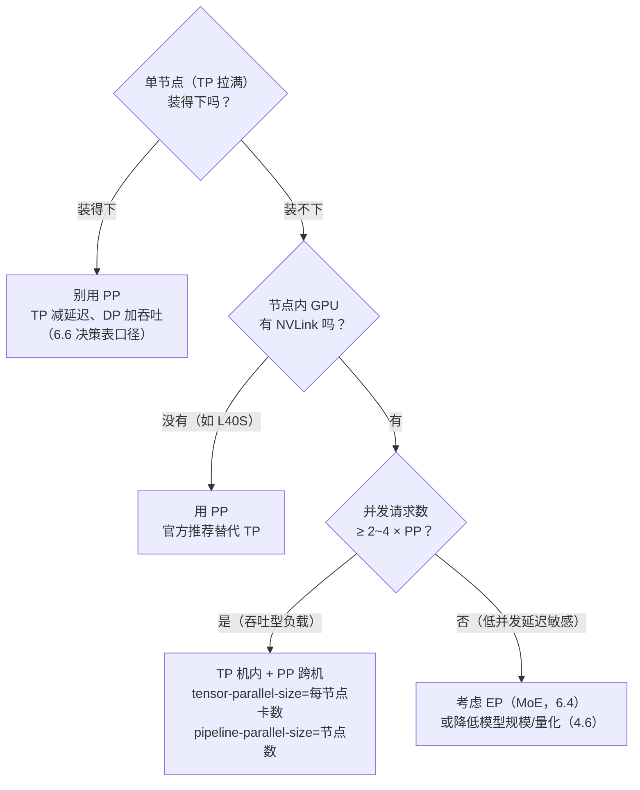

训练里 PP 靠 backward 把流水线双向喂满，推理里没有 backward,PP 的账要重算。单请求 decode 每步必须串行穿过全部 $P$ 个 stage:PP=2 时理想切分下**单请求延迟一分不省**（每个 stage 算半层，两步加起来还是全模型时间）。吞吐能不能提起来，取决于并发：请求数 ≥ $P$ 时流水线才能喂满，并发 4、PP=4 时效率只有 $1 - \frac{3}{7} \approx 57\%$。所以推理侧 PP 的定位很窄：**TP 填满单机之后还装不下时的跨节点手段，不是提速手段**。本文承接模块三第 7 章的 bubble 公式，把推理场景下 PP 的 prefill/decode 差异、TP×PP 组合、vLLM 支持现状和决策边界算给你看。

<!-- more -->

## 📑 目录

- [1. PP 原理回顾：训练章的公式直接搬过来](#1-pp-原理回顾训练章的公式直接搬过来)
- [2. 推理场景的三个差异](#2-推理场景的三个差异)
- [3. Prefill 阶段：连续计算被切成 P 段](#3-prefill-阶段连续计算被切成-p-段)
- [4. Decode 阶段：bubble 变轻，延迟累加](#4-decode-阶段bubble-变轻延迟累加)
- [5. 显存账本：PP 下的不均衡分布](#5-显存账本pp-下的不均衡分布)
- [6. TP×PP 组合：先机内，后跨机](#6-tppp-组合先机内后跨机)
- [7. vLLM 的 PP 支持现状](#7-vllm-的-pp-支持现状)
- [8. 权衡与决策：什么时候用 PP](#8-权衡与决策什么时候用-pp)
- [总结](#-总结)
- [自我检验清单](#-自我检验清单)
- [参考资料](#-参考资料)

---

## 1. PP 原理回顾：训练章的公式直接搬过来

### 1.1 三十秒复习：切层、micro-batch、bubble

模块三第 7 章把 PP 讲透了，这里只留骨架：**PP 按层把模型切成 $P$ 段，每段放在一个 stage（一组 GPU）上，数据以 micro-batch 为单位在 stage 间依次流动**。打个比方：**这是一场接力赛——激活值是接力棒，每个 stage 是一个队员，只有拿到棒才能跑自己的那段（算自己那几层），交棒就是 stage 间的通信。如果全场只有一根棒（单请求），其他队员全程干等——这就是 bubble（流水线气泡）**。

训练章的 bubble 比例公式（GPipe / 1F1B 口径，$M$ 为 micro-batch 数）：

$$
\underbrace{\frac{P-1}{M+P-1}}_{\text{训练章公式：M 个 micro-batch 填流水线，填充/排空的 P-1 个空档是气泡}}
$$

- 朴素 PP（M=1）退化为 $\frac{P-1}{P}$——流水线完全没填起来
- $M \to \infty$ 时气泡趋于 0，但训练里 $M$ 太大激活显存爆炸，所以用 1F1B 把峰值激活从 $M$ 份压到 $P$ 份

### 1.2 推理视角的三个新问题

公式能搬，但**代入什么数变了**。训练里 $M$ 是"一个 mini-batch 内部切出的 micro-batch 数"，由你拍脑袋定；推理里流水线的"micro-batch"变成了**调度器每个 step 从并发请求里组出来的 batch**——它不由你控制，而由请求到达率决定。这引出三个问题：

1. **prefill 阶段**：单请求的 prefill 是连续计算，PP 下要跨段传递激活，TTFT 会不会变差？
2. **decode 阶段**：每步所有 stage 都在工作，bubble 是不是消失了？每步的 stage 间传递会怎样？
3. **显存分布**：没有 backward 之后，各 stage 的显存负担均匀吗？

下面三节逐一算。

---

## 2. 推理场景的三个差异

先给一张总表，再分别展开：

| 📊 维度 | 训练 PP | 推理 PP |
|---|---|---|
| 流水线内容 | forward + backward 交替（1F1B） | 只有 forward |
| 填满流水线的单位 | 自己切的 micro-batch（$M$ 可调） | 并发请求组成的 batch（由负载决定） |
| bubble 最痛的时刻 | 反向阶段（backward 依赖 forward） | 低并发 / prefill 填充期 |
| 每步 stage 间传递 | 激活（前向）+ 梯度（后向） | 只有激活 |
| 显存分布 | 激活随 1F1B 动态 | 权重静态不均衡（embedding/logits） |

### 2.1 差异一：没有 backward，流水线简化了

训练里 PP 最复杂的部分——1F1B 的 warmup/steady/cooldown 三段调度、backward 与 forward 的交叉、激活释放时机——全部源于**反向传播依赖前向**。推理只有前向，流水线退化成最简单的"生产节拍"：每个 stage 拿到上一段传来的激活，算完传给下一段，没有回流。

这带来一个好消息和一个坏消息：

- ✅ **调度简单了**：不需要为 backward 预留显存和算力，每步每 stage 固定干一件事。
- ❌ **也少了一张底牌**：训练里 PP 的经典收益——"1F1B 把峰值激活显存从 $M$ 份压到 $P$ 份"——在推理里几乎无感，因为推理的激活瞬生瞬灭（6.2 第 1.3 节讲过），**PP 在推理里省不下什么训练里省的那份显存**。它剩下的唯一硬收益是"权重装得下"。

### 2.2 差异二：micro-batch 的个数不由你定

训练里 $M$ 是你调的参数，想让 bubble 小就加大 $M$（代价是显存）；推理里流水线里同时在飞的 micro-batch 数 ≈ **并发请求数**（vLLM V1 的实现里，一个 decode 请求同一时刻只能在一个 in-flight microbatch 中，官方 RFC #11945 原文如此）。所以训练章的 bubble 公式在推理 decode 稳态下变成：

$$
\underbrace{\frac{P-1}{C+P-1}}_{\text{推理版：C = 并发请求数，M 从"可调参数"变成"负载决定"}}
$$

代入算例（PP=4）：

| 并发请求 $C$ | bubble | 流水线效率 | 直观感受 |
|---|---|---|---|
| 1 | 75% | 25% | 全场一根棒，灾难 |
| 4 | 43% | 57% | 勉强跑起来，一半空转 |
| 16 | 16% | 84% | 可以接受 |
| 64 | 4.5% | 95.5% | 接近满载 |

📌 **关键点**：**PP 的效率是并发请求数的函数，不是你能直接调的参数**。低并发的在线服务（比如单用户对话）上 PP=4，等于花 4 倍的卡拿 25%~57% 的效率——这就是"推理侧 PP 只适合吞吐场景"的数学来源。

### 2.3 差异三：显存分布不均衡

训练里 PP 各 stage 的显存压力主要由激活的 1F1B 动态决定，大体均衡；推理里激活不重要了，**权重成为显存主角，而权重在层间天然不均衡**：

- **首 stage** 多背一份 embedding（7B 词表 32K × hidden 4096 × 2B ≈ 0.26GB；70B 词表 128K × 8192 × 2B ≈ 2.1GB）
- **末 stage** 多背 lm_head 输出投影（同量级），还要承担 logits 计算与采样
- **中间 stage** 只有 Transformer 层，每层权重固定（70B 共 80 层，每层约 1.75GB FP16）

以 70B、PP=4 为例（FP16，每 stage 20 层）：

| 📊 Stage | 内容 | 权重（FP16） |
|---|---|---|
| Stage 0 | embedding + 20 层 | 2.1 + 35 ≈ 37.1GB |
| Stage 1 | 20 层 | 35GB |
| Stage 2 | 20 层 | 35GB |
| Stage 3 | 20 层 + lm_head | 35 + 2.1 ≈ 37.1GB |

差距只有 ~7%，看起来不大——但注意 embedding 和 lm_head 的权重**和 Transformer 层一样要驻留显存、一样在 decode 时被读取**，而它们的计算密度极低（一次查表/一次矩阵乘）。PP 切层时若不做特殊处理，首尾 stage 的带宽浪费是纯亏。实际引擎会把这部分和层数一起打包分配（vLLM 按 `--pipeline-parallel-size` 自动均分层数，embedding/logits 归首尾 stage），**你要心里有数：PP 的"均匀"只是层数均匀，不是显存均匀**。

---

## 3. Prefill 阶段：连续计算被切成 P 段

### 3.1 问题：prefill 是"一大块连续计算"，PP 把它切成 P 段

单请求的 prefill 是 compute bound 的连续计算：一个 4K token 的 prompt，在单卡上就是一口气跑完 4K 个位置的前向。PP 下这段计算必须**切成 P 段串行穿过流水线**——因为第 $i+1$ 个 stage 必须等第 $i$ 个 stage 算完这一段的全部层才能开始。

单请求 prefill 的 TTFT：

$$
TTFT_{\text{PP}} = \underbrace{P \times t_{\text{prefill,stage}}}_{\text{P 个 stage 串行}} + \underbrace{(P-1) \times t_{\text{xfer}}}_{\text{P-1 次 stage 间传输}} + \underbrace{t_{\text{sched}}}_{\text{调度与同步开销}}
$$

理想均匀切分下 $t_{\text{prefill,stage}} = \frac{t_{\text{prefill,单卡}}}{P}$（假设每 stage 算力相同），于是第一项恰好等于单卡 prefill 时间——**PP 不降低 prefill 延迟，只是把"一块大计算"换成"P 块小计算 + P-1 次传输"**。传输本身不贵（下一节算），贵的是：

1. **同步等待**：每个 stage 算完必须等下一 stage 接棒才能算下一个 microbatch，stage 间任何一卡抖动都会把延迟直接传给整条链。
2. **调度复杂度**：prefill 请求在 vLLM V1 里可以同时跨多个 in-flight microbatch（RFC #11945 的规划），但实现细节随版本演进——**长 prefill 配 PP，调试成本显著高于 TP**。

### 3.2 好消息：prefill 的传输是大块消息，带宽吃得饱

传输量公式（训练章第 5 节口径：Stage 间传输 = $b \times s \times h$）：

$$
V_{\text{xfer}} = \underbrace{b}_{\text{micro-batch 内 token 数}} \times \underbrace{s}_{\text{序列长度}} \times \underbrace{h}_{\text{hidden 维}} \times \underbrace{d}_{\text{每元素字节数}}
$$

代入 70B（$h=8192$，FP16）、micro-batch 512 token：$512 \times 8192 \times 2\text{B} = 8.4\text{MB}$——一次 8.4MB 的消息走 IB（约 50GB/s）只要 ~0.17ms，对比该 micro-batch 在 stage 上几毫秒的计算，**prefill 的跨段通信占比可以接受**。

💡 **提示**：这正是 6.2 结尾那句“PP 把跨机通信变成每段只传一次激活值”的出处——TP 每层 2 次 AllReduce（70B 单 token 每 step 约 5MB 通信，见 6.2），PP 每 stage 边界每 micro-batch 只传 1 次激活。**通信次数从“每层 2 次”降到“每段 1 次”，数量级完全不同**。

---

## 4. Decode 阶段：bubble 变轻，延迟累加

### 4.1 为什么 decode 的 bubble 反而轻

训练里 bubble 最痛的时刻是 backward——后向必须等前向算完，流水线一半时间在等。推理 decode 只有前向，**只要并发请求数 ≥ $P$，每个 stage 每个 step 都有活干**：stage 0 算请求 A 的第 $n$ 个 token 时，stage 1 正在算请求 B 的第 $n$ 个 token，stage 2 在算请求 C…… 每步所有 stage 同时工作，这就是 2.2 节公式里 $C \geq P$ 之后效率冲到 84%+ 的原因。

### 4.2 代价一：每步延迟串行累加，且不随算力翻倍而下降

单请求 decode 每步的延迟是**串行穿过整条流水线**的总和：

$$
T_{\text{step}} = \underbrace{P \times t_{\text{stage}}}_{\text{串行经过 P 个 stage}} + \underbrace{(P-1) \times t_{\text{xfer}}}_{\text{每步 P-1 次传输}}
$$

代入 70B、TP8+PP2（每节点 8 卡，每 stage 背 8.75GB 权重，H100 约 3.35TB/s 带宽下限估算，数字待实测）：

- 单机 TP8 全模型每 step ≈ 17.5GB / 3.35TB/s ≈ **5.2ms**
- PP2 下每 stage ≈ 2.6ms，单请求每 step = 2.6 + 2.6 + 传输 ≈ **5.2ms + ε**

📌 **关键点（反直觉）**：**PP 把算力翻倍了，单请求延迟却一分不省**——因为两个 stage 是串行接力而不是并行各算各的。TP 的延迟收益来自"一层内的矩阵乘法被切到多卡并行"，PP 没有这个性质。你多花的钱（多一倍 GPU）只买到了"装得下"和"并发吞吐"，买不到单请求速度。

### 4.3 代价二：每步都有的小消息传输，延迟占比随并发上升

decode 的 stage 间传输是**小消息**：单 token（$b=1, s=1$）每边界只有 $h \times d$。70B 是 16KB，7B 是 8KB。16KB 走 IB 的带宽时间 ≈ 0.3µs，几乎可以忽略——但**每步都要传一次，且受固定延迟（NCCL 小消息启动、跨机 RTT）主导**，经验量级每边界 5~10µs（待核实，以你机器实测为准）。PP=4 时每步 3 次传输，约 15~30µs 的固定开销叠在 5.2ms 上不明显；**但注意它是 per-step 固定成本，并发越大、每步出 token 越多，它摊得越薄**——这又回到"PP 是吞吐玩法"的结论。

### 4.4 吞吐账：PP 的收益曲线长什么样

设并发 $C$、每 step 每 stage 处理一个 microbatch，则：

$$
\text{每 step 产出} = C\ \text{个 token} \qquad \text{效率} = \frac{C}{C+P-1}
$$

对比同一批卡做 TP+DP（不切层，副本内 TP、副本间 DP）的收益：DP 的吞吐放大是线性的（6.4 展开），而 PP 的放大带 $\frac{C}{C+P-1}$ 的折扣——**并发越低，PP 相对 DP 越吃亏**。这就是业界"PP 只出现在模型大到单节点装不下的场景"的原因：那时候没有别的选择，折扣也得付。

---

## 5. 显存账本：PP 下的不均衡分布

回到装得下的问题。PP 的显存收益一句话：**每张卡只背自己那个 stage 的层**。

$$
\text{每卡权重} = \frac{\text{模型权重} + \text{embedding/lm_head 分摊}}{P \times \text{TP}}
$$

代入两个典型场景：

| 📊 场景 | 权重总量 | 配置 | 每卡权重 |
|---|---|---|---|
| 70B FP16 | 140GB | TP8 + PP2（16 卡） | 140 / (2×8) ≈ **8.75GB** |
| 70B FP16 | 140GB | TP8（8 卡，单机） | 140 / 8 = **17.5GB** |
| 405B FP8 | 405GB | TP8 + PP2（16 卡） | 405 / 16 ≈ **25GB** |
| 405B FP8 | 405GB | TP8（8 卡） | 405 / 8 ≈ **50.6GB** |

💡 **提示**：405B 那行说明 PP 的典型用途——**单机 8 卡放不下（50.6GB 权重 + KV 后 80GB 卡很紧），16 卡每卡 25GB 权重就从容了**。注意 PP 的显存收益和 TP 是相乘关系：每卡权重 = 总量 / (PP × TP)，所以"先 TP 填满单机、再 PP 跨机"在显存账本上也是最自然的拆法。

⚠️ **注意**：KV Cache 不参与 PP 切分——KV 跟着层走，每个 stage 只维护自己那几层的 KV（每层 1/TP 的 head），**PP 不会把 KV 总量摊薄**（那是 TP 的红利，6.2 第 3 节讲过）。所以判断"PP 够不够"时，权重账按上式算，KV 账按单 stage 内的层数 × 每层 KV 算，两个都要放得下。

---

## 6. TP×PP 组合：先机内，后跨机

### 6.1 带宽层级决定了组合顺序

为什么行业惯例是"TP 先机内、PP 再跨机"？因为两者的通信模式对带宽层级的要求完全不同（模块三 2.1 的结论：机内 NVLink 数百 GB/s，机间 IB 约 50GB/s，差一个数量级）：

| 📊 通信模式 | 频率 | 单次数据量 | 需要的带宽 | 结论 |
|---|---|---|---|---|
| TP 的 AllReduce | 每层 2 次，每 step 固定 | 7B 约 16KB（decode 单 token） | 极高（延迟敏感） | 必须 NVLink，限单机 |
| PP 的 stage 间传输 | 每 step (P-1) 次 | 单 token 8~16KB | 中（带宽占比小） | 可以走 IB，跨机 OK |

所以标准拓扑就是 vLLM 官方文档的推荐：**`tensor_parallel_size` = 每节点 GPU 数，`pipeline_parallel_size` = 节点数**。比如 2 节点 × 8 卡：

```bash
# 2 节点 16 卡：每节点内 TP8，节点间 PP2（细节与 Ray 拉起见 6.5）
vllm serve <model> \
  --tensor-parallel-size 8 \
  --pipeline-parallel-size 2 \
  --distributed-executor-backend ray
```

把镜头拉远到学习路线里的 64 卡拓扑题：8 节点 × 8 卡，**TP=8（机内）+ PP=4（4 组节点）+ DP=2（两组副本）**——TP 吃 NVLink、PP 吃 IB、DP 零通信，三层各走各的带宽层级，这是面试标准答案，也是生产部署的默认拆法。

### 6.2 反例：无 NVLink 的机器，官方建议 PP 顶替 TP

vLLM 官方文档（parallelism_scaling 页）专门写了一条边角规则：**如果节点内 GPU 之间没有 NVLink 互联（比如 L40S 这类机器），官方建议用 PP 而不是 TP**——因为 TP 的每层 AllReduce 在 PCIe 上比 NVLink 慢一个数量级，而 PP 的跨段传输频率低得多，"更低的通信开销、更高的吞吐"。这从反面印证了 6.1 的带宽层级逻辑：**TP 是"吃带宽的娇气方案"，带宽不够时 PP 反而更皮实**。

### 6.3 DeepSeek-V3：训练用 PP，推理为什么不用

最硬的证据来自 DeepSeek-V3 技术报告（§3.2 与 §3.4）：

- **训练**：2048 张 H800 上，**16-way PP + 64-way EP（跨 8 节点）+ ZeRO-1 DP**，还专门设计了 DualPipe 双向流水线把 forward/backward 的计算通信重叠——PP 是训练的主力。
- **推理部署**：prefill 阶段 4 节点 32 卡 = **TP4 + SP + DP8（attention）/ EP32（MoE）**；decode 阶段 40 节点 320 卡 = **TP4 + SP + DP80（attention）/ EP320（MoE）**——**全程没有 PP**。

为什么训练离不了 PP、推理却完全不用？对照本文前几节的账：

1. **训练要省激活显存**：1F1B 把峰值激活从 $M$ 份压到 $P$ 份，这是硬收益；推理激活瞬生瞬灭，没有这份收益（2.1 节）。
2. **训练有 backward 填流水线**：DualPipe 双向流水让流水线双向满载；推理只有单向 forward，bubble 全靠并发请求数硬扛（2.2 节）。
3. **推理有在线 SLO**：PP 的串行延迟累加（4.2 节）对 TTFT/TPOT 不友好，而 DeepSeek 的部署目标是"同时保证在线 SLO 与高吞吐"——TP4 的小 TP 组 + EP 把跨机通信集中到专家层，比 PP 更可控。

💡 **提示**：这个例子不是说"推理永远不该用 PP"，而是说明**当模型是 MoE 时，EP 提供了比 PP 更优的跨节点方案**（6.4 展开）；稠密模型跨节点时，PP 仍是官方文档里的标准答案（6.2 节那条命令）。

---

## 7. vLLM 的 PP 支持现状

### 7.1 从 V0 的 virtual engine 到 V1 的重写

vLLM 的 PP 实现走过两代：

- **V0 时代**：用"virtual engine"方案——每个 PP stage 一个虚拟引擎，各自带独立的 scheduler、block manager 和 KV cache 引擎，通过多个虚拟引擎同时调度多个 batch 来填满流水线。缺点是**没有统一调度器，全局优化（KV 复用、前缀缓存）做不了**。
- **V1 时代**：早期（2025 年上半年）V1 引擎**不支持 PP**，官方 RFC #11945 专门设计了新方案——引擎循环改成异步调度，向执行器持续提交 microbatch，流水线里同时有 PP 个 microbatch 在飞。当前版本的 `vllm serve` 已支持 `--pipeline-parallel-size`（与 `--tensor-parallel-size` 组合使用），**具体支持度以你所用版本的 `vllm serve --help` 为准**。

### 7.2 V1 下 PP 的三个现实限制

1. **流水线必须持续注入 microbatch**：RFC #11945 写得很直白——队列必须保持满，请求不足时要推入空 microbatch 占位；**一旦断流，流水线效率无法自行恢复，只能重启引擎**。翻译成人话：PP 服务不能空转，低负载时段是纯亏。
2. **与投机解码不兼容**：站内 5.5 记录的官方口径——截至 vllm ≤ 0.15.0，Pipeline Parallelism 与投机解码不兼容（draft 验证的批次结构没法穿过流水线）。开 PP 就得放弃投机解码的收益。
3. **低并发无收益**：第 2 节的效率公式是硬约束——并发 < PP 时流水线填不满，卡越多越浪费。

⚠️ **注意**：网上搜 PP 教程会看到大量 V0 时代的 virtual engine 说法（"PP 需要 `--num-virtual-engine` 之类参数"），V1 下这些都不适用。**判断标准只有一个：打开你所用版本的 `vllm serve --help`，看 `--pipeline-parallel-size` 是否存在及其说明。**

### 7.3 顺带说清：TP 跨机 vs PP 跨机

技术上 vLLM 允许 `--tensor-parallel-size` 跨节点（必须 Ray 拉起，6.2 第 2.4 节算过账：每 step 的 AllReduce 全部走 IB，通信耗时与计算同量级，加速比趋近 1）。**官方文档的推荐始终是"TP = 每节点卡数、PP = 节点数"**——支持跨机 ≠ 推荐跨机。跨节点的活，交给 PP（或 6.4 的 EP）。

---

## 8. 权衡与决策：什么时候用 PP

### 8.1 牺牲了什么，换取了什么

| 📊 换取 | 📉 牺牲 |
|---|---|
| 权重显存 ÷ (PP×TP)，单节点装不下的模型能跑 | 单请求延迟不降反增（串行接力 + 传输） |
| 跨节点只传激活（每段 1 次），比 TP 跨机轻两个数量级 | 吞吐打折：效率 = C/(C+P-1)，低并发血亏 |
| 无 NVLink 机器上的可行替代（官方背书） | 调度复杂度：持续注入 microbatch、断流效率不可恢复 |
| 与连续组批正交，并发充足时接近线性 | 与投机解码不兼容（vllm ≤ 0.15.0 口径） |

### 8.2 决策规则



落成一句话的规则：

- ✅ **单机装得下** → 别用 PP。TP 减延迟、DP 加吞吐，PP 只负责"装得下"（6.6 的决策表口径）。
- ✅ **单机装不下、且要跨节点、且并发充足** → TP 机内 + PP 跨机，`--tensor-parallel-size` = 每节点卡数、`--pipeline-parallel-size` = 节点数。
- ✅ **节点内无 NVLink（L40S 等）** → 官方建议 PP 顶替 TP。
- ✅ **MoE 大模型跨节点** → 优先考虑 EP（6.4），PP 不是首选。
- ❌ **别为了"显得高级"开 PP**——单机装得下的模型开 PP，白付跨机通信和调度复杂度，还可能丢了投机解码。

---

## 📝 总结

1. **公式迁移**：训练章的 bubble 公式 $\frac{P-1}{M+P-1}$ 直接搬到推理，但 $M$ 从"可调参数"变成"并发请求数 $C$"——PP 的效率由负载决定。
2. **prefill**：连续计算被切成 P 段串行，TTFT 不降反增（多 P-1 次传输与同步）；好在传输是大块消息，带宽占比可接受。
3. **decode**：并发 ≥ P 时每步所有 stage 都在工作，bubble 变轻；但单请求延迟 = P×t_stage + (P-1)×t_xfer，算力翻倍延迟一分不省。
4. **显存**：每卡权重 = 总量/(PP×TP)，但 KV 不参与 PP 切分；embedding/lm_head 让首尾 stage 显存略重、带宽浪费。
5. **组合**：TP 吃 NVLink（每层 2 次 AllReduce）、PP 走 IB（每段 1 次激活），带宽层级决定"TP 机内、PP 跨机"。
6. **证据**：DeepSeek-V3 训练用 PP16+EP64，推理部署（prefill EP32 / decode EP320）全程不用 PP——推理侧 PP 的收益在 MoE 时代进一步收窄。
7. **vLLM**：V1 重写了 PP（RFC #11945），当前支持 `--pipeline-parallel-size`，但受"持续注入 microbatch、与投机解码不兼容"两条限制，以你所用版本为准。
8. **决策**：PP 是"装不下的最后手段"——TP 填满单机、并发充足、才轮到 PP。

## 🎯 自我检验清单

- 能写出训练章的 bubble 公式 $\frac{P-1}{M+P-1}$，并解释推理 decode 稳态下 $M$ 应替换成并发请求数 $C$
- 能手算 PP=4、并发 16 时的 bubble ≈ 16%、效率 ≈ 84%
- 能推导单请求 decode 每步延迟 $T = P \times t_{\text{stage}} + (P-1) \times t_{\text{xfer}}$，并解释"PP 不降低单请求延迟"的反直觉结论
- 能计算 70B 模型（h=8192）单 token 每 stage 边界的传输量 = 16KB，并与 6.2 的 TP 通信账对比出数量级差异
- 能解释为什么 PP 跨机可行而 TP 跨机不可行（通信频率 + 带宽层级）
- 能画出 64 卡（8 节点 × 8 卡）的 TP8×PP4×DP2 拓扑，并标注 NVLink/IB 各自承载什么通信
- 能说明 PP 下显存分布不均衡的来源（embedding/lm_head 在首尾 stage）以及 KV 为何不随 PP 摊薄
- 能说出 DeepSeek-V3 训练用 PP16 而推理部署不用 PP 的三个原因（无激活显存收益 / 无 backward 填流水线 / 在线 SLO 对串行延迟敏感）
- 能说出 vLLM V1 下 PP 的两条限制（需持续注入 microbatch、与投机解码不兼容），并知道用 `vllm serve --help` 验证版本差异
- 能根据"单机装不装得下 / 节点内有无 NVLink / 并发是否充足"三问做出是否用 PP 的决策
- 能解释无 NVLink 机型（L40S）官方为何建议 PP 顶替 TP
- 能向同事一句话讲清 PP 的定位：装不下的最后手段，不是提速手段

## 📚 参考资料

**论文**

- [DeepSeek-V3 Technical Report - DeepSeek-AI, 2024（§3.2 训练 PP16/EP64/ZeRO-1，§3.4 推理 TP+SP+EP 部署）](https://arxiv.org/abs/2412.19437)
- [GPipe: Easy Scaling with Sub-Model Parallelism - Huang et al., 2019（micro-batch 流水线与 bubble 公式源头）](https://arxiv.org/abs/1811.06965)

**官方文档**

- [vLLM Parallelism and Scaling（TP/PP 组合规则、"TP=每节点卡数、PP=节点数"、无 NVLink 机型建议）](https://docs.vllm.ai/en/stable/serving/parallelism_scaling/)
- [vLLM RFC #11945：Pipeline Parallelism for vLLM V1（V1 早期无 PP、microbatch 队列设计）](https://github.com/vllm-project/vllm/issues/11945)
- [vLLM V1 指南（V0 弃用状态与功能支持矩阵）](https://docs.vllm.ai/en/stable/usage/v1_guide/)

**站内**

- [模块三第 7 章 流水线并行（bubble 公式与 GPipe/1F1B/Interleaved 口径）](/AIInfraGuide/distributed/模块三-分布式训练/第7章-流水线并行)
- [模块三第 6 章 张量并行与序列并行（TP 通信量公式出处）](/AIInfraGuide/distributed/模块三-分布式训练/第6章-张量并行与序列并行)
- [模块三 2.1 集合通信原语详解（NVLink 数百 GB/s vs IB 约 50GB/s）](/AIInfraGuide/distributed/模块三-分布式训练/21-集合通信原语详解)
- [6.1 推理并行策略总览（四种策略决策树与 70B 显存账本）](/AIInfraGuide/inference/模块四-推理优化/第6章-分布式推理/61-推理并行策略总览)
- [6.2 张量并行推理（TP 通信量、KV 1/TP 切分、"PP 每段只传一次激活"伏笔）](/AIInfraGuide/inference/模块四-推理优化/第6章-分布式推理/62-张量并行推理)
- [6.5 多节点部署：vLLM 与 Ray 集群（跨节点拉起与排错）](/AIInfraGuide/inference/模块四-推理优化/第6章-分布式推理/65-多节点部署-ray)
- [6.6 vLLM 分布式部署实战（TP/PP/DP 三场景命令与决策表）](/AIInfraGuide/inference/模块四-推理优化/第6章-分布式推理/66-vllm分布式部署实战)
- [5.5 vLLM 投机解码实战（PP 与投机解码不兼容的口径）](/AIInfraGuide/inference/模块四-推理优化/第5章-speculative-decoding/55-vllm投机解码实战)
- [AI Infra 学习路线（第二层 3D 并行拓扑检验标准）](/AIInfraGuide/guides/ai-infra学习路线)
