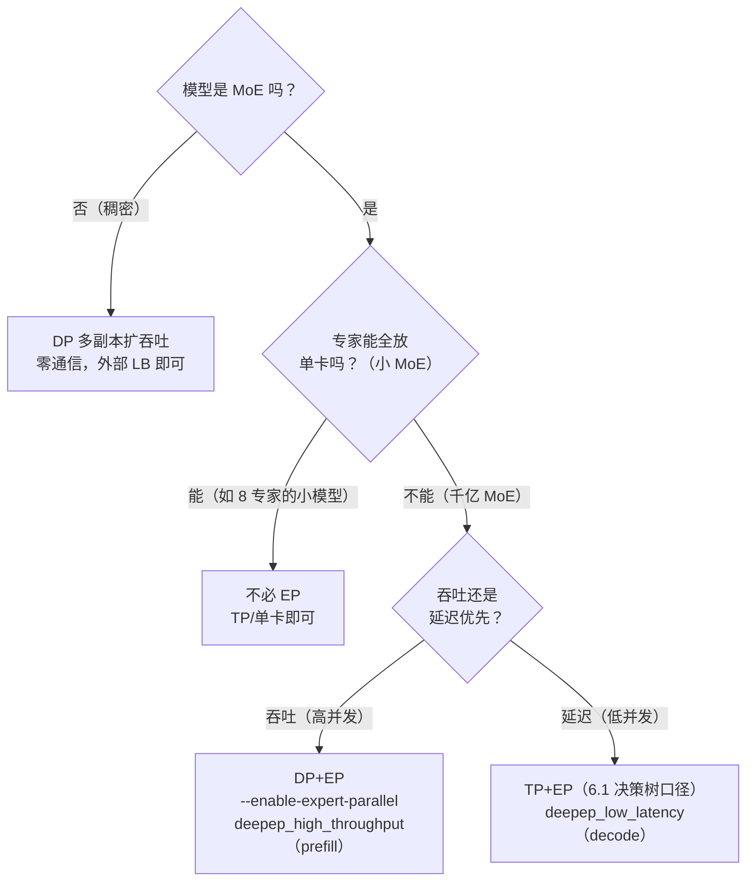

这一节讲两种“复制与分摊”的并行：**数据并行（DP）复制整个引擎来加吞吐，专家并行（EP）摊开 MoE 的专家来装显存**。先给结论：稠密模型的多副本推理是**零通信**的——权重只读、副本之间不用对账，开 N 个副本就把吞吐放大 N 倍（训练里每步都要 AllReduce 同步梯度，推理里没有这件事）。而 MoE 模型（混合专家，Mixture of Experts：模型里放多个小网络，每个 token 只激活其中几个）把账本彻底改写：DeepSeek-V3 总参数 671B、FP8 权重 671GB，**8 张 H100（640GB）连权重都装不下**——于是有了专家并行（EP）。

一个问题先摆在这：**同样是分摊显存，为什么 EP 要把专家“整块”分到各卡，而不是像 TP 那样把每个专家都切成碎片？** 答案分两半：显存账（第 3 节）和计算效率账（第 4 节）。先记住直觉：EP 的代价是每个 token 都要“搬家”两次（All-to-All），通信量是同样 batch 下 TP 的 $K/2$ 倍（DeepSeek-V3 即 4 倍）。这一节把这两张牌讲透：DP 怎么零成本扩吞吐，EP 为什么是千亿 MoE 推理的必选项，以及 vLLM 怎么把 All-to-All 藏进计算里。

<!-- more -->

## 📑 目录

- [1. 推理数据并行：零通信的横向扩展](#1-推理数据并行零通信的横向扩展)
- [2. 权重复制还是切分：DP×TP 的组合账本](#2-权重复制还是切分dptp-的组合账本)
- [3. MoE 的显存难题：671B 与 37B 之间](#3-moe-的显存难题671b-与-37b-之间)
- [4. 专家并行 EP：token 按路由搬家](#4-专家并行-eptoken-按路由搬家)
- [5. All-to-All 通信量推导：每个 token 都要搬家](#5-all-to-all-通信量推导每个-token-都要搬家)
- [6. vLLM 的 MoE/EP 支持与 DeepSeek 实践](#6-vllm-的-moeep-支持与-deepseek-实践)
- [7. 权衡：EP 换来了什么，牺牲了什么](#7-权衡ep-换来了什么牺牲了什么)
- [总结](#-总结)
- [自我检验清单](#-自我检验清单)
- [参考资料](#-参考资料)

---

## 1. 推理数据并行：零通信的横向扩展

### 1.1 先立问题：吞吐不够，为什么要“复制引擎”而不是“切模型”？

6.2/6.3 的 TP、PP 都是“切”——把一个大模型拆开装进多卡。切分解决了**装不下**，但对**吞吐不够**是低效的：TP=8 时一个请求的 decode 也要走全部 8 卡的 AllReduce，单请求延迟降了，但整组卡只服务一个引擎，batch 上限被一组 KV Cache 锁死。

数据并行（DP）的思路完全不同：**不切模型，复制模型**。每块卡（或每组卡）跑一份完整引擎，各接各的请求，互不相干。

打个比方：**一家店客流爆满，你不改厨房流程，而是直接开分店——每家分店菜单完全一样（同样的权重副本），各自独立接客、独立排队，店与店之间不需要打电话对账**。用技术语言说：推理的 DP 副本之间**没有任何梯度需要同步**，权重是只读的，所以副本之间零通信。

对比训练 DDP（Distributed Data Parallel，分布式数据并行：训练里每个副本算完自己的梯度后全量同步，模块三 4.1 讲过）：训练每步都要 AllReduce 梯度把副本“对齐评分尺度”；推理权重冻结，没有这个动作。**训练 DP 的通信量是 $2\Psi$（每步全量梯度），推理 DP 的通信量是 0**——这是推理侧最便宜的一种并行。

### 1.2 vLLM 里的两种形态：多实例 or 内置 DP

- **形态一：多实例 + 外部负载均衡**。对稠密模型，vLLM 官方文档明说：“每个部署的服务器完全独立，直接启动多个 vLLM 实例、外部路由器分发请求即可，不需要任何 `--data-parallel-*` 参数”。这是最朴素也最稳的形态——零通信、零耦合，挂了还能各自重启。
- **形态二：内置 DP**。`vllm serve --data-parallel-size 4` 把 4 个核心引擎（core engine）进程拉在同一个 API server（对外提供接口的服务进程）后面（进程间通信走 ZMQ，一个轻量消息库），由内部负载均衡按各引擎的 running/waiting 队列分发请求。它和 `--tensor-parallel-size` 可组合：`--data-parallel-size 4 --tensor-parallel-size 2` 需要 8 卡——4 个副本，每个副本内部 TP2。

⚠️ **注意**：`--max-num-seqs` 是**每个 DP rank 各自生效**的（官方文档原话：“When sizing DP deployments, remember that --max-num-seqs applies per DP rank”）——配并发上限时别按总量算错。

### 1.3 收益曲线：DP 让每个副本的 batch 都能做大

DP 的吞吐收益来自两层：

1. **显存预算翻倍**：N 个副本 = N 份独立 KV Cache 预算，总并发上限近似 ×N（受负载均衡影响，真实曲线要压测）。
2. **Continuous Batching 的乘法效应**：第 2 章的结论是调度器把 GPU 利用率从 30% 拉到 80%+ 靠的是“batch 做大”；DP 给每个副本都留出了做大批次的显存空间——**单副本的 batch 上限 × 副本数 = 总吞吐的近似线性放大**。

用 7B 的账本验证（站内 2.1 口径：4K ctx、batch 16 的 KV ≈ 32GB；单卡 80GB 减去 14GB 权重剩约 60GB 给 KV/激活）：

| 📊 配置 | 每副本 KV 预算 | 每副本 batch 上限（4K ctx 估算） | 总并发上限 |
|---|---|---|---|
| 单实例 TP1 | ~60GB | ~30 | 30 |
| DP2 | ~60GB × 2 | ~30 × 2 | ~60 |
| DP4 | ~60GB × 4 | ~30 × 4 | ~120 |

（估算口径：每请求 KV ≈ 2GB/4K ctx，具体以你实测为准。）

📌 **关键点**：数字会随模型变化，但结构不变——**DP 的收益是“并发容量”的线性扩展，不是单请求延迟的改善**。延迟敏感要 TP（6.2），吞吐不够要 DP。6.6 的压测设计就是拿“TP 减延迟、DP 加吞吐”当假设去验证的。

---

## 2. 权重复制还是切分：DP×TP 的组合账本

### 2.1 前提：每副本必须装得下完整权重

DP 复制的是**完整引擎**，所以它的硬前提是：**单副本（含 TP 切分后）必须装得下完整权重**。70B FP16 权重 140GB，单卡 80GB 放不下 → 纯 DP（每副本单卡）直接出局，必须先 TP 切分。

同一批 8 卡，两种玩法：

| 📊 8 卡配置 | 每卡权重（70B FP16） | 副本数 | 单请求延迟 | 总吞吐容量 |
|---|---|---|---|---|
| TP8（1 副本） | 17.5GB | 1 | 最低（5.2ms/step 量级） | 1 份 KV 预算 |
| TP4 + DP2（2 副本） | 35GB | 2 | 中 | 2 份 KV 预算 |
| TP2 + DP4（4 副本） | 70GB | 4 | 高 | 4 份 KV 预算 |

📌 **关键点（反直觉）**：同样 8 卡，**TP 拉满 ≠ 最优**。TP8 的单请求延迟最低，但 KV 预算只有一份；TP4+DP2 延迟略高（每卡权重翻倍，decode 每 step 读取量翻倍），吞吐容量翻倍。**“装得下”之后，TP 和 DP 是在延迟与吞吐之间做交换**——先问你的 SLO 是 TTFT/TPOT 还是 QPS。

### 2.2 一个例外：MoE 模型的 DP 不是零通信

稠密模型的多副本完全独立；但 MoE 模型一旦用 DP，**副本之间不再独立**（vLLM 官方文档原话：DP ranks are not completely independent）。原因：MoE 的专家层要跨副本同步——即使某个 rank 当前没有请求，只要其他 rank 有请求在跑，它也得跟着跑“空的 dummy forward”让专家层的集合通信对齐。这是 MoE 推理 DP 的第一个隐藏成本，第 4 节讲完 EP 你就明白为什么必须这样。

---

## 3. MoE 的显存难题：671B 与 37B 之间

### 3.1 账本：总参数 671B，激活 37B

**设问：671B 和 37B 分别是什么？** DeepSeek-V3 是当前 MoE 部署的标准样本（技术报告原文：“671B total parameters with 37B activated for each token”）。先算清它的结构（配置来自官方 config.json，数字为近似值）：

- 61 层 Transformer，**前 3 层是稠密 FFN，后 58 层是 MoE 层**（每层 1 个共享专家 + 256 个路由专家）
- 每 token 由 router 选 **top-8** 个路由专家 + 共享专家处理
- 每个专家 = 一个小 FFN（hidden 7168 → 中间 2048 → 7168），约 44M 参数 ≈ **44MB（FP8）**

$$
\underbrace{671\text{B}}_{\text{总参数}} = \underbrace{58 \times 256 \times 44\text{M}}_{\text{路由专家} \approx 653\text{B}} + \underbrace{58 \times 44\text{M}}_{\text{共享专家}} + \underbrace{\text{MLA / 稠密层 / embedding}}_{\approx 14\text{B}}
$$

每个 token 过一层 MoE 时，只挑 top-8 个路由专家加 1 个共享专家来算，58 层加起来：

$$
\underbrace{58 \times (8 \times 44\text{M} + 44\text{M})}_{\text{58 层 MoE:top-8 路由专家 + 共享专家} \approx 23\text{B}} + \underbrace{\text{attention / MLA 等}}_{\approx 13\text{B}} \approx 37\text{B}
$$

**37B / 671B ≈ 5.5%**——每生成一个 token，只有 5.5% 的参数真正参与计算，但**推理时必须把 100% 的参数驻留显存**（router 是动态的，你永远不知道下一个 token 会选中哪些专家）。

### 3.2 显存账本：FP8 是唯一可行的前提

权重显存 = 参数量 × 每参数字节数：

| 📊 精度 | 总权重 | 8×H100 80GB（640GB） | 8×H200 141GB（1128GB） |
|---|---|---|---|
| BF16（2B/参数） | ~1342GB | ❌ | ❌ |
| FP8（1B/参数） | ~671GB | ❌ | ✅（均分 ≈ 84GB/卡） |

- **FP8 的 671GB 权重，8 张 H100（640GB）都装不下**——vLLM 官方 EP 文档的原话是：DeepSeek-V3 单节点示例“可以在 H200（或 H20）上跑，H100 请换小模型或上多节点”。
- 即便 EP8 把专家摊到每卡 ~82GB（653B/8），加上复制到每卡的 attention/共享专家等 ~14GB，**每卡权重约 96GB，H200 上只剩约 45GB 给 KV 和激活**——这就是为什么 MLA 的 KV 压缩（每 token 每层仅 576 维）和 KV 量化（4.4）在 MoE 部署里是刚需。

💡 **提示**：对比 4.6 的 70B 账本（FP16 140GB → W8A8 70GB → INT4 35GB），MoE 的账本逻辑完全不同：**量化（FP8）只能救一半（671GB → 335GB 若用 4-bit），但 BF16 的 1342GB 连 8×H200 都装不下——EP 才是把 671B 塞进单节点的关键一招，量化只是辅助**。这也是“MoE 必选 EP”的第一条理由：显存。

---

## 4. 专家并行 EP：token 按路由搬家

### 4.1 核心思想：切“专家集合”，而不是切矩阵

**设问：EP 到底切什么？** TP 切的是**单个权重矩阵**（每个专家都被切成 N 片）；EP 切的是**专家本身**——256 个专家按路由热度分配到 N 张卡，每卡只驻留 $256/N$ 个专家的完整权重（模块三第 10 章的结论直接复用）。

EP=8 时：每卡 32 个专家，约 32 × 44MB ≈ **1.4GB 专家权重/层**——比 TP 模式下“每个专家切 8 片、每片只有 5.5MB”的碎片化强得多。**每个专家的权重完整驻留一卡 = 这个专家的 GEMM 可以整块算完，不需要跨卡 AllReduce 聚合部分和**。

### 4.2 数据流：两次 All-to-All

一个 token 在前向中穿过 MoE 层的完整旅程（训练章第 10 章画过数据流，这里从推理视角走一遍）：


- **dispatch（分发）**：把 token 的 hidden state（h 维向量）发给它选中的 8 个专家所在的卡——同一专家收到的多个 token 打包成一个 batch 一次算完（专家侧的大 batch 是 EP 算力效率的来源）。
- **combine（回收）**：各专家卡把 FFN 结果发回原卡，原卡按 router 权重加权求和。

与训练 EP 的差异只有一条：**没有反向**。训练的 dispatch/combine 前后向各一次、通信量对称；推理只有前向，**通信量减半**——但结构不变，仍然是“每个 token 每次穿过 MoE 层都要搬家”。

### 4.3 打个比方：银行柜台

**把 MoE 层想象成银行大厅——256 个专家是 256 个业务柜台，分布在 8 个楼层（GPU）里，token 是拿着叫号单（router 结果）的顾客。顾客（token）在自己的座位（原卡）上填好单子，由传送带（All-to-All）把单子送到对应柜台所在楼层；柜台算完（专家 FFN），结果再经传送带送回顾客手里。** 问题在于：**每一个顾客、每一个 MoE 层、都要经历一次这样的“送单 + 取回”**——这就是 All-to-All 通信的本质，也是 EP 的全部代价。

---

## 5. All-to-All 通信量推导：每个 token 都要搬家

### 5.1 公式：通信量 ∝ batch × K × h

设一个 MoE 层收到 $B$ 个 token，每 token 激活 $K$ 个路由专家，hidden 维 $h$，每元素 $d$ 字节，则这一层的 All-to-All 总量：

$$
V_{\text{A2A}} = \underbrace{B}_{\text{该层 token 数}} \times \underbrace{K}_{\text{每 token 的专家数}} \times \underbrace{h}_{\text{hidden 维}} \times \underbrace{d}_{\text{字节/元素}} \times \underbrace{2}_{\text{dispatch + combine}}
$$

直觉验证：每个 token 要向 $K$ 个专家各送一份自己的 hidden state（$h \times d$ 字节），再从 $K$ 个专家各收一份结果——**搬家的总量与 token 数严格线性**。

代入 DeepSeek-V3（$h=7168$，FP8 每元素 1B，$K=8$）：

- 单 token：$1 \times 8 \times 7168 \times 1 \times 2 = 114\text{KB}$/层 → 58 个 MoE 层 ≈ **6.6MB/step**
- batch 256：$256 \times 8 \times 7168 \times 1 \times 2 = 29.4\text{MB}$/层 → ≈ **1.7GB/step**
- 若 BF16（2B）：batch 256 → **3.4GB/step**

### 5.2 和 TP 的通信量对比：EP 贵 K/2 倍

同样 batch、同样模型，TP 模式下每层通信量（6.2 公式：每层 2 次 AllReduce，每次 $2 \times B \times h \times d$）：

$$
V_{\text{TP}} = \underbrace{2}_{\text{层内 AllReduce 次数}} \times \underbrace{2 \times B \times h \times d}_{\text{单次 AllReduce 的传输量}}
$$

$$
\frac{V_{\text{A2A}}}{V_{\text{TP}}} = \frac{2 \times B \times K \times h \times d}{4 \times B \times h \times d} = \frac{K}{2}
$$

DeepSeek-V3 的 $K=8$ → **EP 的通信量是 TP 的 4 倍**。这是“EP 没有免费午餐”的定量版本：EP 用显存和算力效率换来了 K/2 倍的通信量。

💡 **提示**：batch 越大，EP 通信的**绝对量**越大（∝B），但相对计算的比例不一定恶化——因为专家侧 GEMM 效率也随 batch 提升。真正的恶化发生在 decode：每步 batch 小（DeepSeek 报告口径：每专家通常 ≤256 token），消息小而多，**通信由延迟主导而非带宽**，这就是为什么需要专门的低延迟 All-to-All kernel（下一节）。

### 5.3 prefill 与 decode 的 A2A 形态差异

| 📊 维度 | Prefill | Decode |
|---|---|---|
| 每层 A2A 数据量 | B 大（几千 token），MB 级 | B 小（几十~几百 token），KB 级 |
| 通信受什么主导 | 带宽 | 延迟（小消息） |
| 对应优化 | deepep_high_throughput 后端、计算通信重叠 | deepep_low_latency 后端、IBGDA 低延迟传输 |

📌 **关键点**：同一套 A2A，prefill 和 decode 是两种病——这正是 vLLM 提供两个 DeepEP 后端、以及第 7 章 PD 解耦（把 prefill 和 decode 拆到不同实例上跑）把两个阶段拆开的原因；decode 一侧还要靠 IBGDA（InfiniBand GPUDirect Async：让 GPU 数据直连网卡、绕过 CPU 的低延迟传输技术）压小消息的固定延迟。

---

## 6. vLLM 的 MoE/EP 支持与 DeepSeek 实践

### 6.1 参数与语义（以你所用版本为准）

- **`--enable-expert-parallel`**：显式开启 EP。不开时，MoE 层走 TP（专家层形成一个大小为 `DP × TP` 的 TP 组）；开了之后专家层切到 EP。**EP 不是自动启用的**——EP 大小自动计算：`EP_SIZE = TP_SIZE × DP_SIZE`（官方文档原话）。
- **层的分工**：开 EP 后，专家层在全部 `TP×DP` 个 rank 上切分；attention 层看 TP——`TP=1` 时 attention 权重在所有 DP rank 上**复制**（这就是 DP attention），`TP>1` 时 attention 在 DP 组内做 TP 切分。
- **DP attention 的意义**：6.2 第 3.3 节的问题在这里解决——MLA 模型在 TP 下 KV 相关结构在 shard 间复制、浪费显存（vLLM 官方 Issue #16037 原话：“If TP is used in an MLA model, we duplicate the KV cache across GPUs”）。DP attention 让每个副本只持有自己那批请求的 KV，**副本间按请求切 KV，而不是按层切**——这是 DeepSeek-V3/R1 推荐 DP+EP 而不是纯 TP 的核心原因。
- **All-to-All 后端**：`--all2all-backend` 可选 `allgather_reducescatter`（默认，通用）、`deepep_high_throughput`（prefill 主导）、`deepep_low_latency`（decode 主导）、`flashinfer_nvlink_*`（MNNVL 系统）。DeepEP 需要单独安装（官方 EP kernels 工具链）。
- **EPLB**（`--enable-eplb`）：推理时真实负载的专家热度可能严重倾斜（训练时均衡不代表线上均衡），EPLB 周期性收集每 token 负载、重新映射“逻辑专家 → 物理卡”并在不重启的情况下搬权重。**冗余专家有显存成本**：DeepSeek-V3 每 EP rank 多放 1 个冗余专家 ≈ 2.4GB（官方文档数字），官方建议大规模部署 `num_redundant_experts: 32`——与 DeepSeek 报告里 prefill 阶段“全组共 32 个冗余专家（每卡 1 个）”的机制类似但口径不同（报告是全组数量，vLLM 参数是每 rank 的额外份数）。

### 6.2 官方示例：DeepSeek-V3 单节点 EP

vLLM 官方 EP 文档的示例（DeepSeek-V3-0324，8 张 H200/H20）：

```bash
# TP1 + DP8（attention 复制）+ EP8（专家切 8 份）
vllm serve deepseek-ai/DeepSeek-V3-0324 \
  --tensor-parallel-size 1 \
  --data-parallel-size 8 \
  --enable-expert-parallel
```

逐项解读：TP=1 表示 attention 不做张量切分（MLA 下 TP 反而复制 KV）；DP=8 让 8 个副本各接各的请求；EP=8 自动算出，256 个专家每卡 32 个。**单节点 8 卡的 H200 就能把 671B 的 V3 跑起来——这在稠密模型里是不可想象的（6.3 里 405B 稠密都要 16 卡）**。

多节点版的关键参数（官方文档示例，2 节点 × 8 卡跑 DP16/EP16）：

```bash
# 节点 0（主）：接请求
vllm serve deepseek-ai/DeepSeek-V3-0324 \
  --tensor-parallel-size 1 --enable-expert-parallel \
  --data-parallel-size 16 --data-parallel-size-local 8 \
  --data-parallel-address <主节点IP> --data-parallel-rpc-port 13345 \
  --all2all-backend deepep_low_latency --api-server-count 8

# 节点 1（headless，纯计算）：不接请求
vllm serve deepseek-ai/DeepSeek-V3-0324 \
  --tensor-parallel-size 1 --enable-expert-parallel \
  --data-parallel-size 16 --data-parallel-size-local 8 \
  --data-parallel-start-rank 8 \
  --data-parallel-address <主节点IP> --data-parallel-rpc-port 13345 \
  --all2all-backend deepep_low_latency --headless
```

要点：`--data-parallel-start-rank` = 之前所有节点的本地 DP 数累加；`--api-server-count` 建议对齐本节点 rank 数（API server 是 DP 规模大时的瓶颈，官方文档原话）；`--headless` 节点不暴露 HTTP 端点。

### 6.3 DeepSeek 官方报告的部署口径

DeepSeek-V3 技术报告 §3.4 的部署数字，和 vLLM 的实践完全同构：

- **Prefill**：最小部署单元 4 节点 32 卡。attention = TP4 + SP + DP8；MoE = **EP32**（每卡 8 个专家 + 1 个冗余专家）。
- **Decode**：最小部署单元 40 节点 320 卡。attention = TP4 + SP + DP80；MoE = **EP320**（每卡只放 1 个专家，64 张卡专门放冗余专家和共享专家）。
- decode 的 dispatch/combine 走 **IB 点对点直传 + IBGDA** 压延迟；每专家 batch 通常 ≤256 token，**内存访问是瓶颈而非计算**——专家权重只有 44MB，读一遍几乎不费带宽。

这两组数字的工程含义：**EP 的粒度可以拉到“每卡 1 个专家”**——只要 A2A 足够快，专家的分布可以任意稀，这是稠密模型永远做不到的扩展维度。

### 6.4 性能锚点：Wide-EP 的实测

vLLM 官方博客（2025-12）在 Coreweave H200 集群（IB ConnectX-7）上的生产级多节点 benchmark：**2.2k tokens/s/GPU**（此前 1.5k），来自 Wide-EP（EP+DP）+ DBO（Dual Batch Overlap，`--enable-dbo`，把 All-to-All 通信和计算重叠）+ EPLB + DeepEP/DeepGEMM 一整套。**这组数字说明 EP 的通信代价是可以通过工程手段“藏”进计算里的——但那是 2.2k 背后的功夫，不是默认配置免费送的。**

---

## 7. 权衡：EP 换来了什么，牺牲了什么

### 7.1 账本对照

| 📊 换取 | 📉 牺牲 |
|---|---|
| 显存：专家权重 ÷ EP，671B 塞进单节点 | All-to-All 通信：∝ B×K×h，同样 batch 下是 TP 的 K/2 倍 |
| 专家权重完整驻留一卡，GEMM 无跨卡聚合 | 实现复杂度：DeepEP/DBO/EPLB/IBGDA 全套工程 |
| 每专家收到足够 token，大 batch GEMM 效率高 | DP 副本间耦合：每步对齐 + 空 dummy forward |
| 扩展维度：EP 粒度可到“每卡 1 专家” | 单个 compute-bound 请求会拖慢整个 EP 组（官方博客原话：prefill 请求延迟整个组的前向） |

### 7.2 决策规则



决策规则：

- ✅ **千亿 MoE（671B 级）部署 → 基本必选 EP**：FP8 权重 671GB，EP 是唯一把显存压到每卡 80~100GB 的路径。
- ✅ **高并发吞吐 → DP+EP**（DP attention 还顺带解决 MLA 的 KV 复制问题）。
- ✅ **低并发延迟敏感 → TP+EP**（TP 小规模 2~4，attention 用 TP 切，专家用 EP）。
- ✅ **A2A 占比高 → 上 DeepEP 后端 + `--enable-dbo` 重叠通信与计算**，别裸跑。
- ❌ **小 MoE（专家能整卡放下）→ 别为“显得高级”开 EP**，白付 A2A 与同步复杂度。
- ❌ **别忽略 EPLB**——线上负载的专家倾斜会让部分卡空转，`--enable-eplb` + 冗余专家的 ~2.4GB/rank 是值得的保险。

---

## 📝 总结

1. **推理 DP 零通信**：权重只读、无梯度同步，稠密模型多副本完全独立——训练 DDP 的 $2\Psi$ 通信在推理侧是 0。
2. **DP 的收益是并发容量**：N 个副本 = N 份 KV 预算，配合 Continuous Batching 近似线性放大吞吐；前提是单副本装得下完整权重，装不下先 TP 切分。
3. **MoE 显存难题**：671B 总参数、37B 激活（5.5%），但 100% 权重必须驻留；FP8 下 671GB，8×H100 都装不下，必须 EP。
4. **EP = 切专家集合**：每卡 $256/N$ 个完整专家，router 决定 token 走哪张卡，dispatch + combine 两次 All-to-All 是全部代价。
5. **A2A 公式**：$V = 2 \times B \times K \times h \times d$，∝ batch；DeepSeek-V3 下是同样 batch TP 的 $K/2 = 4$ 倍——EP 的显存红利明码标价。
6. **vLLM 实践**：`--enable-expert-parallel` 显式开启，EP = TP×DP 自动计算；DeepSeek-V3 单节点 TP1+DP8+EP8 是官方示例；DeepEP/DBO/EPLB 是把 A2A 藏进计算的三件套。
7. **DeepSeek 报告背书**：prefill EP32、decode EP320（每卡 1 专家），attention 走 TP4+SP+DP——MoE 时代的跨节点主力是 EP 不是 PP。
8. **权衡**：EP 用 K/2 倍的通信量换显存、专家算力集中和“每卡 1 专家”的扩展维度；实现复杂度与同步耦合是隐性税。

## ⚠️ 常见错误做法

- ❌ **推理 DP 不复制模型还指望吞吐翻倍**：把 DP 当成“免费的卡越多越快”。为什么错：DP 每副本要完整权重 + 完整 KV，显存不共享；且请求调度要在副本间均衡，分配不均反而拖慢。正确做法：先确认单副本能装下权重 + KV，再上 DP，配合负载均衡路由（10.3）。
- ❌ **把 MoE 的专家并行当成“普通 DP”**：所有卡都放全部专家。为什么错：EP 把专家分到不同卡，路由按 token 分发，通信模式完全不同（all-to-all vs allreduce）。正确做法：按专家粒度切分（DeepSeekMoE 的 EP 方案），理解 all-to-all 通信量。
- ❌ **忽略 EP 的负载不均衡**：热门专家被反复命中。为什么错：路由分布不均时热门专家所在卡成为瓶颈，整体吞吐受限。正确做法：负载均衡损失项（辅助 loss）或动态路由调度（本文的均衡策略）。
- ❌ **DP 与 TP 组合时通信拓扑冲突**：DP 组跨机、TP 组也跨机。为什么错：两层并行都跨机，通信叠加后带宽不够。正确做法：TP 机内、DP/EP 跨机，按 6.1 的拓扑规则组合。

## 🎯 自我检验清单

- 能解释“推理 DP 零通信”与训练 DDP 的本质差异（权重只读、无梯度同步），并说出稠密模型多实例部署不需要任何 `--data-parallel-*` 参数
- 能写出 `--data-parallel-size 4 --tensor-parallel-size 2` 的资源含义（8 卡、4 副本、每副本 TP2），并说明 `--max-num-seqs` 按 rank 生效
- 能口算 DeepSeek-V3 的 FP8 权重账本：671GB 总量、EP8 每卡约 82GB 专家 + 复制部分，并判断 8×H100（640GB）为何装不下
- 能说出 37B/671B 的含义（每 token 激活参数占比约 5.5%）以及为什么推理必须驻留全部 671B
- 能手动推导 All-to-All 通信量 $V = 2 \times B \times K \times h \times d$，并算出 batch 256 时每层 29.4MB（FP8）
- 能推导 EP 与 TP 的通信量比值 $K/2$，并解释为什么 EP 通信 ∝ batch 而 TP 通信次数固定
- 能画出 MoE 层 router → dispatch → 专家 FFN → combine 的数据流，并说明与训练 EP 的差异（无反向、通信量减半）
- 能写出 vLLM 启用 EP 的最小命令（`--enable-expert-parallel`）并解释 EP_SIZE = TP × DP 的自动计算规则
- 能说明 MLA 模型为什么 TP 下 KV 复制、DP attention 如何解决（每副本按请求持有 KV）
- 能说出 DeepEP 两个后端各自适配的阶段（high_throughput → prefill、low_latency → decode）及原因（带宽主导 vs 延迟主导）
- 能说明 EPLB 解决的问题与冗余专家的成本（DeepSeek-V3 约 2.4GB/冗余专家/rank）
- 能根据负载类型做出决策：千亿 MoE → 必选 EP；高并发 → DP+EP；小 MoE → 不必 EP；并解释“为什么 MoE 跨节点用 EP 而非 PP”（6.3 的对照）

## 📚 参考资料

**论文**

- [DeepSeek-V3 Technical Report - DeepSeek-AI, 2024（671B/37B、§3.4 推理部署 EP32/EP320、冗余专家、IBGDA）](https://arxiv.org/abs/2412.19437)
- [GShard: Scaling Giant Models with Conditional Computation and Automatic Sharding - Lepikhin et al., 2021（MoE 与 All-to-All 通信源头）](https://arxiv.org/abs/2006.16668)

**官方文档**

- [vLLM Data Parallel Deployment（DP 语义、per-rank 参数、内部/外部负载均衡、MoE 的 dummy forward）](https://docs.vllm.ai/en/latest/serving/data_parallel_deployment/)
- [vLLM Expert Parallel Deployment（--enable-expert-parallel、EP=TP×DP、DeepSeek-V3 单节点示例、EPLB、DeepEP 后端选择）](https://docs.vllm.ai/en/latest/serving/expert_parallel_deployment/)
- [vLLM 官方博客：Large Scale Serving - DeepSeek @ 2.2k tok/s/H200 with Wide-EP（2025-12-17）](https://vllm.ai/blog/2025-12-17-large-scale-serving)
- [vLLM Issue #16037：Data Parallel Attention and Expert Parallel MoEs（MLA 模型 TP 下 KV 复制问题）](https://github.com/vllm-project/vllm/issues/16037)

**开源项目**

- [DeepEP（DeepSeek 的高吞吐/低延迟 All-to-All kernel）](https://github.com/deepseek-ai/DeepEP)
- [DeepGEMM（DeepSeek 的 FP8 GEMM kernel，vLLM 集成）](https://github.com/deepseek-ai/DeepGEMM)
- [EPLB（DeepSeek 专家并行负载均衡器）](https://github.com/deepseek-ai/EPLB)

**站内**

- [模块三第 10 章 MoE 并行（EP 原理、All-to-All、负载均衡）](/AIInfraGuide/distributed/模块三-分布式训练/第10章-moe并行)
- [模块三 4.1 数据并行详解（训练 DDP 的梯度同步与通信量对照）](/AIInfraGuide/distributed/模块三-分布式训练/41-数据并行详解)
- [模块三 2.1 集合通信原语详解（All-to-All 原语语义）](/AIInfraGuide/distributed/模块三-分布式训练/21-集合通信原语详解)
- [6.1 推理并行策略总览（TP/PP/DP/EP 决策树）](/AIInfraGuide/inference/模块四-推理优化/第6章-分布式推理/61-推理并行策略总览)
- [6.2 张量并行推理（TP 通信量公式、MLA 的 KV 复制伏笔）](/AIInfraGuide/inference/模块四-推理优化/第6章-分布式推理/62-张量并行推理)
- [6.3 流水线并行推理（PP vs EP 的跨节点方案对照）](/AIInfraGuide/inference/模块四-推理优化/第6章-分布式推理/63-流水线并行推理)
- [2.1 PagedAttention（KV Cache 账本与显存管理）](/AIInfraGuide/inference/模块四-推理优化/第2章-推理引擎核心技术/21-pagedattention)
- [4.6 量化选型与 vLLM 实战（70B 显存账本对照与 FP8 路径）](/AIInfraGuide/inference/模块四-推理优化/第4章-量化/46-量化选型与vllm实战)
- [AI Infra 学习路线（MoE 并行与推理检验标准）](/AIInfraGuide/guides/ai-infra学习路线)
