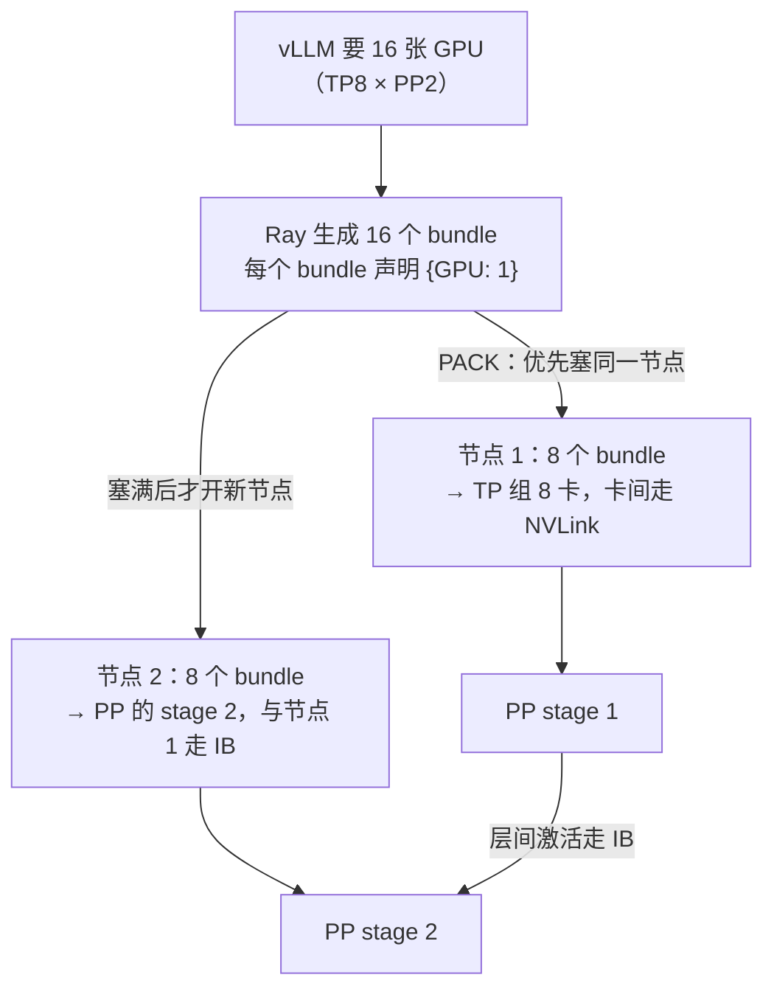

先给结论：**单机多卡的 vLLM 默认根本不用 Ray**——官方默认的分布式运行时是 Python 多进程（multiprocessing），Ray 只有在**跨节点**部署时才出场，而且它只负责“编排”（把进程放到哪台机器、哪张卡），不碰任何计算。为什么跨节点需要它？因为多进程模式假设所有进程在同一台机器上，跨机器时需要一个“调度中枢”来决定谁跑在哪——这就是 Ray。经验之谈：多节点部署 80% 的故障发生在通信层 NCCL（英伟达集合通信库，多卡通信的底层库；典型症状：卡在初始化、网卡不识别、超时），而不是模型层——这些坑大多可以通过两条环境变量和一行日志检查提前规避。本文解决“怎么把并行度落到两台以上的机器上”：Ray 基础概念、部署三步走、排错表、拓扑检查，以及“**单机装得下就别上 Ray**”的决策规则。

<!-- more -->

## 📑 目录

- [1. 为什么多节点需要 Ray](#1-为什么多节点需要-ray)
- [2. Ray 基础概念：60 秒版](#2-ray-基础概念60-秒版)
- [3. 部署流程：三步拉起集群](#3-部署流程三步拉起集群)
- [4. 常见问题排错表](#4-常见问题排错表)
- [5. 拓扑检查：动手之前先看路](#5-拓扑检查动手之前先看路)
- [6. 权衡：Ray 换取了什么，牺牲了什么](#6-权衡ray-换取了什么牺牲了什么)
- [总结](#-总结)
- [自我检验清单](#-自我检验清单)
- [参考资料](#-参考资料)

---

## 1. 为什么多节点需要 Ray

### 1.1 先钉死一个问题：单机多卡需要 Ray 吗？

**不需要。** vLLM 官方文档（Parallelism and Scaling 一节，2026 年快照）写得很明确：默认运行时是 **Ray（多节点）与原生 Python multiprocessing（单节点）**，`--distributed-executor-backend` 参数可以强制覆盖（`mp` 或 `ray`）。也就是说，你在一台 8 卡机器上跑 `--tensor-parallel-size 8`，vLLM 拉起 8 个 worker 进程各绑一张卡，进程间用 NCCL 通信——全程没有 Ray 的事，也不要求你装 Ray（Ray 是 optional dependency，需要时 `pip install "ray[cgraph]"`）。

那为什么还有这么多人把“vLLM 多卡”和“Ray”绑定在一起？因为**模型一旦大到单机装不下，vLLM 自己搞不定“把进程放到另一台机器上”这件事**。多进程模式假设所有进程在同一台机器的同一个文件系统里（进程只能在本机创建，跨不了机器）；跨机器时，谁来决定哪个进程跑在哪台机器、哪张卡上？这需要一个跨节点的“调度中枢”——Ray。

### 1.2 Ray 的角色：调度台，不是计算者

**设问：Ray 到底干什么、不干什么？** 打个比方：把模型部署比作搬家公司搬一套大件家具。单机多卡是你一个人在一间仓库里调配几台叉车（GPU），自己喊就行；跨节点相当于家具大到一间仓库放不下，要**两个仓库协同搬运**——这时候你需要一个调度台（Ray）：它登记每个仓库有几台叉车、派单决定“哪台叉车去哪个仓库、什么时候动”，但它**不负责开叉车**。开叉车（GPU 之间传数据）是 NCCL 干的，调度台管不到也不该管。

映射回术语：**Ray 是资源调度与进程编排层，NCCL 是数据通信层，CUDA kernel 是计算层**。vLLM 只把“我要 N 个 GPU 资源”的需求告诉 Ray，Ray 负责在集群里找到 N 张卡、把 vLLM 的 worker 进程拉起来、并让它们互相知道对方在哪（地址发现）。之后每一层 Transformer 的 AllReduce 走什么网卡、多快，Ray 一概不参与。

### 1.3 一个数字钉死边界：什么时候必须跨节点

**设问：什么情况下非跨节点不可？** 显存账本说了算（6.1 的口径）：70B FP16 权重 140GB，单机 8×A100 80GB 勉强装下但 KV 余量吃紧；**Llama-3.1-405B FP16 权重 810GB，8×80GB = 640GB 连权重都放不下**——官方文档的多节点示例正是拿 405B 演示：2 节点各 8 卡，`--tensor-parallel-size 8 --pipeline-parallel-size 2`。跨节点那一刻起，你就要和 Ray、NCCL 环境变量、IB 网卡打交道了。

---

## 2. Ray 基础概念：60 秒版

### 2.1 head 与 worker：调度台和工位

**设问：Ray 集群里有哪几种角色？** 只有两种：

- **head 节点**：调度中枢。`ray start --head --port 6379` 启动，负责资源登记、任务派发、元数据存储（GCS，Global Control Store，集群状态的存放处）。一个集群只有一个 head。
- **worker 节点**：干活的人。`ray start --address=<HEAD_IP>:6379 --block` 启动，加入集群后把自己的资源（CPU/GPU/内存）上报给 head。

验证集群状态的命令就三条：`ray status`（资源总览，能看到 2 节点、16 GPU 是否都上线）、`ray list nodes`（节点列表）、`ray resources`（单节点资源）。**动手前先跑 `ray status`，确认 GPU 数量对得上再启动 vLLM**——这是排错的第一步，后面第 4 节会看到大量“看起来像 NCCL 问题、其实是集群没起来”的案例。

### 2.2 Placement Group 与 bundle：vLLM 的并行度怎么落到机器上

Ray 用 **Placement Group（放置组）** 表达“我要一批资源，且这批资源要按某种拓扑摆放”。一个 PG 由若干 **bundle** 组成，每个 bundle 是一份资源声明，比如 `{"GPU": 1}` 表示“我要一张卡”。PG 的摆放策略决定 bundle 之间的亲疏：

- **PACK**：所有 bundle 尽量塞进同一台节点；
- **SPREAD**：所有 bundle 尽量摊开到不同节点。

vLLM 的做法（`ray_utils.py`，以你所用版本源码为准）：**给每个 GPU worker 进程申请一个 `{"GPU": 1}` 的 bundle**，默认策略是 PACK。于是：

- `--tensor-parallel-size 8`（单机）→ 8 个 bundle，PACK 到同一节点 → 8 张卡落在机内，NVLink 通信；
- `--tensor-parallel-size 8 --pipeline-parallel-size 2`（双机）→ 16 个 bundle，PACK 策略下 Ray 会优先填满第一个节点再填第二个 → 每个 PP 段恰好拿到 8 张机内卡；
- `--tensor-parallel-size 16`（跨 2 节点，官方文档给出的另一种写法）→ 16 个 bundle 分布在两台节点上，TP 组跨机，NCCL 走节点间网络（IB）。

💡 **提示**：PACK 是默认策略，vLLM 靠“每节点 8 卡、TP=8”的整数关系自然做到 TP 机内、PP 跨机。**官方推荐的多节点配置就是 TP = 每节点 GPU 数、PP = 节点数**——这个“推荐”不是文档拍脑袋，而是让 PACK 策略下的 bundle 恰好按节点对齐。下面这张图把“并行度 → bundle → 物理卡”的映射画出来：



这张图讲的是：**bundle 是 vLLM 向 Ray 表达的“资源愿望”，PACK 策略让同一个 TP 组的 bundle 落在同一节点内，PP 的段间通信自然落到节点间**。如果每节点卡数不均匀（比如一台 8 卡一台 4 卡），PACK 会把 12 个 bundle 里的 8 个塞进第一台，TP 组照样跨机——这种拓扑要你自己想清楚再配。

### 2.3 资源不满足时会发生什么

如果集群总卡数不够，Ray 的 PG 会一直 **pending**（排队等资源），vLLM 启动卡在“等待 placement group”；如果单节点卡数不够而你又要求 PACK，会出现经典警告：

```
WARNING ray_utils.py: Tensor parallel size (16) exceeds available GPUs (8).
This may result in Ray placement group allocation failures.
```

**看到这个警告先别查 NCCL，先数卡。** `ray status` 看 Total GPUs 是不是 ≥ 你要的 world size，`nvidia-smi` 看是不是有别的东西占了卡（第 4 节排错表第 4 行）。

---

## 3. 部署流程：三步拉起集群

以最常见的 2 节点 × 8 卡部署 405B（TP8 + PP2）为例，全程以 vLLM 官方 multi-node-serving 示例为蓝本（以你所用版本为准）。

### 3.1 第 0 步：环境一致性（最容易忽略）

官方文档明确要求：**每个节点提供完全一致的执行环境，包括模型路径和 Python 包**。推荐做法：

- 用同一个容器镜像（`vllm/vllm-openai`）或同一份 conda 环境 + 固定版本 `pip freeze`；
- **模型提前下载到每个节点的同一路径**（或共享文件系统），别让 worker 启动时现下——16 个进程同时下载 800GB 权重会互相踩缓存，慢到怀疑人生；
- 每个节点设置 `VLLM_HOST_IP=<本节点IP>`。⚠️ 这是多网卡机器的头号坑：节点上可能同时有管理网、业务网、IB 网多个 IP，Ray 和 NCCL 各自猜一个，猜错就“互相找不到”。`VLLM_HOST_IP` 就是告诉 vLLM“对外报这个地址”（环境变量官方文档：多节点推理时必须每节点设不同的值）。

### 3.2 第 1 步：起集群

head 节点（假设 IP 10.0.0.1）：

```bash
export VLLM_HOST_IP=10.0.0.1
# NCCL 网络变量要在集群创建时就带上，才能传播到所有 worker（vLLM 官方排错页建议）
ray start --head --port 6379 --block
```

worker 节点（10.0.0.2）：

```bash
export VLLM_HOST_IP=10.0.0.2
ray start --address=10.0.0.1:6379 --block
```

`--block` 让进程在前台挂着，关闭终端集群即散——生产环境请用 systemd/容器守护。两个节点都起来后，任取一个节点验证：

```bash
ray status
# 期望看到: 2 nodes, 16 GPUs, 每节点 8 GPU
```

### 3.3 第 2 步：一条命令起 vLLM

Ray 集群就绪后，**只需要在任意一个节点跑一条 vllm serve 命令**，全集群的资源对它可见：

```bash
vllm serve /models/Llama-3.1-405B-Instruct \
  --tensor-parallel-size 8 \
  --pipeline-parallel-size 2 \
  --distributed-executor-backend ray \
  --gpu-memory-utilization 0.9
```

或者另一种官方写法——TP 直接跨节点（需要节点间 IB 够快）：

```bash
vllm serve /models/Llama-3.1-405B-Instruct \
  --tensor-parallel-size 16 \
  --distributed-executor-backend ray
```

启动成功的标志是日志里出现每卡的 KV Cache 分配行（6.6 第 2 节会细读）：

```
INFO kv_cache_utils.py: GPU KV cache size: 643,232 tokens
INFO kv_cache_utils.py: Maximum concurrency for 40,960 tokens per request: 15.70x
```

💡 **提示**：不想用 Ray 的话，vLLM 也支持纯多进程跨节点：head 节点跑 `--nnodes 2 --node-rank 0 --master-addr <HEAD_IP>`，worker 节点跑 `--nnodes 2 --node-rank 1 --master-addr <HEAD_IP> --headless`（官方文档提供）。少一个组件少一类故障，但你要自己保证两边的环境一致和端口可达——**多进程模式适合“我就两台机器，不想装 Ray”的临时场景；要长期运维、要弹性扩缩，还是 Ray**。

### 3.4 第 3 步：验证 NCCL 真的走了 IB

多节点 TP 的性能命脉是节点间通信走 InfiniBand 而不是 TCP 回退。验证方法（官方文档）：用 `NCCL_DEBUG=TRACE` 启动一次，看 NCCL 日志里网络路径的字段：

- ✅ 看到 `[send] via NET/IB/GDRDMA` → 走了 IB 且启用 GPUDirect RDMA，高效；
- ❌ 看到 `[send] via NET/Socket` → 走了 TCP 回退，跨节点 TP 会慢一个数量级，回头查网卡识别。

常用 NCCL 环境变量（以你所用 NCCL 版本为准）：

| 变量 | 作用 | 典型值 |
|---|---|---|
| `NCCL_SOCKET_IFNAME` | 指定 TCP socket 走哪块网卡 | `eth0`（管理网） |
| `NCCL_IB_HCA` | 指定哪块 IB 设备参与通信 | `mlx5`（vLLM 文档示例） |
| `NCCL_DEBUG` | 日志级别，排错神器 | `INFO` / `TRACE` |
| `GLOO_SOCKET_IFNAME` | torch 分布式组发现的网卡（IB 集群上防初始化挂起，vLLM EP 文档明确建议） | `eth0` |

⚠️ **注意**：**环境变量要在 `ray start` 之前就 export（或写进 run_cluster.sh 的 `-e` 参数），而不是在 vllm serve 前设置**。vLLM 官方排错页专门强调过（Issue #6803）：集群创建时设置会传播到所有节点；shell 里单独设置只影响本机——你在一台机器上配好了，另一台没配，表现就是“一半 worker 连不上”。

---

## 4. 常见问题排错表

多节点部署的故障呈现“症状在 NCCL、病灶在别处”的特征。下面每一条都按 **症状 → 诊断命令 → 修复** 组织，全部来自 vLLM 官方排错文档与社区高频案例（Issue 编号见参考资料）：

| 症状 | 诊断命令 | 大概率病因与修复 |
|---|---|---|
| 启动卡在 “waiting for NCCL” / 初始化挂起不动 | `ray status`（集群是否完整）、`NCCL_DEBUG=INFO` 重启 | ① 节点没齐：worker 没起来或 `--block` 掉了 → 补齐节点；② IB 集群上 torch 组发现走了 IB → `export GLOO_SOCKET_IFNAME=eth0`；③ 防火墙/网段不通 → `nc -vz <对端IP> 6379` 与 NCCL 端口 |
| NCCL 报错但看日志走了 Socket 回退 | `NCCL_DEBUG=TRACE vllm serve ...` 搜 `NET/Socket` | IB 未识别：`ibstat` / `ibv_devinfo` 看设备，`NCCL_IB_HCA=mlx5` 指定；容器内要 `--privileged` 或加 `IPC_LOCK`（GPUDirect RDMA 需要） |
| `No available node types can fulfill resource request` | `ray status` 看节点与 GPU 数；`ray list nodes` 看 IP | 节点有多个 IP，vLLM 和 Ray 选了不同的地址 → 每节点设不同的 `VLLM_HOST_IP` 后**重建集群**（vLLM Issue #7815 的标准解法） |
| PG 一直 pending / `Tensor parallel size (16) exceeds available GPUs (8)` 警告 | `ray status` 数 GPU；`nvidia-smi` 数卡 | ① TP 参数超过单节点卡数且没有多节点；② 卡被别的进程占着 → `nvidia-smi --query-compute-apps=pid,used_memory --format=csv` 查占用者，`fuser -v /dev/nvidia*` 找进程，必要时 `CUDA_VISIBLE_DEVICES` 隔离 |
| 跨节点超时（engine iteration timeout / 心跳断） | `ray status` 看 Alive 状态；`dmesg` 看 GPU 错误 | ① 网络抖动或 IB 驱动问题 → `ulimit -l unlimited`（vLLM EP 文档明确要求，`cannot register cq buf` 就是这个）；② 节点漂移 → 检查 `--block` 终端是否关闭；③ vLLM 侧超时默认值可调：`VLLM_ENGINE_ITERATION_TIMEOUT_S`（默认 60，环境变量文档） |
| 只有部分 GPU 被使用 | `ray status` 各节点 GPU 数、`nvidia-smi` 各卡利用率 | 每节点卡数不匀 + PACK 策略导致 PG 部分满足 → 按“TP=每节点卡数”重排并行度，或换 `ray symmetric-run` 这类每节点等量启动的方式 |

📌 **关键点**：排错顺序永远是 **集群（ray status）→ 资源（PG/GPU 占用）→ 网络（NCCL_DEBUG）→ 模型**。90% 的多节点故障在前两步就能定位，别一上来就怀疑模型参数。

---

## 5. 拓扑检查：动手之前先看路

### 5.1 `nvidia-smi topo -m` 怎么读

部署之前（以及部署之后怀疑通信慢时），先看一张图——每张卡的互联拓扑：

```bash
nvidia-smi topo -m
```

输出是一个 GPU×GPU 矩阵，关键标记（学习路线第零层的检验标准）：

- **NV12 / NV18**：NVLink 直连，数字是链路数（A100 典型 NV12、H100 典型 NV18，以你机器实际输出为准）。NVLink 带宽：A100 约 600GB/s、H100 约 900GB/s（每卡双向聚合，NVIDIA 官方规格）；
- **SYS**：系统总线路径（要绕 CPU/PCIe），跨节点通信的典型标记；
- **NODE**：跨 NUMA 节点（NUMA：Non-Uniform Memory Access，非统一内存访问——CPU 访问不同位置的内存速度不一样），带宽比同 NODE 差一截；
- **PIX / PHB**：PCIe 直连或经 PCIe 桥（PCIe：GPU 插在主板上走的外设总线），比 NVLink 慢一个数量级。

### 5.2 为什么这张图决定 TP 能不能跨机

回顾 6.2 的通信账本（公式出处见模块三第 6 章）：每个 Transformer 层前向有 **2 次 AllReduce**（Attention 输出 + FFN 输出），每次传输 $2bsh$ 字节（$b$ 批大小、$s$ 序列长度、$h$ 隐藏维度，FP16 每元素 2 字节）：

$$
\underbrace{2}_{\text{每层 AllReduce 次数}} \times \underbrace{2bsh}_{\text{每次 AllReduce 传输字节数}} = 4bsh \text{ 字节/层}
$$

代入 70B（$h = 8192$）的 Prefill（$b=1, s=4096$）：每层 $4 \times 1 \times 4096 \times 8192 = 134$ MB，80 层全模型约 **10.7GB**。这个量在两种链路上的理论耗时：

$$
\underbrace{\frac{10.7\text{ GB}}{900\text{ GB/s}}}_{\text{NVLink 机内}} \approx 12\text{ ms} \qquad \underbrace{\frac{10.7\text{ GB}}{50\text{ GB/s}}}_{\text{IB 机间(400Gbps)}} \approx 214\text{ ms}
$$

（按理论带宽推算的估算值，需在你目标硬件上实测验证；模块三 2.1 的原话是“同样一个 AllReduce，放机内还是跨机，耗时可能差十倍”。）

💡 **提示**：8 卡整机通常还有 NVSwitch 全互联（任意两卡直连，topo 里表现为满 NVLink），此时 TP8 的任意 rank 对之间都是最高速路径。反过来，如果 SYS 标记出现在 TP 组内部，说明你的 TP 组被跨节点/NUMA 拆开了，通信要绕系统总线。**配置没问题但性能不对时，先看 topo 是不是 SYS 混进了 TP 组**。

**结论：TP 的通信量按 token 数线性放大，跨节点就要全部穿过 IB——所以 TP 默认锁死在 NVLink 机内，跨节点交给 PP（每 stage 只传一次激活）或 EP（只有路由的 token 过网）**。`nvidia-smi topo -m` 里看到 SYS 出现在 TP 组内部，你的 TP 配置就值得重新考虑了。

---

## 6. 权衡：Ray 换取了什么，牺牲了什么

### 6.1 换取的东西

- **跨节点资源统一视图**：一个命令看到、调度全集群的 GPU，不用自己写“第几台机器跑第几个 rank”的脚本（对比 3.3 节的多进程模式，你要手动 `--node-rank`）；
- **弹性与失败处理**：节点掉线可检测、可重调度，配合 KubeRay/Ray Serve LLM 还能扩缩容；
- **生态**：Ray 自己的离线批处理（`ray.data`）和在线服务（Ray Serve）能直接嵌 vLLM。

### 6.2 牺牲的东西

- **运维复杂度 +1 个组件**：多一个 GCS、多一组端口（6379 等）、多一类“集群没起来”的故障——排错表第 4 节一半的条目都是 Ray 引入的；
- **调度开销**：每个请求/每个 worker 的资源申请都要过 Ray 的调度器，进程拉起比本地 fork 慢（毫秒级起步，对常驻服务影响不大，但对“快速启停实验”有体感）；
- **网络假设**：跨节点必须依赖 IB/RoCE 质量（RoCE：RDMA over Converged Ethernet，在以太网上跑 RDMA 的传输方案；RDMA 即网卡直读远端内存、绕过 CPU 的技术），TCP 回退时性能断崖（3.4 节的验证方法就是为它准备的）。

### 6.3 决策规则

- ✅ **单机装得下**（8 卡以内）→ **别上 Ray**，默认 multiprocessing 就够，少一个组件少一类故障。
- ✅ **必须跨节点** → 上 Ray（或 3.3 的多进程模式），先验 `ray status` 再启动 vLLM。
- ✅ **公司已有统一 Ray 集群 / KubeRay** → 直接用，别自己再造轮子。
- ❌ **没有 IB（或不确定走没走 IB）就做跨节点 TP** → 先修网络，`NCCL_DEBUG=TRACE` 确认 GDRDMA 再谈性能。
- ❌ **为了“显得高级”给单机部署套 Ray** → 白白多付调度与运维成本，没有任何收益。

---

## 📝 总结

1. **角色分工**：vLLM 单机多卡默认走 multiprocessing，Ray 只在跨节点时出场，且只做资源调度与进程编排——计算归 GPU、通信归 NCCL。
2. **并行度映射**：vLLM 为每个 worker 申请一个 `{"GPU": 1}` bundle，PACK 策略 + “TP=每节点卡数、PP=节点数”的配置让 TP 天然锁在 NVLink 机内、PP 跨节点。
3. **部署三步**：环境一致（同容器/同模型路径/`VLLM_HOST_IP`）→ `ray start --head` + `ray start --address` → 一条 `vllm serve` + `NCCL_DEBUG=TRACE` 验证 GDRDMA。
4. **排错顺序**：集群（`ray status`）→ 资源（PG/GPU 占用）→ 网络（NCCL 环境变量）→ 模型；环境变量必须在 `ray start` 前设置才能传播到所有节点。
5. **拓扑决定命运**：TP 每层通信量 $4bsh$ 字节、按 token 线性放大，70B Prefill 全模型约 10.7GB——机内 NVLink 12ms、跨机 IB 214ms（理论估算），这就是“TP 不跨机”的物理根源。
6. **决策一句话**：单机装得下就别上 Ray；跨节点才上，且先确认 IB 可用。

## 🎯 自我检验清单

- 能解释为什么单机多卡的 vLLM 默认不需要 Ray（默认 runtime 是 multiprocessing）
- 能说清 Ray 在 vLLM 多节点部署中的职责边界（编排与资源调度，不参与计算与 NCCL 通信）
- 能画出 2 节点 × 8 卡、TP8+PP2 时 Placement Group 的 bundle 分布（每节点 8 个 `{"GPU": 1}` bundle）
- 能在 30 分钟内从零拉起 2 节点 Ray 集群并用 `ray status` 验证 16 GPU 全部上线
- 能解释 `VLLM_HOST_IP` 解决什么问题（多网卡节点地址选择），以及为什么每个节点要设不同值
- 能用 `NCCL_DEBUG=TRACE` 判断跨节点通信走的是 IB/GDRDMA 还是 TCP Socket 回退
- 能背出至少 3 条排错命令及其适用症状（ray status / NCCL_DEBUG / nvidia-smi 占用查询）
- 能读懂 `nvidia-smi topo -m` 的 NV12/NV18/SYS/NODE 标记，并判断 TP 组是否跨了节点
- 能手动估算 70B Prefill（$h=8192$、4096 token）的 TP 通信总量（约 10.7GB）及 NVLink/IB 理论耗时
- 能根据“单机装得下/必须跨节点/已有 Ray 集群”三种情况给出是否上 Ray 的决策，并说明代价
- 能说出“环境变量必须在 ray start 前设置”的原因（集群创建时传播到所有节点，shell 设置只影响本机）

## 📚 参考资料

**官方文档**

- [vLLM - Parallelism and Scaling（默认 runtime、TP/PP 配置建议、多节点示例）](https://docs.vllm.ai/en/stable/serving/parallelism_scaling/)
- [vLLM - Multi-Node Serving 示例（ray start --head / --address 脚本）](https://docs.vllm.ai/en/latest/examples/ray_serving/multi-node-serving/)
- [vLLM - Troubleshooting distributed deployments（NCCL_SOCKET_IFNAME、VLLM_HOST_IP、Issue #6803/#7815）](https://docs.vllm.ai/en/latest/serving/distributed_troubleshooting/)
- [vLLM - Environment Variables（VLLM_HOST_IP、VLLM_ENGINE_ITERATION_TIMEOUT_S 等）](https://docs.vllm.ai/en/stable/configuration/env_vars)
- [Ray - Placement Group 文档（bundle 与 PACK/SPREAD 策略）](https://docs.ray.io/en/latest/ray-core/ray-core-concepts.html)

**博客与社区**

- [vLLM Blog: Streamlined multi-node serving with Ray symmetric-run](https://vllm.ai/blog/ray-symmetric-run)：多节点启动的简化新姿势
- [vLLM Issue #31005: Tensor parallel size exceeds available GPUs 警告](https://github.com/vllm-project/vllm/issues/31005)
- [vLLM Issue #7815: 多 IP 节点上的资源请求失败与 VLLM_HOST_IP 修复](https://github.com/vllm-project/vllm/issues/7815)
- [vLLM Issue #6803: 多节点服务中的环境变量设置](https://github.com/vllm-project/vllm/issues/6803)

**站内**

- [第 6 章 分布式推理（章首页）](/AIInfraGuide/inference/模块四-推理优化/第6章-分布式推理/第6章-分布式推理)
- [6.2 张量并行推理（TP 通信量公式出处）](/AIInfraGuide/inference/模块四-推理优化/第6章-分布式推理/62-张量并行推理)
- [6.3 流水线并行推理（PP 跨节点的激活传输）](/AIInfraGuide/inference/模块四-推理优化/第6章-分布式推理/63-流水线并行推理)
- [6.6 vLLM 分布式部署实战（本文的实战收拢）](/AIInfraGuide/inference/模块四-推理优化/第6章-分布式推理/66-vllm分布式部署实战)
- [模块三 2.1 集合通信原语详解（NVLink/IB 带宽与 AllReduce 通信量公式）](/AIInfraGuide/distributed/模块三-分布式训练/21-集合通信原语详解)
- [模块三 第 6 章 张量并行与序列并行（每层 2 次 AllReduce 的切分图）](/AIInfraGuide/distributed/模块三-分布式训练/第6章-张量并行与序列并行)
- [AI Infra 学习路线（第零层：nvidia-smi topo -m 检验标准）](/AIInfraGuide/guides/ai-infra学习路线)
