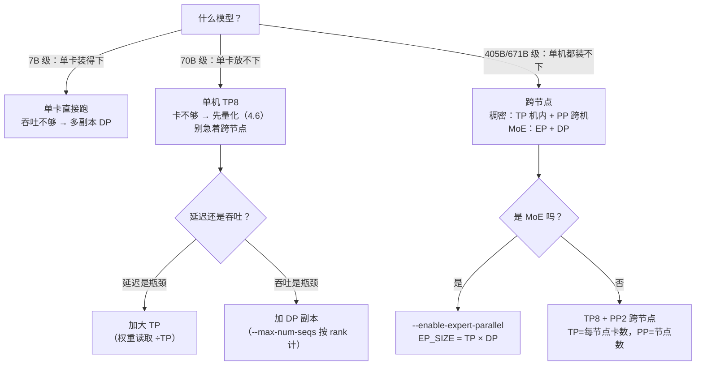

这一节把 6.1~6.5 的零件装成三台能开走的机器。先给结论：**TP 减延迟、DP 加吞吐、PP 只负责“装得下”**——三个并行度各治一种病，别拿错药。以 70B 模型为例：FP16 权重 140GB，单机 8 卡 `--tensor-parallel-size 8` 后每卡只背 17.5GB，decode（逐 token 生成）阶段每生成一个 token 要读的权重也变成 1/8，单请求延迟随之下降（按带宽估算的数字在第 1 节）。而“吞吐不够”是另一种病，要用数据并行复制引擎来治。本文给出三个场景的完整命令、显存账本的验证方法（启动日志 + nvidia-smi 实测）、一套“TP 减延迟、DP 加吞吐”的对照压测设计，最后落一张 7B/70B/671B 的决策表。

<!-- more -->

## 📑 目录

- [1. 三个场景的完整命令](#1-三个场景的完整命令)
- [2. 显存验证：日志、账本与实测](#2-显存验证日志账本与实测)
- [3. 压测验证："TP 减延迟、DP 加吞吐"](#3-压测验证tp-减延迟dp-加吞吐)
- [4. 排错速查](#4-排错速查)
- [5. 决策规则汇总](#5-决策规则汇总)
- [总结](#-总结)
- [自我检验清单](#-自我检验清单)
- [参考资料](#-参考资料)

---

## 1. 三个场景的完整命令

### 1.1 场景 A：单机 8 卡装 70B

**设问：70B 模型在单机上怎么摆？** 需求：70B 模型，手上有 1 台 8×A100/H100 80GB。两个候选：

- **方案 A1：FP16 + TP8**。权重 140GB ÷ 8 = 每卡 17.5GB，余下 ~62GB 全给 KV Cache 和激活，精度无损，单请求延迟最低（Decode 权重读取量每卡 17.5GB）。按带宽估算（思想实验，数字待你实测）：A100 约 2TB/s，INT4 单卡方案每 token 要读 35GB → 约 17.5ms；TP8 每卡只读 17.5GB → 约 8.75ms，延迟约减半；
- **方案 A2：INT4 单卡**（4.6 的账本：35GB 单卡放得下）。省 7 张卡，但单卡 Decode 每 token 要读 35GB 权重，且 4-bit 有精度损失。

```bash
# 方案 A1：TP8 + FP16（延迟与精度优先，8 卡全用）
vllm serve <your-70b-model> \
  --tensor-parallel-size 8 \
  --max-model-len 8192 \
  --gpu-memory-utilization 0.9

# 方案 A2：INT4 单卡（省卡优先，4.6 的 AWQ 参数）
vllm serve <your-70b-awq> \
  --quantization awq \
  --max-model-len 8192 \
  --gpu-memory-utilization 0.92
```

📌 **关键点**：两个方案的正确选法不是“谁能跑”，而是**瓶颈在哪**。并发低、延迟敏感 → A1（TP8 每卡只读 17.5GB 权重）；卡紧张、吞吐为主 → A2 单卡 + 多副本；**A2 单卡跑 70B 并不等于 A1 的“穷人版”，而是“省卡版”**——它牺牲了单请求延迟换卡数。

### 1.2 场景 B：双机 16 卡跨节点 TP

**设问：单机装不下时，跨节点怎么配置？** 需求：模型大到单机 8×80GB 装不下（如 405B FP16 权重 810GB），或你只有 2 台 8 卡机想合力跑一个 70B/更大的模型。

**第 1 步**：按 6.5 的三步拉起 2 节点 Ray 集群（`ray start --head` / `ray start --address`，`ray status` 确认 16 GPU 上线），然后任选一种并行度：

```bash
# 方案 B1（官方推荐）：TP=每节点卡数，PP=节点数 —— TP 锁机内 NVLink，只有 PP 的激活过 IB
vllm serve /models/your-model \
  --tensor-parallel-size 8 \
  --pipeline-parallel-size 2 \
  --distributed-executor-backend ray

# 方案 B2：TP 直接跨节点（16 卡一个 TP 组，官方文档同样给出示例）
vllm serve /models/your-model \
  --tensor-parallel-size 16 \
  --distributed-executor-backend ray
```

**`--tensor-parallel-size` 必须整除节点卡数吗？** 查证结论（vLLM 官方文档，2026 年快照）：**没有这条硬约束**——官方明确给出 `--tensor-parallel-size 16` 跨 2 节点的示例，NCCL 会走节点间网络。真正必须满足的是两条：

1. **模型结构可整除**：注意力头数必须能被 TP 整除（经典报错 `ValueError: Total number of attention heads (52) must be divisible by tensor parallel size (3)`），GQA 的 KV 头同理（6.2 讲过）；
2. **节点间网络够快**：TP16 每个 token 每层都要跨机 AllReduce（6.5 算过 70B Prefill 全模型约 10.7GB 通信量），没有 IB 就别选 B2。

⚠️ **注意**：B1 和 B2 的性能差一个数量级是有物理原因的——**B1 里只有 PP 的激活传输跨机（每层一次），B2 里每层 2 次 AllReduce 全跨机**。所以“TP=每节点卡数、PP=节点数”是官方推荐，不是风格偏好。

**不想用 Ray**：多进程模式，head 机与 worker 机各一条命令（6.5 第 3.3 节，`--nnodes 2 --node-rank 0/1 --master-addr`）。

### 1.3 场景 C：多副本高吞吐（DP 形态）

**设问：吞吐不够时，多副本怎么开？** 需求：单机/单副本吞吐不够，要横向扩容——**这是数据并行的主场**（6.4 讲过：DP 复制引擎、请求级负载均衡，不减少单请求延迟）。

**稠密模型**（7B/70B 这类非 MoE）：官方文档说得直白——外部负载均衡部署“可以平凡地做到”：**直接开 N 个独立 `vllm serve` 实例，各占几张卡，前面挂一个负载均衡器**。不需要任何 `--data-parallel-*` 参数，每个实例完全独立，这是最简单的多副本形态：

```bash
# 节点 A（8 卡分 4 个副本，每个 TP2）
CUDA_VISIBLE_DEVICES=0,1 vllm serve <model> --tensor-parallel-size 2 --port 8001 &
CUDA_VISIBLE_DEVICES=2,3 vllm serve <model> --tensor-parallel-size 2 --port 8002 &
# ... 节点 B 同理，上游 nginx/网关轮询 8001~8008
```

**MoE 模型**（DeepSeek-V3/R1 这类，MLA + MoE）：官方建议 attention 层走 DP、expert 层走 EP/TP（6.4 讲过为什么：MLA 的潜在投影在 TP 下会重复、浪费显存）。用一个命令就能起多副本：

```bash
# 8 卡：TP1 × DP8，--enable-expert-parallel 后 EP 组 = TP×DP = 8
# （vLLM 官方 EP 文档的 DeepSeek-V3-0324 示例，8×H200/H20 单节点）
vllm serve deepseek-ai/DeepSeek-V3-0324 \
  --tensor-parallel-size 1 \
  --data-parallel-size 8 \
  --enable-expert-parallel

# 组合形态：DP4 × TP2 = 8 卡（attention 在每组 2 卡内 TP，expert 层 EP=8）
vllm serve <model> \
  --data-parallel-size 4 \
  --tensor-parallel-size 2 \
  --enable-expert-parallel
```

注意两个 DP 专属参数：**`--max-num-seqs` 按每个 DP rank 计**（DP8 时想全局 256 并发，每个 rank 只配 32）；大 DP 规模下 API server 可能成为瓶颈，用 **`--api-server-count`** 横向扩（官方 EP 文档建议等于本地 rank 数）。

💡 **提示**：MoE 的 DP 和稠密模型的“开 N 个实例”有个本质区别——**DP rank 之间不是完全独立的**：MoE 的 expert 层需要跨 rank 同步（哪怕某个 rank 没有请求，也要跑空 forward 来对齐），由 DP Coordinator 协调。所以 MoE 多副本必须走 `--data-parallel-size` 体系，不能像稠密模型那样随便开实例。

### 1.4 V1 参数语义速查表

**设问：三个 size 参数分别是什么意思？** vLLM 进入 V1 引擎后（v0.11.0 起 V0 代码完全移除，RFC #18571 确认），三个 size 参数的语义值得钉死：

| 📊 参数 | 语义 | 默认 | V1 注意事项 |
|---|---|---|---|
| `--tensor-parallel-size` | 单个模型副本内的 TP 组大小 | 1 | 必须能整除注意力头数；跨节点可行但需 IB |
| `--pipeline-parallel-size` | 按层切分的段数 | 1 | **定位是“装得下”（capacity/memory fallback，官方 Issue #41685），不增吞吐、不降单请求延迟**；支持不均匀层划分（`VLLM_PP_LAYER_PARTITION`） |
| `--data-parallel-size` | DP rank 数（每个 rank 一份完整模型/一个 core engine 进程） | 自动 = 总卡数 ÷ (TP×PP) | `--max-num-seqs` 按 rank 计；MoE 需要 DP Coordinator 同步 |
| `--enable-expert-parallel` | MoE 的 expert 层改用 EP | 关闭（默认 expert 层用 TP 组，大小 = TP×DP） | 开启后 **EP_SIZE = TP_SIZE × DP_SIZE**；attention 层 TP=1 时各 rank 复制、TP>1 时组内分片 |

📌 **关键点**：V1 里 **EP 不会自动启用**——不传 `--enable-expert-parallel` 时，MoE 的 expert 层默认走张量并行（组大小 TP×DP）。传了之后 expert 层才变成“专家分片 + All-to-All 路由”。参数与默认值随版本演进，一切以你所用版本的 `vllm serve --help` 为准。

---

## 2. 显存验证：日志、账本与实测

### 2.1 启动日志怎么读

**设问：启动成功后，哪两行日志最关键？** TP 启动成功后，日志里两行是关键（官方文档给出的格式）：

```
INFO kv_cache_utils.py: GPU KV cache size: 643,232 tokens
INFO kv_cache_utils.py: Maximum concurrency for 40,960 tokens per request: 15.70x
```

- 第一行：**全集群**的 KV Cache 容量（token 数）。除以 world size 就是每卡容量——TP8 时每卡 ≈ 80,404 tokens；
- 第二行：按 `--max-model-len`（此例 40960）估算的最大并发请求数。**这两个数字低于你的吞吐需求时，就该加卡或降量化**（官方文档原话）。

### 2.2 账本公式：每卡 KV = 总量 ÷ TP

6.2 讲过 KV 在 TP 下按注意力头切分——打个比方：TP 的每个 worker 负责模型的一部分注意力头，**就像图书馆分馆：总馆的藏书按主题分到几个分馆，每个分馆只存自己那几类，查书的人按主题去对应分馆**。所以每卡 KV = 模型 KV 总量 ÷ TP：

$$
\underbrace{2}_{\text{K 和 V}} \times \underbrace{L}_{\text{层数}} \times \underbrace{h_{kv}}_{\text{KV 头数}} \times \underbrace{d}_{\text{每头维度}} \times \underbrace{2\text{B}}_{\text{FP16}} \times \underbrace{\frac{1}{TP}}_{\text{TP 切分}}
$$

代入两个经典账本（与学习路线 3.1、1.1 的算法一致）：

- **7B**（32 层、32 头、d=128）：每 token 512KB；4096 上下文 × batch 16 = 32GB 总量 → **TP8 每卡 4GB**；
- **70B**（80 层、GQA 8 个 KV 头、d=128）：每 token 320KB；4096 × 16 = 20GB 总量 → **TP8 每卡 2.5GB**。

权重账本再叠上来：70B FP16 TP8 每卡权重 17.5GB + KV 2.5GB + 激活/碎片余量，80GB 卡轻松跑 8K 上下文大并发——**这就是 TP 的核心价值：把“单卡放不下”变成“每卡只背 1/TP”**。

### 2.3 实测对比：账本 vs nvidia-smi

启动后逐卡验证，账本和实测对不上就说明有问题：

```bash
nvidia-smi --query-gpu=index,memory.used,memory.total --format=csv
```

| 📊 项目 | 理论账本（7B TP8） | 实测（nvidia-smi） | 说明 |
|---|---|---|---|
| 权重 | 14GB ÷ 8 ≈ 1.75GB/卡 | 待核实 | 含 CUDA context 与 kernel 缓存，实测会比理论高 1~3GB |
| KV Cache（4096×16） | 32GB ÷ 8 = 4GB/卡 | 待核实 | 日志 `GPU KV cache size` 除以 8 应与之一致 |
| 每卡总量 | 约 10~12GB | 待核实 | 与 `--gpu-memory-utilization 0.9` 预留的上限核对 |

💡 **提示**：`--gpu-memory-utilization` 控制的是 vLLM 为权重 + KV 预留的显存上限（0.9 = 用满 90%），不是 KV 的实际用量。**KV 是按需增长的**：并发和上下文长度上去才占满。所以“显存不够”分两种病：启动即 OOM（权重都放不下 → 加 TP 或量化）和跑着跑着 KV 分配失败（→ 降 `--max-model-len`、降并发、或升 `--gpu-memory-utilization`）。

---

## 3. 压测验证：“TP 减延迟、DP 加吞吐”

### 3.1 协议设计（承接 4.6 / 5.5 的方法论）

**设问：压测怎么设计才公平？** 变量全部固定，只切换并行配置：

- 同一模型、同一台机器、同样的 `--gpu-memory-utilization`；
- 同一批 prompt（100~200 条，固定 `max_tokens`、`temperature=0`）；
- **并发档位 1 / 8 / 32 三档**——低并发看延迟（TP 的收益），高并发看吞吐（DP 的收益）；
- 记录六件套：TTFT P50/P95、TPOT P50/P95、throughput（token/s）、显存峰值（4.6 的协议，第 9 章的门禁口径）。

用 GenAI-Perf（英伟达的压测工具）打 OpenAI 兼容端点（命令模板见 4.6，参数以 `genai-perf profile --help` 为准）。

### 3.2 单卡 vs TP8：结果表结构

**设问：结果表长什么样、该往哪个方向看？** 数字必须你自己跑（下表为**结构模板，数值待核实**）：

| 📊 指标 | 单卡（7B） | TP8（7B） | 预期方向 | 机制 |
|---|---|---|---|---|
| TTFT P50（ms） | / | / | TP8 更低（Prefill 算力 8×，但通信有开销） | 矩阵乘并行 |
| TPOT P50（ms） | / | / | **TP8 明显更低** | Decode 是 memory bound，每卡权重读取量 = 总量 ÷ TP（14GB→1.75GB） |
| Throughput（token/s） | / | / | **TP8 通常超线性** | KV 容量变大 → 可并发数暴涨（官方博客实测：TP1→TP2 KV blocks +13.9x、吞吐 +3.9x，远超线性 2x） |
| 显存峰值（GB） | / | / | 每卡显著下降 | 权重/KV 各 1/TP |

📌 **关键点**：TP 的延迟收益来自**每个 token 的权重读取量除以 TP**（Decode 阶段 GPU 主要在做“把权重搬出来”这件事），而不是算力叠加。这就是为什么 TP8 的 TPOT 理论上限是 8 倍，但按 6.2 的带宽估算实际约 5x 量级（受通信和 kernel 效率限制，到不了 8x）。而 TTFT 的提升没那么夸张。**别拿单卡数字除以卡数当 KPI，跑出来为准。**

### 3.3 “TP 减延迟、DP 加吞吐”的验证设计

**设问：怎么用一次实验同时证明这两句话？** 关键在**控制资源总量相同**：

- **实验 1（减延迟）**：单卡 vs TP8 部署同一个 7B，并发 1~4，比 TPOT P50——如果 TP8 的 TPOT 没有显著下降，先查 6.5 的 NCCL 路径（是不是走了 Socket 回退）；
- **实验 2（加吞吐）**：DP8（8 个单卡副本 + 负载均衡）vs TP8（1 个 8 卡副本），并发 32~128，比吞吐——DP 的吞吐应该碾压 TP（8 个独立引擎，无层间通信），但单请求 TPOT 不变；**TP 的吞吐优势只在“单副本 KV 容量扩大带来更高批内并发”时体现**（小模型、短上下文时这个优势很小，DP 完胜）；
- **实验 3（组合）**：4 副本 × TP2 vs 2 副本 × TP4，同样的 8 卡，找你们负载的最优解——**没有普适答案，只有你的负载的答案**。

排障规则：**延迟不够 → 加大 TP；吞吐不够 → 加副本（DP）；两个都不够 → TP 与 DP 组合**。别用 TP 治吞吐的病，也别用 DP 治延迟的病。

---

## 4. 排错速查

| 症状 | 诊断 | 修复 |
|---|---|---|
| 启动即 OOM | 日志报 `CUDA out of memory` 在权重加载阶段 | 降 `--gpu-memory-utilization`；或**加大 `--tensor-parallel-size`**（每卡权重 = 总量 ÷ TP）；或量化（4.6 的 INT4 35GB） |
| KV Cache 分配失败 | `No available memory for the cache blocks` / `Failed to allocate KV cache` 类报错 | 降 `--max-model-len`、限并发（`--max-num-seqs`）、或升 util（权重余量确实够时）；长上下文场景考虑 KV 量化（4.4） |
| 多卡卡在 NCCL 初始化/超时 | `NCCL_DEBUG=INFO` 看卡在哪个 rank | 按 6.5 排错表：先 `ray status` 验集群，再验 GDRDMA 路径；多节点时检查 `VLLM_HOST_IP` 与防火墙 |
| 模型加载特别慢 | 日志停在 `Loading safetensors`（safetensors 是模型权重文件的存储格式） | 多节点没预下载：每节点同路径放好权重或用共享文件系统（官方文档明确建议）；`HF_HOME` 指到共享盘避免每进程各下一份 |
| TPOT 异常高（多卡比单卡还慢） | 对比实验 1 的结果 | ① NCCL 走了 Socket 回退（6.5 第 3.4 节验证）；② TP 跨了节点且无 IB；③ 模型头数不能被 TP 整除导致复制而非切分 |
| 并发一高就 preemption 频繁 | 日志大量抢占、P95 恶化 | KV 余量不足：降 `--max-model-len` 或减并发，或按 6.4 上 DP 副本分摊 |

⚠️ **注意**：多卡场景“看起来慢”要先排除网络，再怀疑引擎——vLLM 自身在单机多卡上的 kernel 效率问题远比网络配置问题罕见。**排查顺序：网络 → 资源 → 配置 → 引擎**。

---

## 5. 决策规则汇总

### 5.1 决策表：模型 × 硬件 → 方案

**设问：模型 × 硬件，怎么快速定方案？** 一张表收拢：

| 📊 模型 | 单卡 80GB | 单机 8×80GB | 多机（每节点 8 卡） |
|---|---|---|---|
| 7B（FP16 14GB） | ✅ 单卡直接跑，别折腾 | 不需要（吞吐不够 → 多副本 DP） | 不需要 |
| 70B（FP16 140GB） | ❌ 放不下；INT4 35GB 单卡可跑但 KV 吃紧 | ✅ **TP8**（每卡 17.5GB + 大 KV 余量） | 一般不需要（量化后单机够）；非要双机 → TP8+PP2 或 TP16 |
| 671B MoE（DeepSeek-V3，FP8 ~671GB） | ❌ | ✅ 8×H200（141GB/卡）单机 EP8（TP1+DP8，官方 recipes）；H100 则需多机 | ✅ 生产级：EP+DP（vLLM wide-EP 实测 2.2k tok/s/H200，2025-12 官方博客）；DeepSeek 官方 prefill 最小 4 节点 EP32、decode 40 节点 EP320 |

📌 **关键点**：表里最反直觉的一格是“70B 双机”——**70B 几乎永远不需要跨节点**：FP16 单机 TP8 装得下，装不下就量化（4.6 的 W8A8 两卡 / INT4 单卡）。跨节点是 405B/671B 这个量级的领地，而 671B 走的是 EP 而不是纯 TP。**“跨节点”和“并行”是两回事：并行是手段，装得下 + 延迟 + 吞吐三个目标分别对症下药。**

把这张表画成流程图，就是第 6 章反复强调的三步决策：



这张图讲的是：**先问装不装得下，再问延迟还是吞吐，最后才问要不要跨节点**——三步顺序就是选型的全部逻辑。

### 5.2 决策规则

**设问：三句话能说清选型吗？** 能：

- ✅ **单卡装得下**（7B 级）→ 单卡；要吞吐 → 多副本 DP（稠密模型直接开多个实例 + 负载均衡）。
- ✅ **单机装得下但单卡不行**（70B 级）→ 单机 TP8；卡不够就量化，**别急着跨节点**。
- ✅ **单机都装不下**（405B/671B 级）→ 跨节点：稠密用 TP（机内）+ PP（机间）；MoE 用 EP + DP（`--enable-expert-parallel`，EP_SIZE = TP×DP）。
- ✅ **延迟是瓶颈** → 加大 TP（Decode 权重读取量 ÷TP）；**吞吐是瓶颈** → 加 DP 副本；**并发高** → 记得 `--max-num-seqs` 按 DP rank 计。
- ❌ **别用 PP 治吞吐**——官方定位是“装得下”的兜底（capacity fallback），它不减少单请求延迟，也不线性加吞吐。
- ❌ **别为了“显得高级”上多机**——先算账：70B 量化后单机 2 卡就够的场景，双机 TP16 只会让你多付 IB 带宽的学费（6.5 的 10.7GB 通信量账本）。

---

## 📝 总结

1. **三个场景三张方子**：70B 单机 → TP8（每卡 17.5GB 权重）或 INT4 单卡；跨节点 → TP=每节点卡数 + PP=节点数（或 TP=总卡数，需 IB）；高吞吐 → 稠密模型开多实例、MoE 走 `--data-parallel-size` + `--enable-expert-parallel`。
2. **参数语义**：V1 下 EP 不自动启用（EP_SIZE = TP×DP）；PP 是 capacity fallback；`--max-num-seqs` 按 DP rank 计。
3. **显存验证三件套**：启动日志 `GPU KV cache size`（÷TP = 每卡容量）→ 账本公式（每卡 KV = 总量 ÷ TP，7B 例 TP8 每卡 4GB）→ `nvidia-smi` 实测对照。
4. **压测设计**：并发 1/8/32 三档、六件套指标、TP 与 DP 在资源总量相同下对比——TP 减延迟（权重读取 ÷TP）、DP 加吞吐（副本并行），TP 吞吐的超线性来自 KV 容量（官方实测 13.9x blocks → 3.9x 吞吐）。
5. **排错顺序**：网络（GDRDMA）→ 资源 → 配置 → 引擎；多卡慢先验 NCCL 路径。
6. **决策一句话**：先问“装得下吗”（账本），再问“延迟还是吞吐”（TP 还是 DP），最后才问“要不要跨节点”（405B+/EP 级才需要）。

## 🎯 自我检验清单

- 能独立完成 70B 的单机 8 卡 TP8 部署，并解释启动日志里每卡的显存分布（权重 17.5GB + KV 2.5GB + 余量）
- 能在 60 分钟内完成 2 节点 Ray 集群上的 405B 类模型部署（TP8+PP2），并验证 NCCL 走 IB/GDRDMA
- 能解释 `--tensor-parallel-size 16` 跨 2 节点为什么可行（无“整除节点卡数”硬约束），以及真正必须满足的两条约束（头数整除、IB 带宽）
- 能口算 7B/70B 在 TP8 下的每卡 KV 容量（4GB / 2.5GB，4096×16 场景），误差不超过 20%
- 能解释为什么 `--enable-expert-parallel` 后 EP_SIZE = TP×DP，以及 attention 层在 TP=1 与 TP>1 时的不同行为
- 能设计“TP 减延迟、DP 加吞吐”的对照实验（资源总量相同、并发 1/8/32、六件套指标），并说明判定线
- 能解释 TP1→TP2 吞吐超线性的机制（KV 容量 13.9x → 并发能力暴涨，官方博客数字）
- 能按正确顺序排查“多卡比单卡慢”（先 NCCL 路径、再资源、再配置）
- 能根据“装得下/延迟/吞吐”三问，为 7B、70B、671B 各选出一个部署方案并说明代价
- 能说出 PP 的官方定位（capacity fallback）以及为什么不能拿它治吞吐
- 能在 30 分钟内用 GenAI-Perf 跑出单卡 vs TP8 的 TPOT/吞吐对比表并给出开/关结论

## 📚 参考资料

**官方文档**

- [vLLM - Parallelism and Scaling（TP/PP/多节点配置建议）](https://docs.vllm.ai/en/stable/serving/parallelism_scaling/)
- [vLLM - Data Parallel Deployment（--data-parallel-size、多节点 DP、外部 LB）](https://docs.vllm.ai/en/latest/serving/data_parallel_deployment/)
- [vLLM - Expert Parallel Deployment（--enable-expert-parallel、EP_SIZE 公式、DeepSeek 示例）](https://docs.vllm.ai/en/latest/serving/expert_parallel_deployment/)
- [vLLM - Distributed Troubleshooting（网络与集群排错）](https://docs.vllm.ai/en/latest/serving/distributed_troubleshooting/)
- [vLLM Recipes: DeepSeek-V3（8×H200 EP8 官方部署配方）](https://recipes.vllm.ai/deepseek-ai/DeepSeek-V3)

**博客与论文**

- [vLLM Blog: Distributed Inference with vLLM（TP/PP 机制与 KV 超线性效应 13.9x/3.9x）](https://vllm.ai/blog/2025-02-17-distributed-inference)
- [vLLM Blog: DeepSeek @ 2.2k tok/s/H200 with Wide-EP（EP+DP 生产部署实测）](https://vllm.ai/blog/2025-12-17-large-scale-serving)
- [DeepSeek-V3 Technical Report - DeepSeek-AI, 2024（671B/37B、EP32/EP320 部署）](https://arxiv.org/abs/2412.19437)
- [vLLM Issue #41685: PP 官方定位为 memory/capacity fallback 的讨论](https://github.com/vllm-project/vllm/issues/41685)

**站内**

- [第 6 章 分布式推理（章首页）](/AIInfraGuide/inference/模块四-推理优化/第6章-分布式推理/第6章-分布式推理)
- [6.1 推理并行策略总览（并行目标与适用场景）](/AIInfraGuide/inference/模块四-推理优化/第6章-分布式推理/61-推理并行策略总览)
- [6.2 张量并行推理（1/TP 切分与 AllReduce 通信量）](/AIInfraGuide/inference/模块四-推理优化/第6章-分布式推理/62-张量并行推理)
- [6.4 数据并行与专家并行（DP 请求级均衡与 MoE All-to-All）](/AIInfraGuide/inference/模块四-推理优化/第6章-分布式推理/64-数据并行与专家并行)
- [6.5 多节点部署：vLLM 与 Ray 集群（Ray 拉起与 NCCL 排错）](/AIInfraGuide/inference/模块四-推理优化/第6章-分布式推理/65-多节点部署-ray)
- [4.6 量化选型与 vLLM 实战（INT4 35GB 账本与 GenAI-Perf 模板）](/AIInfraGuide/inference/模块四-推理优化/第4章-量化/46-量化选型与vllm实战)
- [2.1 PagedAttention（KV Cache 账本与切分）](/AIInfraGuide/inference/模块四-推理优化/第2章-推理引擎核心技术/21-pagedattention)
- [vLLM 快速入门（--tensor-parallel-size 基础用法与 OOM 处置）](/AIInfraGuide/inference/模块四-推理优化/第3章-深入vllm/vllm快速入门)
- [AI Infra 学习路线（2.3 并行拓扑、3.1 KV 账本检验标准）](/AIInfraGuide/guides/ai-infra学习路线)
