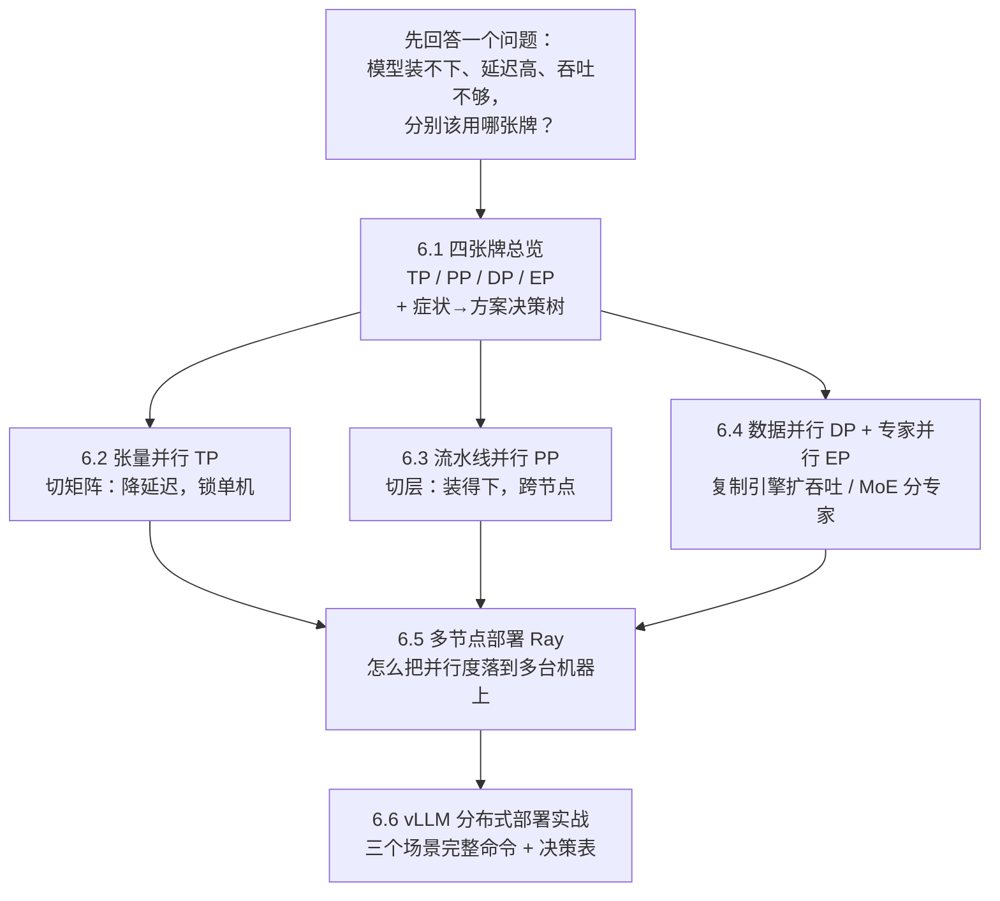

## 本章简介

当模型大到单张 GPU 装不下，或吞吐要求超过单卡上限时，就必须把推理拆到多卡甚至多机上。本章讲清推理场景下的并行策略——注意它与训练并行的目标不同：训练关注梯度同步与收敛，推理关注显存装载、TTFT/TPOT 延迟和吞吐。全程以 vLLM 的分布式能力为实例。

**张量并行（Tensor Parallel, TP）**将每一层的权重矩阵按行/列切分到多卡，单次前向内部通过 AllReduce 聚合，是推理中降低单卡显存、加速单请求延迟的首选。本节分析 TP 的通信量、对 NVLink 带宽的依赖，以及为什么 TP 通常不跨节点。

**流水线并行（Pipeline Parallel, PP）**将模型按层切成多段放在不同 GPU 上，适合跨节点扩展；本节分析推理场景下 PP 的 Bubble 与 Micro-batch 组织，以及 TP×PP 的组合选择。

**数据并行与专家并行（DP / EP）**：DP 复制多份引擎横向扩吞吐；EP 针对 MoE 模型将不同 Expert 分布到不同 GPU，通过 All-to-All 通信路由 Token，是部署超大 MoE 模型的关键。

**多节点部署（Ray 集群）**讲清 vLLM 如何借助 Ray 编排多机多卡：集群拉起、Placement Group、TP/PP 在节点内外的映射，以及常见的通信与环境排错。

**vLLM 分布式部署实战**：用 `tensor-parallel-size` / `pipeline-parallel-size` / `data-parallel-size` 部署大模型，验证多卡下的显存分布与吞吐提升。

## 📖 读前 3 分钟：这一章会用到的术语

下面 18 个词在整章反复出现。第一次见到时正文也会再解释一次，但先花 3 分钟扫一遍这张表，读起来会顺很多：

| 术语 | 中文全称 / 白话 | 一句话解释 |
|---|---|---|
| token | 词元 | 模型处理文本的最小单位，一个词或一个字 |
| H100 / A100 / H200 | 英伟达高端 GPU | 显存 80GB（H200 为 141GB），本章计算都用它当“标准卡” |
| 权重 | 模型参数 | 模型训练出来的参数，70B 模型就是约 700 亿个参数 |
| FP16 / FP8 / INT4 | 数字精度 | 每个参数占 2 / 1 / 0.5 字节，精度越低越省显存 |
| prefill / decode | 预填充 / 解码 | 处理输入 prompt 的阶段 / 逐 token 生成回答的阶段 |
| KV Cache | 键值缓存 | 把算过的注意力键值记下来复用，省算力但吃显存 |
| Memory Bound | 内存带宽瓶颈 | 速度取决于“从显存读数据”而不是“计算” |
| AllReduce | 全归约 | 多卡把各自的部分结果相加汇总，每张卡都拿到完整结果 |
| All-to-All | 全交换 | 每张卡给其他所有卡各发一份数据（EP 的通信方式） |
| NVLink | 机内高速互联 | GPU 与 GPU 之间的直连总线，约 900 GB/s |
| IB（InfiniBand） | 机间高速网络 | 连接不同机器的网络，约 50 GB/s，比 NVLink 慢一个数量级 |
| TP / PP / DP / EP | 四种并行策略 | 切矩阵 / 切层 / 复制引擎 / 分专家，本章主角 |
| MoE | 混合专家（Mixture of Experts） | 模型里放很多“小网络”（专家），每个 token 只激活其中几个 |
| TTFT / TPOT | 首 token 延迟 / 单 token 时间 | TTFT 是“按下回车到第一个字出现”，TPOT 是“每出一个字的间隔” |
| QPS / SLO | 每秒请求数 / 服务水平目标 | 吞吐指标 / 承诺给用户的延迟上限 |
| NCCL | 英伟达集合通信库 | 多卡通信的底层库，所有并行通信都走它 |
| Ray | 跨节点调度框架 | 负责把进程放到多台机器上，不参与计算 |

## 🗺️ 章节地图

这一章按“先看懂四张牌，再动手部署”的顺序推进，整章的骨架如下：

读完这张地图，你应该能复述整章逻辑：**先判断瓶颈（装不下 / 延迟 / 吞吐），再选牌（TP / PP / DP / EP），最后用 vLLM + Ray 把它落到真实机器上**。

## 本章小节

- **6.1 推理并行策略总览**：与训练并行的目标差异，TP/PP/DP/EP 适用场景
- **6.2 张量并行推理**：权重切分、AllReduce、NVLink 带宽依赖
- **6.3 流水线并行推理**：跨节点扩展、Bubble 与 Micro-batch
- **6.4 数据并行与专家并行**：横向扩吞吐、MoE 的 All-to-All 路由
- **6.5 多节点部署（Ray）**：集群编排、并行度映射、排错
- **6.6 vLLM 分布式部署实战**：多卡多机启动参数与验证
