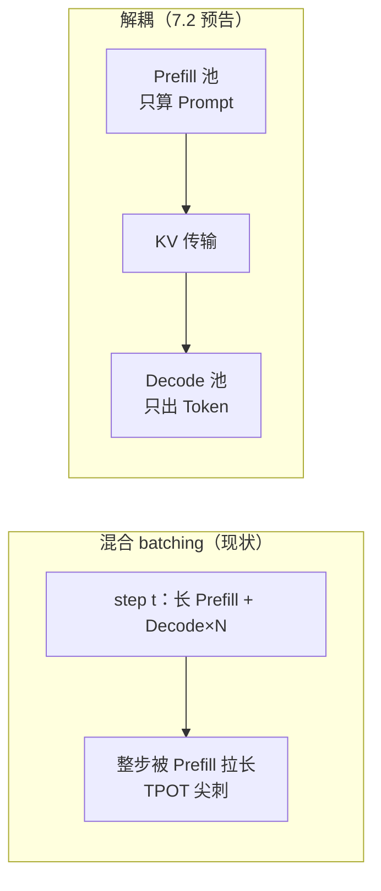

上一节（第 2 章 2.4 节）说 Chunked Prefill 能把长 Prompt 的尖峰削平，但它只是**缓解**，不是根治——长 Prefill 的总计算量还在、块间间隙还会抖，混批的互扰只是被“摊小”而不是被“消灭”。这一节先把互扰这口锅定量掀开：一个 2000 Token 的 Prefill 插进某一步，这一步的耗时从普通 Decode 步的几十毫秒被拉长到几百毫秒，同批所有 Decode 请求的 TPOT 全部遭殃。DistServe（OSDI'24）的实测里，混合部署下 1 张 A100 的 per-GPU goodput 只有 1.6 rps；而 Prefill/Decode 分池后，同样 3 张卡能跑到 10 rps（3.3 rps/GPU，**2.1 倍**）。学习路线 3.5 的检验标准更直接：构造混合负载，证明 Decode 的 P95 TPOT 被拖慢 **3-5 倍**。理解“为什么混在一起、怎么被拖慢、为什么切块救不回来”，是下一节读 DistServe/Splitwise 解耦设计的前提。

<!-- more -->

## 📑 目录

- [1. 为什么混在一起：一锅烩的由来](#1-为什么混在一起一锅烩的由来)
- [2. 互扰机制定量拆解：三条受害路径](#2-互扰机制定量拆解三条受害路径)
- [3. "3-5 倍"从哪里来：论文证据与复现协议](#3-3-5-倍从哪里来论文证据与复现协议)
- [4. 为什么 Chunked Prefill 只是缓解不是根治](#4-为什么-chunked-prefill-只是缓解不是根治)
- [5. 尾延迟放大效应：均值受害小、P95/P99 受害大](#5-尾延迟放大效应均值受害小p95p99-受害大)
- [6. 什么时候问题最严重](#6-什么时候问题最严重)
- [总结](#-总结)
- [自我检验清单](#-自我检验清单)
- [参考资料](#-参考资料)

---

## 1. 为什么混在一起：一锅烩的由来

### 1.1 两种完全不同的“脾气”

先把第 1 章的两条结论搬出来钉在墙上：

- **Prefill 是 Compute Bound（算力瓶颈）**：一次把整段 Prompt 的所有 Token 并行算完，Token 越多、这一步的矩阵运算量越大。13B 模型在 A100 上，一段 512 Token 的 Prompt 就能把 GPU 算力基本占满（DistServe 论文的原话：make an A100 near compute-bound）。
- **Decode 是 Memory Bound（带宽瓶颈）**：每步只处理 1 个新 Token，算力需求小，瓶颈在把权重和 KV Cache 从 HBM（GPU 显存）搬出来。7B 模型 FP16 权重 14GB，每 decode 一步、每序列都要把这 14GB 至少过一遍——所以 Decode 步的耗时和“这步批里有多少序列”强相关，和“算力有多强”关系不大。

一个吃算力、一个吃带宽，本来是两种病。问题在于：**它们必须共用同一块 GPU 上的算力和带宽**。

### 1.2 Continuous Batching 的“一锅烩”

2.2 节讲过 Continuous Batching 的核心：**每一步重新组批**。调度器每步先把正在生成的 Decode 请求喂饱（每个占 1 个 Token 额度），预算有剩才拉新的 Prefill 进来（2.4 的 Token Budget 视角）。这个设计让 GPU 利用率从 30% 拉到 80%+，但也意味着：**只要来了新请求，它的 Prefill 就注定要挤进某个正在跑 Decode 的 step**。

打个比方：这就像高速公路收费站只开了一条混行车道——ETC 小车（短 Decode）本来 20 毫秒过一辆，畅通无阻；突然一辆 8000 吨的重卡（长 Prefill）开进这条道，它自己过站慢不说，后面所有小车都被它压住，跟着龟速。更糟的是，重卡是一辆接一辆来的（高并发下 Prefill 不断涌入），小车被压住的时间不是一次性的，而是反复发生。

问题来了：既然知道混在一起会互相拖累，为什么还要混？**因为不混，GPU 就吃不饱**——纯 Decode 的算力利用率很低（Splitwise 论文对对话负载（conversation）的实测：混合 batching 下 60-70% 的时间 batch 里只有不到 20 个活跃 Token），纯 Prefill 又只在请求到达的瞬间有活干。混批是“用互扰换利用率”的生意。所以互扰不是 bug，是 continuous batching 的**设计代价**。



这张图就是本章的路线图：左边是这一节要诊断的病，右边是 7.2 开始要开的药。

---

## 2. 互扰机制定量拆解：三条受害路径

### 2.1 一个长 Prefill 插进来，同批 Decode 的三条受害路径

把一个 8000 Token 的 Prefill 塞进某一步，同批的 Decode 请求在三个层面同时挨打：

**路径一：算力抢占（Execution Delay）**。Prefill 的矩阵乘把 SM（GPU 的计算单元）和 Tensor Core（矩阵乘专用单元）占满，同批 Decode 的 GEMM（矩阵乘）只能排队等算力。这一步的总计算量从“32 个 Decode Token”变成“32 个 Decode Token + 2000 个 Prefill Token”，单步耗时被整体拉长。

**路径二：KV 带宽竞争（Bandwidth Contention）**。Decode 步本来就要读权重 + 读全量 KV Cache（序列越长读得越多）；Prefill 同时也在读权重、写 KV。HBM 带宽是共享的，两边抢同一根管子，各自都变慢。长上下文场景（多轮对话、长文档 RAG，即检索增强生成）下 KV 读取量暴涨，这条路径的伤害会被放大。

**路径三：调度等待（Queuing Delay）**。即使把 Prefill 和 Decode 分开调度（不塞同一个 step），Decode 请求在 GPU 忙 Prefill 时也要排队；反过来给 Prefill 让路、优先级压 Prefill 时，TTFT 又超标。DistServe 论文的结论：**优先级调度只能保一头，必然牺牲另一头**。

### 2.2 时间线：一个 2k Prompt 插进来的账单

思路很简单：一步的总耗时，约等于 Prefill 的计算量加上 Decode 的计算量。写成线性模型就是：

$$
\underbrace{T_{\text{step}}}_{\text{这一步总耗时}} \approx \underbrace{k_p \cdot P}_{\text{Prefill 计算量（P 个 token）}} + \underbrace{k_d \cdot D}_{\text{Decode 计算量（D 个序列）}}
$$

其中 $k_p$ 是每个 Prefill Token 的均摊耗时（Compute Bound，与 batch 弱相关），$k_d$ 是每个 Decode 序列的均摊耗时（Memory Bound，与序列数强相关）。代入一组估算值（7B 模型、A100 级硬件，**数值为估算口径，以你所用硬件的实测为准**）：平时一步 $P=0, D=32$，$T_{\text{step}} \approx 30$ms；某一步塞进 $P=2000$（一个 2k 的中长 Prompt），$T_{\text{step}} \approx 30 + 180 \approx 210$ms——**这一步里的每个 Decode 请求，TPOT 从 30ms 涨到 210ms，约 7 倍**。这个量级和学习路线检验标准的“3-5 倍”是同一条曲线上的点：倍数取决于 Prefill 长度、Decode 批大小和硬件，你的负载在哪一段，压测说了算。

把时间线画成表，看得更直观（同一批 8 个 Decode 请求 + 1 个 2k Prompt 请求）：

| 时间 | step 内容 | 单步耗时 | Decode 用户感受 |
|---|---|---|---|
| t0 | Decode×8（无 Prefill） | ~30ms | 正常出字 |
| t1 | **2k Prefill + Decode×8** | ~210ms | 卡顿，一个 Token 憋 210ms |
| t2 | 又一批 Prefill 涌入 + Decode×8 | ~150ms | 继续卡 |
| t3 | Decode×8（恢复） | ~30ms | 恢复流畅 |

📌 **关键点**：卡顿不是偶发的——只要长 Prompt 请求持续到达，t1/t2 这样的坏 step 就会周期性出现，Decode 的 TPOT 分布被拉出一条长长的右尾。

⚠️ **注意**：上表的数字是**估算口径**，不是实测。真实系统中 Prefill 与 Decode 的 kernel 可能部分重叠（GPU 流水线并非严格串行），实际倍数会偏低；但“长 Prefill 进组 → 该步耗时显著拉长”的方向和量级是稳定的，DistServe 论文 Figure 2 用 decode-only batch 对比“+1 个 Prefill 任务”的实测曲线证实了这一点：**加一个 Prefill 就能显著拉长整批执行时间，且 Prefill 越长拉得越狠**。

### 2.3 互扰的代价不是“慢一点”，是“白买显卡”

互扰最坑的地方在于：**为了压住尾延迟，你必须降低负载**。DistServe 论文 Figure 1 的实测给出了这笔账（13B 模型、输入 512 / 输出 64、SLO 达标率 90%）：

| 📊 部署方式 | per-GPU goodput | 说明 |
|---|---|---|
| 混合 batching（现状） | **1.6 rps** | 被更紧的那个 SLO（TTFT 或 TPOT）卡死 |
| 只跑 Prefill 的 GPU | 5.6 rps | 互扰消失后的 Prefill 单阶段能力 |
| 只跑 Decode 的 GPU | 10 rps | 互扰消失后的 Decode 单阶段能力 |
| 2 张 Prefill + 1 张 Decode | 10 rps 总量 = **3.3 rps/GPU** | 比混合部署的 1.6 高 **2.1 倍** |

📌 **关键点**：同样的 3 张 A100，混着用每张卡只能扛 1.6 rps，拆开用每张卡扛 3.3 rps——**互扰让你白买了约一半的显卡**。这就是下一节 DistServe 的动机：不是“优化调度技巧”，而是“分池后每张卡的产出直接翻倍”。

---

## 3. “3-5 倍”从哪里来：论文证据与复现协议

### 3.1 这个数字的出处

学习路线 3.5 的检验标准原文：“在一个混合 batching 的推理服务上，构造一个场景——几个超长 prompt 的 prefill 请求和大量短 decode 请求同时到达，用指标证明 decode 的 P95 TPOT 被 prefill 拖慢了 3-5 倍，这就是解耦的动机。”

诚实地说：**论文并没有给出一个通用的“3-5 倍”常数**。DistServe 给出的是定性与机制证据（加一个 Prefill 任务显著拉长 decode 批执行时间、随 Prefill 长度加剧、混合部署下 per-GPU goodput 只剩 1.6 rps）；Splitwise 给出的是利用率证据（对话负载下 60-70% 的时间 batch 活跃 Token ≤ 20 个）。“3-5 倍”是学习路线给你的**复现目标**——在你自己的负载和硬件上，P95 TPOT 的拖慢倍数落在哪个区间，决定了你要不要上解耦。

### 3.2 复现实验协议（判定线：≥2 倍即确认互扰）

照抄下面的协议，30 分钟能拿到你自己的倍数：

1. **基线组**：只发短 Prompt（如 32 Token）+ 固定输出长度的请求，并发 16，记录 TPOT P50/P95/P99；
2. **混合组**：同样并发，按 5%-10% 比例混入 4k-8k 长 Prompt 请求，其余不变；
3. **对比**：混合组 vs 基线组的 TPOT P95。差距超过 **2 倍**即确认互扰成立（学习路线 3.7 的门禁口径），3-5 倍则说明你的负载已经病得不轻；
4. **变量控制**：同一模型、同一引擎参数、同一并发档位，只改 Prompt 长度分布。

实验脚本的主干逻辑长这样（伪代码，非逐字源码）：

```python
# 互扰复现实验：纯 Decode 基线 vs 混合负载（伪代码）
# 思路：除 prompt 长度分布外一切变量固定，比 TPOT P95

def run(engine, prompts, concurrency):
    # 每个请求：固定 max_tokens（如 128）、temperature=0
    # 记录每个输出 token 的间隔 → TPOT 序列
    return measure_tpot_p50_p95_p99(engine, prompts, concurrency)

base_prompts  = [short_prompt()] * 1000          # 基线组：全是短 prompt
mixed_prompts = [short_prompt()] * 950 + \
                [long_prompt(4096)] * 40 + \
                [long_prompt(8192)] * 10          # 混合组：5% 长 prompt

base  = run(engine, base_prompts,  16)
mixed = run(engine, mixed_prompts, 16)

# 判定线：P95 放大 ≥ 2 倍 → 互扰实锤；≥3 倍 → 该考虑解耦了
assert mixed.p95 / base.p95 >= 2.0, "互扰不显著，检查长 prompt 比例或长度"
```

💡 **提示**：长 Prompt 的“长”是相对的。以 2.4 节 Token Budget 的视角看，关键是 Prefill 单块计算量（≈ Prompt 长度）与 Token Budget 的比例——Prompt 越长、Budget 越小，互扰越明显。如果你的负载里根本没有长 Prompt，互扰大概率不是你的主要矛盾，别为了“显得高级”去折腾。

---

## 4. 为什么 Chunked Prefill 只是缓解不是根治

2.4 节讲过 Chunked Prefill 的做法：把 4000 Token 的 Prompt 切成 512 的块，每步只掺一块，Decode 的尖峰被削平。这套思路对“突发单峰”有效，但**治不了四件事**：

**其一：块间间隙仍然会抖**。Chunk 只是变小了的 Prefill，它塞进某一步时，那一步的 Decode 依然被拖慢（从 210ms 变成 60ms 而已），块与块之间 Decode 的速度还不一样——TPOT 的抖动从“大尖刺”变成“小锯齿”，P95 依然难看。

**其二：长 Prompt 的 Prefill 总时长一点没少**。切块只是把一次性尖峰摊到多步，总计算量不变；而且每块之间还要重新加载之前块的 KV（见下一条），TTFT 反而被拉大。DistServe 论文的原话：chunked prefill 本质上是在**用 TTFT 换 TPOT**，互扰并没有被消除。

**其三：块大小的两难**。块切太小，Prefill 吃不饱 GPU，还要和 Decode 抢资源，自己的执行时间变长；块切太大，一步剩下的位置放不下几个 Decode Token，“piggyback”的机会就没了。SARATHI 那套 piggyback 调参调到你怀疑人生，就是这个原因。

**其四：切块让 Prefill 的 KV 读取量从 O(N) 涨到 O(N²)**。每个后续块都要重新读前面所有块的 KV Cache 才能算 Attention，账本如下：

$$
\underbrace{N + (N-1) + \cdots + 1}_{\text{逐块累加的 KV 重读量}} = \underbrace{\frac{N(N+1)}{2}}_{\text{等差数列求和}} \quad \text{vs} \quad \underbrace{N}_{\text{不切块只需读一遍}}
$$

代入算例：一个 4000 Token 的 Prompt 切成 8 块（每块 512），KV 重读量从 8 块次变成 36 块次，**4.5 倍**；8000 Token 切 16 块，从 16 变成 136 块次，**8.5 倍**。上下文越长，这笔额外 HBM 流量越夸张。

📌 **关键点**：Chunked Prefill 的定位是“**把互扰从灾难降级为噪音**”，适合 SLO 宽松、长 Prompt 占比不高的场景；当你的 SLO 严格到“P95 TPOT 必须稳定”时，噪音也是不可接受的——这正是 7.2 解耦架构要解决的问题。DistServe 论文也明说：离线、对延迟不敏感的场景，chunked prefill + piggyback 反而更优（每步都能把 GPU 填到 compute-bound 阈值）。

---

## 5. 尾延迟放大效应：均值受害小、P95/P99 受害大

### 5.1 为什么受伤的总是长尾

直觉上，混批把每个请求都拖慢一点，平均 TPOT 涨一点，好像还能忍。但真实报表往往长这样：**P50 只涨 20%，P99 涨 3-4 倍**。为什么？

排队论的直觉在这里很有用：坏 step（长 Prefill 混入）是**周期性随机出现**的，一个 Decode 请求被拖慢的次数服从近似几何分布——大多数请求运气好，一次都没碰上；少数倒霉请求被反复踩中，每次被踩都是**乘性**放大（这步耗时 ×4、下步又 ×4）。尾部的请求还被叠加调度等待：坏 step 期间到达的请求，前面排着更长的队。

$$
\underbrace{\text{TPOT}_{\text{坏 step}}}_{\text{被 Prefill 拖慢的单步}} \approx \underbrace{f}_{\text{拖慢倍数（本文第 2 节的 } k_pP \text{ 项）}} \times \underbrace{\text{TPOT}_{\text{好 step}}}_{\text{正常步}}
$$

被踩 $k$ 次的请求，其 TPOT 分布就是 $f^k$ 的复合分布——**均值被少数幸运儿拉平，P99 被少数倒霉蛋拉爆**。

打个比方：这就像体检报告——只看平均心率（均值），一切正常；但背 24 小时动态心电图（尾延迟分布），里面藏着几次房颤（坏 step 造成的长尾）。房颤才是要命的，平均心率再正常也掩盖不了它。**互扰的伤害藏在尾部分位数里，均值报表会给你虚假的安全感。**

💡 **提示**：这里有个反直觉推论——**把长 Prompt 请求“优先集中处理”反而更糟**。如果调度器为了照顾 Prefill 而让长 Prefill 连续占用多步，坏 step 会连成一片，个别 Decode 请求被连续踩中 $k$ 次，P99 的放大从 $f$ 变成 $f^k$。这正是 DistServe 论文说的：优先级调度只能保一头，另一头的尾延迟会爆炸。

### 5.2 一张示例报表

以下为**估算口径的结构模板**（7B 模型、16 并发、混合 5% 的 4k Prompt；数值待你在自己硬件上实测）：

| 📊 指标 | 纯 Decode 基线 | 混合组 | 放大倍数 |
|---|---|---|---|
| TPOT P50 | 32ms | 38ms | 1.2x |
| TPOT P95 | 41ms | 95ms | 2.3x |
| TPOT P99 | 48ms | **165ms** | 3.4x |
| SLO 达标率（TPOT<50ms） | 99.2% | 91.5% | 掉 7.7 个点 |

📌 **关键点**：如果只看 P50，你会得出“互扰不严重”的错误结论；**互扰是尾延迟的病，必须用 P95/P99 和 SLO 达标率来诊断**。这也是为什么学习路线的指标体系（3.6）强制要求同时报 P50/P95/P99——均值会骗人。

---

## 6. 什么时候问题最严重

把上面所有机制汇总成一张“症状-严重度”诊断表：

| 负载特征 | 互扰严重度 | 机制 |
|---|---|---|
| 长 Prompt 占比高（RAG、长文档问答） | 🔴 严重 | 长 Prefill 单块计算量大，坏 step 频繁且破坏力强 |
| 并发高（batch 大） | 🔴 严重 | 坏 step 一次拖累更多 Decode 请求，KV 带宽竞争加剧 |
| SLO 严格（TTFT<500ms 且 TPOT<50ms 这类） | 🔴 严重 | 尾延迟直接变成达标率断崖，只能被迫降负载（回到 1.6 rps 困境） |
| 多轮对话/长上下文 | 🟠 中等偏重 | 序列 KV 变长 → Decode 的 KV 读取量涨 → 带宽竞争放大 |
| 短 Prompt + 短输出 + 宽松 SLO | 🟢 轻微 | 坏 step 少、拖慢小、SLO 兜得住 |

决策路径：**先量化，再上药**。用 3.2 的协议跑出你负载的 TPOT P95 放大倍数——<2 倍：Chunked Prefill（2.4）够用；2-5 倍且 SLO 宽松：Chunked Prefill + 调 Token Budget；≥3 倍且 SLO 严格：**读下一节，上解耦**。

---

## 📝 总结

1. **互扰是设计代价**：Continuous Batching 用“混批”换 GPU 利用率（30%→80%+），代价是长 Prefill 挤进某一步时，同批 Decode 的 TPOT 被整体拉长——互扰不是 bug，是“一锅烩”的必然结果。
2. **三条受害路径**：算力抢占（Prefill 占满 Tensor Core）、KV 带宽竞争（两边抢 HBM）、调度等待（排队 + 优先级只能保一头）；一个 8k Prefill 可以把单步耗时从 ~30ms 拉到 ~200ms（估算口径）。
3. **互扰的代价是白买显卡**：DistServe 实测混合部署 per-GPU goodput 只有 1.6 rps，分池后 3.3 rps（2.1x）；学习路线 3.5 的“3-5 倍”是复现目标而非常数，判定线是 P95 TPOT ≥2 倍。
4. **Chunked Prefill 只是缓解**：块间间隙仍抖动、长 Prompt 总时长不变、块大小两难、KV 重读从 O(N) 涨到 O(N²)（8k 切 16 块 → 8.5 倍重读）。
5. **尾延迟放大**：被踩次数服从几何分布、拖慢是乘性的，P50 只涨 20% 时 P99 可能涨 3.4 倍——互扰必须用 P95/P99 + SLO 达标率诊断。
6. **决策路径**：先压测量化（判定线 ≥2 倍），<2 倍用 Chunked Prefill，≥3 倍且 SLO 严格就上解耦（下一节）。

## 🎯 自我检验清单

- 能解释为什么 Prefill（Compute Bound）和 Decode（Memory Bound）混批必然互扰，而不是“调度得好就能避免”
- 能列出长 Prefill 插进某一步时同批 Decode 的三条受害路径（算力抢占、KV 带宽竞争、调度等待）并各举一个机制
- 能手动构造一个 8k Prompt 混入的 step 耗时估算（$T_{\text{step}} \approx k_pP + k_dD$），误差在 50% 以内（估算口径）
- 能解释 DistServe 论文“1.6 rps vs 3.3 rps/GPU（2.1x）”这个数字的含义，以及互扰为什么等于“白买一半显卡”
- 能说清学习路线 3.5 的“P95 TPOT 拖慢 3-5 倍”是复现目标而非论文常数，并复述其依据（DistServe 定性证据 + Splitwise 利用率证据）
- 能在 30 分钟内按 3.2 的协议跑出自己负载的 TPOT P95 放大倍数，并用 ≥2 倍判定线给出互扰结论
- 能解释 Chunked Prefill 的四个不根治理由，并手算 KV 重读账本（4000 Token 切 8 块 → 4.5 倍；8000 切 16 块 → 8.5 倍）
- 能解释为什么互扰的 P50 受害小、P99 受害大（几何分布 + 乘性放大 + 排队叠加）
- 能读一份 TPOT P50/P95/P99 报表，判断其中是否存在互扰并指出该看哪个指标
- 能根据自己负载的“长 Prompt 占比、并发、SLO 严格度”三要素判断互扰严重度，并给出 Chunked Prefill 还是解耦的初步建议

## 📚 参考资料

**论文**

- [DistServe: Disaggregating Prefill and Decoding for Goodput-optimized LLM Serving - Zhong et al., OSDI 2024](https://arxiv.org/abs/2401.09670)（互扰定性证据、1.6/5.6/10 rps 实测、chunked prefill O(N²) 分析）
- [Splitwise: Efficient Generative LLM Inference Using Phase Splitting - Patel et al., ISCA 2024](https://arxiv.org/abs/2311.18677)（混合 batching 60-70% 时间活跃 Token ≤20 的利用率证据）
- [SARATHI: Efficient LLM Inference by Piggybacking Decodes with Chunked Prefills - Agrawal et al., 2023](https://arxiv.org/abs/2308.16369)（chunked prefill + piggyback 原论文）

**站内**

- [AI Infra 学习路线（3.5 互扰定量分析检验标准、3.6 指标与门禁）](/AIInfraGuide/guides/ai-infra学习路线)
- [2.4 Chunked Prefill 与统一 Token Budget 调度（混批与切块机制）](/AIInfraGuide/inference/模块四-推理优化/第2章-推理引擎核心技术/24-chunked-prefill-与统一调度)
- [2.2 Continuous Batching（"一锅烩"调度与 30%→80%+ 利用率）](/AIInfraGuide/inference/模块四-推理优化/第2章-推理引擎核心技术/22-continuous-batching)
- [1.1 LLM 推理基础（Prefill/Decode 两阶段与 TTFT/TPOT 指标）](/AIInfraGuide/inference/模块四-推理优化/第1章-llm推理基础/11-llm推理基础)
- [第 7 章：Prefill/Decode 解耦架构（章首页）](/AIInfraGuide/inference/模块四-推理优化/第7章-pd解耦架构/第7章-pd解耦架构)
