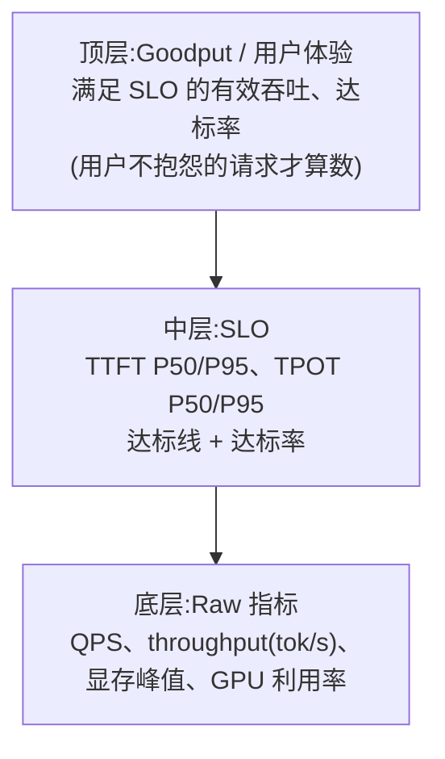

QPS 是给老板看的报表，Goodput（把“满足 SLO 的请求”才算数的吞吐）才是用户感受到的体验。一个服务 Raw QPS 再高，如果 P95 TTFT 超过 2 秒，用户早就流失了——**那些超时的请求不是“完成了”，而是“白算了”：它们同样吃掉了 GPU、同样占了带宽，却没换来一个满意的用户**。这正是 DistServe（OSDI'24）的核心主张：把优化目标从“每秒处理多少请求”换成“满足 SLO（服务质量目标，如”首字 2 秒内“）的请求能打多满”，在同样资源下把可服务的请求量提升了 7.4 倍；TaiChi（2025）再把这一目标推进到聚合/解耦统一调度，平衡 SLO 下 goodput 最多再提升 77%。这一节讲清 goodput 的定义、SLO 的形态、解耦为什么让 goodput 优化成为可能，以及工程上怎么设定 SLO、度量达标率。

<!-- more -->

## 📑 目录

- [1. Raw QPS 的谎言](#1-raw-qps-的谎言)
- [2. Goodput：满足 SLO 的请求才算数](#2-goodput满足-slo-的请求才算数)
- [3. SLO 的形态：TTFT、TPOT 与端到端](#3-slo-的形态ttfttpot-与端到端)
- [4. 为什么解耦让 Goodput 优化成为可能](#4-为什么解耦让-goodput-优化成为可能)
- [5. 调度策略：DistServe、TaiChi 与公平性](#5-调度策略distservetaichi-与公平性)
- [6. Goodput 的度量口径与指标金字塔](#6-goodput-的度量口径与指标金字塔)
- [7. 工程落地：设定 SLO 并度量达标率](#7-工程落地设定-slo-并度量达标率)
- [8. 权衡：用调度复杂度换用户体验](#8-权衡用调度复杂度换用户体验)
- [总结](#-总结)
- [自我检验清单](#-自我检验清单)
- [参考资料](#-参考资料)

---

## 1. Raw QPS 的谎言

### 1.1 平均数的谎言：P50 好看，P95 崩了

为什么说 Raw QPS 是谎言？先回到 1.1 节埋下的伏笔：指标分三层，P50 是“典型体验”，P95/P99 是“用户投诉的来源”。Raw QPS 的问题在于它只有一层——**它统计的是“每秒发出多少个响应”，完全不管响应质量**。

举个例子：一个服务 QPS 报表常年 2000，看起来红红火火。但把请求拆开看：P50 TTFT 300ms 很漂亮，P95 TTFT 却是 2.4 秒——每 20 个用户里就有 1 个要干等 2 秒以上才看到第一个字。经验上，聊天类应用 TTFT 超过约 2 秒，用户就开始流失（这也是很多团队把 TTFT P95 SLO 定在 2s 的原因）。**QPS 报表不会告诉你这些流失**，因为流失的用户也是“处理完”的请求。

为什么尾延迟会烂？机制上一节（7.1）已经讲透：混合 batching 里长 prefill 挤进某一步，同批 decode 全部被拖慢，P95 甚至 P99 的 TPOT 可以比中位数差 3~5 倍（学习路线 3.5 的检验标准就是让你亲手构造这个场景、用指标证明它）。**平均数把尖刺抹平了，而尖刺才是用户真实感受。**

### 1.2 质检思维：不合格品不算产量

打个比方：工厂流水线每小时产出 1000 件产品，但质检发现 30% 不合格——这些不合格品一样消耗了原料、占了产线时间，却卖不出去。**产量（QPS）和合格品产量（Goodput）是两回事**，聪明的厂长盯的是后者。

LLM 推理的“质检标准”就是 SLO：TTFT 不超过多少、TPOT 不超过多少。一个请求只有**同时满足全部 SLO**，才算“合格品”；不合格的请求虽然也返回了结果，但对业务来说等于白做——用户已经走了。**这就是 Goodput 的第一定义：单位时间内满足 SLO 的有效请求数（或有效 token 吞吐）。**

---

## 2. Goodput：满足 SLO 的请求才算数

### 2.1 定义与公式

怎么把“算不算数”翻译成公式？用公式钉死三个口径（这是 DistServe 论文和 1.1 节指标体系的统一口径）：

$$
\text{Goodput} = \underbrace{\frac{N_{slo}}{T}}_{\text{单位时间内满足 SLO 的请求数}} \qquad
\text{达标率 } R = \underbrace{\frac{N_{slo}}{N_{total}}}_{\text{满足 SLO 的请求 ÷ 总请求}}
$$

换算关系一句话：**有效吞吐 = 总吞吐 × 达标率**，即 $\text{Goodput} = QPS \times R$。当 $R = 100\%$ 时 goodput 等于 QPS；$R$ 越低，中间差的“白算”部分越大。

代入例子：QPS 2000、达标率 95% → goodput 1900 请求/s，有 100 个请求/s 在纯浪费资源。**优化 goodput 有两条路：要么把 QPS 拉高（吞吐优化），要么把达标率拉高（延迟稳定性优化）**——解耦走的是第二条路。

### 2.2 Goodput 的“用户不抱怨”视角

📌 **关键点**：Goodput 的本质是**把延迟约束翻译成产量指标**。它不替代 TTFT/TPOT 指标，而是把它们装进一个“算不算数”的框里：满足 SLO 的请求才算数。这也是为什么学习路线 3.5 说“QPS 高 ≠ 用户体验好”——**用户不抱怨的请求才算数**，这句话就是 goodput 的口语版。

---

## 3. SLO 的形态：TTFT、TPOT 与端到端

### 3.1 三类 SLO 各管一段

SLO 长什么样？一个请求的生命周期被切成两段（1.1 的 E2E 公式），SLO 也按段设：

$$
\text{请求满足 SLO} \iff \underbrace{TTFT \leq SLO_{TTFT}}_{\text{首字约束}} \wedge \underbrace{TPOT \leq SLO_{TPOT}}_{\text{出字约束（每个 token）}} \wedge \underbrace{E2E \leq SLO_{E2E}}_{\text{整体约束}}
$$

- **TTFT SLO**：约束 prefill 段，管“第一印象”——用户提交后多久看到第一个字；
- **TPOT SLO**：约束 decode 段，管“流畅感”——每个输出 token 的间隔不能超过多少；
- **端到端 SLO**：整体兜底，$E2E = TTFT + TPOT \times (\text{输出数} - 1)$，长输出场景下由 TPOT 主导。

### 3.2 不同业务，SLO 完全不同

**交互式应用（对话、Copilot）**：TTFT 和 TPOT 都紧，因为用户在实时等；**批处理（离线摘要、批量分类）**：只关心总吞吐，TTFT/TPOT 几乎可以不管。Splitwise 论文的 SLO 设计值得抄：对 TTFT、TBT（token 间延迟）、E2E 三个指标**各设 P50、P90、P99 三个百分位的 SLO，九个全部满足才算达标**——P50 管日常体验，P99 管尾延迟不失控。

💡 **提示**：百分位怎么选是成本问题。P99 达标比 P95 贵得多（要为更极端的尖刺准备资源），大部分业务 P95 够用；只有金融、自动驾驶这类有合同约束的才上 P99。**SLO 不是越严越好，是“业务愿意付多少钱买多少稳定性”。**

---

## 4. 为什么解耦让 Goodput 优化成为可能

### 4.1 混跑架构下，两个目标互相绑架

为什么混跑架构下 goodput 优化不动？回顾 2.4 和 7.1 的核心矛盾：混合 batching 里，prefill 和 decode 挤在同一个 step，**一步的耗时由最重的活决定**：

$$
T_{step} \approx \underbrace{N_p \cdot c_p}_{\text{prefill 块的计算量}} + \underbrace{N_d \cdot c_d}_{\text{decode 批的计算量}}
$$

长 prompt 的 prefill 让 $N_p$ 暴涨，这一步被拉长，同批每个 decode 请求的 TPOT 全部变差。于是调度器陷入两难：**保 TTFT（多给 prefill 资源）就牺牲 TPOT；保 TPOT（限制 prefill）就牺牲 TTFT**——两个 SLO 像拔河的两端，资源怎么分都有人受伤。这是学习路线 3.5 说的“耦合了资源分配与并行策略”：不拆开，goodput 的优化空间被结构性锁死。

### 4.2 分池之后：每池只管一个目标

解耦怎么解开这个死结？分池之后，死结自动解开：

- **P 池**的调度目标只有一个：**TTFT + prefill 吞吐**——池子里全是 prefill，没有 decode 来抢，TTFT 可以压得很稳；
- **D 池**的调度目标只有一个：**TPOT + decode 吞吐**——池子里全是 decode，每步都是均匀的小步长，TPOT 尾延迟可控（7.3 说 vLLM 官方原话“控制 tail ITL”，就是这件事）。

打个比方：这就是 7.2 提过的学习路线餐厅比喻——**让同一个厨师既炒小炒（decode 要快）又炖慢炖菜（prefill 量大），互相拖累；解耦就是把快餐区和慢炖区拆成两个厨房，各自排自己的队**。两个厨房的“出餐合格率”（goodput）都能独立优化。

### 4.3 配比推导：2000 in / 500 out → P:D ≈ 1:3 或 1:4

分池之后立刻要回答：**P 池和 D 池各放多少 GPU？** 稳态下，两池 GPU 数的比例应该等于“单请求在两池的驻留时间比”（哪个池子让请求待得久，就需要更多 GPU 才不排队）：

$$
\frac{N_D}{N_P} = \underbrace{\frac{T_{decode\_per\_req}}{T_{prefill\_per\_req}}}_{\text{单请求在两池的时间占比}}
$$

推导分两步：

**步骤 1：算单请求在 P 池的时间。** Prefill 是一次把 2000 个输入 token 并行算完（Compute Bound，1.1 的结论），7B 模型单卡量级约 0.3~0.5s；

**步骤 2：算单请求在 D 池的时间。** Decode 是 500 个 token 逐个串行算（Memory Bound），每步 3~4ms，合计约 1.5~2s。

时间比 ≈ 3~4 倍 → **P:D ≈ 1:3 或 1:4**，即 D 池要 3~4 倍的 GPU。

⚠️ **注意**：这里有个反直觉点——token 数比（2000:500 = 4:1）和 GPU 配比（1:3~1:4）方向相反：**prefill 是并行读题、decode 是串行答题，同样的 token 数，decode 占的墙上时间（真实流逝的时间）多一个数量级**，所以虽然输入 token 是输出的 4 倍，D 池反而要更多 GPU。

⚠️ **注意**：这个比例是负载的函数，不是常数。Splitwise 论文用生产 trace 实测：代码补全负载（1500 in / 13 out，prefill 主导）在 70 RPS 目标下配比是 **27P:3T（9:1）**（论文另一组 SLO/到达率配置下为 35P:5T 7:1），对话负载（1020 in / 129 out）是 **25P:15T（≈1.7:1）**——和“1:3/1:4”方向相反，因为代码场景 prefill 才是大头。**正确姿势是拿自己的负载 trace 压测定配比（7.5 实战节会走完整流程），1:3/1:4 只是“出多进少”型负载的起点。**

---

## 5. 调度策略：DistServe、TaiChi 与公平性

### 5.1 DistServe：把 SLO 变成调度器的输入

DistServe（OSDI'24）怎么把 goodput 落进调度？它是第一个把 goodput 当成核心优化目标的推理系统，机制三步走：

1. **按 SLO 反推资源与并行策略**：给定应用的 TTFT/TPOT SLO，为 prefill 和 decode **分别**选并行方案（TP/PP 组合）和 GPU 数量——prefill 要算力（可能 TP 拉满），decode 要带宽与容量（可能 PP 更划算），不再用同一套配置凑合两边；
2. **按集群带宽放置**：把 P/D 放到网络拓扑上合适的位置（7.3 讲过，带宽紧张就让它们离得近）；
3. **路由与调度分开执行**：请求先到 P 池完成 prefill，KV 迁到 D 池继续 decode，两侧各自按自己的 SLO 调度。

效果（论文摘要原数字）：**相比当时最先进的系统，同样资源下可服务 7.4 倍多的请求，或满足 12.6 倍更紧的 SLO，且 90%+ 的请求保持在延迟约束内**。核心贡献不是某个调度算法，而是把“goodput 最大化”变成资源分配问题的目标函数。和混跑系统的差别，用一张表说清：

| 📊 决策 | 混跑系统（vLLM 单实例） | DistServe（解耦） |
|---|---|---|
| 并行策略 | 一套 TP/PP 同时服务两阶段 | 每阶段单独选（P 池偏算力、D 池偏带宽/容量） |
| 资源分配 | 一块 GPU 池，两阶段抢 | 两池独立扩容，按时间占比配比 |
| SLO 处理 | 调度器不感知，只能整体调参 | TTFT/TPOT SLO 是调度输入 |
| 请求路由 | 一个队列 | P 池→D 池流水线 |

### 5.2 TaiChi：把“解耦还是聚合”也变成调度决策

TaiChi（arXiv:2508.01989，2025）往前走了一步：解耦是不是唯一答案？它的答案是**解耦不是二选一，而是光谱**。它用两种实例搭出统一架构：

- **P-heavy 实例**：prefill 快，但混入 decode 时干扰大；
- **D-heavy 实例**：decode 干扰小，但 prefill 慢。

调度器按每个请求的 SLO 风险决定它走哪条路（hybrid-mode inference），并暴露三个旋钮（$R_{PD}$：两类实例配比、$S_P$/$S_D$：两侧 chunk 大小）。核心机制叫 **latency shifting（延迟转移）**：**把 GPU 资源从“已经稳达标”的请求身上挪给“濒临违约”的请求**——快车让路给要迟到的人。效果：平衡 TTFT/TPOT SLO 下 goodput 最高提升 **77%**；TTFT 相对纯解耦最多降 13.2 倍，TPOT 相对纯聚合最多降 1.69 倍。

💡 **提示**：TaiChi 的价值是提醒你别把“聚合/解耦”当成信仰——**短请求、宽松 SLO 走聚合更省；长请求、严格 SLO 走解耦更稳**。动态选择比站队更优。

### 5.3 队列管理：长请求与短请求的公平性

goodput 优化有个暗面：**为了保达标率，谁会被牺牲？** 三个工程手段：

- **JSQ（Join the Shortest Queue）**：Splitwise 集群级调度按“待处理 token 数”选最短队列路由，避免请求扎堆；
- **抢占 + 年龄保护**：混跑/混合池里 prefill 优先级高可以抢占 decode，但被抢占请求的优先级随等待时间递增（age），且限制每个请求的抢占次数——**防止 decode 永远被饿死**；
- **混合池**：负载波动时把 P 池/D 池的空闲机器临时挪进“混跑池”承接对端流量，用完归位，缓解分池带来的碎片化（Splitwise 实测用 1.4x 吞吐/降 20% 成本或同预算 2.35x 吞吐，混合池功不可没）。

📌 **关键点**：**公平性是 goodput 的约束条件，不是可选项**——只盯着达标率会把长请求饿死，最后 P99 全面崩盘。成熟系统都在“保达标率”和“防饿死”之间加显式的保护机制。

---

## 6. Goodput 的度量口径与指标金字塔

### 6.1 两套口径：请求数 vs token 数

- **请求口径**（DistServe 主用）：满足 SLO 的请求数/秒——直接对应“用户满意了几个请求”；
- **Token 口径**：满足 SLO 的请求产出的 token 总数/秒——更贴近计费与算力账，长输出请求权重更大。

两者换算：$\text{Goodput}_{tok} = \sum_{\text{达标请求}} \text{输出 token 数} \div T$。**报表用请求口径，容量规划用 token 口径**，别混。

### 6.2 指标金字塔

三层指标各管一件事，从下往上层层收敛：

- **底层**是物理事实：机器跑了多少活；
- **中层**是质量门槛：这些活里有多少符合预期；
- **顶层**是业务结果：合格的活有多少。

**优化永远发生在底层，判断永远发生在顶层**——你在底层动刀（调度、量化、解耦），但刀有没有用对，要看顶层 goodput 涨没涨。

代入一个完整例子走一遍：底层 QPS 2000、throughput 5 万 tok/s 都很好看 → 中层一看 TTFT P95 2.4s，超过 2s 的 SLO → 顶层 goodput 只有 1900 请求/s，5% 的请求在“白算”。**三层一对照，问题定位在“尾延迟”而不是“吞吐不足”，该上的是 7.1 的解耦而不是加卡。**

---

## 7. 工程落地：设定 SLO 并度量达标率

### 7.1 三步设定 SLO

怎么给自己的服务定 SLO？三步：

1. **从业务体验反推**：聊天场景先定“首字 ≤ 2s、出字间隔 ≤ 100ms 用户不骂”（经验起点，按你的用户调研调整），翻译成 TTFT P95 ≤ 2s、TPOT P95 ≤ 100ms；
2. **分请求类型设不同 SLO**：交互式接口（/chat）用严 SLO，批处理接口（/summarize）只保吞吐——不要一套 SLO 管所有请求（TaiChi 的价值就在按请求动态选路）；
3. **压测找“满足 SLO 的最大 QPS”**：用 GenAI-Perf（4.6 的模板）逐档加压，画出 QPS-达标率曲线，**曲线拐点处的 QPS 就是当前部署的 goodput 上限**——这个数才是容量规划的输入，不是 Raw QPS。

### 7.2 监控与告警

生产监控三件套：

| 📊 监控项 | 口径 | 告警阈值（示例） |
|---|---|---|
| TTFT P95 达标率 | 1 分钟内 TTFT ≤ SLO 的请求占比 | < 99% 持续 5 分钟 |
| TPOT P95 达标率 | 同上，按 TPOT | < 99% 持续 5 分钟 |
| Goodput 曲线 | 满足全部 SLO 的请求数/s | 环比下降 >10% |

⚠️ **注意**：达标率要按**滑动窗口**算（如 1 分钟粒度），别用全天累计——尾延迟是短时尖刺，全天累计会把事故平均掉。**压测达标 ≠ 线上达标**：真实负载的 prompt 长度分布和压测不同，上线后必须继续盯达标率。

### 7.3 解耦后怎么调

解耦之后日常怎么调？分池盯三个地方：

- **P 池**：看 TTFT P95 达标率——不达标先加 P 池资源或调 chunk（2.4 的预算思想仍适用）；
- **D 池**：看 TPOT P95 达标率——不达标查 KV 带宽（7.3 的传输账本）和 D 池并发；
- **两池交界**：看 KV 传输延迟占 TTFT 的比例（7.3 的 160ms 账本），超预算就上流式/量化/复用。

**落成一句话：SLO 定业务、达标率做监控、goodput 做容量——三件套齐了，调度优化的每一刀都有裁判。**

---

## 8. 权衡：用调度复杂度换用户体验

这笔买卖划算吗？先看换取了什么、牺牲了什么：

- **换取了**：① 用户体验——资源从“保证平均吞吐”转向“保证达标率”，P95/P99 尾延迟不再失控；② 资源效率——不为极端延迟盲目超配（DistServe 的 7.4x 本质是“同样 GPU 服务更多达标请求”）；③ 优化可归因——分池后 TTFT/TPOT 各自独立调优（第 4 节说的解绑）。
- **牺牲了**：① 调度复杂度——SLO 变成调度器输入，资源分配、路由、抢占都要感知约束（DistServe 的三步机制、TaiChi 的三个旋钮都是新复杂度）；② 部分请求的公平性——latency shifting 本质是资源倾斜，“濒危请求”优先意味着“稳达标请求”可能被延后，需要年龄保护等机制兜底；③ 度量成本——SLO 定不好（过严）会逼你过度供给，比不定还糟。
- **适用边界**：没有明确 SLO 的离线批处理，goodput 优化收益趋近于零——直接优化吞吐即可；对尾延迟无感的内网工具服务，也不必为 99% 达标率付调度学费。

**落成一句话：Goodput 是用“更复杂的调度”换“更稳的用户体验和更省的资源”——有 SLO 的在线服务值得，纯吞吐的离线任务别跟风。**

---

## 📝 总结

1. **Raw QPS 是谎言**：它统计“处理完的请求”，不管请求质量；P95 TTFT 超 2s 用户就流失，而流失用户也是“完成”的请求——平均数把尖刺抹平了。
2. **Goodput = 满足 SLO 的有效吞吐**：$\text{Goodput} = QPS \times \text{达标率}$，“用户不抱怨的请求才算数”；优化有两条路：拉高 QPS 或拉高达标率，解耦走第二条。
3. **SLO 三形态**：TTFT（首字）、TPOT（出字）、E2E（整体），交互式与批处理 SLO 完全不同；参考 Splitwise 的九宫格（三指标 × P50/P90/P99）。
4. **解耦解开死结**：混跑时一步的耗时由最重的活决定，TTFT/TPOT 互相绑架；分池后 P 池只管 TTFT、D 池只管 TPOT。配比是负载的函数：2000 in/500 out 起步 ≈ 1:3/1:4，Splitwise 实测代码负载 7:1、对话负载 1.7:1。
5. **调度三流派**：DistServe 把 SLO 变成资源分配的目标函数（7.4x 请求 / 12.6x 更紧 SLO，90%+ 达标）；TaiChi 用 latency shifting 动态倾斜资源（goodput +77%）；Splitwise 用 JSQ + 抢占年龄保护 + 混合池守住公平性。
6. **度量三件套**：指标金字塔（底层 raw → 中层 SLO → 顶层 goodput）；请求口径做报表、token 口径做容量；压测曲线的拐点 QPS 才是 goodput 上限。
7. **权衡**：用调度复杂度换用户体验与资源效率；无 SLO 的离线任务不值得付这笔学费。

## 🎯 自我检验清单

- 能向非技术同事解释 goodput 与 QPS 的区别（“用户不抱怨的请求才算数”，有效吞吐 = QPS × 达标率）
- 能写出 goodput 定义公式（$\frac{N_{slo}}{T}$）与换算关系，并代入示例算出“白算”比例（如 QPS 2000、达标率 95% → 100 请求/s 纯浪费）
- 能构造一个混合负载场景（几个超长 prompt + 大量短 decode 同时到达），用 TTFT/TPOT 指标证明 decode 的 P95 TPOT 被拖慢 3~5 倍（学习路线 3.5 检验标准）
- 能解释 TTFT SLO、TPOT SLO、E2E SLO 分别约束哪个阶段，以及“三指标 × 三百分位”的 SLO 设计（Splitwise 九宫格）
- 能说明混合 batching 下为什么 TTFT 与 TPOT 互相绑架（一步耗时由最重的活决定），以及分池后如何解绑
- 能推导 2000 in / 500 out 负载的 P:D 池配比（时间占比法 → ≈1:3/1:4），并说明为什么配比是负载的函数（引用 Splitwise 的 7:1 与 1.7:1）
- 能说出 DistServe 的 goodput 调度三步机制（按 SLO 联合优化资源与并行策略 → 按带宽放置 → 分池调度）与量化结果（7.4x / 12.6x / >90%）
- 能解释 TaiChi 的 latency shifting 机制与适用前提，以及 77% goodput 提升的实验条件（平衡 TTFT/TPOT SLO）
- 能画出指标金字塔（底层 raw → 中层 SLO → 顶层 goodput），并说明“优化在底层、判断在顶层”
- 能用自己的业务为服务设定 TTFT/TPOT 的 P95 SLO，并设计达标率监控与告警阈值（如 <99% 持续 5 分钟告警）
- 能用 GenAI-Perf 压测画出 QPS-达标率曲线，并读出当前部署的 goodput 上限（拐点 QPS）
- 能说清 goodput 优化牺牲了什么（调度复杂度、部分请求的公平性），并判断自己的场景值不值得（有无 SLO、在线还是离线）

## 📚 参考资料

**论文**

- [DistServe: Disaggregating Prefill and Decoding for Goodput-optimized Large Language Model Serving - Zhong et al., OSDI 2024（goodput 定义与按 SLO 的资源分配）](https://arxiv.org/abs/2401.09670)
- [Splitwise: Efficient Generative LLM Inference Using Phase Splitting - Patel et al., ISCA 2024（CLS/MLS 两级调度、JSQ、混合池、九 SLO 设计、配比实测）](https://arxiv.org/abs/2311.18677)
- [TaiChi: Prefill-Decode Aggregation or Disaggregation? Unifying Both for Goodput-Optimized LLM Serving - Wang et al., 2025（P-heavy/D-heavy 实例、latency shifting、77% goodput）](https://arxiv.org/abs/2508.01989)
- [A System for Microserving of LLMs - Jin et al., 2024（跨引擎编排的 goodput 视角）](https://arxiv.org/abs/2412.12488)

**官方文档**

- [vLLM - Disaggregated Prefilling（tail ITL 控制与 SLO 的关系）](https://docs.vllm.ai/en/latest/features/disagg_prefill.html)
- [Ray Serve - Prefill/decode disaggregation（生产级 P/D 部署与 SLO 配置）](https://docs.ray.io/en/latest/serve/llm/user-guides/prefill-decode.html)
- [GenAI-Perf（NVIDIA 压测工具，QPS-达标率曲线）](https://github.com/NVIDIA/triton-inference-server/tree/main/genai-perf)

**站内**

- [第 7 章 Prefill/Decode 解耦架构（章首页）](/AIInfraGuide/inference/模块四-推理优化/第7章-pd解耦架构/第7章-pd解耦架构)
- [7.3 KV Cache 传输与 Connector（传输延迟是 goodput 的隐性成本）](/AIInfraGuide/inference/模块四-推理优化/第7章-pd解耦架构/73-kv传输与connector)
- [1.1 LLM 推理基础（TTFT/TPOT 指标与 E2E 公式）](/AIInfraGuide/inference/模块四-推理优化/第1章-llm推理基础/11-llm推理基础)
- [2.4 Chunked Prefill 与统一调度（不彻底解耦时的尾延迟缓解方案）](/AIInfraGuide/inference/模块四-推理优化/第2章-推理引擎核心技术/24-chunked-prefill-与统一调度)
- [2.2 Continuous Batching（动态组批与指标口径）](/AIInfraGuide/inference/模块四-推理优化/第2章-推理引擎核心技术/22-continuous-batching)
- [4.6 量化选型与 vLLM 实战（GenAI-Perf 压测协议与六件套指标）](/AIInfraGuide/inference/模块四-推理优化/第4章-量化/46-量化选型与vllm实战)
- [6.6 vLLM 分布式部署实战（压测设计与指标口径）](/AIInfraGuide/inference/模块四-推理优化/第6章-分布式推理/66-vllm分布式部署实战)
- [AI Infra 学习路线（3.5 PD 解耦检验标准：互扰 3-5 倍、Goodput、配比 1:3/1:4）](/AIInfraGuide/guides/ai-infra学习路线)
