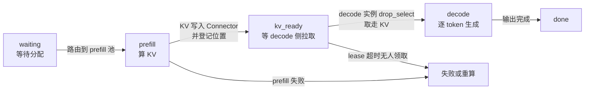

7.1 证明了混批的互扰能把 Decode 的 P95 TPOT 拖慢 3-5 倍，7.2 给了三套解耦设计——但解耦不是免费的：**它把“单池里的一个问题”变成了“系统层面的四个新问题”**。KV 要跨节点搬家（7B 模型 2048 长度的 KV 约 4GB，IB 200Gb/s 也要 ~160ms），调度器要从“装填一个池子”变成“协调两个池子加一条传输链路”，两个池子的负载还不一定同时到（白天交互多、夜间批处理多），更糟的是故障域从“一个实例挂”变成“双池任一挂都影响服务”。这一节把四个问题逐个钉死，然后回答学习路线 3.5 的压轴题：给定“平均 prompt 2000 token、平均输出 500 token”的负载，怎么推导 Prefill 池和 Decode 池的配比（社区经验值 1:3~1:4），以及什么时候这笔账根本不划算——**解耦是给“大客流 + 严格 SLO”准备的，小馆子别学大酒店开两个厨房**。

<!-- more -->

## 📑 目录

- [1. 解耦带来的四个新问题](#1-解耦带来的四个新问题)
- [2. P/D 资源配比：从工作负载推导 GPU 池](#2-pd-资源配比从工作负载推导-gpu-池)
- [3. 配比的动态性：静态配比为什么浪费](#3-配比的动态性静态配比为什么浪费)
- [4. 调度器复杂度：请求生命周期状态机](#4-调度器复杂度请求生命周期状态机)
- [5. 什么时候不该解耦：固定成本账本](#5-什么时候不该解耦固定成本账本)
- [6. 权衡与决策规则](#6-权衡与决策规则)
- [总结](#-总结)
- [自我检验清单](#-自我检验清单)
- [参考资料](#-参考资料)

---

## 1. 解耦带来的四个新问题

### 1.1 收费站分道：治好了互扰，来了新麻烦

7.1 打过一个比方：混批就像高速公路收费站只开了一条混行车道，ETC 小车（短 Decode）被 8000 吨重卡（长 Prefill）压住，跟着龟速。解耦做的事情，就是**把这条混行车道隔成两条专道**——ETC 专道（Prefill 池）和人工道（Decode 池），各走各的，谁也不用等谁。

分道确实治好了互扰。但收费站从“一条道”变成“两道 + 一条引道”之后，新麻烦跟着来了：

| 分道后的新问题 | 对应到解耦架构 |
|---|---|
| 在 ETC 道办完手续的车，要开到人工道去排队——怎么过去、要多久 | KV 从 Prefill 节点搬到 Decode 节点（[7.3 的传输与 Connector](/AIInfraGuide/inference/模块四-推理优化/第7章-pd解耦架构/73-kv传输与connector)） |
| 两道车流不均衡，一条道堵死、另一条道空着 | P/D 池负载不均，某一池空转 |
| 指示牌、闸机、跨道协调全都要新设计 | 调度器与请求生命周期管理变复杂 |
| 两道都得通，任何一道封路，服务就断 | 故障域从单实例扩大到双池 |

学习路线 3.5 的检验标准里有一条“风险清单”，要求你能列出解耦引入的新问题——上面这张表就是标准答案的四条。下面逐个展开，先算最硬的账：KV 传输带宽。

### 1.2 问题一：KV 传输带宽压力

解耦把“计算”拆开了，但 KV Cache 是拆不开的——**Prefill 节点算出来的 KV，必须原封不动搬到 Decode 节点**。先复习 6.2 的账本公式，算清一个请求的 KV 有多大：

$$
\underbrace{2}_{\text{K 和 V}} \times \underbrace{L}_{\text{层数}} \times \underbrace{h_{kv}}_{\text{KV 头数}} \times \underbrace{d}_{\text{每头维度}} \times \underbrace{2\text{B}}_{\text{FP16}} = \text{每 token 的 KV 字节数}
$$

代入 7B（32 层、32 头、head_dim=128）：

$$
2 \times 32 \times 32 \times 128 \times 2\text{B} = 512\text{KB/token}
\quad \Rightarrow \quad
\underbrace{512\text{KB} \times 2048}_{\text{2048 token 的序列}} \approx 1\text{GB/序列}
$$

学习路线 3.5 说“7B 模型 2048 长度的 KV 约 4GB”，这个数字我核对过：**单序列是 1GB，4GB 对应约 4 个并发请求同时把 KV 搬过去**（batch≈4 的批量传输口径，账本公式可自行验证）。再算传输时间：

$$
t = \frac{4\text{GB} \times 8\text{bit}}{200\text{Gb/s}} \approx \underbrace{160\text{ms}}_{\text{IB 200Gb/s 的理论传输时间}}
$$

**一个 2048 长度的请求，光把 KV 从 Prefill 节点搬到 Decode 节点，就要吃掉 160ms 的链路时间**——这还没算协议开销。如果 TTFT 的 SLO 是 500ms，这一项就占掉近三分之一。

💡 **提示**：160ms 是“串行 + 理论带宽”的最坏估计。生产系统靠三招把它藏起来：一是**传输与计算重叠**（Splitwise 实测：重叠后第二 token 延迟只增加 16.5%，串行传输则高达 64%）；二是**边算边传**（按层流水，prefill 算完第 $k$ 层就把第 $k$ 层的 KV 发走，不需要等整段算完）；三是**传输与下一次 prefill 重叠**（DistServe 的流水设计）。Splitwise 的实测里，非重叠传输时间约 8ms（A100）/ 5ms（H100），相对 prompt 计算开销 <7%。**KV 传输的工程细节在 [7.3](/AIInfraGuide/inference/模块四-推理优化/第7章-pd解耦架构/73-kv传输与connector) 展开，这里记住结论：带宽是硬约束，延迟可以靠重叠抹平。**

### 1.3 问题二：调度器队列管理复杂度

混批时，调度器只需要管一个池子：每步按 Token Budget 装填（2.4 讲过）。解耦后变成**两个池子 + 一条链路的三方协调**：

- 请求先进 Prefill 池的队列，等 prefill 算完；
- KV 写入 Connector 后，调度器要**知道“这份 KV 在哪、属于哪个请求”**；
- 然后请求进 Decode 池的队列，等 decode 实例把 KV 拉过去生成 token。

“KV 在哪”这个信息在单池时代根本不存在，现在成了调度器的核心状态——第 4 节专门讲请求生命周期状态机，这里先记下：**调度器从“装箱”问题变成了“分布式事务”问题（要跨两个池子协调状态）**，复杂度不是一个量级的。

### 1.4 问题三：P/D 池负载不均，某一池空转

解耦是按“两类请求的均值”配的池子，但真实流量是**两峰两谷、此消彼长**的：

- 白天交互密集：短对话多，输出 token 多，Decode 池吃紧，Prefill 池可能闲着；
- 夜间批处理（离线打分、数据标注）：长 prompt 涌入，Prefill 池爆满，Decode 池空转；
- 高峰期的比例，还和均值比例不是一回事——**按均值配比，高峰期必然有一边排队、一边空转**。

用回收费站的比方：ETC 专道是按“全天平均车流”修的，结果早高峰人工道堵了 200 米，ETC 道却一辆车都没有。空转的 GPU 是实打实付了钱的——**这就是为什么配比推导之后还要做动态扩缩容（第 3 节），而不是一配定终身**。

### 1.5 问题四：故障域扩大

混批时挂一个实例，是“这一个实例上的请求”遭殃；解耦后，**一个请求的生命周期横跨 prefill 实例、传输链路、decode 实例三段，任何一段出问题，这个请求就完不成**。打个比方：原来是一个人端菜上桌，他摔了，菜洒了；现在变成两个人接力传菜，第一棒（prefill）跑完把菜递给传送带（KV 传输），第二棒（decode）再端上桌——**任何一环断了，菜都到不了客人面前，而客人只会觉得“这家店不行”**。

故障域从“一个点”拉成“一条链”，意味着：传输失败要有重试或重算策略、decode 实例挂了要有重新 prefill 的路径、lease 超时要有兜底（第 4 节的状态机就是为这些场景设计的）。

### 1.6 风险清单汇总

📌 **关键点**：学习路线 3.5 要你背的不是“解耦好”，而是这张风险清单——**解耦的每一分收益，都对应一个必须管理的风险**：

| 风险 | 量化指标 | 缓解手段 |
|---|---|---|
| KV 传输带宽压力 | 4GB/4 序列，IB 200Gb/s ≈ 160ms | 传输与计算重叠、按层流水（[7.3](/AIInfraGuide/inference/模块四-推理优化/第7章-pd解耦架构/73-kv传输与connector)） |
| 调度复杂度 | 请求状态数从 2 个变 5 个+ | 状态机 + lease + 失败策略（第 4 节） |
| 池负载不均 | 某一池长期空转，利用率显著低于另一池（待实测） | 动态扩缩容（第 3 节、第 10 章） |
| 故障域扩大 | 链路任一点故障即请求失败 | 重试 / recompute / 多副本 |

---

## 2. P/D 资源配比：从工作负载推导 GPU 池

### 2.1 配比问题的本质是什么？

先问一个问题：**为什么不能直接“两个池子一样大”？** 因为 Prefill 和 Decode 每秒处理的 token 量完全不同。配比问题的本质是：

> **池子大小 ∝ 每秒需要处理的 token 流 ÷ 每 GPU 每秒能处理的 token 数**

三个负载输入：平均 prompt 长度 $I$、平均输出长度 $O$、QPS $q$（每秒请求数）。两个硬件参数：每 GPU 的 prefill 吞吐 $r_P$（token/s）、每 GPU 的 decode 吞吐 $r_D$（token/s）。

$$
\underbrace{N_P}_{\text{Prefill 池 GPU 数}} = \frac{q \times I}{r_P}, \qquad \underbrace{N_D}_{\text{Decode 池 GPU 数}} = \frac{q \times O}{r_D}
$$

两边一除，QPS 直接消掉——**配比只取决于负载特征（$I$、$O$）和硬件吞吐（$r_P$、$r_D$），与绝对请求量无关**：

$$
\boxed{\frac{N_P}{N_D} = \frac{I / r_P}{O / r_D}}
$$

这个公式是本节的主线，下面一步步把它用起来。

### 2.2 第一步：算计算量比例（2000 ： 500 = 4 ： 1）

学习路线 3.5 的检验标准给定负载：平均 prompt 2000 token、平均输出 500 token。先算一个请求在两阶段的 FLOPs。Transformer 前向每个 token 的 FLOPs ≈ $2 \times H \times L$（$H$ 为 hidden size，$L$ 为层数，每参数约 2 次 FLOPs）：

$$
\underbrace{\text{FLOPs}_{\text{prefill}}}_{\text{一个请求的 P 阶段}} \approx \underbrace{2 \times H \times L}_{\text{每 token 前向}} \times \underbrace{2000}_{\text{平均 prompt 长度}}
\qquad
\underbrace{\text{FLOPs}_{\text{decode}}}_{\text{一个请求的 D 阶段}} \approx 2 \times H \times L \times \underbrace{500}_{\text{平均输出长度}}
$$

$$
\frac{\text{FLOPs}_{\text{prefill}}}{\text{FLOPs}_{\text{decode}}} = \frac{2000}{500} = \boxed{4:1}
$$

**结论：从计算量看，一个请求的 prefill 是 decode 的 4 倍**。如果你按这个比例配 GPU 池——4 台 prefill、1 台 decode——那就大错特错了，原因在下一步。

### 2.3 第二步：从“计算量比例”到“GPU 池比例”的关键修正

为什么 4:1 的算力比例不能直接变成 4:1 的 GPU 比例？因为 **decode 是 memory bound，每台 GPU 每秒产出的 token 数，远低于 prefill 每台 GPU 每秒吃进的 token 数**（第 1 章的两个阶段结论）：

- prefill GPU：compute bound，可以跑到很高的 MFU（矩阵乘全占满），$r_P$ 是**数千 token/s** 量级；
- decode GPU：每生成一个 token 都要把整份权重从 HBM 读一遍（7B FP16 就是 14GB），瓶颈是带宽不是算力，$r_D$ 只有 **100~300 token/s** 量级。

所以 $r_P$ 和 $r_D$ 差着一个数量级，必须代进 2.1 的公式，用**两组硬件参数分别算**。

### 2.4 数值算例：两组硬件的配比

**算例 A：7B FP16，A100 单卡**（估算口径：权重 14GB/卡，A100 带宽 ~2TB/s × 70% 效率 → $r_D \approx 100\sim140$ token/s；BF16 算力 312 TFLOPS × 40% MFU ÷ 每 token 14 GFLOP → $r_P \approx 5000\sim8000$ token/s）：

$$
\frac{N_P}{N_D} = \frac{2000 / 6000}{500 / 120} = \frac{0.33}{4.17} \approx 1 : 12
$$

**算例 B：70B FP8，H100 单机 TP8**（估算口径：FP8 权重 70GB ÷ TP8 = 每卡 8.75GB，H100 ~3.35TB/s × 70% → $r_D \approx 250\sim300$ token/s；FP8 算力 ~1979 TFLOPS × 25~40% MFU ÷ 每 token 140 GFLOP → $r_P \approx 3500\sim5500$ token/s）：

$$
\frac{N_P}{N_D} = \frac{2000 / 4500}{500 / 260} = \frac{0.44}{1.92} \approx 1 : 4
$$

📌 **关键点**：同一个负载，两组硬件算出来的配比是 1:12 和 1:4——**配比不是常数，是“负载 × 硬件”的函数**。学习路线 3.5 的 1:3~1:4 经验值，对应的正是算例 B 这类生产配置（大模型 + FP8 + TP 分片）：FP8 让 decode 每卡读的权重减半，TP8 再除以 8，decode 单卡吞吐翻了几倍，Decode 池相对就没那么“饿”了。为什么 7B 单卡反而要 1:12？因为 decode 每卡读 14GB 权重，而 prefill 每卡吃 token 的速度又太快——**模型越小、精度越宽，Decode 池占比越大**。

⚠️ **注意**：以上为估算值，$r_P$、$r_D$ 的 MFU/带宽效率假设不同，结果会明显漂移。**正确姿势是把公式当骨架，用你自己的压测数字填肉**（7.6 的实验二就是这么干的）。

### 2.5 敏感性：负载一变，配比就变

把公式里的 $I$、$O$ 拨一拨，看配比怎么动（以算例 B 为基准）：

| 负载变化 | 计算量比例 | 配比（算例 B 硬件） | 现实场景 |
|---|---|---|---|
| 2000 in / 500 out（基准） | 4:1 | ≈ 1:4 | 常规对话 |
| 2000 in / 2000 out | 1:1 | ≈ 1:17 | 长文生成、agent 多轮推理 |
| 8000 in / 500 out | 16:1 | ≈ 1:1 | 长文档问答、RAG |
| 2000 in / 500 out，但并发翻倍 | 4:1 | 不变（只加总 GPU 数） | 扩容不改变配比 |

再看生产锚点，配比随负载摆动的幅度有多大：

- **SGLang 部署 DeepSeek-R1（2025，96 张 H100）**：3 个 prefill 节点 + 9 个 decode 节点，**24P ： 72D = 1:3**——R1 是推理模型，输出长，但 prefill 用满算力，所以落在 1:3；
- **Splitwise 论文的成本最优设计**：编码负载 **27 台 prompt ： 3 台 token（9:1）**，对话负载 **25P ： 15T（5:3）**——编码任务 prefill 极重，配比直接倒挂；
- **DeepSeek 官方 DeepSeek-V3/R1 生产部署**：prefill 4 节点（32 卡）对 decode 40 节点（320 卡），**1:10**（6.6 引过）。

💡 **提示**：1:3~1:4 之所以流传最广，是因为“平均 2000 in / 500 out 的对话负载 + FP8 大模型”是最常见的生产组合。**面试官考你“1:3 哪来的”，你要能答出公式和两条腿：计算量比例 4:1 + decode 带宽瓶颈修正**，而不是背一个数。

### 2.6 方法论小结：配比的四步走

1. **算账**：用 $N_P/N_D = (I/r_P)/(O/r_D)$ 拿自己的负载和硬件参数算出初值；
2. **定 SLO**：TTFT 由 prefill 池决定，TPOT 由 decode 池决定（[7.4 的 goodput 口径](/AIInfraGuide/inference/模块四-推理优化/第7章-pd解耦架构/74-goodput与slo调度)）；
3. **压测校准**：固定负载和总 GPU 数，扫描配比，画 goodput 曲线找平台（7.6 实验二）；
4. **持续监控**：负载漂移了，配比要跟着动（下一节）。

---

## 3. 配比的动态性：静态配比为什么浪费

### 3.1 负载是时变的，配比不是

2.5 的锚点都是“某个时刻的负载”。真实线上负载是**随时间漂移的**：白天交互密集（输出多、Decode 池吃紧），深夜批处理（长 prompt 多、Prefill 池吃紧），周末和发布会前后整体流量还可能翻倍。打个比方：**静态配比像一张固定排班表——按“平均客流”排的班，遇上早高峰必然一边爆满一边闲着**；排班表本身没错，错的是它不会自己改。

### 3.2 按峰值配 = 大部分时间空转

有人会说：那按最坏情况配呗。算笔账：如果白天 Decode 池需求是夜间的 3 倍，按峰值把 Decode 池配满，夜间就有 2/3 的 decode GPU 空转——**空转的 GPU 一样付电费、一样算成本，只是不产出**。而两个池子的峰值还往往**错峰到达**（交互高峰和批处理高峰不是同一时刻），静态配比只能顾一头。

### 3.3 动态扩缩容：每个池子独立伸缩

解耦架构的一个隐藏红利，就是**两个池子天然是独立的伸缩单元**——这正好是第 10 章 10.3 讲的 HPA 的用武之地：

- **按池独立扩缩容**：Prefill 池和 Decode 池各自的副本数独立伸缩，指标可以用 QPS、队列长度、KV 利用率（第 10 章口径）；
- **以“副本”为最小单位**：扩缩容的粒度是完整的 vLLM 实例（TP 组内不能拆，6.2 讲过），新增一个副本 = 新增一台可被路由的实例；
- **官方工具已经支持**：Ray Serve 的 prefill/decode 部署文档里，prefill 与 decode 各自带 `autoscaling_config`（官方示例：prefill min 2 / max 4，decode min 6 / max 10）；vLLM 官方 XpYd 代理示例也提供 `/instances/add` 接口动态注册新实例。

### 3.4 动态化的新代价

动态扩缩容不是免费的：实例拉起要加载权重（分钟级）、缩容要等存量请求排空、KV 位置随实例漂移后路由表要更新。**先静态配比跑稳，再上动态扩缩容**——顺序反了，你会同时调试两个变量，出了问题都不知道怪谁。

---

## 4. 调度器复杂度：请求生命周期状态机

### 4.1 双池队列与路由

解耦后的调度器要回答三个问题：请求发给哪个 prefill 实例？KV 存到哪、谁负责通知 decode？decode 实例怎么知道“我的 KV 就绪了”？这就是为什么生产解耦架构都要一个**代理/路由层**（vLLM 官方示例的 proxy、Ray Serve 的 `build_pd_openai_app`、7.2 提过的 MLC Microserving 可编程路由）。原因很简单：**单池时代“请求自己会走”的假设，解耦后不成立了——必须有人记得每份 KV 在哪**。

### 4.2 请求生命周期：从 2 个状态到 5 个状态

混批时请求只有两个阶段（prefill → decode），解耦后变成一条带传输和等待的状态链：

每个状态迁移都是一次潜在的失败点：prefill 挂了、KV 丢了、decode 队列积压导致 KV 等太久、传输链路断了——**状态越多，要处理的异常分支越多**。

### 4.3 超时与重试：KV Lease 机制

最关键的兜底机制是 **KV lease（租约）**：prefill 完成后，KV 不会永远留在缓冲区等人来取，而是**只保留一段时间**。vLLM 的 NixlConnector 默认 `kv_lease_duration = 30s`：prefill 完成后的 KV 块保留 30 秒等 decode 读取；decode 排队期间通过心跳（heartbeat）自动续期；**如果既没心跳也没读取，lease 一到就释放 KV 块**。这个设计防止了“prefill 算完没人管，KV 把缓冲区撑爆”——但代价是：decode 侧积压超过 lease 的请求，会**拿不到 KV**。

### 4.4 故障转移：失败之后怎么办

KV 拿不到、传输失败之后，vLLM 的 `kv_load_failure_policy` 给了两个选项（以你所用版本的文档为准）：

- **`fail`（默认）**：请求直接失败返回。好处是 decode 实例绝不掺入 prefill 计算，性能稳定；坏处是用户看到报错；
- **`recompute`**：decode 实例本地重算缺失的 KV 块。好处是请求还能完成；坏处是 decode 实例要临时干 prefill 的活——**这正是解耦要消灭的互扰，以另一种形式回来了**，官方文档原话是“可能引起 decode 实例的性能抖动”。

decode 实例本身挂了则更直接：请求要重新走 prefill，或者靠“多副本 decode + 路由重试”（第 6 章的 DP 形态）兜底。**解耦系统的可靠性设计，本质是给这条状态链的每个环节准备一个“如果失败怎么办”的答案。**

---

## 5. 什么时候不该解耦：固定成本账本

### 5.1 解耦的固定成本清单

前面都在讲“解耦的麻烦”，这一节算总账——**解耦有固定成本，与小流量无关**：

| 成本项 | 量化（以 70B FP16 为例） | 说明 |
|---|---|---|
| 双份模型权重 | 140GB × 2 = 280GB 显存 | 两个池子各存一份完整权重，这是最大的隐性开销 |
| 网络设施 | IB 200Gb/s 或高速 RoCE/以太网 | KV 传输的带宽硬约束（1.2 的账本） |
| 代理/路由层 | 新增一个服务 + 状态维护 | 请求生命周期、KV 位置登记、失败重试 |
| 每请求传输延迟 | +几十 ms（重叠后可忽略，[7.3](/AIInfraGuide/inference/模块四-推理优化/第7章-pd解耦架构/73-kv传输与connector)） | 串行时 TTFT 增加 16.5%~64%（Splitwise 实测） |
| 运维与排错 | 双倍实例、双倍日志、新故障面 | 第 4 节的每个状态都要监控 |

### 5.2 收益什么时候追不上成本？

解耦的收益是“尾延迟变稳、goodput 变高”，但**如果互扰本来就不严重，收益就是零，成本却一分不少**。用 7.1 的诊断标准过一遍：

- **请求量小**：低 QPS 下长 prefill 很少和 decode 撞车，互扰不严重——解耦白付双份权重的钱；
- **prompt 短**：平均几百 token 的 prefill 单步算完就走，2.4 的 Chunked Prefill 已经够用，不需要分池；
- **SLO 宽松**：没有 TTFT/TPOT 的硬约束（离线批处理），P95 抖一抖无所谓——互扰的“病”都不算病；
- **单池能满足**：7.1 的复现协议跑下来，P95 TPOT 差距 <2 倍——**没确诊的病，别开刀**。

### 5.3 决策规则表

| 场景特征 | 诊断 | 结论 |
|---|---|---|
| 高并发在线 + 长 prompt 混合 + 严格尾延迟 SLO | 互扰确诊（P95 TPOT ≥2 倍） | ✅ 解耦 |
| 低 QPS / prompt 短 / 离线批处理 | 无病可治 | ❌ 别解耦 |
| 有硬 SLO 但流量小 | 解耦收益 < 双份权重成本 | ❌ 先单池 + Chunked Prefill（2.4） |
| 流量大但只有 TTFT 敏感（如 RAG 检索问答） | 病在 prefill 不在 decode | ⚠️ 只扩 prefill 池或先试切块，不必全解耦 |

### 5.4 一个反直觉点：解耦不提升吞吐

vLLM 官方文档对 Disaggregated Prefill 有一句加粗级别的声明：**“Disaggregated prefill DOES NOT improve throughput.”**（解耦不提升吞吐）。想提吞吐，靠的是 Continuous Batching（[2.2](/AIInfraGuide/inference/模块四-推理优化/第2章-推理引擎核心技术/22-continuous-batching)，利用率 30%→80%+）和数据并行副本（[6.4](/AIInfraGuide/inference/模块四-推理优化/第6章-分布式推理/64-数据并行与专家并行)）；解耦只治“尾延迟”这一种病。**把解耦当吞吐优化器用，是典型的药不对症。**

---

## 6. 权衡与决策规则

### 6.1 牺牲了什么，换取了什么

对齐学习路线第 3 章的思维模型表：

| 解耦 | 牺牲 | 换取 |
|---|---|---|
| Prefill/Decode 分池 | 系统复杂度 + KV 迁移开销 + 双份权重显存 + 故障域扩大 | 尾延迟稳定 + goodput 提升 |

DistServe 的实测给这个交换标了价：解耦后同样的 GPU 能服务 **7.4 倍请求**或扛 **12.6 倍更紧的 SLO**（>90% 请求达标）；Splitwise 换了个角度：**1.4 倍吞吐 + 省 20% 成本**（或同成本 2.35 倍吞吐）；TaiChi 则证明聚合与解耦不必二选一，统一框架下 goodput 最高再提升 **77%**。**这些数字的前提都是：负载够大、SLO 够严、互扰够重。**

### 6.2 落成一句话的规则

- ✅ **高并发 + 严格尾延迟 SLO + 长 prompt 混合负载** → 解耦，配比按 $(I/r_P):(O/r_D)$ 算初值，再压测校准。
- ✅ **流量大到单池 P95 确诊互扰（≥2 倍）** → 解耦；池子独立扩缩容（第 10 章 HPA）。
- ❌ **小规模、短 prompt、宽松 SLO** → 别解耦——双份权重的固定成本是白付的，Chunked Prefill（2.4）先顶着。
- ❌ **想提吞吐** → 解耦帮不了你（官方声明不提升吞吐），去上 Continuous Batching（[2.2](/AIInfraGuide/inference/模块四-推理优化/第2章-推理引擎核心技术/22-continuous-batching)）和 DP 副本（[6.4](/AIInfraGuide/inference/模块四-推理优化/第6章-分布式推理/64-数据并行与专家并行)）。
- ⚠️ **配比别拍脑袋**：先算账、再实验、后监控，1:3 是经验值不是定律。

下一节（7.6）把这套账落到 vLLM：双实例怎么起、代理怎么路由、互扰实验和配比实验怎么做、KV 传输失败怎么排错。

---

## 📝 总结

1. **四个新问题**：KV 传输带宽（4GB/4 序列、IB 200Gb/s ≈ 160ms）、调度复杂度（状态机 + lease）、池负载不均（空转浪费）、故障域扩大（链路任一点断裂即失败）——这就是学习路线 3.5 要你背的风险清单。
2. **配比推导**：$N_P/N_D = (I/r_P)/(O/r_D)$，QPS 自动消掉；2000/500 负载的计算量比例是 4:1，但 decode 的带宽瓶颈修正后，FP8 大模型（TP 分片）落 1:3~1:4，7B FP16 单卡落 ~1:10~1:15——配比是“负载 × 硬件”的函数。
3. **动态性**：静态配比按均值配，峰值必然一边排队一边空转；解耦的隐藏红利是两池独立伸缩（第 10 章 HPA、Ray Serve 按池 autoscaling）。
4. **调度复杂度**：请求从 2 状态变 5+ 状态的状态链，KV lease（默认 30s + 心跳续期）与 fail/recompute 两种失败策略是可靠性底座。
5. **固定成本**：双份权重 + 网络 + 代理 + 传输延迟；小规模/短 prompt/宽松 SLO 时收益追不上成本——解耦不提升吞吐，只治尾延迟。
6. **权衡一句话**：牺牲系统复杂度 + KV 迁移开销 + 双份显存，换取尾延迟稳定与 goodput（DistServe 7.4x/12.6x、Splitwise 1.4x+省 20%、TaiChi +77%）。

## 🎯 自我检验清单

- 能列出解耦引入的四个新问题，并各配一个量化指标（如 KV 4GB@2048、IB 200Gb/s ≈ 160ms）
- 能手算 7B 模型每 token 的 KV 字节数（512KB）与 2048 序列的 KV 总量（~1GB），误差不超过 20%
- 能解释为什么学习路线的“4GB”对应约 4 个并发序列，并验证 160ms = 4GB×8bit ÷ 200Gb/s
- 能推导 2000/500 负载的 prefill:decode 计算量比例（4:1），并说明为什么不能直接当 GPU 配比用
- 能写出 $N_P/N_D = (I/r_P)/(O/r_D)$，并代入两组硬件参数（7B/A100 与 70B/H100-FP8-TP8）各算出一个配比
- 能解释同一负载下 1:12 与 1:4 两种配比差异的机制（decode 带宽瓶颈、FP8、TP 分片）
- 能说出 1:3~1:4 经验值的适用前提，以及负载敏感性（输出变长 → decode 池需求线性放大）
- 能画出请求生命周期状态机，并指出 lease 超时、传输失败、decode 故障三个兜底节点
- 能解释 KV lease 的作用（默认 30s、心跳续期、过期释放）以及 `kv_load_failure_policy` 的 fail/recompute 取舍
- 能解释静态配比为什么浪费（峰值错峰、按均值配必有一边空转），并说出动态扩缩容的最小单位
- 能判断“什么时候不该解耦”，给出固定成本清单（双份权重、网络、代理、传输延迟）至少 3 项
- 能向老板一句话讲清“解耦不提升吞吐，只治尾延迟”（官方文档声明），并指出提吞吐该用什么

## 📚 参考资料

**论文**

- [DistServe: Disaggregating Prefill and Decoding for Goodput-optimized LLM Serving - Zhong et al., OSDI 2024](https://arxiv.org/abs/2401.09670)（7.4x 请求 / 12.6x SLO、goodput 调度、传输重叠设计）
- [Splitwise: Efficient Generative LLM Inference Using Phase Splitting - Patel et al., ISCA 2024](https://arxiv.org/abs/2311.18677)（1.4x 吞吐省 20% 成本、27P:3T / 25P:15T 集群设计、KV 传输 16.5% vs 64% 实测）
- [Prefill-Decode Aggregation or Disaggregation? Unifying Both for Goodput-Optimized LLM Serving（TaiChi）- Wang et al., 2025](https://arxiv.org/abs/2508.01989)（聚合/解耦统一框架，goodput 最高 +77%）
- [A System for Microserving of LLMs - Jin et al., 2024](https://arxiv.org/abs/2412.12488)（可编程路由把编排策略变成几行 Python，JCT 最高降 47%）

**官方文档与博客**

- [vLLM - Disaggregated Prefilling 文档（"不提升吞吐"官方声明、Connector 列表）](https://docs.vllm.ai/en/latest/features/disagg_prefill.html)
- [vLLM - NixlConnector Usage Guide（kv_lease_duration、kv_load_failure_policy、side channel 端口）](https://docs.vllm.ai/en/latest/features/nixl_connector_usage.html)
- [Ray Serve - Prefill/decode disaggregation（按池 autoscaling 示例：prefill 2~4、decode 6~10）](https://docs.ray.io/en/latest/serve/llm/user-guides/prefill-decode.html)
- [Disaggregated Inference: 18 Months Later - Hao AI Lab, 2025（SGLang R1 24P:72D=1:3 等生产锚点）](https://haoailab.com/blogs/distserve-retro/)

**站内**

- [AI Infra 学习路线（3.5 配比推导与风险清单检验标准）](/AIInfraGuide/guides/ai-infra学习路线)
- [7.1 混合 Batching 的互扰问题（互扰 3-5 倍与复现协议）](/AIInfraGuide/inference/模块四-推理优化/第7章-pd解耦架构/71-混合batching互扰分析)
- [7.2 解耦架构设计（DistServe/Splitwise/TaiChi 与好处的量化）](/AIInfraGuide/inference/模块四-推理优化/第7章-pd解耦架构/72-解耦架构设计)
- [6.2 张量并行推理（KV 按头切分与每卡容量账本）](/AIInfraGuide/inference/模块四-推理优化/第6章-分布式推理/62-张量并行推理)
- [6.6 vLLM 分布式部署实战（DeepSeek R1 32P:320D 锚点）](/AIInfraGuide/inference/模块四-推理优化/第6章-分布式推理/66-vllm分布式部署实战)
- [2.4 Chunked Prefill 与统一调度（单池方案的替代药方）](/AIInfraGuide/inference/模块四-推理优化/第2章-推理引擎核心技术/24-chunked-prefill-与统一调度)
- [第 10 章 生产部署与运维（10.3 自动扩缩容与 HPA）](/AIInfraGuide/inference/模块四-推理优化/第10章-生产部署与运维)
