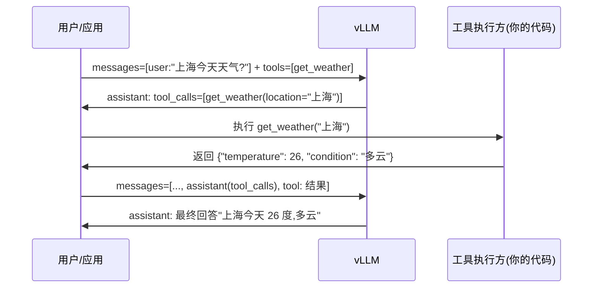

Agent 场景下，模型输出的不是答案，而是**动作**：调用哪个工具、传什么参数。Tool Calling 让这个动作走 OpenAI 兼容的 `tools` / `tool_choice` 协议，而 vLLM 对它的定位很诚实——对通用模型，`tool_choice=required` 或命名函数调用走 8.1 的 schema 约束，只保证参数**可解析**,官方原话是“guaranteed validly-parsable, not high-quality”。另一面是推理模型：DeepSeek-R1 的思考链可以长达数千 token,不解析出来，下游要么把内心戏当答案，要么为它多付几倍的 KV 与带宽。本文讲清协议语义、vLLM 的工具解析器、一次工具调用的完整消息流，以及 `--reasoning-parser` 的解析机制与工程陷阱。

<!-- more -->

## 📑 目录

- [1. 为什么需要 Tool Calling](#1-为什么需要-tool-calling)
- [2. 两种范式:原生 Function Calling 与通用模型加约束](#2-两种范式原生-function-calling-与通用模型加约束)
- [3. vLLM 的 Tool Calling 支持](#3-vllm-的-tool-calling-支持)
- [4. 一次工具调用的完整消息流](#4-一次工具调用的完整消息流)
- [5. Reasoning Parser:把思考与回答分开](#5-reasoning-parser把思考与回答分开)
- [6. 工程陷阱:KV 增长、超时与循环防护](#6-工程陷阱kv-增长超时与循环防护)
- [7. 权衡与落成一句话](#7-权衡与落成一句话)
- [总结](#-总结)
- [自我检验清单](#-自我检验清单)
- [参考资料](#-参考资料)

---

## 1. 为什么需要 Tool Calling

### 1.1 模型要输出“动作”,而不是“文字”

聊天场景里，模型输出的唯一形式是文本；但一旦进入 Agent 场景——查天气、调数据库、发订单、执行代码——文本就不够了。模型必须输出**结构化的动作**：工具名 + 参数 JSON,让应用代码去执行，再把结果喂回给模型继续推理。

这就是 Tool Calling（又称 Function Calling）存在的理由。OpenAI 定了一套协议，各推理引擎（包括 vLLM）都兼容它：

- **请求侧**：`tools` 数组声明“有哪些工具可用”（工具名、描述、参数 JSON Schema），`tool_choice` 声明“怎么选工具”;
- **响应侧**：assistant 消息里带 `tool_calls` 数组（每个元素含工具名 + 参数字符串）；
- **后续轮次**：工具执行结果以 `role: "tool"` 的消息（带 `tool_call_id` 对应回哪次调用）塞回上下文。

🔑 **核心概念**：Tool Calling = **在 OpenAI 兼容协议里，把“模型该说什么”扩展成“模型该做什么”**。工具定义是 schema,工具调用是结构化输出——这正是 8.1 的用武之地。

### 1.2 为什么不能靠“模型自己把调用写进文本”？

可以，但代价是脆弱：模型用自然语言说“我现在要调用 get_weather，参数是上海”。你的应用得写解析器去猜这句话的意图，而模型可能把参数写成“Shanghai”或“上海”或“sh”，格式千奇百怪。Tool Calling 的价值是**把动作的格式也变成协议的一部分**，解析失败率从“看模型心情”变成“引擎保证”。至于保证到什么程度，正是第 2 节要讲的两种范式。

---

## 2. 两种范式：原生 Function Calling 与通用模型加约束

### 2.1 范式一：原生 Function Calling（模型微调过工具语法）

一批模型（如 Qwen2.5-Instruct、Hermes、DeepSeek-V3、Llama-3.1）在训练时专门喂过工具调用数据，学会了“看到工具定义 → 输出固定格式的调用”这件事。它们配合**专门的 chat template**（把工具定义渲染成模型见过的格式）和**tool parser**（从原始输出里把调用解析出来），`tool_choice=auto` 下就能自主决定“这次要不要调工具、调哪个”。

### 2.2 范式二：通用模型 + 结构化输出约束（8.1 的 schema 约束）

任何模型——哪怕没训练过工具语法——都可以被“逼”出合法调用：把工具参数 schema 塞进 prompt，再用 8.1 的受限解码把输出约束成该 schema。vLLM 里 `tool_choice=required` 和命名函数调用就是这么做的：走 structured outputs 后端，**参数 JSON 保证可解析，但不保证质量**。模型可能选错工具、给错参数值，只是格式永远合法。

打个比方：范式一像**训练有素的售货员**——看到顾客（工具定义）就知道怎么招呼，熟门熟路；范式二像**给一台自动售货机配上严格的收银规则**——投币金额必须正确（格式合法），但顾客想买什么、买得对不对，规则管不了。售货员更聪明，但培养成本高；收银规则谁都能配，只保证流程不出错。

### 2.3 对比表

| 📊 维度 | 原生 Function Calling | 通用模型 + 约束 |
|---|---|---|
| 前置条件 | 模型微调过 + 匹配的 parser/chat template | 任意模型，引擎侧约束 |
| 调用质量 | 高（选得准、参数合理） | 格式保证，内容不保证 |
| tool_choice=auto | ✅ 自主决定是否调用 | ⚠️ auto 下多数后端不做 schema 约束，靠 parser 从文本里抠 |
| 引擎负担 | parser 按模型格式定制 | 走 8.1 的 FSM 编译（首请求有编译延迟） |
| 适用 | 生产 Agent 主力 | 模型没调过工具、或只要“解析零失败” |

📌 **关键点**：两种范式不是二选一，而是**同一套协议上的两个实现层次**。vLLM 的 auto 模式默认走“模型自主生成 + parser 解析”;required/命名函数走“约束生成”。你要根据模型能力选层次。

---

## 3. vLLM 的 Tool Calling 支持

### 3.1 开启方式：两个开关

以 vLLM 近期版本为例，`tool_choice=required` 和命名函数调用**默认可用**（走结构化输出后端，无需额外参数）；`auto` 模式需要显式开启：

```bash
# auto 模式:模型自主决定是否调用工具
vllm serve Qwen/Qwen2.5-7B-Instruct \
  --enable-auto-tool-choice \        # 必选:允许模型自主生成工具调用
  --tool-call-parser hermes          # 选解析器(按模型系列)
  # --chat-template <path>           # 部分模型需要指定工具版 chat template
```

`--tool-call-parser` 按模型系列选：Qwen2.5/QwQ-32B 用 `hermes`、Llama-3.1/3.2 用 `llama3_json`、Llama-4 用 `llama4_pythonic`、Mistral 用 `mistral`、DeepSeek-V3 用 `deepseek_v3`、Qwen3-Coder 用 `qwen3_xml`、OpenAI gpt-oss 用 `openai`……解析器列表随版本增长，认准官方文档；**找不到你模型的 parser 时，可以用 `--tool-parser-plugin` 注册自己的解析器**（实现 `extract_tool_calls` / `extract_tool_calls_streaming` 两个方法）。

⚠️ **注意**：`--tool-call-parser` 里填 `auto` 并不会“自动探测”——文档里 `auto` 仅对 Mistral 系列有特殊含义（用 Mistral 官方 tokenizer 格式）。对绝大多数模型，你要**显式写对解析器名**,写错会解析失败或解析出空调用。

### 3.2 tool_choice 的四种取值

| tool_choice 取值 | 语义 | 是否走 schema 约束 |
|---|---|---|
| `"none"` | 不生成任何工具调用，纯文本回答 | 不适用 |
| `"auto"` | 模型自己决定调不调、调哪个 | 默认不约束；对工具标 `strict: true` 才约束参数 |
| `"required"` | 必须生成至少一次工具调用 | ✅ 走结构化输出，参数保证合法 |
| `{"type":"function","function":{"name":"get_weather"}}` | 必须调用指定工具 | ✅ 同上 |

两个默认行为细节（易踩坑）：

- **给了 `tools` 但没写 `tool_choice` → 默认 `auto`**;
- **`tool_choice="none"` 时，工具定义默认仍然会塞进 prompt**（占 token、可能诱导模型输出调用），不想塞就加启动参数 `--exclude-tools-when-tool-choice-none`。

💡 **提示**：`auto` 模式下要不要对参数做 schema 约束，由工具定义里的 `strict: true` 决定（全局开关 `VLLM_ENFORCE_STRICT_TOOL_CALLING`,默认 true）。开了 strict 且 parser 支持 structural tag 时，vLLM 用 8.1 的 structural_tag 约束把参数“钉死”成合法 JSON;没开 strict 时，工具调用从原始文本里抠，偶尔会出现参数格式不合法——这是“解析器模式”的固有代价。

### 3.3 首次调用的隐藏成本：FSM 编译

命名函数调用 / `required` 走结构化输出后端，意味着**第一次用某个 schema 时要编译 FSM**——官方文档明说：首次使用时会有**数秒甚至更长的延迟**,编译结果缓存后，后续请求正常。生产里建议：上线前用工具 schema 预热一次（发一个 dummy 请求），别让第一个真实用户承担这几秒。

---

## 4. 一次工具调用的完整消息流

### 4.1 三轮消息走一遍

以“查上海天气”为例，完整链路是四次消息轮次：



对应的请求侧消息结构（第二轮的 `messages` 长这样）：

```json
{
  "messages": [
    {"role": "user", "content": "上海今天天气?"},
    {"role": "assistant", "tool_calls": [
      {"id": "call_001", "type": "function",
       "function": {"name": "get_weather", "arguments": "{\"location\": \"上海\"}"}}
    ]},
    {"role": "tool", "tool_call_id": "call_001",
     "content": "{\"temperature\": 26, \"condition\": \"多云\"}"}
  ],
  "tools": [{"type": "function", "function": {
      "name": "get_weather",
      "parameters": {"type": "object",
                     "properties": {"location": {"type": "string"}},
                     "required": ["location"]}}}]
}
```

📌 **关键点**：`role: "tool"` 的消息必须带 `tool_call_id`,与 assistant 的 `tool_calls[].id` 一一对应——**这是协议层的关联键**,对不上号，chat template 渲染就会出错或模型看不懂。应用侧的职责（官方文档原话）：定义工具、把上下文喂给模型、在应用逻辑里处理工具调用——引擎不替你执行工具。

### 4.2 并行工具调用

一个请求里 `tool_calls` 可以带多个元素（比如同时查上海和北京的天气）。注意：

- **支持度因解析器而异**：Hermes、DeepSeek-V3、pythonic 系解析器支持并行；**Llama-3.x 不支持并行工具调用**（官方文档已知问题），Llama-4 才支持；
- 请求参数里的 `parallel_tool_calls` 字段 **vLLM 会忽略**（协议源码注释原话）——调不调并行由模型和解析器决定，不是客户端能强制开的；
- 工具结果也按序塞回：每个 `tool` 消息对应一次调用的 `tool_call_id`,并行调用 N 次就回 N 条 tool 消息。

---

## 5. Reasoning Parser：把思考与回答分开

### 5.1 为什么需要：思考链不该当答案返回

DeepSeek-R1 这类推理模型的输出分两段：`<think>` 包裹的**思考链(CoT)**和之后的**最终回答**。R1 论文明说思考链可以长达数千 token。不解析的后果：

1. **下游拿错东西**：把“让我一步步想……”的内心戏当成最终答案返回给用户；
2. **白付 token 和 KV**：思考链占输出的大头，流式返回给客户端、写进日志、喂回上下文，全是浪费；
3. **评测失真**：评测通常只比对最终答案，带思考链的原始输出会把指标搞乱。

所以引擎需要**在流式返回时就地把思考链和回答切开**——这就是 Reasoning Parser。

### 5.2 vLLM 的 --reasoning-parser

```bash
# DeepSeek-R1 系列(以及 QwQ-32B)用 deepseek_r1 解析器
vllm serve deepseek-ai/DeepSeek-R1-Distill-Qwen-7B --reasoning-parser deepseek_r1
```

解析器按 `<think>` / `</think>` 边界切分，返回两个字段：

- `message.reasoning`：思考链（流式时在 `delta.reasoning` 里）；
- `message.content`：最终回答。

支持的解析器随版本演进：DeepSeek R1 系用 `deepseek_r1`、Qwen3 系用 `qwen3`、GLM-4.5 用 `glm45`、DeepSeek-V3.1 用 `deepseek_v3` 等（与工具解析器同名但各管一摊）。两个易错点：

- 字段名：`reasoning_content` 是旧名，现在统一叫 `reasoning`,**客户端还在读旧字段会静默拿到空值**（官方迁移警告原话）；
- 有推理解析器时，**工具调用只从 `content` 里解析，不碰 `reasoning`**——思考链里即使出现“我想调用 X”也不会被当成真调用。

### 5.3 控制思考的工程参数

| 参数 | 作用 |
|---|---|
| `include_reasoning=false` | 思考照常生成（不影响质量），但响应里不返回 reasoning,省网络带宽与日志体积 |
| `thinking_token_budget` | 按请求限制思考 token 上限，超了强制输出 `reasoning_end_str` 结束思考（省 KV、控延迟） |
| `--reasoning-config` | 服务端自定义思考起止标记(`reasoning_start_str` / `reasoning_end_str`) |
| `chat_template_kwargs.enable_thinking` | 部分模型（Qwen3 默认开、Granite/Gemma4 默认关）的思考开关；`reasoning_effort` 可自动注入 |

💡 **提示**：`include_reasoning=false` 是“省传输不省计算”——思考 token 还是照常生成、照常占 KV,只是不发给客户端。要真正省算力和 KV,用 `thinking_token_budget` 限思考长度，或干脆 `enable_thinking=false` 关掉思考模式。

---

## 6. 工程陷阱：KV 增长、超时与循环防护

### 6.1 工具结果塞回上下文：KV 增长的账本

每轮工具调用，工具定义、调用记录、执行结果都**永久留在上下文里**,只增不减。算一笔账（口径同 2.1）：7B 模型（32 层、32 头、head_dim=128、FP16），每 token 的 KV 是：

$$
\underbrace{2}_{\text{K 和 V}} \times \underbrace{32}_{\text{层}} \times \underbrace{32}_{\text{头}} \times \underbrace{128}_{\text{head dim}} \times \underbrace{2\text{B}}_{\text{FP16}} = 512\ \text{KB/token}
$$

假设一轮工具调用新增约 270 token（用户追问 30 + assistant 调用 40 + 工具结果 200）：

$$
270 \times 512\ \text{KB} \approx 138\ \text{MB/轮} \quad \rightarrow \quad 10\ \text{轮} \approx 1.4\ \text{GB}
$$

📌 **关键点**：Agent 多轮对话的 KV 增长是**线性且不可逆**的——10 轮就把 1.4GB 显存吃进上下文里。对策按顺序：① 工具结果**只回传必要字段**（截断/摘要）；② 用前缀缓存复用 system prompt 与工具定义（见 6.3）；③ 长对话做上下文裁剪或摘要压缩；④ 必要时上 KV 量化(4.4)。

### 6.2 超时与循环防护

工具调用把“模型推理”和“外部系统”耦合起来，引入了两类新故障：

- **工具执行超时**：外部 API 可能挂。生产做法：给每次工具调用设超时（如 10s），超时就把错误信息以 tool 消息回给模型，让模型决定重试还是换招——**不要静默失败**,模型需要知道发生了什么；
- **调用循环**：模型可能反复调用同一工具停不下来（尤其工具一直报错时）。生产做法：给 Agent 设**最大工具轮次**（如 5~10 轮），超过即强制返回当前结果或报错；同时监控“同一工具连续失败 N 次”的异常模式。

⚠️ **注意**：vLLM 这类推理引擎本身**不提供工具执行与循环控制**——它只负责生成调用和解析结果，执行、超时、重试、轮次上限全是应用层的 Agent 框架（或你自己的循环）的职责。把循环防护写进引擎侧是常见的架构错误。

### 6.3 与前缀缓存的联动

工具定义通常在 system prompt 里，对所有请求都是**相同前缀**——这正是 2.3 前缀缓存(2.3 Prefix Cache / RadixAttention)的甜点区：同一份工具描述只算一次 KV,后续请求全部命中缓存。

工程含义：

- **把工具定义放 system prompt 固定位置**,别让动态内容（用户 ID、时间戳）插到工具定义前面——前缀越稳定，缓存命中率越高；
- **工具结果不要塞进 system prompt**,塞进对话尾部（tool 消息），否则每次结果不同，前缀缓存整段失效；
- 会话内重复出现的长工具结果（比如反复查询同一份报表），可以靠 RadixAttention 的公共前缀树跨请求复用（2.3 讲过）。

---

## 7. 权衡与落成一句话

### 7.1 两个权衡

**权衡一：原生 Function Calling vs 通用模型 + 约束**。原生模型调用质量高、能跑 auto 模式，但绑定具体 parser 和 chat template,模型升级/换模型就要重新验证；通用模型 + `required` 约束牺牲调用质量（可能选错工具、参数值不准），换来“任何模型都能用 + 格式零失败”。**当你的模型没调过工具、或调用质量要求不高（如固定工具集的信息查询），约束方案更省事**;当 Agent 逻辑复杂、工具多、选择质量直接决定任务成败，上原生 function calling 模型。

**权衡二：auto vs required**。auto 让模型自由决定“调不调”,省 token、体验自然，但模型可能漏调或乱调；required 强制每次至少调用一次，保证 Agent 流程推进，但简单问题也要硬凑一次调用，浪费一轮往返。**流程型任务（必须走工具）用 required;对话型任务（可调可不调）用 auto**。

### 7.2 落成一句话的规则

- ✅ **模型支持工具语法（Qwen2.5+/Hermes/DeepSeek-V3 等）** → `--enable-auto-tool-choice` + 对应 parser,`tool_choice` 默认 auto。
- ✅ **通用模型，只求调用可解析** → 不加 auto 开关，直接用 `tool_choice="required"` 或命名函数，走 8.1 约束，记得预热 FSM 缓存。
- ✅ **流式返回 R1/Qwen3 等推理模型** → 必须配 `--reasoning-parser`,客户端读 `reasoning`/`content` 两个字段；不需要思考链就 `include_reasoning=false`。
- ✅ **Agent 长会话** → 工具结果截断、system prompt 前缀稳定化（吃前缀缓存）、最大工具轮次 5~10、单次工具调用超时 10s。
- ❌ **别把循环防护和工具执行写进推理引擎**——那是应用层职责，引擎只负责生成与解析。
- ❌ **别让客户端继续读 `reasoning_content`**——新版本只返回 `reasoning`,旧字段静默为空。

---

## 📝 总结

1. **协议**：Tool Calling = OpenAI 兼容协议上的“动作输出”;请求侧 `tools` + `tool_choice`,响应侧 `tool_calls`,`role: "tool"` 消息用 `tool_call_id` 关联。
2. **两种范式**：原生 function calling（模型微调 + parser,质量高）vs 通用模型 + 8.1 的 schema 约束（格式保证、内容不保证）；vLLM 对后者只承诺“可解析，不保证高质量”。
3. **vLLM 开启**：auto 需要 `--enable-auto-tool-choice` + `--tool-call-parser`（按模型系列选）；required/命名函数默认可用但首次要付 FSM 编译延迟（数秒，需预热）。
4. **消息流**：user → assistant(tool_calls)→ tool（结果）→ assistant（最终回答）；并行调用由解析器决定，`parallel_tool_calls` 参数被忽略，Llama-3.x 不支持并行。
5. **Reasoning Parser**：`--reasoning-parser` 按 `<think>` 边界切开 `reasoning` 与 `content`;思考链不当答案返回、不参与工具解析；`include_reasoning` 省传输、`thinking_token_budget` 省算力。
6. **工程陷阱**：7B 模型一轮工具调用约 +138MB KV(270 token × 512KB/token),10 轮 1.4GB——工具结果要截断、前缀要稳定、循环要限轮次；执行与防护都在应用层，不在引擎。
7. **权衡**：流程型任务用 required,对话型用 auto;模型没调过工具就上约束方案。

## 🎯 自我检验清单

- 能解释 Tool Calling 与普通文本生成的本质区别（输出动作而非文本），并画出 OpenAI 协议的四轮消息流
- 能写出一个包含 `tools`、`tool_choice`、`tool_calls`、`tool_call_id` 的完整请求/响应 JSON,并说明每个字段的语义
- 能说出原生 function calling 与通用模型+约束两种范式的差异，以及 vLLM“可解析但不保证高质量”的官方口径
- 能说出开启 auto 模式的两个必选参数(`--enable-auto-tool-choice`、`--tool-call-parser`)及 parser 与模型系列的对应关系
- 能说清 `tool_choice` 四种取值（none/auto/required/命名函数）的语义与是否走 schema 约束
- 能解释为什么首次命名函数调用会有数秒延迟（FSM 编译），并给出预热方案
- 能解释 `--reasoning-parser` 的切分机制（`<think>` 边界、`reasoning`/`content` 双字段），并说出旧字段名 `reasoning_content` 的迁移陷阱
- 能说明 `include_reasoning=false` 与 `thinking_token_budget` 各自省的是什么（传输 vs 算力/KV）
- 能手算 7B 模型每 token 的 KV 大小(512KB)并估算 N 轮工具调用新增的 KV 显存
- 能解释工具定义放 system prompt 为什么能吃到前缀缓存，以及哪些做法会破坏前缀稳定性
- 能说出工具执行、超时、循环防护为什么必须放在应用层而非推理引擎
- 能根据模型能力与任务类型选择范式与 tool_choice：流程型 → required,对话型 → auto,模型未调过工具 → 约束方案

## 📚 参考资料

**官方文档**

- [vLLM - Tool Calling(parser 列表、tool_choice 语义、strict 模式)](https://docs.vllm.ai/en/latest/features/tool_calling/)
- [vLLM - Reasoning Outputs(--reasoning-parser、reasoning 字段、thinking_token_budget)](https://docs.vllm.ai/en/latest/features/reasoning_outputs/)
- [vLLM - Structured Outputs(structural_tag 与严格工具调用)](https://docs.vllm.ai/en/latest/features/structured_outputs/)
- [OpenAI - Function Calling 指南(协议语义与最佳实践)](https://platform.openai.com/docs/guides/function-calling)

**论文**

- [DeepSeek-R1: Incentivizing Reasoning Capability in LLMs via Reinforcement Learning - DeepSeek-AI, 2025(思考链长度与 <think> 格式)](https://arxiv.org/abs/2501.12948)
- [Berkeley Function Calling Leaderboard(工具调用能力评测基准)](https://gorilla.cs.berkeley.edu/leaderboard.html)

**开源项目**

- [BFCL - Berkeley Function Calling Leaderboard(评测代码与数据集)](https://github.com/gorilla-llm/berkeley-function-call-leaderboard)
- [vLLM 示例 - Tool Calling(各模型 parser 的 chat template 与完整示例)](https://github.com/vllm-project/vllm/tree/main/examples/tool_calling)
- [vLLM 示例 - Reasoning(openai_chat_completion_tool_calls_with_reasoning.py)](https://github.com/vllm-project/vllm/tree/main/examples/reasoning)

**站内**

- [8.1 结构化输出(required/命名函数调用的 schema 约束与 FSM 编译开销)](/AIInfraGuide/inference/模块四-推理优化/第8章-生产级服务特性/81-结构化输出)
- [2.3 Prefix Cache 与 RadixAttention(工具定义前缀复用)](/AIInfraGuide/inference/模块四-推理优化/第2章-推理引擎核心技术/23-prefix-cache-与-radixattention)
- [vLLM 快速入门(OpenAI 兼容端点部署基线)](/AIInfraGuide/inference/模块四-推理优化/第3章-深入vllm/vllm快速入门)
- [4.4 KV Cache 量化(Agent 长上下文显存兜底方案)](/AIInfraGuide/inference/模块四-推理优化/第4章-量化/44-kv-cache量化-kivi)
- [第 10 章 生产部署与运维(Agent 服务的监控与限流)](/AIInfraGuide/inference/模块四-推理优化/第10章-生产部署与运维)
