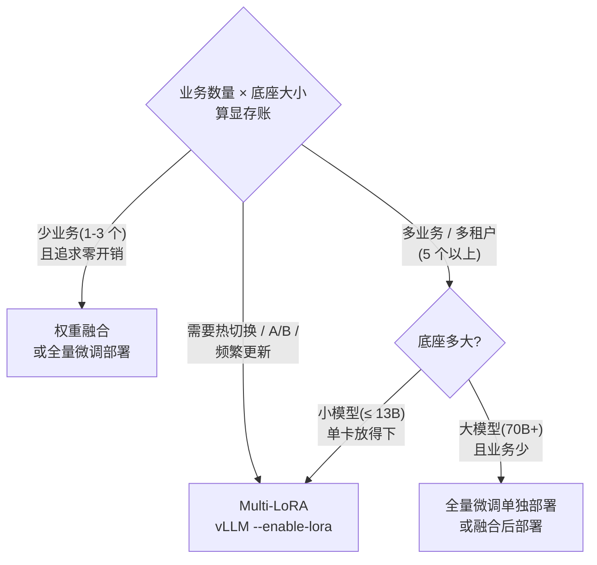

100 个业务如果各部署一个 7B 全量模型，权重就是 100 × 14GB = 1.4TB；而 Multi-LoRA 用“1 个底座 + N 个 Adapter”把同样的账压到 14GB + 100 × 0.32GB ≈ **46GB**——**显存省 30 倍以上**，并且能在同一个服务进程里按请求热切换业务。这一节先算清 LoRA 的显存账本,再讲 vLLM 的 Multi-LoRA 参数、批内多 Adapter 的共存与驱逐机制、动态拼接的性能代价,最后给出一套"什么时候该用 Multi-LoRA"的决策规则。

<!-- more -->

## 📑 目录

- [1. LoRA 是什么:冻结底座,训练小矩阵](#1-lora-是什么冻结底座训练小矩阵)
- [2. 显存账本:1 个底座 + N 个 Adapter vs N 个模型](#2-显存账本1-个底座--n-个-adapter-vs-n-个模型)
- [3. vLLM 的 Multi-LoRA 参数与请求路由](#3-vllm-的-multi-lora-参数与请求路由)
- [4. 调度与显存管理:批内混跑、LRU 驱逐](#4-调度与显存管理批内混跑lru-驱逐)
- [5. 性能影响:动态拼接的代价](#5-性能影响动态拼接的代价)
- [6. 应用形态:单卡多租户与 A/B 实验](#6-应用形态单卡多租户与-ab-实验)
- [7. 权衡与"落成一句话"](#7-权衡与落成一句话)
- [总结](#-总结)
- [自我检验清单](#-自我检验清单)
- [参考资料](#-参考资料)

---

## 1. LoRA 是什么:冻结底座,训练小矩阵

### 1.1 从"微调一个业务"说起

要上线一个垂直业务(法律问答、SQL 生成、客服话术……),常规做法是拿底座模型做全量微调,然后**每个业务部署一份完整的微调模型**。100 个业务就是 100 份 7B 权重、100 个服务进程、100 份 KV Cache 预算——底座能力的 99% 内容(通用语言理解)被复制了 100 次。

LoRA(Low-Rank Adaptation,低秩适配)把"微调"换了个做法:底座权重 $W_0$ **冻结不动**,只额外训练一对小矩阵 $A$、$B$,推理时叠加一个低秩增量:

$$
\underbrace{W' = W_0 + BA}_{\text{微调后的权重}} \qquad
\underbrace{A: r \times d_{\text{in}}}_{\text{降维矩阵}} \quad
\underbrace{B: d_{\text{out}} \times r}_{\text{升维矩阵}} \quad
\underbrace{r \ll \min(d_{\text{in}}, d_{\text{out}})}_{\text{秩远小于维度}}
$$

训练时只更新 $A$、$B$(约 2% 的参数),$W_0$ 全程不动;推理时 $h = W_0 x + BAx$,多算两次小矩阵乘。

打个比方:全量微调是给每个租客**单独买一套房**(一份完整权重,水电物业全套);LoRA 是**合租公寓**——公共区域(底座能力)大家共用,每个租客只拎一个行李箱入住(几 GB 的 Adapter),换租客只需换行李箱,房子还是那套。Multi-LoRA 就是让 100 个租客在同一套公寓里各住各的房间。

### 1.2 LoRA 到底有多大:参数规模推导

以 Llama 类 7B 为模板(32 层、hidden=4096、FFN intermediate=11008),LoRA 打在全部 7 个线性层(q/k/v/o/gate/up/down)上,$r = 64$:

| 层 | 每层参数量(A+B) | 计算 |
|---|---|---|
| q/k/v/o(4 个) | 4 × 2 × 4096 × 64 ≈ 2.10M | 输入输出都是 4096 |
| gate/up(2 个) | 2 × (64×4096 + 11008×64) ≈ 1.93M | 输出侧是 11008 |
| down(1 个) | 64×11008 + 4096×64 ≈ 0.97M | 输入侧是 11008 |
| 每层合计 | ≈ 5.0M | 7 个线性层 |
| **全模型** | **≈ 160M ≈ 底座的 2.3%** | × 32 层 |

$$
\underbrace{160M}_{\text{参数量}} \times \underbrace{2\text{B}}_{\text{FP16/BF16}} \approx \underbrace{0.32\ \text{GB}}_{\text{单个 r=64 Adapter}}
$$

💡 **提示**:参数量与 $r$ 成正比。$r=128$ 时约 0.64GB,$r=16$ 时约 80MB;如果只打在 q/v 上(经典 LoRA 配置),还要再小一个量级。**Adapter 大小 ≈ 2% × 底座大小 × (r/64)**,这个速算公式能帮你 10 秒估算任何模型。

### 1.3 为什么 Multi-LoRA 划算

N 个业务:

- 全量路线:$N \times$ 底座权重($N$ 份 14GB),显存、部署、运维全部乘 N;
- Multi-LoRA 路线:**1 份底座 + N 个 Adapter**,底座权重只占一份,Adapter 总量只有底座的 2% × N。

显存从 $O(N)$ 降到 $O(1 + 2\% \times N)$——这就是 S-LoRA 论文(Sheng et al., 2023)说的"pretrain-then-finetune 范式在服务端的机会":**同一底座派生的几百个 Adapter,天然可以在一个进程里共享批量推理**。

---

## 2. 显存账本:1 个底座 + N 个 Adapter vs N 个模型

### 2.1 账本怎么算

先算权重总账(7B 底座、FP16、r=64):

| 📊 方案 | 100 个业务的权重总量 | 部署形态 |
|---|---|---|
| 100 个全量微调模型 | 100 × 14GB = **1.4TB** | 100 个服务进程/副本 |
| 1 底座 + 100 个 Adapter | 14GB + 100 × 0.32GB ≈ **46GB** | 1 个服务进程 |
| 1 底座 + 100 个 Adapter(只算 GPU 显存) | 14GB + max_loras × 0.32GB | 1 个服务进程,GPU 只留热 Adapter |

📌 **关键点**:46GB 是"仓库总账"——100 个 Adapter 不用同时躺在 GPU 里。GPU 显存只放底座 + 若干个**热 Adapter 槽位**(`--max-loras`,默认只有 1 个),其余 Adapter 存在 CPU 内存或磁盘,用到时换入。所以 A100 80GB 单卡就能扛"7B 底座 + 几十个业务"。

### 2.2 GPU 显存里到底放什么

以 A100 80GB 部署 7B 底座为例,按 [vLLM 快速入门](/AIInfraGuide/inference/模块四-推理优化/第3章-深入vllm/vllm快速入门) 的显存公式拆账:

```
80GB × 0.9(gpu-memory-utilization) ≈ 72GB 可支配
- 14GB   底座权重
- ~2GB   激活与运行时开销(经验值,随 max_num_batched_tokens 浮动)
≈ 56GB   留给 KV Cache + LoRA 槽位
- 16 × 0.32GB(max_loras=16, r=64)≈ 5GB  LoRA 槽位
≈ 51GB   KV Cache(7B 约可容纳 8K 上下文 × 上百并发,第 2 章的口径)
```

对比:100 个全量模型的方案,80GB 单卡连一个 7B + 大并发 KV 都紧张,更不用说 100 份。

### 2.3 仓库放不下怎么办:S-LoRA 的答案

当 Adapter 数量到几千个时,连 CPU 内存都要精打细算。S-LoRA 提出**统一分页(Unified Paging)**:把不同 rank 的 Adapter 权重和不同长度的 KV Cache 放进同一个显存/内存池,按页管理、按需换入,配合"异构批处理"的 CUDA kernel,在单卡上服务**数千个**并发 Adapter,吞吐相对 HF PEFT 和当时的朴素 vLLM 实现最高提升 **4 倍**(论文实测口径)。vLLM 的 Multi-LoRA 沿用了同一套思路:预分配槽位 + 按需换入 + 专用 kernel(下一节展开)。

⚠️ **注意**:2.2 的账是"单卡够用"的底线账。多卡 TP 部署时,LoRA 权重会在各 rank 上有对应的分布(部分实现支持 `--fully-sharded-loras` 切分),**别按单卡账直接乘 TP 倍数**,以你所用版本的官方文档为准。

---

## 3. vLLM 的 Multi-LoRA 参数与请求路由

### 3.1 启动参数:一行命令打开多租户

以 vLLM 近期版本为例(参数名以你所用版本的 `vllm serve --help` 为准):

```bash
vllm serve meta-llama/Llama-3.2-3B-Instruct \
  --enable-lora \
  --max-loras 8 \
  --max-lora-rank 64 \
  --max-cpu-loras 32 \
  --lora-modules \
    sql-lora=jeeejeee/llama32-3b-text2sql-spider \
    law-lora=/data/adapters/law-qa
```

| ⚙️ 参数 | 含义 | 默认值 |
|---|---|---|
| `--enable-lora` | 打开 LoRA 支持(加载权重管理、kernel、槽位分配) | 关闭 |
| `--max-loras` | **GPU 上最多同时驻留的 Adapter 数**(槽位数) | 1 |
| `--max-lora-rank` | 允许的最大 rank,**预分配内存按它算** | 16 |
| `--lora-modules` | 启动时预注册 Adapter,`名字=路径` 或 JSON 格式 | 无 |
| `--max-cpu-loras` | CPU 内存里缓存的 Adapter 数(换出后暂存处) | 0 |
| `--lora-extra-vocab-size` | Adapter 扩充词表的预留容量 | 256 |
| `--lora-dtype` | Adapter 权重精度(auto/float16/bfloat16) | auto |

### 3.2 请求怎么选 Adapter:model 字段就够了

服务起来后,`/v1/models` 里会同时列出底座和所有已注册 Adapter——**调用方把 Adapter 名当作 model 名即可**,OpenAI 兼容协议零改动:

```bash
# 用 SQL Adapter 生成(底层走同一个服务进程、同一份底座权重)
curl http://localhost:8000/v1/completions \
  -H "Content-Type: application/json" \
  -d '{
    "model": "sql-lora",
    "prompt": "CREATE TABLE students(id INT, name TEXT);\n-- 查询所有学生:",
    "max_tokens": 64,
    "temperature": 0
  }'
```

离线推理则用 `LoRARequest` 显式指定:

```python
from vllm import LLM, SamplingParams
from vllm.lora.request import LoRARequest

llm = LLM(model="meta-llama/Llama-3.2-3B-Instruct", enable_lora=True)
outputs = llm.generate(
    ["<prompt>"],
    SamplingParams(temperature=0, max_tokens=256),
    lora_request=LoRARequest("sql_adapter", 1, sql_lora_path),  # 名字、全局唯一 id、路径
)
```

### 3.3 动态加载与热切换:不用重启服务

新业务上线、Adapter 更新,都要**热插拔**,而不是重启进程。vLLM 提供两条路径(需设环境变量 `VLLM_ALLOW_RUNTIME_LORA_UPDATING=True`):

```bash
# 动态注册一个 Adapter
curl -X POST http://localhost:8000/v1/load_lora_adapter \
  -H "Content-Type: application/json" \
  -d '{"lora_name": "law-lora", "lora_path": "/data/adapters/law-qa"}'

# 卸载
curl -X POST http://localhost:8000/v1/unload_lora_adapter \
  -H "Content-Type: application/json" \
  -d '{"lora_name": "law-lora"}'
```

- **load_inplace**:同名覆盖加载新权重(`"load_inplace": true`),RL 训练循环里"边训边换 Adapter"就靠它;
- **LoRA Resolver 插件**:把 Adapter 仓库挂在本地目录/S3/HuggingFace 上,请求带着没见过的 model 名进来时自动解析加载(`lora_filesystem_resolver`、`lora_hf_hub_resolver`,可自实现)。

⚠️ **注意**:动态加载官方明确标注有安全风险——**多租户场景若允许用户提交任意 Adapter 路径,等于开放任意代码/权重加载,生产环境只应在受信内网使用**。注册白名单或走 Resolver 插件,别裸开。

---

## 4. 调度与显存管理:批内混跑、LRU 驱逐

### 4.1 一个 batch 里多个 Adapter:底座共享,增量各算各的

Continuous Batching([2.2](/AIInfraGuide/inference/模块四-推理优化/第2章-推理引擎核心技术/22-continuous-batching))把不同业务的请求混进同一个 step——A 业务的请求带 adapter-A,B 业务的请求带 adapter-B。每个 Linear 层的计算拆成两部分:

```python
# 伪代码:带 LoRA 的 Linear 前向(非逐字源码,理解原理用)
def linear_with_lora(x, lora):          # x: (batch, in_features)
    y_base = x @ W0.T                   # 底座 GEMM:整个 batch 共享一次,照常快
    if lora is not None:                # 该请求指定了 Adapter
        # 低秩增量:先降维再升维,两次小矩阵乘
        y_lora = (x @ lora.A.T) @ lora.B.T
        y = y_base + y_lora * (lora.alpha / lora.r)   # 缩放系数
    else:
        y = y_base                      # 底座请求:零额外开销
    return y
```

vLLM 实际用 **Punica 风格的分段 kernel**(`lora_shrink`/`lora_expand`)把同 batch 里多个 Adapter 的增量计算合并成一次批式 GEMM——同一 Adapter 的请求聚成一段(segment),不同段各算各的低秩乘,再按位置写回。底层推理的"共享底座"和训练时的"共享底座"是同一件事,这正是 1.3 说的机会。

### 4.2 Adapter 的槽位与驱逐:谁最久没用,谁先回仓库

GPU 槽位只有 `--max-loras` 个,Adapter 却可能有一百个——放不下的怎么办?vLLM 维护一个 **AdapterLRUCache**:新请求要用的 Adapter 不在 GPU 上时,把**最久未被使用**的驻留 Adapter 逐出槽位(可暂存到 CPU 内存,配合 `--max-cpu-loras`),再换入目标 Adapter。

打个比方:合租公寓的**公共储物柜**只有 16 格,租客的行李箱谁最久没来取,谁就被挪去地下室仓库;下次他要用时再搬回来。换来换去有搬运费(换入换出的 I/O 时间),所以:

- `--max-loras` 太小 → 频繁换入换出,请求延迟抖动;
- `--max-loras` 太大 → 槽位挤占 KV Cache 预算,并发下降。

**落成一句话:`max-loras` 取"活跃业务数 + 余量",不是"Adapter 总数"。**

### 4.3 与 Continuous Batching 的交互:rank 补齐的浪费

一个 step 里不同请求的 Adapter 可能 rank 不同(r=16 和 r=64 混批)。kernel 按**批内最大 rank** 预分配计算缓冲区,低 rank 的段会被 padding——**padding 的部分是纯浪费的算力和带宽**(第 5 节会看到实测量级)。加上每个 step 都要多一轮 LoRA 增量计算,Multi-LoRA 的混批吞吐通常低于纯底座,这是"省显存"换来的成本,不是配置错了。

---

## 5. 性能影响:动态拼接的代价

### 5.1 两条实现路线:融合 vs 动态拼接

| 📊 对比项 | 权重融合(merge) | 动态拼接(on-the-fly,vLLM 的做法) |
|---|---|---|
| 做法 | 把 $W_0 + BA$ 写回权重,重新保存一份模型 | 推理时实时计算 $W_0x + BAx$ |
| 运行时开销 | 零(和普通模型完全一样) | 每次前向多两次小矩阵乘 |
| 换 Adapter | ❌ 一个融合副本 = 一个模型 | ✅ 请求级热切换 |
| 显存 | 每份都是完整权重(14GB) | 底座共享 + 小 Adapter |
| 适用 | 业务固定、极致性能 | 多租户、A/B、频繁更新 |

**牺牲什么、换取什么,一句话讲清:融合牺牲了"多租户共享"换取"零开销";动态拼接牺牲了"单请求的少量算力"换取"一套权重服务 N 个业务"。**

### 5.2 单请求开销的量级

LoRA 增量是两次小 GEMM,相对底座 GEMM 很小。以 Llama-3.1-8B 的 Q 投影(hidden=4096、r=16)为例的估算:

$$
\underbrace{4096 \times 4096}_{\text{底座 GEMM: 16.7M 乘加}} \quad \text{vs} \quad
\underbrace{2 \times 16 \times 4096}_{\text{LoRA 增量: 0.13M 乘加}} \approx \underbrace{0.78\%}_{\text{单层额外算力(估算)}}
$$

7 个线性层全打上,估算总开销 < 5%(社区博客口径,待你在自己硬件上核实)。但注意两个放大因素:**批内 rank padding**(4.3)和 **kernel 切换开销**——小 batch、多 Adapter 混批时,实际开销远高于 5%。

### 5.3 max_lora_rank 的陷阱:vLLM 开发者实测

vLLM 官方文档专门有一节讲 `max_lora_rank` 配置。开发者实测(A100-80GB,Gemma-3-27B 底座 + rank=16 的 Adapter):

| 📊 配置 | 单请求耗时 | LoRA 占用的 GPU 显存 |
|---|---|---|
| `--max-lora-rank 256`(虚高) | 3.649 s | 3.18 GB |
| `--max-lora-rank 16`(贴合实际) | 2.292 s | 0.20 GB |
| 差距 | **快 59%** | **省 15.9 倍** |

为什么?vLLM 按 `max_lora_rank` **预分配**所有 LoRA 计算缓冲区和槽位;rank 设高了,每次前向都在给一大片零 padding 做无用计算,还拖垮 L2 缓存命中率。**规则:`--max-lora-rank` 取你所有 Adapter 里最大的实际 rank,而不是留余量**——文档原话:adapter ranks 是 [16, 32, 64] 就用 64,别用 256。

📌 **关键点**:Multi-LoRA 的性能账不是"免费"的。省下的是**显存**(30 倍量级),付出的是**每请求少量算力 + 换入换出抖动 + 调参陷阱**。上线前用第 4 章 4.6 的压测协议,在同样负载下对比"底座直出 vs 带 5 个 Adapter 混批"的 TTFT/TPOT/吞吐,数字钉死在自己硬件上。

---

## 6. 应用形态:单卡多租户与 A/B 实验

### 6.1 单卡多租户:多个业务共享一个服务

典型场景:一个团队维护 5~20 个垂直业务(客服、SQL、法务、代码注释……),每个业务一个 Adapter,全部挂在同一个 7B 底座上,单卡 A100 即可。收益不只是显存:

- **一份底座 = 一份 KV 预算**:所有业务共享池子,波峰波谷互补(2.2 的混批优势);
- **一个服务端点**:网关按租户路由 model 名,运维面从 N 个服务收敛成 1 个;
- 配额、限流、鉴权在网关层做(第 10 章 10.x 的 K8s/网关体系,一句话:多租户上线前先解决认证与隔离)。

### 6.2 A/B 实验:同一底座,两个版本对打

上线新 Adapter 时,不需要部署第二套服务:注册 `adapter-v1` 和 `adapter-v2`,流量按比例路由到两个 model 名,同一份底座、同一个 batch,连 GPU 状态都是共享的——A/B 的对照条件比"两套服务"干净得多。RL 场景更极端:策略每轮更新,`load_inplace` 原地换权重,推理进程不重启、服务不中断。

---

## 7. 权衡与"落成一句话"



落成一句话的规则:

- ✅ **小模型 + 多业务(≥5 个)** → Multi-LoRA:显存省 30 倍量级,热切换白送。别为"显得高级"把 100 个模型拆 100 份部署。
- ✅ **需要 A/B、RL 持续更新** → Multi-LoRA + 动态加载,`load_inplace` 原地换权重。
- ❌ **大模型 + 少业务 + 精度敏感** → 别硬上 LoRA:Adapter 容量有限(2% 参数能学的东西有限),全量微调 + 单独部署,精度和性能都更稳。
- ❌ **追求极致单请求性能、业务固定** → 把 Adapter **merge 进权重**再部署,别让每次前向都背着 LoRA 增量开销。
- ⚠️ **多租户开放动态加载** → 先解决鉴权与路径白名单,官方文档原话:生产环境默认不建议开。

---

## 📝 总结

1. **LoRA 的本质**:冻结底座 $W_0$,只训练低秩增量 $BA$——参数量 ≈ 底座的 2%(r=64),显存从"每业务一份全量"变成"一份底座 + N 个小 Adapter"。
2. **账本**:100 个 7B 业务,全量路线 1.4TB vs Multi-LoRA 路线 ~46GB(仓库总账)或 ~19GB(GPU 热账),省 30 倍以上。
3. **vLLM 四件套**:`--enable-lora` / `--max-loras` / `--max-lora-rank` / `--lora-modules`;请求用 `model` 字段选 Adapter,动态加载走 `/v1/load_lora_adapter`(需 `VLLM_ALLOW_RUNTIME_LORA_UPDATING=True`)。
4. **批内共存**:底座 GEMM 共享,LoRA 增量用 Punica 风格分段 kernel 批算;AdapterLRUCache 驱逐最久未用的槽位,`max_loras` 取活跃业务数而非总数。
5. **性能代价**:动态拼接全层合计 <5% 的估算开销 + rank padding 放大;`max_lora_rank` 虚高会让耗时差出 59%、显存差出 15.9 倍(vLLM 开发者实测)。
6. **选型**:小模型多业务/热切换 → Multi-LoRA;大模型少业务精度敏感 → 全量微调;固定业务求性能 → merge 后部署。

## 🎯 自我检验清单

- 能口算 7B 底座 + r=64 全层 LoRA 的参数量(≈160M)与 FP16 体积(≈0.32GB),误差不超过 20%
- 能解释 $W' = W_0 + BA$ 中 A、B 的维度与训练/推理时的计算流程
- 能说出 100 个 7B 业务在"全量部署 vs Multi-LoRA"两条路线下的权重总账(1.4TB vs ~46GB)
- 能写出 vLLM 启动 Multi-LoRA 的四件套参数,并说明 `--max-loras` 与 `--max-lora-rank` 各自管什么
- 能用 `model` 字段和 `/v1/load_lora_adapter` 分别完成"选 Adapter"和"热注册 Adapter",并说出安全前提
- 能解释同一个 batch 里多个 Adapter 如何共存(共享底座 GEMM + 分段 LoRA kernel),以及 rank padding 为什么浪费算力
- 能说明 AdapterLRUCache 的驱逐语义,并给出 `max_loras` 的合理取值规则(活跃业务数 + 余量)
- 能解释"权重融合 vs 动态拼接"的牺牲/换取,并说出各适合什么场景
- 能复述 vLLM 开发者实测:max_lora_rank 从 256 改到 16,耗时快 59%、LoRA 显存省 15.9 倍
- 能说出 S-LoRA 的三大机制(统一分页/异构批处理/专用 kernel)与"数千 Adapter、最高 4 倍吞吐"的论文结论
- 能根据业务数量、模型大小、精度敏感度给出 Multi-LoRA / 全量微调 / merge 的三选一决策
- 能在 30 分钟内用 vLLM 把一个底座 + 2 个 Adapter 跑起来,并用压测对比底座直出与多 Adapter 混批的吞吐

## 📚 参考资料

**论文**

- [LoRA: Low-Rank Adaptation of Large Language Models - Hu et al., 2021](https://arxiv.org/abs/2106.09685)(低秩适配的原始论文)
- [S-LoRA: Serving Thousands of Concurrent LoRA Adapters - Sheng et al., 2023](https://arxiv.org/abs/2311.03285)(统一分页 + 异构批处理,单卡数千 Adapter、最高 4 倍吞吐)
- [Punica: Multi-Tenant LoRA Serving - Chen et al., MLSys 2024](https://arxiv.org/abs/2310.18547)(segment-gather kernel,vLLM LoRA 计算的源头)

**官方文档**

- [vLLM - LoRA Adapters(--enable-lora/--max-loras/--max-lora-rank/动态加载端点/max_lora_rank 配置指南)](https://docs.vllm.ai/en/latest/features/lora.html)
- [vLLM - LoRA Resolver Plugins(本地目录/S3/HF Hub 自动加载)](https://docs.vllm.cc/en/latest/design/lora_resolver_plugins/)
- [vLLM PR #22782 - max_lora_rank 配置与性能数据(59% / 15.9× 实测)](https://github.com/vllm-project/vllm/pull/22782)

**开源项目**

- [S-LoRA 官方实现](https://github.com/S-LoRA/S-LoRA)
- [vLLM examples/features/lora(multilora_offline.py 等示例)](https://github.com/vllm-project/vllm/tree/main/examples/features/lora)

**站内**

- [vLLM 快速入门(--enable-lora 之外的部署基线)](/AIInfraGuide/inference/模块四-推理优化/第3章-深入vllm/vllm快速入门)
- [2.2 Continuous Batching(多 Adapter 混批的调度底座)](/AIInfraGuide/inference/模块四-推理优化/第2章-推理引擎核心技术/22-continuous-batching)
- [4.6 量化选型与 vLLM 实战(压测协议与 GenAI-Perf 模板)](/AIInfraGuide/inference/模块四-推理优化/第4章-量化/46-量化选型与vllm实战)
- [第 8 章 生产级服务特性(章首页)](/AIInfraGuide/inference/模块四-推理优化/第8章-生产级服务特性/第8章-生产级服务特性)
