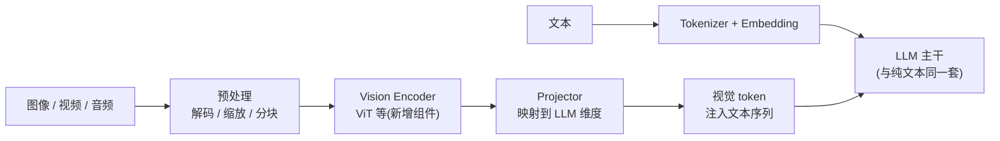
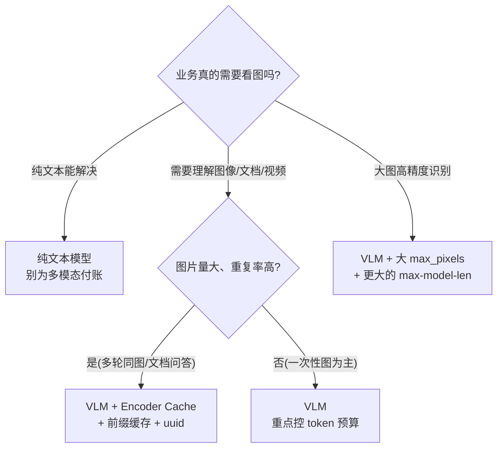

纯文本推理的输入是一串 token;图文推理在进 LLM 之前多了一道"翻译":图片先被 Vision Encoder 变成视觉 token,再混进文本序列。这道翻译不便宜——一张 448×448 的图在 Qwen2.5-VL 里等于 256 个视觉 token,而 Llama 3.2 Vision 处理一张高分辨率图最多要 6404 个 token——**一张图的"上下文长度"可能顶得上半篇长文**,KV Cache 账本随之暴涨。这一节拆开 VLM 的完整服务链路(预处理 → Encoder → 注入 → LLM),讲清 vLLM 的 Encoder Cache 和图像哈希前缀缓存怎么把重复计算的账省回来,最后给出一套可落地的部署参数与权衡规则。

<!-- more -->

## 📑 目录

- [1. 多模态推理与纯文本的差异](#1-多模态推理与纯文本的差异)
- [2. VLM 推理链路:从像素到视觉 token](#2-vlm-推理链路从像素到视觉-token)
- [3. 视觉 token 数量:一张图值多少个 token](#3-视觉-token-数量一张图值多少个-token)
- [4. Encoder Cache 与图像哈希前缀缓存](#4-encoder-cache-与图像哈希前缀缓存)
- [5. 多模态的 KV Cache 账本](#5-多模态的-kv-cache-账本)
- [6. vLLM 部署要点:参数与 OpenAI 兼容格式](#6-vllm-部署要点参数与-openai-兼容格式)
- [7. 权衡与"落成一句话"](#7-权衡与落成一句话)
- [总结](#-总结)
- [自我检验清单](#-自我检验清单)
- [参考资料](#-参考资料)

---

## 1. 多模态推理与纯文本的差异

### 1.1 输入多了一条"编码"路径

纯文本推理:文本 → tokenize → embedding → LLM。多模态推理多了一个分支:



关键差异:LLM 主干不变,但**前面多了一个独立的 Encoder 组件**,且**视觉 token 要占用 LLM 的序列长度和 KV Cache**——这是 VLM 服务成本的两个核心来源。

打个比方:纯文本旅客走自助通道,刷个证件就登机;带图的旅客必须**先过海关安检(Encoder)**:行李(图片)上 X 光机(视觉编码),生成一张查验报告(视觉 token),报告随人登机,LLM 只看报告、不亲自翻行李。多出来的时间就是 TTFT 的增量,多出来的"报告"就是要占座位的 token。

### 1.2 视觉 Encoder 的代价

| 📊 对比项 | 纯文本模型 | VLM |
|---|---|---|
| 输入形态 | token ids | token ids + 像素/波形 |
| 额外组件 | 无 | Vision Encoder(0.5~1B 参数)+ Projector |
| 额外显存 | 无 | Encoder 权重 + Encoder 激活 + 视觉 KV |
| 额外延迟 | 无 | 预处理 + Encoder 前向(几十~几百 ms 量级,随模型/图而异) |
| 序列长度 | 全由文本决定 | 文本 + 视觉 token(见第 3 节) |

📌 **关键点**:VLM 不是"换个模型",而是**在推理链路上多了一整段 Encoder 计算**,服务端要同时为它付显存、算力和延迟——这就是为什么多模态服务需要专门管理 Encoder Cache(第 4 节)。

---

## 2. VLM 推理链路:从像素到视觉 token

### 2.1 链路五步:每一步在干什么

| 步骤 | 做什么 | 谁执行 | 产出 |
|---|---|---|---|
| ① 解码与缩放 | 图片解码、等比缩放(受 min_pixels/max_pixels 约束) | 预处理(CPU/GPU) | 像素张量 |
| ② 分块(patch) | 切成 patch(如 14×14),组帧 | 预处理 | patch 序列 |
| ③ Encoder 前向 | ViT 等骨干网络跑一遍 | Vision Encoder(GPU) | patch 特征 |
| ④ 映射(Projector) | MLP/Resampler 把特征映射到 LLM hidden 维度 | Projector(GPU) | 视觉 embedding |
| ⑤ 注入 | 视觉 embedding 按占位符位置拼进文本序列 | LLM 前端 | 完整输入序列 |

以 Qwen2.5-VL-7B 为例(官方 config):Vision 塔 32 层、hidden=1280、patch=14×14、spatial_merge=2(2×2 个 patch 合并为一个视觉 token,即每个视觉 token 对应 28×28 像素区域);LLM 主干 28 层、hidden=3584,与纯文本 Qwen2.5 完全同构。

### 2.2 两种主流注入方式

- **拼接式(LLaVA / Qwen2-VL 系)**:视觉 token 作为序列的一部分拼在文本前,参与全部自注意力。实现简单、主流 VLM 多用;代价是视觉 token 直接计入上下文长度和 KV。
- **交叉注意力式(Llama 3.2 Vision)**:视觉特征作为 KV 进入交叉注意力层,不参与文本的自回归扩展;但**视觉 KV 同样占显存**,且多一层注意力计算,显存账不比拼接式便宜多少。

⚠️ **注意**:无论哪种注入,视觉信息最终都要占 LLM 的 KV Cache(第 5 节的账)。"交叉注意力不占 KV"是常见误解。

### 2.3 vLLM 对主流 VLM 的支持

以 vLLM 官方支持矩阵(2026 年快照,以你所用版本的文档为准)为例:

| 模型家族 | 代表 | 模态 | vLLM 支持 |
|---|---|---|---|
| Qwen2-VL / Qwen2.5-VL / Qwen3-VL | `Qwen/Qwen2.5-VL-7B-Instruct` | 图 + 视频 | ✅ 原生 |
| Llama 3.2 Vision | `meta-llama/Llama-3.2-11B-Vision-Instruct` | 图 | ✅ 官方 day-1 支持 |
| LLaVA 系列 | LLaVA-1.5 / NeXT / OneVision | 图 / 视频 | ✅ 原生 |
| Phi 系列 | Phi-3.5-vision / Phi-4-multimodal | 图 / 音频 | ✅ 原生 |
| InternVL | InternVL 2 / 2.5 / 3 / 3.5 | 图 + 视频 | ✅ 原生 |
| Pixtral / MiniCPM-V / Molmo | mistralai/Pixtral-12B 等 | 图 | ✅ 原生 |
| 音频系 | Qwen2-Audio / Qwen2.5-Omni | 音频 | ✅ 原生 |

💡 **提示**:部署前先查支持矩阵,再查"该模型的视觉 token 规则"(第 3 节)——**同样的 --max-model-len,不同 VLM 能塞的图片数完全不同**,这是多模态部署最容易踩的坑。

---

## 3. 视觉 token 数量:一张图值多少个 token

### 3.1 三个代表性数字

| 模型 | 一张图的视觉 token 数 | 规则 |
|---|---|---|
| Qwen2.5-VL(官方默认) | **256 ~ 1280**(理论范围 4~16384) | 每 28×28 像素 = 1 token,按 min_pixels/max_pixels 缩放 |
| Qwen2-VL（官方建议区间） | 256 ~ 1280 | 同上 |
| Llama 3.2 Vision(11B/90B) | **1601 ~ 6404** | 560×560 tile = 1601 token(40×40 patch + CLS),最多 4 tile |
| LLaVA-1.5(CLIP ViT-L/14) | 576 | 336×336 → 24×24 = 576 patch,固定 |

为什么差这么多？Qwen2.5-VL 用**动态分辨率**：先按 28×28 的网格把图缩放到目标 token 数（官方建议区间 256~1280，通过 `min_pixels`/`max_pixels` 控制）。Llama 3.2 Vision 则是**固定 tile + 大 ViT-H/14**：每 tile 1601 个 patch token，高分辨率图切成最多 4 个 tile。论文实测：一张 384×384 的图 1601 token，一张 720p/1080p 的图直达 6404 token。

$$
\underbrace{448 \times 448}_{\text{常见图}} = \underbrace{16 \times 16}_{\text{28px 网格}} = \underbrace{256}_{\text{Qwen2.5-VL 视觉 token}} \qquad
\underbrace{4 \times 1601}_{\text{最多 4 个 tile}} = \underbrace{6404}_{\text{Llama 3.2 高分辨率图}}
$$

📌 **关键点**：**"一张图"不是一个固定长度的 token**——同一张图，模型和分辨率不同，token 数可以差一个数量级。而所有视觉 token 都计入 `--max-model-len`。max_model_len=8192 时，Qwen2.5-VL 可以放 6~7 张 1024-token 的图（还得给文本和输出留预算），而 Llama 3.2 Vision 一张 1080p 图（6404 token）就占了 78%。

### 3.2 token 数对部署的连锁影响

- **max_model_len 预算**:视觉 token + 文本必须一起塞进序列上限;
- **Prefill 量**:6404 个视觉 token 的 prefill 计算 ≈ 6404 个文本 token,TTFT 直线上升;
- **KV Cache**:第 5 节算账;
- **调控手段**:Qwen 系调 `min_pixels`/`max_pixels`(256↔1280),Llama 3.2 系只能调"是否切 4 tile",LLaVA 系固定不可调。

---

## 4. Encoder Cache 与图像哈希前缀缓存

### 4.1 问题:同一张图,被反复"安检"

真实业务里同一张图会被反复提问:多轮对话里用户对着同一张图连续追问、文档问答里同一页截图被不同人问、审核场景同一张图多模型复审……如果每次都重新跑一遍预处理 + Encoder,算力全花在重复翻译上。vLLM 在 V1 引擎里为此做了**两级缓存**,都按媒体内容的哈希(`mm_hash`)做键:

**第一级:MM Processor Cache(预处理缓存)**。缓存"解码/缩放/分块"的产出(像素张量等)。为什么需要?官方设计文档的原话:部分 HF 处理器(如 Qwen2-VL 的)**非常慢**,同样的输入反复预处理是纯浪费。默认开启。

**第二级:Encoder Cache(编码器缓存)**。缓存 Vision Encoder 的输出 embedding(`[num_tokens, hidden_dim]` 的张量)。命中时**整个 Encoder 前向直接跳过**:

```python
# 伪代码:带 Encoder Cache 的多模态请求处理(vLLM V1 调度器语义,非逐字源码)
def process_mm_item(mm_item):
    h = hash_mm_content(mm_item)            # 按媒体内容计算 mm_hash
    if encoder_cache.has(h):                # 同一张图已经编码过?
        return encoder_cache.get(h)         # 直接复用 embedding,跳过 Encoder
    embeds = vision_encoder(mm_item.pixels) # 冷启动:跑一次 Encoder 前向
    encoder_cache.put(h, embeds)            # 存入缓存(引用计数 +1)
    return embeds
```

打个比方:海关对同一件货物**只开箱检查一次**,检查结果登记在系统里(内容哈希 = 货物编号),下次同一件货物过关直接放行;缓存满了就优先清掉"没人再引用"的登记(引用计数为 0 的条目先被驱逐)。

### 4.2 缓存的键与生命周期

- **键 = mm_hash**:vLLM 对每个媒体项按内容算哈希(图像/视频/音频都适用),相同内容天然共享——不需要调用方做任何事;
- **生命周期**:引用计数管理,请求处理完释放引用;缓存空间不足时先驱逐零引用条目;
- **容量**:V1 当前版本里 Encoder Cache 容量由 `max_num_batched_tokens`(默认 2048 个 embedding 单位)推导,**暂不可直接配置**(官方 PR #34051 正在讨论放开),够不够用看命中率;
- **手动清缓存**:`/reset_encoder_cache` 端点(模型权重热更新后需要)。

### 4.3 图像哈希 × 前缀缓存:连 prefill 一起省

这是第二层省钱:视觉 token 是**确定性地**由图像内容生成的——相同的图 → 相同的视觉 token 序列 → 与 [2.3 Prefix Cache](/AIInfraGuide/inference/模块四-推理优化/第2章-推理引擎核心技术/23-prefix-cache-与-radixattention) 的块哈希天然兼容。vLLM 对每个媒体项按内容哈希,哈希参与前缀块的 key:**同一张图 + 相同的文本前缀,第二次请求直接复用 KV,prefill 整个跳过**。

调用方还可以提供 `multi_modal_uuids` 自报媒体 ID:

- 省掉内容哈希的计算(大图的哈希也要时间);
- **极端形态**:图片都不必再上传——`"image_url": None + uuid`,服务端直接用缓存的 embedding(缓存未命中会报错)。

⚠️ **注意两个不命中场景**(官方 PR 讨论里点名的):① 两次请求的**系统提示词不同**,前缀哈希对不上;② 多图顺序调换(图 A、B 变 B、A),即使每张图都一样,前缀也不连续。**多模态前缀缓存对"图片顺序"敏感**,应用层最好固定媒体顺序。

---

## 5. 多模态的 KV Cache 账本

### 5.1 视觉 token 也要占 KV:公式与算例

视觉 token 进入 LLM 后,和文本 token 一样按层存 K/V:

$$
\text{KV}_{\text{每 token}} = \underbrace{2}_{\text{K 和 V}} \times \underbrace{L}_{\text{层数}} \times \underbrace{G}_{\text{KV 头数}} \times \underbrace{d_{\text{head}}}_{\text{头维度}} \times \underbrace{2\text{B}}_{\text{FP16/BF16}}
$$

代入两个模型:

| 模型 | 配置(L / G / head_dim) | KV/token | 一张图的 KV |
|---|---|---|---|
| Qwen2.5-VL-7B | 28 层 / 4 KV 头 / 128 | 2×28×4×128×2 ≈ **56 KB** | 256 token → ~14MB;1280 token → ~72MB |
| Llama 3.2-11B-Vision | 40 层 / 8 KV 头 / 128 | 2×40×8×128×2 ≈ **160 KB** | 1601 token → ~250MB;6404 token → **~1.0GB** |

对照：Qwen2.5-VL-7B 的 8K 纯文本上下文（8192 token）KV ≈ 8192 × 56KB ≈ **448MB**——**一张 1280-token 的大图 ≈ 72MB KV，接近 1/6 个 8K 文本上下文**。而 Llama 3.2 Vision 一张 1080p 图 ≈ 1GB KV，相当于 6400 个文本 token 的 KV，接近 16K 上下文预算的一半。

📌 **关键点**:多模态 KV 账本的本质是"**视觉 token 按 token 计价**"。省 KV 只有两条路:减少视觉 token 数(调 max_pixels / 换模型),或提高 KV 复用(前缀缓存 / 更长上下文预算)。量化 KV(4.4)对视觉 token 同样生效,但先算清账再考虑优化。

### 5.2 多图与长图场景:账本怎么爆炸

以 Qwen2.5-VL-7B、`--limit-mm-per-prompt '{"image":10}'`、每图 1280 token 为例:

$$
\underbrace{10 \times 1280}_{\text{10 张大图的视觉 token}} = 12800 \ \text{token} \rightarrow \underbrace{12800 \times 56\text{KB}}_{\text{KV}} \approx \textbf{716 MB}
$$

- 序列长度占掉 max_model_len 的 12800/32768 ≈ 39%(假设 max_model_len=32768);
- 一次 prefill 要算 12800 个视觉 token + 文本,TTFT 的量级直接从"几十 ms"跳到"秒级";
- 高并发下,10 个这样的请求就能吃掉 7GB+ KV——**多图是 VLM 服务的显存刺客,部署前必须用 --limit-mm-per-prompt 和 max_pixels 双重封顶**。

### 5.3 工程对策一览

| 症状 | 对策 | 代价 |
|---|---|---|
| 单图 token 过多 | 调小 `max_pixels`(如 1280→256 token/图) | 高分辨率细节识别精度下降 |
| 请求带图过多 | `--limit-mm-per-prompt` 限每请求媒体数 | 业务被拒/降级 |
| 长视频 | 帧采样 + `--video-pruning-rate` 剪枝(evs/vidcom2) | 时序信息丢失 |
| 重复图 | Encoder Cache + 前缀缓存 + uuid(第 4 节) | 缓存占用显存/内存 |
| KV 总量吃紧 | 叠加第 4 章量化(KV Cache 量化、INT4 权重) | 精度损失 |

---

## 6. vLLM 部署要点:参数与 OpenAI 兼容格式

### 6.1 启动命令与关键参数

以 vLLM 近期版本为例(参数名以你所用版本的 `vllm serve --help` 为准):

```bash
vllm serve Qwen/Qwen2.5-VL-7B-Instruct \
  --limit-mm-per-prompt '{"image":4,"video":0}' \
  --max-model-len 32768 \
  --mm-processor-kwargs '{"max_pixels":1003520}' \
  --gpu-memory-utilization 0.9
```

| ⚙️ 参数 | 作用 | 建议 |
|---|---|---|
| `--limit-mm-per-prompt` | 每请求每种媒体的数量上限(如 image=4) | **必配**:防多图打爆序列与 KV |
| `--max-model-len` | 序列上限,视觉 token 计入其中 | 按"最大图 token 数 + 最大文本 + 输出"预留 |
| `--mm-processor-kwargs` | 透传给处理器的参数,如 `{"max_pixels": 1003520}` | Qwen 系用它卡视觉 token 数(256~1280) |
| `--allowed-local-media-path` | 允许客户端用 `file://` 读本地图 | 内网部署开,公网别开 |
| `VLLM_IMAGE_FETCH_TIMEOUT` | 远程 URL 拉图超时(默认 5 秒) | 慢源调大 |
| `--no-mm-processor-cache` | 关闭预处理缓存 | 调试用,默认开 |

💡 **提示**:Qwen2.5-VL 原生上下文 128K,但 **max_model_len 不是越高越好**——序列越长,单请求 KV 越多、并发越低。vLLM 官方配方建议 7B 从 16K 起跑,按你的实际"图 + 文本 + 输出"预算调,别直接拉满。

### 6.2 OpenAI 兼容格式:image_url 就够了

```bash
curl http://localhost:8000/v1/chat/completions \
  -H "Content-Type: application/json" \
  -d '{
    "model": "Qwen/Qwen2.5-VL-7B-Instruct",
    "messages": [{
      "role": "user",
      "content": [
        {"type": "text", "text": "这张图里有什么?"},
        {"type": "image_url",
         "image_url": {"url": "data:image/jpeg;base64,<base64 编码的图片>"},
         "uuid": "sku-1234-a"}
      ]
    }],
    "max_tokens": 128
  }'
```

要点:

- `image_url` 支持 `https://`、`data:image/...;base64,`、`file://`(需 `--allowed-local-media-path`);
- **`uuid` 字段可选但强烈建议**:自报媒体 ID 后,vLLM 跳过内容哈希,后续相同 uuid 直接命中 Encoder Cache(第 4.3 节),甚至可以不传图;
- 文本与图片可以**交错排列**(多图多段文本),占位符由 chat template 生成,服务端自动处理。

### 6.3 排错速查

| 症状 | 诊断 | 修复 |
|---|---|---|
| 带图请求 400:超出媒体限制 | 触到 `--limit-mm-per-prompt` 上限 | 调大限额,或应用层先压缩图片数量 |
| 序列超长报错 | 视觉 token + 文本 > max_model_len | 调小 max_pixels / 缩短文本 / 加大 max-model-len(有余量时) |
| 远程图拉取超时 | URL 源慢 | 调 `VLLM_IMAGE_FETCH_TIMEOUT`,或改 base64 直传 |
| file:// 被拒 | 没开 `--allowed-local-media-path` | 内网部署时开启 |
| TTFT 偏高 | Encoder 冷启动 / 大图 token 多 | 看 MM cache hit rate;限制 max_pixels;图片预处理做去重 |
| 同样的图反复全量 prefill | 前缀缓存没命中 | 固定系统提示词与图片顺序;用 uuid;检查是否开了 `--no-enable-prefix-caching` |

---

## 7. 权衡与"落成一句话"



落成一句话的规则:

- ✅ **业务要理解图像/文档/视频内容**(OCR、文档问答、内容审核、电商理解)→ 上 VLM;纯文本能解决的场景**别为多模态付账**(Encoder 显存 + TTFT + KV 三笔账)。
- ✅ **同一批图会被反复问**(多轮对话、文档问答)→ 必配 Encoder Cache + 前缀缓存,图片附 `uuid`,命中率是 VLM 服务吞吐的第一杠杆。
- ✅ **图片来源可控** → 用 `--limit-mm-per-prompt` + `max_pixels` 双重封顶,token 预算写进服务契约,别让用户随意传 10 张 4K 图。
- ❌ **别把 max_model_len 拉满**:视觉 token 单价是固定的(56~160KB/token),拉满只会让并发归零;按真实负载算预算。
- ❌ **别忽略预处理 pipeline**:远程拉图、解码、缩放都发生在请求路径上,超时与失败处理要进服务契约;公网服务注意 `file://` 和远程 URL 的安全边界。
- 💡 **与 8.3 联动**:vLLM 对多模态模型塔/连接器的 LoRA 支持目前是实验特性(`--enable-tower-connector-lora` 等),生产先用底座直出;Encoder Cache 在 LoRA 场景会按 LoRA 前缀隔离缓存键,避免张冠李戴。

---

## 📝 总结

1. **链路**:VLM = 预处理 → Vision Encoder → Projector → 视觉 token 注入 LLM;多出的 Encoder 段是显存、算力、TTFT 三笔新账的来源。
2. **视觉 token 数**:Qwen2.5-VL 一张图 256~1280(可调),Llama 3.2 Vision 最多 6404(固定 tile),LLaVA-1.5 固定 576——同一张图,token 数可差一个数量级,全部计入 max_model_len。
3. **两级缓存**:MM Processor Cache 缓存预处理产出,Encoder Cache(键 = mm_hash)缓存 Encoder 输出,命中即跳过 Encoder 前向;容量当前由 max_num_batched_tokens 推导,零引用条目先驱逐。
4. **前缀缓存**:相同图像 → 相同视觉 token → KV 前缀可复用,连 prefill 一起省;`multi_modal_uuids` 可跳过哈希甚至不传图,但注意系统提示词与图片顺序影响命中。
5. **KV 账本**:Qwen2.5-VL-7B 每视觉 token 约 56KB KV,1280-token 大图 ≈ 72MB;Llama 3.2 11B Vision 每 token 约 160KB,一张 1080p 图 ≈ 1GB——多图场景是显存刺客。
6. **部署**:`--limit-mm-per-prompt` + `--mm-processor-kwargs`(max_pixels)双重封顶,OpenAI 兼容 `image_url` 直传,`uuid` 是缓存命中率的第一杠杆。

## 🎯 自我检验清单

- 能画出 VLM 推理链路五步(解码缩放 / 分块 / Encoder 前向 / Projector / 注入),并说出每一步的产出
- 能解释拼接式与交叉注意力式注入的差异,并纠正"交叉注意力不占 KV"的误解
- 能说出 Qwen2.5-VL、Llama 3.2 Vision、LLaVA-1.5 三者的单图视觉 token 量级(256~1280 / 1601~6404 / 576)及原因
- 能计算给定 max_model_len 时最多能放几张图(如 8192 上下文、Qwen2.5-VL 1024-token 图 → 6~7 张,需给文本和输出留预算)
- 能手算 Qwen2.5-VL-7B 的每 token KV 字节数(2×28×4×128×2 ≈ 56KB),并给出 1280-token 图的 KV(≈72MB)
- 能解释 vLLM 两级缓存(mm_processor_cache / Encoder Cache)各自缓存什么、键是什么、命中后省掉哪段计算
- 能说明 `multi_modal_uuids` 的用途与两个前缀缓存不命中场景(系统提示词不同、媒体顺序变化)
- 能写出 vLLM 启动 VLM 的关键参数(--limit-mm-per-prompt / --mm-processor-kwargs / --max-model-len)并解释三者关系
- 能用 OpenAI 兼容格式(curl)发送 base64 图片请求,并说明 uuid 与 file:// 的前提条件
- 能按排错速查表定位"序列超长 / 图拉取超时 / TTFT 高"三类问题的修复路径
- 能给出多图场景的 KV 账本(10 图 × 1280 token ≈ 716MB),并说出两种封顶手段
- 能根据"业务是否真需要看图 / 图片重复率"给出上不上 VLM、怎么配缓存的决策

## 📚 参考资料

**论文与官方博客**

- [Qwen2-VL: To See the World More Clearly(视觉 token 4~16384、256~1280 建议区间)](https://qwenlm.github.io/blog/qwen2-vl/)
- [Qwen2.5-VL-7B-Instruct 模型卡(min_pixels/max_pixels 与 token 数配置)](https://huggingface.co/Qwen/Qwen2.5-VL-7B-Instruct)
- [Efficient LLaMA-3.2-Vision by Trimming Cross-attended Visual Features(1601~6404 视觉 token 实测)](https://arxiv.org/abs/2504.00557)
- [LLaVA: Large Language and Vision Assistant - Liu et al., 2023(CLIP ViT 576 patch)](https://arxiv.org/abs/2304.08485)

**官方文档**

- [vLLM - Multimodal Inputs(image_url/base64/file://、uuid、缓存与媒体哈希、视频剪枝)](https://docs.vllm.ai/en/latest/features/multimodal_inputs.html)
- [vLLM - Automatic Prefix Caching(APC 适用场景与限制)](https://docs.vllm.ai/en/latest/features/automatic_prefix_caching.html)
- [vLLM - Supported Models(多模态模型支持矩阵)](https://docs.vllm.ai/en/latest/models/supported_models.html)
- [vLLM - Multi-Modal Data Processing 设计文档(Qwen2-VL 处理器慢与缓存动机)](https://docs.vllm.ai/en/stable/design/mm_processing/)
- [vLLM PR #22711 - Encoder Cache 按 mm_hash 共享嵌入](https://github.com/vllm-project/vllm/pull/22711)
- [vLLM PR #34051 - Encoder Cache 容量可配置化讨论](https://github.com/vllm-project/vllm/pull/34051)
- [LMCache - Encoder Caching(--ec-transfer-config 与 MM cache hit rate 指标)](https://docs.lmcache.ai/non_kv_cache/encoder_cache.html)

**站内**

- [2.3 Prefix Cache 与 RadixAttention(前缀哈希复用,多模态缓存的地基)](/AIInfraGuide/inference/模块四-推理优化/第2章-推理引擎核心技术/23-prefix-cache-与-radixattention)
- [2.1 PagedAttention(KV Cache 显存管理,视觉 token 同样适用)](/AIInfraGuide/inference/模块四-推理优化/第2章-推理引擎核心技术/21-pagedattention)
- [vLLM 快速入门(部署基线:--max-model-len / --gpu-memory-utilization)](/AIInfraGuide/inference/模块四-推理优化/第3章-深入vllm/vllm快速入门)
- [4.6 量化选型与 vLLM 实战(压测协议,多模态同样适用)](/AIInfraGuide/inference/模块四-推理优化/第4章-量化/46-量化选型与vllm实战)
- [8.3 Multi-LoRA 服务(VLM × LoRA 的实验特性边界)](/AIInfraGuide/inference/模块四-推理优化/第8章-生产级服务特性/83-multi-lora服务)
- [第 8 章 生产级服务特性(章首页)](/AIInfraGuide/inference/模块四-推理优化/第8章-生产级服务特性/第8章-生产级服务特性)
