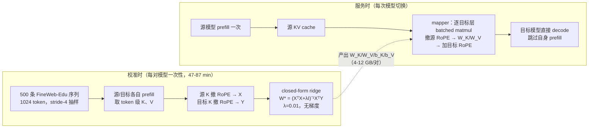

长会话里模型一换，接收方就要把几万 token 的上下文重新 prefill 一遍——这正是生产环境里 cost-quality cascading、对话中切换、路由三类做法的共同账单。本文的答案是：**源模型算好的 KV cache 可以用一个小线性矩阵直接映射到目标模型**，因为同族模型的 KV 之间本质上高度线性：Qwen3 14B→32B 上，单个源层就能解释目标 keys 56% 的方差、values 32% 的方差，多个源层升到 79%/65%（论文 §2.3，下文简称"原文"）。基于这个观察，作者设计了一个**不需要梯度训练的 closed-form per-head ridge mapper**（top-k 源层选择、去 RoPE、500 条序列校准，三步）。三个家族六对模型中，四对保留接收方 standalone-prefill 精度 73-98%，prefill 延迟比重新 prefill 快 2.7-25×，多轮 handoff 稳定；另外两对明显退化，换非线性 MLP 最多找回 +37pp HellaSwag 保留。全文最该记住的一句话是：**决定迁移成败的不是 mapper 误差多大，而是误差落在哪里——落在注意力正在读的方向，还是注意力忽略的方向**（§4.5）。

<!-- more -->

## 📑 目录

- [🗺️ 原文阅读地图](#️-原文阅读地图)
- [0. 读前 3 分钟：最小术语与两组直觉](#0-读前-3-分钟最小术语与两组直觉)
- [1. 问题：模型切换时，接收方要重新付一遍 prefill](#1-问题模型切换时接收方要重新付一遍-prefill)
- [2. 核心思想：同族模型的 KV 之间是线性关系](#2-核心思想同族模型的-kv-之间是线性关系)
- [3. 方法拆解：per-head ridge mapper 的三步](#3-方法拆解per-head-ridge-mapper-的三步)
- [4. 效果与对比：73-98% 保留率的两层结构](#4-效果与对比73-98-保留率的两层结构)
- [5. 权衡与局限](#5-权衡与局限)
- [🕰️ 原文时代 vs 当前工程](#️-原文时代-vs-当前工程)
- [6. 常见误读与错误做法](#6-常见误读与错误做法)
- [📝 总结](#-总结)
- [🎯 自我检验清单](#-自我检验清单)
- [📚 参考资料](#-参考资料)

## 🗺️ 原文阅读地图

原文共 6 节 + 8 个附录。本精读的选择与理由如下（来源锚点精确到章节/图表号）：

| 原文单元 | 处理 | 本文位置 / 省略理由 | 来源锚点 |
|---|---|---|---|
| §2.1 问题形式化与 matched-KV 定义 | 精讲 | §2.1：核心承诺的定义与目标式 | §2.1, Eq.(1) |
| §2.2 相关工作 | 简述 | §1：一张四行表讲清"closed-form + 免训练"的定位 | §2.2, Table 6（Appendix A） |
| §2.3 跨模型 KV 的线性结构 | 精讲 | §2.2：全文立论的证据，四个模式 + R² 数字 | §2.3, Fig.2, Appendix B |
| §3.1 Per-head ridge 回归 | 精讲 | §3.3：核心机制卡 1（闭式拟合） | §3.1, Eq.(3)(4) |
| §3.2 跨层源层选择 | 精讲 | §3.1：核心机制卡 2（top-k） | §3.2, Eq.(5) |
| §3.3 内容空间映射（RoPE 分解） | 精讲 | §3.2：核心机制卡 3（位置无关） | §3.3 |
| §4.1 实验设置 | 简述 | §4.1：模型表 + 基准表 + k 选择口径 | §4.1, Appendix D/E/H |
| §4.2 主结果 | 精讲 | §4.1：两层结构是本文核心主张 | Table 1, Appendix F |
| §4.3 消融 | 精讲（中度） | §4.2：组件贡献排序 + 校准鲁棒性 | Table 2, Appendix C |
| §4.4 MLP 替换 | 简述（中度） | §4.4：只保留失败对恢复数字与配置 | Table 3, Appendix E |
| §4.5 误差落点诊断 | 精讲 | §4.3：核心机制卡 4，解释 Tier 2 失败 | §4.5, Table 4 |
| §4.6 多轮 handoff | 简述 | §4.5：一段漂移数字 | §4.6, Fig.4 |
| §4.7 Prefill 延迟 | 简述（中度） | §4.5：Table 5 + Appendix G 口径与告诫 | Table 5, Appendix G |
| §5 局限 | 精讲 | §5：四条局限就是决策边界 | §5 |
| Appendix B/C（探针与消融细节） | 简述 | 正文已引用关键数字，不重复搬运 | Appendix B/C |
| Appendix F/G/H（家族表/延迟/k 选择） | 简述 | §4.1/§4.5/§5 各取关键口径 | Appendix F/G/H |

**本文的核心承诺**：读完你能解释三件事——mapper 的输入如何变成输出（三步 + 闭式拟合）；为什么 4 对成功 2 对失败（误差落点诊断）；以及"matched KV"这条前提能推多远、不能推多远（局限）。

## 0. 读前 3 分钟：最小术语与两组直觉

先钉死六个术语，后文不再重复解释：

| 术语 | 一句话解释 |
|------|-----------|
| KV cache | Attention 里每个 token 的 Key/Value 向量缓存，是 prefill 算出来的中间结果（详见站内 [PagedAttention 精读](/AIInfraGuide/papers/pagedattention-notes)） |
| prefill | 生成开始前把整段 prompt 过一遍前向、填满 KV cache 的阶段；成本随模型尺寸和 prompt 长度增长 |
| RoPE | 旋转位置编码：把位置信息以"旋转角"的形式乘进 Key/Query；KV cache 里只存转过的 Key |
| matched KV | 源与目标 KV 头数相同、每头维度相同（本文全部 6 对都满足）；层数和参数量可以不同 |
| R²（决定系数） | 线性拟合解释了目标多少比例的方差：0 = 完全没解释，1 = 完全解释 |
| ridge（岭回归） | 加了 $\lambda\|\mathbf{W}\|^2$ 惩罚的最小二乘，有闭式解，不需要梯度训练 |

然后是两组直觉，后文反复用到：

**直觉一：交接合同笔记（职场域）。** 想象一份几万字的合同：实习生（14B 模型）逐字读完，留下自己 shorthand 写成的笔记（KV cache）；现在要交给资深编辑（32B 模型）继续写回复。重新读一遍全文（re-prefill）当然可以，但耗时随合同长度线性涨。省事的办法是：资深编辑不重读合同，而是用一张"shorthand 对照表"（mapper）把实习生的笔记翻译成自己的 shorthand，接着写。本文的全部工作就是回答三件事：这张对照表能不能用线性公式直接算出来（能，§3）、要多少校准语料才能算准（500 条，§3.3）、翻译错了会不会写废（看错落在哪，§4.3）。

**直觉二：段落号要撕掉再翻译（书本域）。** 实习生的笔记上每行都标了"第 t 段"（RoPE 位置信息）。如果你用一本恰好 1024 页的文档学翻译规则，规则会跟那 1024 个段落号绑死——换一本 32K 页的合同就用不了。正确做法：先把段落号撕掉（去 RoPE），学"内容 → 内容"的翻译（content-space 映射），用的时候再按资深编辑自己的编号习惯重新标注（重编码目标 RoPE）。R² 热力图直接支持这一点：撕掉段落号后，对角线明显更锐利（§2.2、§3.2）。

## 1. 问题：模型切换时，接收方要重新付一遍 prefill

**为什么 prefill 成本会被双重放大？** 因为两个生产趋势在叠加：长 agentic 会话让上下文跨轮次不断累积（prompt 变长），而多模型编排——cost-quality cascading（先小模型答、答不好再升级大模型）、mid-conversation switching（对话中途换模型）、routing（按请求路由到不同尺寸）——又让同族不同尺寸的成员频繁轮换（§1，OpenAI 2025 报告了这类编排）。每次切换，接收方都要对累积的整段上下文重新 prefill 一遍。原文一句话点破：**prefix caching 只在同一个模型内部有效**——换模型的那一刻，之前缓存的 KV 在架构上就不认识了（层数、hidden 维度、KV 头配置都可能不同，§1）。

**既然 re-prefill 这么贵，为什么之前没人做跨模型 KV 迁移？** 因为源和目标可以差在层数、hidden 维度、KV 头配置三处，之前的工作都靠"重武器"填这个坑。原文 §2.2 列了四家，Table 6（Appendix A）给了对照：

| 方法 | 免梯度 | 跨尺寸 | 迁移 KV 值 | 闭式解 | 原文一句话定位 |
|---|---|---|---|---|---|
| C2C（Fu et al. 2026） | — | ✓ | ✓ | — | 每对模型训练一个 neural fuser |
| LatentAlign（Dery et al. 2026） | — | ✓ | ✓ | — | 每模型学 adapter 进共享潜空间 |
| IAM（Zhao et al. 2025） | ✓ | ✓ | — | — | 迁移注意力模式，不是 KV 值 |
| DroidSpeak（Liu et al. 2026） | ✓ | — | ✓ | — | 仅同架构（同 hidden/层数/头配置）可用 |
| **本文** | **✓** | **✓** | **✓** | **✓** | closed-form per-head ridge |

📌 **关键点**：原文的定位是四行表里唯一同时满足"免梯度 + 跨尺寸 + 迁 KV 值 + 闭式解"四个条件的方法（Table 6 脚注说明 DroidSpeak 的"—"是"不适用"而非"缺失"）。它真正想回答的问题是：**跨模型 KV 关系是否简单到可以直接写公式、不训练？**（§2.2 末段）

原文 Figure 1 画出了整条 pipeline：

*图源：arXiv 2608.03893 Figure 1（pipeline overview）*

这张图讲的是：源模型只 prefill 一次 → 源 KV cache → per-head 线性映射（图中注明 closed-form ridge、~1 hour on 8×H100）→ 映射后的 KV → 目标模型直接 decode 出 token。右下角灰色虚线框表示"被跳过的目标 prefill"。**迁移是双向的**：小→大提质，大→小省钱（§1）。

## 2. 核心思想：同族模型的 KV 之间是线性关系

### 2.1 先钉死前提：什么算 matched KV

**同族不同尺寸的模型，KV cache 的"格式"差在哪？** 差在两个量：层数 $L$（32B 比 14B 多几层）和每层的 KV 头数 × 头维度（$n_{\text{kv}}$ 和 $d_h$）。原文把"两个模型的 KV 头数相同、每头维度相同"（$n_{\text{kv}}^{s}=n_{\text{kv}}^{t}$ 且 $d_h^{s}=d_h^{t}$）称为 **matched KV**：层数和参数量可以不同，但每一层里"K/V 向量的形状"一致（§2.1）。本文全部 6 对评测都满足这个条件（§4.1, Table 10）：

| 家族 | 源 → 目标 | 参数比 | KV 头（s→t） | 头维度（s→t） | 层数比 |
|---|---|---|---|---|---|
| Qwen3 | 8B / 14B → 32B | 2.3–4× | 8→8（matched） | 128→128 | 1.6–1.8× |
| Llama 3.1 | 8B → 70B | 8.8× | 8→8（matched） | 128→128 | 2.5× |
| Ministral 3 | 3B / 8B → 8B / 14B | 1.8–4.7× | 8→8（matched） | 128→128 | 1.2–1.5× |

📌 **关键点**：全部是 dense full-attention 模型（每个目标层都收到映射 KV）；Qwen3 与 Ministral 3 是 post-trained、Llama 3.1 是 base，均以 completion 模式评测（§4.1）。注意 Llama 3.1 8B→70B 的参数比 8.8× 是全文最极端的一对——它能成，说明 matched KV 之下尺寸差距不是决定性因素。

**目标怎么形式化？** 设源模型 $\mathcal{S}$（$L_s$ 层）、目标模型 $\mathcal{T}$（$L_t$ 层），同族共享 tokenizer，所以输入序列 $\mathbf{x}$ 两边等长。我们想要一个映射 $f:\mathcal{C}_{\mathcal{S}}\to\hat{\mathcal{C}}_{\mathcal{T}}$，使得目标模型用"翻译后的缓存" $\hat{\mathcal{C}}_{\mathcal{T}}$ 解码，输出等价于用它自己算的缓存 $\mathcal{C}_{\mathcal{T}}$：

$$m\bigl(\mathcal{T}(\mathbf{x};\hat{\mathcal{C}}_{\mathcal{T}})\bigr) \approx m\bigl(\mathcal{T}(\mathbf{x};\mathcal{C}_{\mathcal{T}})\bigr) \quad (1)$$

逐项：$\mathcal{C}_{\mathcal{S}}$/$\mathcal{C}_{\mathcal{T}}$ 是源/目标全层的 KV cache；$\hat{\mathcal{C}}_{\mathcal{T}}$ 是 mapper 产出的"伪目标缓存"；$m$ 是下游任务的指标（精度、F1 等）。注意两个设计选择：**等价性用下游精度定义，不用重构误差定义**（§2.1 末段）——这条区分是后文 §4.3"R² 不预测成败"的伏笔；映射分解成每个（层, 头）的独立映射 $f_K^{l,h}$、$f_V^{l,h}$。

### 2.2 线性结构证据：56%/32% → 79%/65%

**在决定 mapper 长什么样之前，先问：这个映射到底线性吗？** 原文的探针方法很朴素（§2.3）：对每一种缓存 $C\in\{K_{\text{rope}}, K_{\text{stripped}}, V\}$（带 RoPE 的 key、去掉 RoPE 的 key、value），每一对（源层 $l'$, 目标层 $l$, 头 $h$），在 token 级拟合一个单源普通最小二乘：

$$\hat{C}_t^{l,h} = C_s^{l',h}\,\mathbf{W} + \mathbf{b}, \qquad \mathbf{W}\in\mathbb{R}^{d_h^s\times d_h^t} \quad (2)$$

逐项：每个校准 token 贡献一个观测（源该 token 的 per-head 向量 → 目标同位置的向量）；$\mathbf{W}$ 是 $d_h^s\times d_h^t$ 的小矩阵（matched KV 下就是 128×128）；拟合质量用 R² 度量，跨 $n_{\text{kv}}^t$ 个目标头平均。这是探针，不是生产 mapper（生产 mapper 拼多个源层 + ridge，§3）。

把 head-averaged R² 画成"源层（行）× 目标层（列）"的热力图（原文 Figure 2，Qwen3 14B→32B 与 8B→32B 两张，各画 K_rope / K_stripped / V 三个版本），出现四个模式：

1. **高线性拟合**：对角线附近 R² 显著高于零，峰值单元 K_stripped R²=0.81（14B→32B）、0.65（8B→32B）；
2. **越近的模型对角线越锐利**：架构/深度差距越大，模式越弥散（8B→32B 明显糊于 14B→32B）；
3. **RoPE 污染拟合**：撕掉 RoPE 后对角线普遍更锐利——这就是 §3.2 位置-内容分解的直接动机；
4. **K 比 V 好预测**：head-averaged R² 通常差约 0.2（Appendix B）。

*图源：arXiv 2608.03893 Figure 2（cross-model KV linear structure heatmaps）*

**量化版本（层平均，Qwen3 14B→32B，Table 7 / Appendix C）：**

| 源层数 $k$ | K_stripped R² | V R² |
|---|---|---|
| 1（单个最佳源层） | 0.5572 | 0.3249 |
| 8 | 0.7914 | 0.6541 |
| all（全部源层） | 0.8451 | 0.7645 |

📌 **关键点**：单个源层只拿到 $k=\text{all}$ 时 R² 的 66%（K）和 42%（V）——**互补信息分散在多个源层里**，增益主要在 $k=1\to4$，$k=6$ 时已接近 $k=\text{all}$（K 达到 all 的 92.3%、V 87.7%，Appendix B Fig.5）。这直接 motivates 下一步的 top-k 跨层选择。

## 3. 方法拆解：per-head ridge mapper 的三步

**mapper 整体长什么样？** 一句话：**每个目标（层, 头）独立拟合一个闭式线性解**，三个组件——per-head ridge（§3.1）、跨层源层选择（§3.2）、内容空间映射（§3.3）——分别回答"怎么拟合""用哪些源层""在什么空间拟合"。原文 Figure 3 画了 Qwen3 14B→32B 这一对的具体形态：

*图源：arXiv 2608.03893 Figure 3（per-head linear mapper architecture；图中给出 Qwen3-14B 40 层 / Qwen3-32B 64 层、各 8 个 KV 头）*

这张图讲的是：源侧 40 层每层 8 个 KV 头（Qwen3-14B），目标侧 64 层每层 8 个 KV 头（Qwen3-32B）；对每个目标层，按 head-averaged R² 选 top-k 个源层，把选中层的 K/V 拼成 $k\times8\times d_h$ 的特征，Key 走 $\mathbf{W}_K+\mathbf{b}_K$、Value 走 $\mathbf{W}_V+\mathbf{b}_V$ 两条独立路径；**头和头之间、K 和 V 之间不共享任何参数**（Fig.3 标注）。

### 3.1 第一步：为每个目标层选 top-k 最预测性的源层

**源 40 层、目标 64 层，每个目标层该"抄"哪些源层？** 答案不是按层号对位（14B 第 10 层 ≠ 32B 第 10 层的对应物，深度比 1.6-1.8×），而是按预测力选：对每个目标层 $l$，按 head-averaged R²（在去 RoPE 的 K 与 V 上平均）选出 top-$k$ 个源层，把它们的全头 K/V 拼起来当特征：

$$\mathbf{X}_K^{l} = \bigl[\bar{\mathbf{K}}_s^{l_1}\,\|\,\bar{\mathbf{K}}_s^{l_2}\,\|\,\cdots\,\|\,\bar{\mathbf{K}}_s^{l_k}\bigr] \quad (5)$$

逐项：$\bar{\mathbf{K}}_s^{l_i}\in\mathbb{R}^{T\times(n_{\text{kv}}^s\cdot d_h^s)}$ 是第 $l_i$ 个选中源层**全部 KV 头**的拼接（$T$ 个 token，每行 $8\times128=1024$ 维）；$\{l_1,\dots,l_k\}$ 是目标层 $l$ 的 top-k 源层；$\mathbf{X}_V^l$ 从 Value 头同法构造。两个设计细节值得注意：**同一目标层的所有头共享同一组选中源层**（原文说这允许 cross-head 信息流，§3.2）；$k$ 是每对模型一个超参，在 $\{1,2,4,6,8,10,12,16,20,24,\text{all}\}$ 上扫描、按 ARC-C/HellaSwag/MMLU 的 log-likelihood 精度均值选（近平局倾向大 $k$），GSM8K、多轮、延迟不参与选择（§4.1, Appendix H）。

📌 **关键点**：消融显示**跨层源层选择是三个组件里贡献最大的**——$k$ 从 8 砍到 1，K 的 R² 从 0.79 掉到 0.56（§4.2, Table 2 第四行是全篇掉得最惨的配置之一）。§2.2 的探针已经预告了这一点：互补信息分散在多个源层。

### 3.2 第二步：先去 RoPE，在"内容空间"做映射

**为什么不在缓存里存的 key 上直接拟合？** 因为 KV cache 里只存**转过 RoPE 的 key**：$\mathbf{k}_{\text{RoPE}}(t)=\mathbf{R}_{\Theta}(t)\,\mathbf{k}_{\text{content}}$，位置 $t$ 的旋转被焊死在值里（query 是 decode 时现算的，不存）。如果直接在"旋转耦合"的 key 上拟合，权重就绑在 1024-token 校准语料的位置分布上——原文实测它在 1024 上下文的短基准上"在噪声范围内也能工作"（Table 2 第三行），但**按构造无法外推到更长上下文**，而生产 prompt 要撑到 32K（§3.3, §4.7）。

解法是把位置和内容拆开：先撤掉源的位置旋转、在位置无关的空间做线性映射、再按目标的 RoPE 重新编码。对位置 $t$ 的 token：

$$\hat{\mathbf{K}}_t = \Bigl(\underbrace{\mathbf{K}_s\,\mathbf{R}_{\Theta_s}^{-1}(t)}_{\text{① 撤掉源的位置旋转}} \underbrace{\mathbf{W}_K}_{\text{② 内容空间线性映射}} + \underbrace{\mathbf{b}_K}_{\text{偏置}}\Bigr)\,\underbrace{\mathbf{R}_{\Theta_t}(t)}_{\text{③ 按目标 RoPE 重新旋转}}$$

逐项：$\mathbf{R}_{\Theta_s}^{-1}(t)$ 把源位置 $t$ 的旋转撤掉（$\mathbf{R}_{\Theta}$ 正交，逆是精确的、几乎零成本）；$\mathbf{W}_K,\mathbf{b}_K$ 就是"内容 → 内容"的翻译；$\mathbf{R}_{\Theta_t}(t)$ 用**目标模型**的 RoPE 配置重新编码。校准时，回归的响应 $\mathbf{Y}$ 也先把目标 ground-truth key 的 RoPE 撕掉，所以 $\mathbf{W}_K$ 全程在位置无关空间里拟合（§3.3）。**Value 不带位置编码，直接映射，不走这套**（§3.3 末段）。

这一步的收益是"按构造可迁移"：权重与 RoPE 配置解耦后，跨不同 RoPE 参数、任意目标 RoPE 支持的位置都有效。它也是 benchmark-specific 的——消融（§4.2）显示：只去掉"推理时重新旋转"（拟合仍解耦），MMLU 从 78.09 崩到 25.79、GSM8K 从 90.98 崩到 4.17，而 HellaSwag 只掉 ~5pp。为什么？原文的解释是不同基准对位置错配的敏感度不同（§4.3），位置编码在知识类/数学类任务上更承重。

### 3.3 第三步：500 条序列上的 closed-form ridge 拟合

**最后一步：$\mathbf{W}$ 和 $\mathbf{b}$ 怎么算出来？** 对每个目标（层 $l$，头 $h$），把 $N$ 个校准 token 堆成设计矩阵 $\mathbf{X}\in\mathbb{R}^{N\times d_s}$（$d_s=k\,n_{\text{kv}}^s\,d_h^s$）和响应矩阵 $\mathbf{Y}\in\mathbb{R}^{N\times d_h^t}$，解 ridge 回归：

$$\hat{\mathbf{K}}_t^{l,h}=\mathbf{X}_K^{l}\mathbf{W}_K^{l,h}+\mathbf{b}_K^{l,h}, \qquad \hat{\mathbf{V}}_t^{l,h}=\mathbf{X}_V^{l}\mathbf{W}_V^{l,h}+\mathbf{b}_V^{l,h} \quad (3)$$

$$\mathbf{W}^* = \underbrace{(\mathbf{X}^{\top}\mathbf{X}+\lambda\mathbf{I})^{-1}}_{\text{加了惩罚的"求解"}} \underbrace{\mathbf{X}^{\top}\mathbf{Y}}_{\text{特征与响应的交叉项}} \quad (4)$$

逐项：$\mathbf{X}$ 的每行是一个校准 token 的 $d_s$ 维源特征（top-k 层 × 全头拼接）；$\lambda=0.01$ 是 Tikhonov 惩罚强度；$\mathbf{I}$ 是单位阵。为什么用 ridge 而不用纯 OLS？两个原因叠在一起：大 $k$ 时 $d_s$ 可达几万维，且 top-k 选出的源层按构造高度相关，$\mathbf{X}^{\top}\mathbf{X}$ 近奇异——惩罚项把逆稳住，对拟合偏差影响可忽略（§3.1 Fitting 段）。另外 $\mathbf{X}$、$\mathbf{Y}$ 先中心化再解，$\mathbf{W}^*$ 只估斜率，偏置由 $\mathbf{b}=\bar{\mathbf{Y}}-\bar{\mathbf{X}}\mathbf{W}^*$ 恢复（§3.1）。

**校准语料有多小？** 500 条 FineWeb-Edu 序列、每条 1024 token、stride-4 子采样：$500\times1024\div4=128{,}000$ 个 token 级观测，每目标头共享（§3.1, Appendix E）。这就是全部训练数据——没有反向传播，没有梯度。

**成本账本（Appendix D/E）：**

| 项目 | 数值 | 口径 |
|---|---|---|
| mapper 参数量 | $2\,L_t\,n_{\text{kv}}^t\,(k\,n_{\text{kv}}^s\,d_h^s)\,d_h^t$；1.01–3.36 B | 公式中 2 是 K+V 两套 |
| 存储 | 4–12 GB/对 | 论文报告（Table 12） |
| 拟合耗时 | 47–87 min/对，单 8×H100 节点 | 论文实测，无梯度训练 |
| 耗时瓶颈 | $\mathbf{X}^{\top}\mathbf{X}$（$O(Nd_s^2)$），每目标层算一次、其下所有头共享 | 原文解释（§3.1, Appendix E） |

📌 **关键点（纸笔走查）**：拿 Qwen3 14B→32B 对（$L_t=64$、$n_{\text{kv}}^t=8$、$k=8$、$n_{\text{kv}}^s=8$、$d_h=128$）代入参数量公式：$d_s=8\times8\times128=8192$，参数量 $=2\times64\times8\times8192\times128=1{,}073{,}741{,}824\approx1.07$ B——与论文 Table 12 的 1.07 B / 4 GB 完全吻合（64 层来自原文 Fig.3 标注与公开配置，本算例为文章核验计算）。**mapper 大小由目标深度/头数和 $k$ 决定，不随序列长度或 cache 大小增长**；它也不必常驻 GPU——推理时每目标层就是一个 batched matmul，4–12 GB 放主机内存/磁盘，按 25–50 GB/s 的 PCIe 带宽加载约 80–480 ms，只在某对模型激活时付一次（Appendix D，**按尺寸×带宽计算、非实测**）。注意拟合是**有方向的**：P 个模型的 fleet 要准备最多 $P(P-1)$ 个方向的 mapper，平均 ~6.5 GB/个，3/4/5 模型约 39/79/131 GB，随 $P$ 二次增长——但预算是磁盘/主机内存，不是显存（Appendix D Serving cost）。

校准 + 服务两条流水线的完整关系：

这张图讲的是：左半部分只发生一次（拟合出每对的 $\mathbf{W}_K/\mathbf{W}_V/\mathbf{b}_K/\mathbf{b}_V$），右半部分是每次切换时反复走的路径——右半部分的计算主体就是若干次矩阵乘法，这正是 2.7-25× 加速的来源（§4.5）。

**最小例子（玩具维度，读者可复算）：** 设源/目标各 1 层、2 个 KV 头、头维度 4、$k=1$。则 $d_s=1\times2\times4=8$，校准 $N=10$ 个 token：$\mathbf{X}\in\mathbb{R}^{10\times8}$，$\mathbf{Y}\in\mathbb{R}^{10\times4}$，闭式解给出 $\mathbf{W}^*\in\mathbb{R}^{8\times4}$（32 个参数）+ $\mathbf{b}\in\mathbb{R}^4$。把 $k$ 换成 8、头数换成 8、头维度换成 128、层数换成 64，就是生产形态——每（层, 头, K/V）各一套，合计 1.07 B（上表走查）。💡 **提示**：K 和 V 各自独立拟合（$\mathbf{W}_K\neq\mathbf{W}_V$），头与头之间也不共享参数（Fig.3）——"per-head" 不是口号，参数量公式里的 $n_{\text{kv}}^t$ 和 2 就是这么来的。

## 4. 效果与对比：73-98% 保留率的两层结构

### 4.1 主结果：六对模型，两个 tier

**先定义口径。** 保留率（retention）= 迁移后精度 ÷ 目标模型自己 prefill 的精度 ×100%：

$$\text{retention} = \frac{\text{transfer 精度}}{\text{target standalone 精度}}\times100\% \qquad \text{floor-normalized} = \frac{\text{acc}-\text{chance}}{\text{target}-\text{chance}}$$

为什么要第二种口径？因为不同基准的瞎猜水平（chance floor）不同：ARC-C/HellaSwag/MMLU 25%、WinoGrande 50%、GSM8K ≈0%（Table 1 首行）。floor-normalized 把 chance 归 0、目标自身归 100。**代入算例（数据取自 Appendix F Table 13/15）**：Llama 3.1 8B→70B 的 GSM8K 迁移精度 14.78、standalone 81.12 → retention $=14.78/81.12=18.2\%$；同一对的 WinoGrande floor-normalized $=(63.14-50)/(72.45-50)=58.5\%$——WinoGrande 的 50% 高 floor 让 raw retention 看着没那么惨，两种口径读同一张表会看到不同故事。

评测设置（§4.1, Appendix D/E）：5 个精度基准（ARC-C、HellaSwag、WinoGrande、MMLU 5-shot、GSM8K 8-shot CoT）+ WikiText-2 前缀条件 perplexity；多轮用 CoQA；主结果聚焦小→大方向，全 pipeline（ridge、内容空间、各对选定 $k$）。主结果（Table 1 复刻）：

| 家族 | 对（选定 k） | Avg | Avg_fn | ARC-C | HellaSwag | WinoGrande | MMLU | GSM8K |
|---|---|---|---|---|---|---|---|---|
| Qwen3 | 14B→32B (8) | **97.6%** | 96.3% | 101.0% | 97.6% | 98.5% | 95.0% | 95.6% |
| Qwen3 | 8B→32B (12) | 87.5% | 80.7% | 94.0% | 95.2% | 91.0% | 88.5% | 68.8% |
| Llama 3.1 | 8B→70B (20) | 72.8% | 62.9% | 90.9% | 94.4% | 87.1% | 73.3% | 18.2% |
| Ministral 3 | 3B→8B (all) | 76.2% | 65.9% | 90.6% | 93.3% | 91.3% | 69.4% | 36.6% |
| Ministral 3 | 3B→14B (20) | 44.2% | 14.7% | 43.6% | 68.0% | 74.0% | 32.0% | 3.2% |
| Ministral 3 | 8B→14B (12) | 41.6% | 11.1% | 40.7% | 58.7% | 74.2% | 32.7% | 1.6% |

📌 **关键点**：结果分成两层（原文称 Tier 1 / Tier 2）。**Tier 1**：四对保留 73-98%——包括参数比最极端的 Llama 8B→70B；**Tier 2**：两个 Ministral→14B 对掉到 42-44%（floor-normalized 只有 11-15%）。注意 GSM8K 列：Llama 对只有 18.2%——生成类任务在 8.8× 参数比下掉得最狠。原文的结构化结论是：**matched KV 与成功相关，但不保证成功**（§4.2）——后两节回答"那什么决定成败"。

*图源：arXiv 2608.03893 Figure 8（per-benchmark retention，Appendix F）*

### 4.2 消融：哪个组件最值钱

**把三个组件逐个关掉，哪个掉得最惨？** 在保留率最高的一对（Qwen3 14B→32B）上做顺序消融（Table 2 复刻，单元为各基准精度，最右列为 WikiText-2 PPL）：

| 配置 | ARC-C | HellaSwag | WinoGrande | MMLU | GSM8K | PPL |
|---|---|---|---|---|---|---|
| Full（k=8, ridge, content-space） | 61.60 | 80.70 | 68.98 | 78.09 | 90.98 | 7.33 |
| − inference RoPE（推理时不重旋转） | 44.97 | 75.39 | 56.59 | 25.79 | 4.17 | 7.70 |
| − all RoPE（拟合+推理都耦合 RoPE） | 61.09 | 80.73 | 68.59 | 77.70 | 90.98 | 7.35 |
| − RoPE − cross-layer（k=1） | 27.65 | 44.81 | 51.78 | 26.07 | 0.38 | 22.73 |
| − RoPE − cross-layer − ridge | 36.43 | 62.26 | 51.22 | 51.26 | 1.44 | 9.86 |

三个结论（§4.3）：

1. **跨层源层选择贡献最大**：$k$ 8→1，K 的 R² 从 0.79 掉到 0.56；ARC-C 从 61.60 崩到 27.65、PPL 从 7.33 飙到 22.73；
2. **内容空间映射是 benchmark-specific**：去掉推理时 RoPE 处理，MMLU/GSM8K 近随机（25.79/4.17），HellaSwag 只掉 ~5pp——位置错配在知识/数学任务上更致命；
3. **校准很鲁棒**：$\lambda$ 扫 4 个数量级、$N$ 扫 50–1000 条都是宽平台（Appendix C Table 8：$\lambda=1$ 才崩，HellaSwag −15.79pp；$N=50$ 距生产仅 ~1.6pp）；**域是唯一有真实成本的轴**：换 CodeAlpaca 校准 HellaSwag 掉 5.24pp，换 Wikipedia 基本在噪声内（−1.05pp）。

### 4.3 为什么两对失败：误差放哪，比误差多大更要命

**一个反直觉问题：校准 R² 那么高，为什么下游还能崩？** 看两个对照（§4.5）：Llama 3.1 8B→70B 校准 $\text{R}_K^2=0.84$，小→大 HellaSwag 保留 94%、大→小只有 37%；Ministral 3B→8B 同样的 $\text{R}_K^2=0.84$，双向都保留 93%。**同样的校准 R²，下游结果天差地别**——R² 是逐通道平均的重构质量，对所有维度一视同仁；但注意力不是：它拿目标的 query 给 K 打分、再按注意权重给 V 加权。**决定下游行为的是"注意力最终读到的东西"**，原文直接测量它：映射 KV 与 ground-truth KV 各自算出的 attention output 的余弦相似度（跨层、头平均）。在 12 个 matched-KV 对评测（三家族 × 双向）上，attention-output cosine 与 HellaSwag 保留率的 Pearson 相关 $r=+0.57$，而校准域 $\text{R}_K^2$ 只有 $r=-0.20$（§4.5）。**R² 在单个对内部依然有用（比如选源层），但不是跨对的标量指标。**

**误差"放哪"怎么量化？** 原文没给闭式公式，给了一个三步程序（§4.5，文章按原文流程转述）：① 取 mapper 的 per-token K 误差，投影到目标每头 query 矩阵 $\mathbf{Q}_h$ 的右奇异向量上，按对应奇异值平方加权，除以全体分量的平均误差，得 K-concentration；② V 侧用每位置的 ground-truth 注意力权重平方加权，同法归一；③ **大于 1 表示误差集中在"注意力在读的方向"，小于 1 表示落在"注意力忽略的方向"**。

打个比方：一份翻译总共有 100 个错别字，可不可怕？取决于位置——**目录里错一个，整本书就被读歪了；附录末尾错十个，读者根本翻不到**（表格域）。R² 只数总字数，attention-output cosine 和 concentration 才看错别字落在目录还是附录。

⚠️ **注意**：这条诊断是 **post-hoc** 的——attention-output cosine 需要先拟合出 mapper 才能算（§5 Future work 2 明确把"拟合前的可迁移性预测信号"列为未来工作）。

### 4.4 非线性 MLP：失败对上 +24 到 +37pp

**ridge 救不回来的对，非线性能不能救？** 能，而且只在该救的地方救。替换方式：per（目标层, 头, K/V）一个 MLP——两层 1024 单元 ReLU 隐层，Adam（lr $10^{-3}$，20 epochs，MSE loss，batch 4096，Appendix E），推理时 drop-in 替换 ridge，其他一切不变（同校准数据、同下游评测管线，§4.4）。结果（Table 3 复刻，HellaSwag 保留率）：

| 对 | Ridge | MLP | Δ |
|---|---|---|---|
| Qwen3 14B→32B | 97.6% | 97.3% | −0.3 pp |
| Ministral 3B→8B | 93.3% | 91.8% | −1.5 pp |
| Ministral 3B→14B | 68.0% | 92.3% | **+24.3 pp** |
| Ministral 8B→14B | 58.7% | 95.5% | **+36.8 pp** |

**MLP 到底改了什么？** 在失败对上，ridge 的 $\text{R}_K^2$ 在 HellaSwag token 上是深度负的（−7.81 / −3.22，Table 4）——校准域拟合的线性 mapper **不向评测域外推**；MLP 把它抬回接近零（仍为负）。同时 MLP 把 K-concentration 平均压低 ~2.5、attention-output cosine 抬高 ~0.45——即**把残余误差从"注意力在读的方向"挪到"注意力忽略的方向"**。但注意一个反例：Ministral 3B→8B 上 MLP 把两个诊断量都改善了，HellaSwag 反而 −1.5pp——原文的结论是**"重新分布误差"本身不充分，只有当被放错的误差大到"binding"时才改变下游精度**；线性 ridge 在关系本来就线性的地方足够好（§4.5 MLP intervention）。

### 4.5 多轮与延迟

**切换不是一次性的——来回切换会漂移吗？** 原文在 Qwen3 14B↔32B 上测了 CoQA 多轮 handoff（100 个对话 × ~15 轮 × 5 个域，每轮答案对 ground-truth 算 F1，"drift"定义为同轮 target standalone 与 mapper 的 F1 差，§4.6）：小→大方向 gap 从第 1 轮到第 10 轮只扩了 1.7pp（mapper 稳住、32B 天花板在上升）；大→小方向以 0.33pp/轮线性增长。10 轮内都太小、不足以级联失败，但线性漂移在超长会话里仍会累积。在多轮任务上重调 $k$，漂移最多变化 2.0pp。

**省下来的时间有多大？** 端到端对比：re-prefill 整个 transformer body vs mapper 应用（Qwen3 14B↔32B，Table 5 复刻）：

| 序列长度 | S→L mapper (ms) | S→L re-prefill (ms) | S→L 加速 | L→S mapper (ms) | L→S re-prefill (ms) | L→S 加速 |
|---|---|---|---|---|---|---|
| 64 | 14.0 | 61.7 | 4× | 11.6 | 39.2 | 3× |
| 8K | 67.8 | 1154.8 | 17× | 101.9 | 501.0 | 5× |
| 32K | 277.6 | 6975.3 | **25×** | 427.1 | 2952.7 | 7× |

📌 **关键点（口径，Appendix G）**：摘要的 **2.7–25×** 来自 7 对 × 10 个序列长度（64 到 32768）共 70 个单元的扫描，mapper 在全部 70 格都更快（32K 处：S→L 2.7–25.1×，L→S 2.8–7.6×）。测量环境：单 8×H100 节点 NVLink、bf16、50 warmup + 30 timed trials；**mapper 跑 eager 模式（无 torch.compile、无 CUDA graphs）**，re-prefill 用 flash_attention_2 且不含 LM head；短序列处 mapper 被 ~14ms 固定地板（Python dispatch + 跨 GPU 传输）托住，之后近线性增长。三条告诫照读：① 双方都是合成输入（隔离计算成本）；② **没测"把映射后的 cache 送到目标进程"这一步**；③ Ministral 3 的 re-prefill 只计语言 decoder body（不含 vision tower）。所以这个倍率可以理解为**对 mapper 不利的保守口径**——工程上把 mapper 编译优化后只会更快。

*图源：arXiv 2608.03893 Figure 9（mapper vs re-prefill latency，8×H100 bf16）*

## 5. 权衡与局限

**牺牲了什么，换取了什么？** 账本如下：

| 维度 | 牺牲 | 换取 |
|---|---|---|
| 存储 | 每对 4–12 GB mapper；有方向性 → P 个模型最多 P(P−1) 个（~6.5 GB/个，3/4/5 模型 ≈39/79/131 GB，随 P 二次增长） | 跳过接收方 prefill：2.7–25×（保守口径） |
| 一次性成本 | 每对 47–87 min 拟合（8×H100，无梯度） | 映射后目标直接 decode，多轮 handoff 稳定（10 轮内漂移 ≤1.7pp / 0.33pp 每轮） |
| 精度 | 4 对 73–98% 保留；2 对掉到 42–44%（需 MLP 补救 +24/+37pp HellaSwag） | 免训练、闭式、可审计（权重就是一个矩阵） |
| 适用面 | 同族 + matched KV + dense full-attention；mismatched KV 未测 | 覆盖 cascading / 对话中切换 / 路由三类生产场景 |

原文自认的四条局限（§5，逐条保留）：

1. **单域校准**：校准只用 FineWeb-Edu。Wikipedia/CodeAlpaca 替代实验（Appendix C）没有把"主题"和"文体"分开，也**不覆盖单领域（医疗/法律）校准的边界**——垂直域部署需要自己补校准实验；
2. **k 是样本内选的**：$k$ 在与报告指标相同的 log-likelihood 基准上选。Appendix H 给了上界：留出重选最多影响 2.49pp（Tier 1 上至多 1.45pp），另有从未参与选择的 PIQA/BoolQ/ARC-Easy 三个基准——Tier 1 对保留 ≥96%、Tier 2 对 <64%，分层结构复现；但原文承认"都不如样本外选 k 干净"；
3. **matched KV 是经验前提**：闭式公式本身不要求维度对齐（任何维度都能拼 $\mathbf{X}$），但 6 对全部 by construction matched，**mismatched KV 没测**——别把结果外推到 KV 头数/维度不一致的模型对；
4. **范围**：同族、dense full-attention。sliding-window/local 混合注意力、带 SSM 状态的 attention-recurrent 混合架构（如 Nemotron 3 类）都超出范围，原文列为 future work。

**落成一句话的决策规则：**

- ✅ **同族 + matched KV + 高频切换** → 值得做；新模型对先按 §4.1 的口径（HellaSwag/MMLU/ARC-C + floor-normalized）验证该对保留率再上线；
- ✅ **切换频率低** → 直接 re-prefill，别为 4–12 GB mapper 和校准流程付固定成本；
- ⚠️ **掉进 Tier 2 的对**（评测 token 上 $\text{R}_K^2$ 深度为负是预警信号）→ 评估 MLP 替换（失败对上 +24/+37pp）或退回 re-prefill；
- ❌ **别把 FineWeb-Edu 单域校准外推到垂直域**；**别把 matched KV 的结果外推到 mismatched KV**。

## 🕰️ 原文时代 vs 当前工程

本文是 arXiv 2608.03893 **v1**，访问日期 2026-08-18，距提交仅数日；截至 2026-08-18 未见后续版本，**未核实到实质差异**（HTML 版与摘要一致）。需要标注的工程口径（全部来自原文，不是当前工程变化）：

- **延迟是保守口径**：mapper 跑 eager（无 torch.compile / CUDA graphs）、re-prefill 用 FA2 且不含 LM head、合成输入、不含映射后 cache 的跨进程传输（Appendix G Caveats）——2.7–25× 应理解为下限；
- **存储加载 80–480 ms 是计算值**（4–12 GB ÷ 25–50 GB/s），原文明确标注非实测（Appendix D）；
- **结论边界**：这些口径只影响加速倍率与加载耗时的绝对值，不改变机制层结论（线性结构、闭式拟合、误差落点诊断）的可复现性条件——复现时按 Appendix D/E 的配置（FineWeb-Edu 500×1024、stride 4、λ=0.01、bf16 前向/float32 协方差）对齐即可。

## 6. 常见误读与错误做法

- **误读 1："97.6% 保留 ≈ 迁移的 KV 几乎和目标原始 KV 一样。"** 错。retention 定义在**下游基准精度**上（Eq.1），不是重构指标；失败对上 ridge 的 $\text{R}_K^2$ 可以深度为负（−7.81）而 HellaSwag 仍有 68%——重构误差与下游精度是两回事（§4.5）。
- **误读 2："matched KV 是这个方法的硬性前提。"** 不准确。闭式解对源/目标维度**没有结构性要求**（$\mathbf{X}$ 按 $k\,n_{\text{kv}}^s\,d_h^s$ 拼接，任意维度都能拟合），但论文 6 对全部 by construction matched，mismatched KV 明确未测（Limitations 3）——"公式允许"≠"有证据"。
- **误读 3："线性 mapper 够了，非线性版本没必要。"** 只看 4 对成功对才会这么说。两个 Ministral→14B 对掉到 42-44%，换 MLP 才回到 92%/95%；线性够用的边界是"跨模型关系已经线性"，评测 token 上 $\text{R}_K^2$ 深度为负是该换 MLP 的预警（§4.4-4.5）。
- **误读 4："k 越大越好。"** R² 边际递减：k=8→all，K 只从 0.79 升到 0.85；每对的选定 k 从 1 到 26 不等（Qwen3 14B→32B 在 k=8 就到达峰值 HellaSwag 的 0.3pp 内，Llama 8B→70B 要到 k≈20-24，Appendix C Fig.6）。
- **错误做法："FineWeb-Edu 校准一次，医疗/法律场景直接部署。"** 域是消融里唯一有真实成本的轴（CodeAlpaca −5.24pp HellaSwag），且原文明确：替代实验不覆盖单领域校准的边界（Limitations 1）——垂直域要自己设计校准域并复测。

## 📝 总结

1. **问题**：生产环境同族不同尺寸模型频繁切换（cascading/切换/路由），每次切换接收方都要对累积上下文重新 prefill——成本随模型尺寸 × prompt 长度增长，prefix caching 只在单模型内有效（§1）。
2. **立论**：matched KV（头数与头维度相同）下，跨模型 KV 高度线性——Qwen3 14B→32B 单源层解释 K/V 56%/32% 方差，多层 79%/65%；互补信息分散在多个源层（§2.3）。
3. **方法**：closed-form per-head ridge mapper 三步——每目标层选 top-k 最预测性源层（贡献最大）、先去 RoPE 在内容空间映射（按构造跨上下文长度可用）、500 条 FineWeb-Edu 序列上闭式拟合（47–87 min/对，无梯度，1.01–3.36 B / 4–12 GB）（§3）。
4. **结果**：三家族六对中四对保留 73–98% standalone 精度（含 8.8× 参数比），两对掉到 42–44%；prefill 提速 2.7–25×（保守口径），多轮 handoff 10 轮内稳定。成败由**误差落点**而非误差大小决定：attention-output cosine 跨 12 对预测保留率（r=+0.57）显著优于校准 R²（r=−0.20）；MLP 在失败对上把误差重分布到注意力忽略的方向，+24/+37pp（§4）。
5. **决策线**：同族 + matched KV + 高频切换才值得做；新对先验证保留率；Tier 2 对评估 MLP；mismatched KV 与垂直域校准都不在本结果的证据范围内（§5）。

## 🎯 自我检验清单

- [ ] 能解释生产环境模型切换时重新付的是什么成本（prefill，随模型尺寸 × prompt 长度增长），以及为什么 prefix caching 解决不了它（只在单模型内有效）
- [ ] 能写出 matched KV 的定义（$n_{\text{kv}}^s=n_{\text{kv}}^t$ 且 $d_h^s=d_h^t$），并说明层数与参数量可以不同、本文 6 对的参数比范围（1.8–8.8×）
- [ ] 能复述线性结构的关键数字：Qwen3 14B→32B 单源层 K/V R² = 0.56/0.32，k=8 时 0.79/0.65，k=all 时 0.85/0.76（允许 ±0.01 误差）
- [ ] 能列出 mapper 三步及各自作用：top-k 源层选择（跨层互补信息、消融中贡献最大）、去 RoPE（位置无关、跨上下文长度可复用）、closed-form ridge（免梯度、47–87 min/对）
- [ ] 能写出 ridge 闭式解 $\mathbf{W}^*=(\mathbf{X}^{\top}\mathbf{X}+\lambda\mathbf{I})^{-1}\mathbf{X}^{\top}\mathbf{Y}$，并解释为什么不用纯 OLS（$d_s$ 可达几万维 + top-k 源层相关 → $\mathbf{X}^{\top}\mathbf{X}$ 近奇异）
- [ ] 能手算 mapper 参数量：给定 $L_t=64$、$n_{\text{kv}}=8$、$k=8$、$d_h=128$，算出 $2\times64\times8\times8192\times128\approx1.07$ B（与论文 Table 12 一致）
- [ ] 能解释校准时不撤 RoPE 会把权重绑在 1024-token 位置分布上，以及解耦为什么按构造泛化到 32K（正交逆精确 + V 无位置编码），并举出 benchmark-specific 的证据（−inference RoPE：MMLU 78.09→25.79，HellaSwag 仅 −5pp）
- [ ] 能区分 retention 与 floor-normalized 两个口径，并算出 Llama 8B→70B GSM8K 18.2%、WinoGrande floor-normalized 58.5%（允许 ±1pp）
- [ ] 能说明两层结果：4 对 73–98% vs 2 对 42–44%，并复述"matched KV 相关但不保证成功"
- [ ] 能解释"误差落点 > 误差大小"：attention-output cosine 与 HellaSwag 保留的 Pearson r=+0.57 vs 校准 R² 的 r=−0.20（12 对评测），以及 MLP 在失败对上 +24/+37pp 的机制（误差向注意力无关方向重分布，且"重分布不充分"的反例）
- [ ] 能列出四条局限与决策边界：单域校准、k 样本内选择（上界 2.49pp）、matched KV 经验前提（mismatched 未测）、仅同族 dense full-attention
- [ ] 能说明 2.7–25× 加速为什么是保守口径（eager 无 torch.compile/CUDA graphs、合成输入、不含跨进程 cache 传输、re-prefill 用 FA2 不含 LM head）

## 📚 参考资料

**原文**

- [arXiv 2608.03893v1: Cross-Model KV Cache Transfer in LLM Families: A Closed-Form Linear Mapping for Prefill Reuse](https://arxiv.org/abs/2608.03893)（Heo et al., NVIDIA, 2026；HTML 版 https://arxiv.org/html/2608.03893v1 ，访问日期 2026-08-18）——本文全部数字的出处；正文 6 节 + Appendix A-H

**站内链接**

- [PagedAttention 精读](/AIInfraGuide/papers/pagedattention-notes)：KV cache 与分页管理的基础
- [Mooncake 精读](/AIInfraGuide/papers/mooncake-notes)：以 KV cache 为中心的调度与全局缓存池（同为 engine 阶段精读）
- [Splitwise 精读](/AIInfraGuide/papers/splitwise-notes)：prefill/decode 解耦——理解"为什么要省 prefill"的前置

**原文引用的相关工作**（详见原文 References）

- C2C（Fu et al. 2026）、LatentAlign（Dery et al. 2026）：跨模型 KV 迁移的梯度训练路线（per-pair fuser / 共享潜空间 adapter）
- IAM（Zhao et al. 2025）：迁移注意力模式而非 KV 值；DroidSpeak（Liu et al. 2026）：同架构 KV 共享
- RoPE：Su et al. 2024（RoFormer），§3.3 位置-内容分解的基础
- 校准数据：FineWeb-Edu（HuggingFace 教育文本子集）；评测基准 ARC-C / HellaSwag / WinoGrande / MMLU / GSM8K / WikiText-2 / CoQA 均为公开基准（原文 §4.1）
